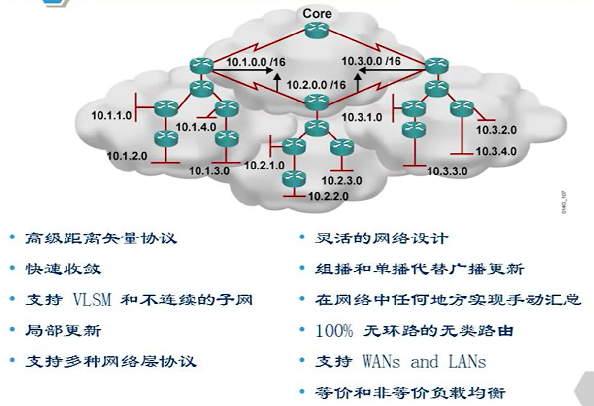
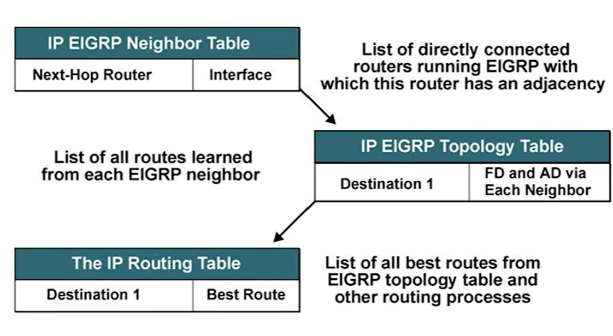
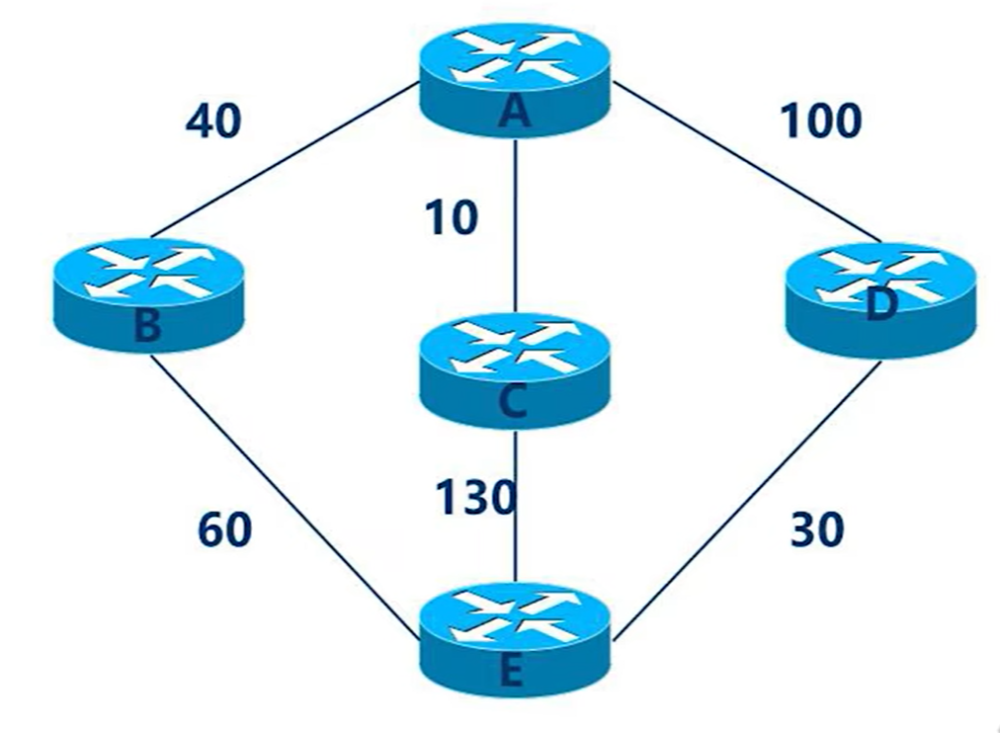
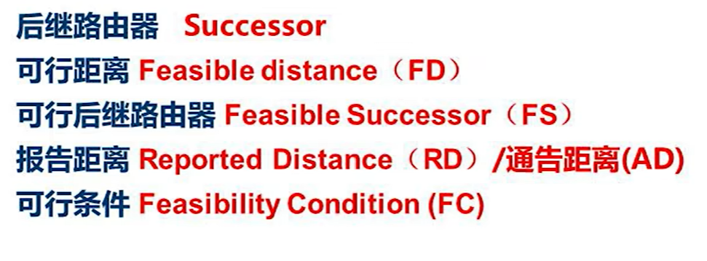
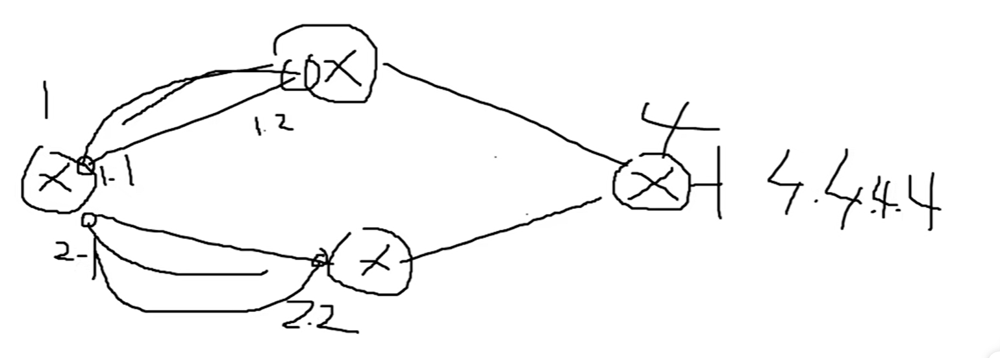
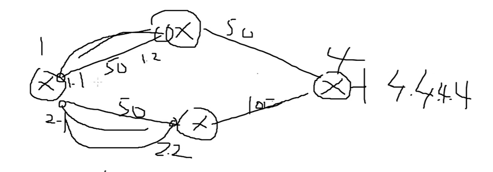
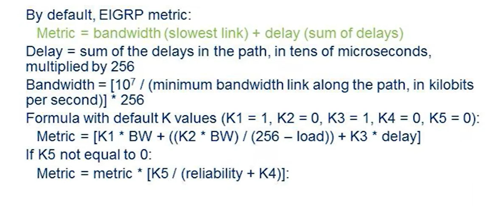
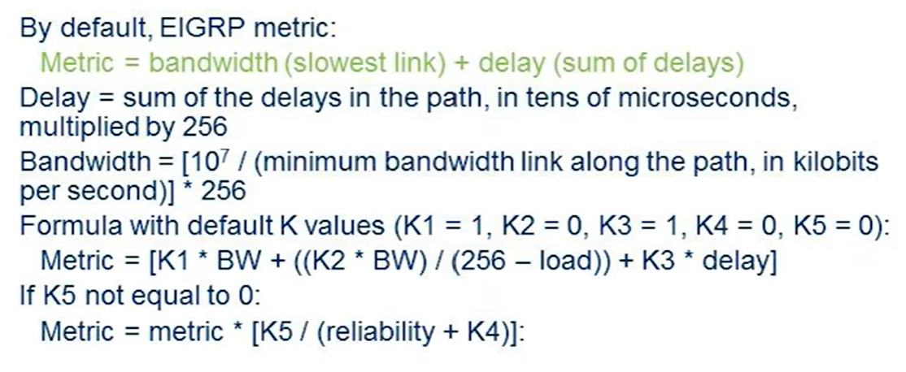

# EIGRP

结合距离矢量和链路状态。距离矢量传递路由信息不知道拓扑，链路状态协议同步数据库知道拓扑。

## EIGRP关键技术
### 邻居发现
使用Hello包发现邻居。RIP的计时器针对路由，没有邻居概念。OSPF的计时器针对邻居，邻居在就有路由。

### 可靠传输协议RTP
保证RIGRP数据包到达所有邻居。不是传输层的协议。OSPF只有Update包有Ack确认。EIGRP的Hello包也有Ack。

### DUAL弥散更新算法

### 协议独立模块
EIGRP同时支持IP，AppleTalk和Novel NetWare，每一种网络协议支持RIGRP都有自己独立的模块。

### 管理距离
内部管理距离90，EIGRP协议通用；

外部管理距离170，**重分发**；

汇总管理距离5，将多个网段汇总为一个大段地路由。

### 组播地址和协议号
组播地址为224.0.0.10，协议号为88

## 表项
OSPF是邻居表，路由表，数据库表，没有明显固定的顺序。EIGRP的三张表有明确的顺序。

EIGRP最先拥有邻居表，建立邻居的方式与OSPF相同。

根据邻居表产生拓扑表，类似于OSPF的数据库，但二者不同。根据所有的邻居传来的所有路由，都记录在路由表中。不论是不是最优，所有路径都保存在表中。

拓扑表中最优的路径会进入路由表。

## DUAL算法
DUAL算法的作用

每条链路上的数值为开销。例如从A到E有3条路劲，但ABE最优。

计算开销得度量值：
1. 带宽
2. 可靠性
3. 延迟
4. 负载
5. 最大传输单元

建立邻居关系后，本地建立邻居表，之后从邻居获取路由建立拓扑表。

4.4.4.4的路由有1.2和2.2两个下一跳，但是不做负载均衡。假设1.2传输的总开销是100，2.2传输的总开销是150。累加入接口开销，在路由表中叫开销，在拓扑表中叫做**可行距离**。

最优可行距离的下一跳是**后继路由器**。对应路由4.4.4.4最优的可行距离的下一跳路由器就是它的后继路由器，1.2的路由条目会被记录到路由表中。

下一跳路由器为我单独通告出它到我的目的有多大开销，是**通告距离**。通告距离会写在可行距离后面。**下一跳到目的的总距离**。当前路由器不但知道总开销，还知道后面的距离。

**可行后继路由器**：后继路由器的链路失效后，OSPF该路径消失，需要重新计算。EIGRP的可行后继路由器的路由内容会成为执行的内容(备份内容)。

**可行条件**：能够成为可行后继路由器的条件。其他路径的通告距离必须小于最优后继路由器的可行距离。

>

EIGRP建立邻居时只考虑：
1. AS号相同
2. K值必须匹配，参考的K只要一样
3. 认证相同

