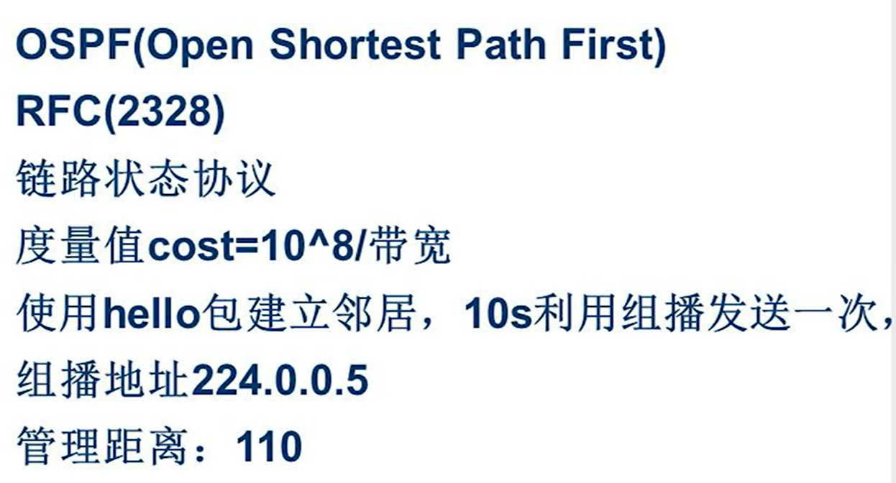
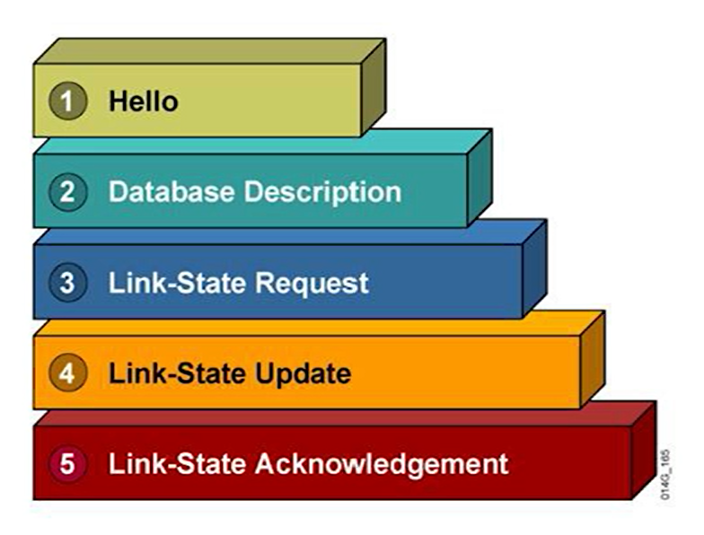
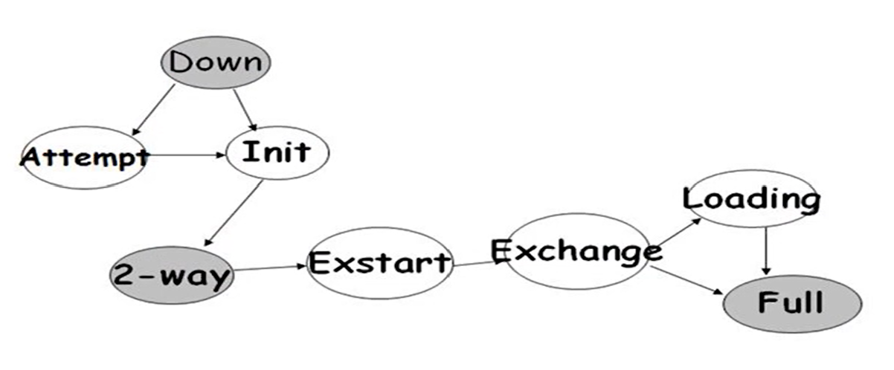
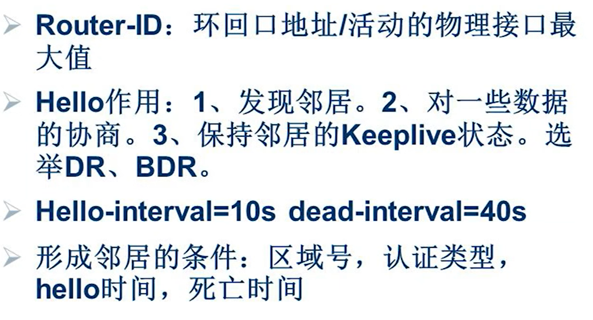

# OSPF
开放式最短路径优先

距离矢量协议RIP传递的是路由条目，链路状态协议传递的是数据库。路由所在接口的链路信息，形成数据库表。通过数据库描述的内容，每台设备以自己为根，计算出到达各个网段的路由信息。

RIP不知道完整拓扑，OSPF知道完整拓扑。

## 度量值
度量值为cost=10^8/接口带宽，参考带宽。

经过路由器时，沿途累加入接口的开销，都是回程的出接口。

## 邻居
所有的信息靠邻居关系维持。hello包是OSPF的报文，每10s组播发送一次(224.0.0.5)。

10s收不到路由

OSPF算出每条路由的路由信息，根据信息寻找选路，是无法汇总的。

## 工作报文

### Hello
先利用hello包寻找邻居，建立邻居关系，只给邻居发数据库相关路由。RIP中无邻居概念。
### Database Description
建立邻居关系后，在数据库中描述宣告的内容。
### Link-State Request
链路状态请求。OSPF只请求需要的信息，不像RIP发送整个路由表。
### Link-State Update
链路状态更新。根据对方请求，发送更新信息。
### Link-State Acknowledgement
链路状态确认。确认更新的内容。

通过hello寻找邻居，建立邻居关系，只向邻居发送宣告的路由。

## 工作状态
邻居状态。OSPF报文根据邻居关系发送。不同的邻居状态发送相应的数据包。

### Down
未开启，断开连接，是初始状态。
### Init
Down状态发送Hello包，进入Init状态。 

**收到Hello包的路由器认证完信息后，将发送Hello包的路由器置为Init。**

路由器(R1)宣告了网段之后，从该接口**组播**发送Hello包，寻找邻居。
对方路由器(R2)启用OSPF后从接口听到Hello，将接收到的包内容做审核。 

1. Router-ID
真正的含义是路由器的唯一标识。可以通过配置手动分配。如果没有手动分配，会看路由器有无环回接口，如果有会选择唤回接口中最大的IP地址。若没有环回接口，会选择开启端口中的最大IP地址。**Router-ID在系统中必须唯一**。
2. 时间
Hello时间10s，死亡时间40s，死亡时间固定是Hello时间的4倍。Hello时间调整，死亡时间自动调整，死亡时间调整，Hello时间不自动调整。**建立邻居关系的路由器时间必须匹配**。
3. 区域号
OSPF涉及到区域。网络越大，路由越多，设备的开销越大。OSPF在路由器内存中存在两个表项，一个是数据库表，另一个是由数据库计算出的路由表。 
划分区域后，相同区域同步一样的数据库，不同区域同步不同的数据库。 
通过配置接口，将接口配置在区域中。同一个路由器可能跨几个不同的区域。 
区域号范围为0~255，区域0为骨干区域，其余区域为常规区域。骨干区必须和常规区域相连。
4. 认证
在能建立邻居的基础上增加了一个密码。

路由器的Router-ID不能相同，区域号Hello时间死亡时间要相同。审核通过后将R1写入邻居表中，此时R1相对于R2的状态从Down置为Init。 
Init可以理解为半连接状态。 

### Attempt
是非广播网络中才出现的状态，与常用的广播网络不同。

### 2-way
R1发送Hello包，R2接收到并审核信息，R2将R1的Router-ID放入自己的邻居表中，将R1状态置为Init。 
R2也要播发送Hello包。R1接收到R2的Hello包后审核数据，并将R2的Router-ID放入自己的邻居表中，并将R2设置为Init。 
R2发送的Hello与R1发送的Hello不一样。因为R2发送Hello包之前收到了R1发送的Hello包，并将R1放入了自己的邻居表中。R2有邻居表时会将邻居表中携带到Hello包中。而R1发送的Hello包中没有邻居表。 
R1再收到Hello包时，会发现包中含有自己的Router-ID。此时直接给R2**单播**回复一个单播Hello 
此时R1 R2的状态均变为2-way。

### Exstart
在Extart状态下邻居两两之间单播发送DBD数据包。当路由器较多时，DBD数据包量会比较大。为了避免单播量过大，在2-way时会选举DR(Design Router)和BDR(Backup Design Router)，指定路由器和备份指定路由器。 
在过渡到Exstart状态时，每个路由器均与DR和BRD交换数据库。未被选举的路由器称为others，others之间只维持邻居关系。会大量减少DBD的泛洪量。 
DR和BDR有所有路由器的数据库信息，可以组播更新所有人数据库。 
others只了解DR和BDR的数据库信息，只需要更新给DR和BDR。在只有DR和BDR在的组播中更新，224.0.0.6。 

优先级范围：0~255，0不具备参选资格，默认优先级为1，最大为255，越大越优先。若优先级相同，对比Router-ID。大家都发送Hello包，包中包含优先级和Router-ID。最优的会成为BDR，等待40s。第一个Hello包发送完后大家都知道了别人的优先级和Router-ID，在第一个Hello包的超时时间40s内，选举出BDR。等待一个40s等待有没有路由器通告自己是DR。在这40s内每10s发送一个Hello包。在第一个包时间超时后，没有其他路由器回复，则该路由器会认为自己成为DR，再选一个BDR。若等待期间有其他路由器声名自己是DR，则不选了。 
DR和BDR一经选举，就不会被抢占。之后发送DBD数据包。

### Exchange
在Exstart状态同步完DBD后，进入到Exchange状态，交换LSR和LSU，进行请求和更新，都是单播。

### Loading
Loading持续进行组播更新。两两交换DBD，两两更新请求都是一对一。但是不只是一个广播域还有不通的网段，跟不同网段的路由器更新需要发送组播，一个网段一个网段渗透给所有路由器，更新数据库。 
除了同步数据库，还要计算路由表。

### Full
在同步完数据库并计算路由表后完成完全邻接。DR和BDR是Full状态，others都停留在2-way状态。