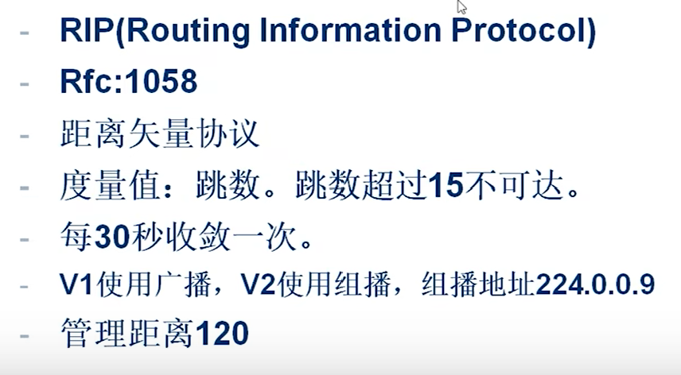
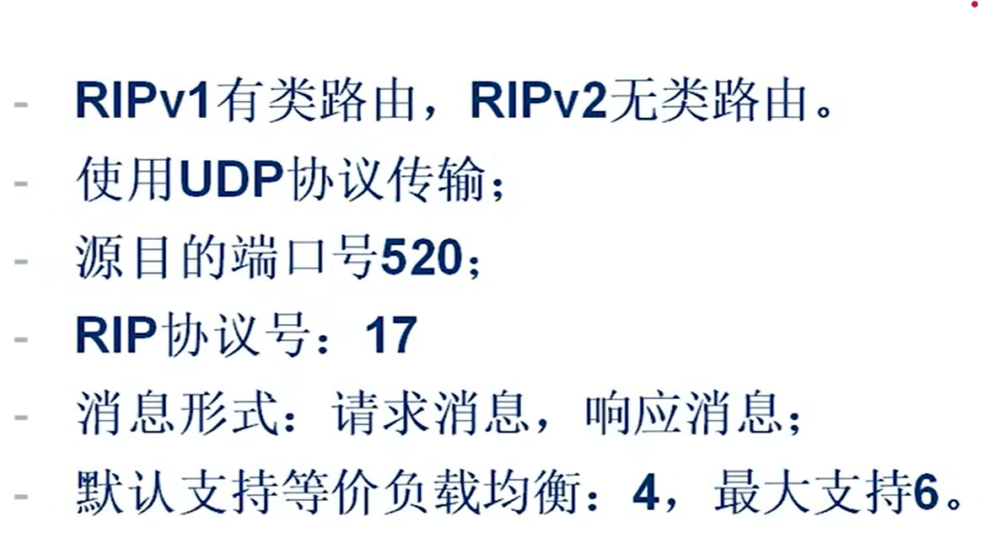
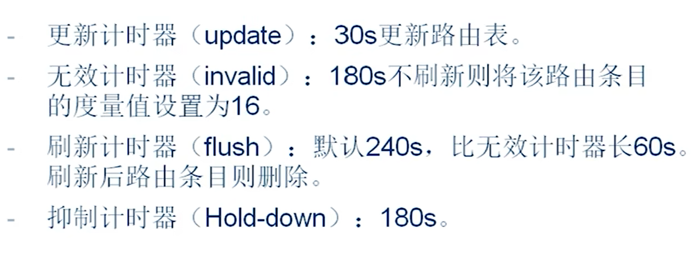
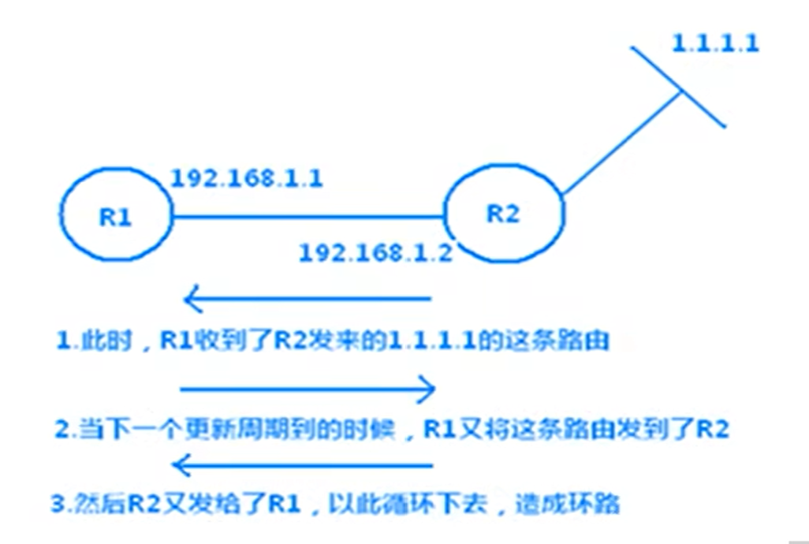
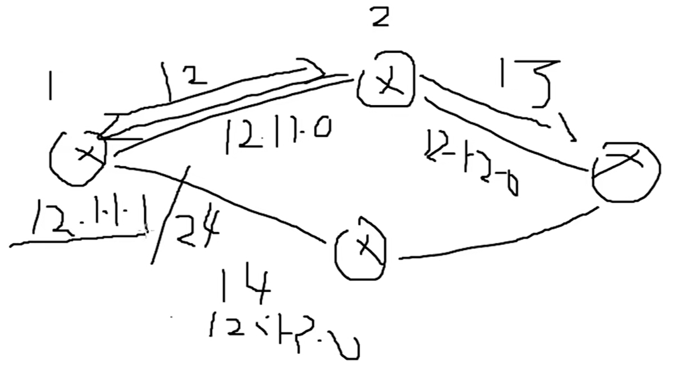

# RIP

Routing Information Protocol，路由信息协议。



## 距离矢量
假设有三台路由器，以最左侧设备为参考。要将1.0段的路由通过RIP传到最右侧的路由器上。

现在1.0的路由处于最左侧的路由器中。最左侧路由器将路由传递给中间路由器。中间路由器从左侧接口收到1.0的路由，所以将左侧接口设置为1.0段的出接口（**方向**）。<br />
开销（**距离**）。中间的路由器和左侧路由器到1.0网段的距离是不一样的。中间的路由器相对于左边路由器到1.0差一个路由器，距离多1，方向为左侧的接口。右侧路由器由中间路由器收到1.0网段路由，到1.0网段距离为两个路由器，为2，方向为左侧接口。

:::TIPS
RIP传递的内容是路由表里的信息，路由。
:::

## 度量值
单位为跳数，网络中路由器节点的个数。是不同路由协议中计算开销用的。

超过15跳不可达，不继续传播，所以RIP不适用于很大的网络。

每30s收敛一次，每30s把整张路由表传递一次。

## 版本
主要针对ipv4地址，有两个版本。V1使用广播更新路由表。V2使用组播组播地址为224.0.0.9。D类地址都属于组播。

## 管理距离
对于路由协议来说，管理距离越小越优先。协议优先级。若多种路由协议获得同一条路由，路由表只显示最优先的。


## 有类路由
有类路由是指所有的主机和路由器接口都有相同的子网掩码，有类路由不在路由更新中发送子网掩码。这意味着有类路由协议在具有真实子网掩码的信息充足的情况下，会假定有类IP边界，从而导致无法在每个有类IP网络中拥有多于一个子网掩码，或者即使掩码长度相同的情况下也通过不同的有类网络来分离子网。

在传递路由时不传递子网掩码，传到对端后，按照主类定义掩码。有可能不能精确地查找网段在哪。

## 无类路由
传递子网掩码，可以精确匹配。

由此看RIPv2在各方面都比RIPv1好。

RIP其实是一个应用层协议，端口号UDP520，协议号17。17在IP报头中，其实是表示UDP。

启用RIP后会向所有直连设备发送请求。

RIP支持4条负载均衡，可以认为改成6条。


## 更新计时器
30s一更新

## 无效计时器
若30s没有更新，则会再等待150s。180s没有刷新则将度量值设置为16。

## 抑制计时器
开始抑制路由为16跳，网路不可达

## 刷新计时器
到240s还没有收到更新，删除所有路由。

## 环路

路由器将自己的整张路由表发送给直连设备，触发直连设备的路由更新，直连设备再让自己的直连设备更新。<br />
例如，12.1.1.0/24在R1的度量值是1，R1给R2更新完路由表后，R2中12.1.1.0/24的度量值为2。R2在更新后会让自己的直连设备更新，其中就包括R1。有可能会导致R1中12.1.1.0/24的度量值变为3，形成环路。因为每更新一次，度量值都会加一。


## RIP防环机制
### 水平分割
从一个接口收到的路由条目不会再从这个接口发出。

### 路由毒化和毒性逆转的水平分割
从一个接口收到的路由条目会从这个接口发送出去，但是将这个路由条目标记为16跳不可达。

### 触发更新
当路由表发生变化时，会立刻发送更新信息。

## 启用RIP
```shell
# 全局模式下启用RIP
router rip
# 配置RIP版本，如果不配置的话版本介于V1 V2之间
# 如果没配置，使用广播发出路由信息，也能听到组播信息
version 2
# 关闭自动汇总。自动汇总会将无类路由汇总为有类路由
no auto-summary
# 宣告设备上路由表直连接口网络，相当于将这些网络的接口宣告出去了
# 1.将网段宣告进组播
# 2.把网段通告出去，给其他路由器
network 【[网段]
```
