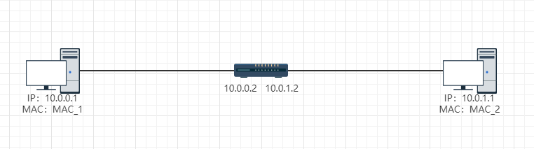

# ARP协议

Address Resolution Protocol，已知IP地址，解析MAC地址。通过ARP协议可以将网络地址映射为mac地址。

32位的ip地址位于网络层封装在ip头部中，48位mac地址位于数据链路层。

主机通过arp协议解析目的mac地址，在自己的arp缓存表中记录目的ip地址和目的mac地址之间的对应关系。

通过arp -a 查询本机记录的arp表
```shell
arp -a
```

在数据转发之前一定要有arp缓存表，才能知道对端mac地址。

## 数据转发

PC1要访问PC3，在应用层产生数据，到达传输层加上源目端口号，到达网络层加上IP头部包含源目IP地址。目的IP地址为1.1.1.3，接下来继续封装到达数据链路层，加上数据链路层头部，有目的MAC和源MAC。


在第一次访问时，PC1不知道PC3的源MAC，会暂缓发送数据包，发送一个广播arp请求，源IP和源MAC地址为PC1的IP和MAC，目的IP为PC3IP地址，目的MAC地址为全0。
* 发送arp request包，目的MAC地址为全0，源MAC为PC_1的MAC地址。
* 封装arp包之后，在数据链路层封装帧头部，帧头部也会有目的和源mac。此时为广播形式，目的mac为全F，源mac为自己的mac地址。
* 数据链路层为广播地址，PC2和PC3都接收数据帧。PC3在收到数据包后会学习PC1的IP地址和MAC地址，同时单播向PC1回复arp relpy，包含自己的MAC地址。
* PC1接收到回复后学习到PC3的mac地址。

过程中最重要的是**缓存表**，所有转发的本质是arp缓存表中有没有ip地址和mac地址的对应关系，有对应关系时就可以不用发送arp请求。

arp缓存表中有一个老化时间，为1200s。mac地址表的老化时间为300s。数据在到达老化时间之前需要重新发送请求报文，进行更新。arp请求报文发送的时间间隔默认为5s。

## arp代理


交换机的作用：隔离冲突域

路由器的作用：隔离广播域，路由器本身不转发广播报文

PC1和PC2处于不同的网段，PC1第一次与PC2通讯，请求PC2的MAC地址，无法请求。因为PC1请求MAC地址时采用的是广播方式，而路由器隔离广播域，所以PC1的广播报文在到达路由器的端口时会被丢弃，PC2无法收到PC1的报文。

解决方案：在路由器上开启arp代理功能。

开启arp代理后，PC1仍然请求PC2的MAC地址.PC1发送的arp请求目的IP为PC2的地址，目的MAC未知。当该arp请求到达路由器时，路由器先不处理该数据帧，收到包后会查找路由表。如果路由器中存在PC2的路由表项，则路由器会使用自己与PC2相连的接口发送arp request，同时用另一接口回复PC1的arp reply，路由器的该接口会假装自己是PC2。PC1收到请求后得知10.0.1.1对应的mac为路由器与pc直连的端口的请求，PC2会认为10.0.0.1的mac地址为10.0.1.2的mac地址。

## 免费ARP
是arp协议的一个应用
* 网络中新加入一台设备，当网络中主机被分配了ip地址或者ip地址发生变更后，必须检测网络中ip地址是不是唯一的，避免地址冲突。当主机加入网络中后，主机会发送arp request，进行地址冲突检测。该arp request报文的格式为：以太网二型帧头部，包含源MAC地址为新加入主机的MAC地址，目的MAC地址为广播地址(全F)，让网络中所有设备都能接收到该报文。**arp报文中的源目ip地址均为新PC自己的IP地址**，目的MAC地址为空(全0)，源MAC为自己的MAC地址。如果有设备与自己的ip地址一样，就会有设备回复。若没有接收到回复报文，则该网络环境中没有与自己ip相同的设备。
* 涉及DHCP协议时，当网络环境中所有设备均采用dhcp协议获取地址时，这些地址有24h有效期。有效期到期时会重新分配地址。在重新分配地址时，设备首先会检测会不会协议新分配的地址已经被占用了。

## RARP
与arp协议相反，根据mac地址解析ip地址。使用相对较少。上世纪90年代的无盘网络中的无盘工作站，操作系统文件放在一台指定的服务器中，无盘工作站获取操作系统后引导。工作站的ip地址在操作系统中配置，而无盘工作站启动前没有地址和系统，服务器通讯获取系统又需要ip地址。

无盘工作站有MAC_A，没有IP地址，首先发送广播rarp请求，内容：源MAC为MAC_A，询问自己的ip地址。请求到达PC1和rarp服务器，只有rarp服务器会处理数据，当rarp服务器接收到请求后，为无盘工作站分配一个地址，响应包含MAC_A，和分配给它的地址。


## GARP
通用属性注册协议，为处于同一个交换网中的交换机之间提供某种分发、传播和注册某种信息的功能。

三台交换机两两互联


三台交换机之间发送GARP报文，注册、注销、传播交换机属性，提高交换机管理效率。例如vlan信息，组播地址信息。

garp在传递信息的时候会包含vlan信息，和组播地址

### 报文结构
采用IEEE802.3格式封装

目的MAC地址，源MAC地址，长度等，最重要的是PDU部分。

目的MAC地址为固定的多播MAC地址01-80-C2-00-00-21。

GARP会使用PDU包含的信息定义属性，根据属性类型的字段，和属性列表的识别消息分类。
* 第一个属性数值为0，代表事件Leave All，1代表Join Empty，2代表Join in事件，3代表Leave Empty，4代表Leave in，5代表Empty

Join消息包含Join Empty和Join in，表示注册属性。例如运行了GARP的交换机希望其他交换机注册自己的属性，就会发送Join消息。SWA创建vlan10，向其他设备发送Join消息，SWB、SWC收到后，也会注册vlan10，同时向下行设备继续发送Join消息。


Leave消息表示注销。例如SWA要注销vlan20，向下行设备发送Leave消息，其他设备收到消息后会注销对应的属性，并继续向下行设备发送消息。Leave All表示注销所有属性，Leave in表示注销某一个属性。

Empty表示部分，注销或者注册部分属性。