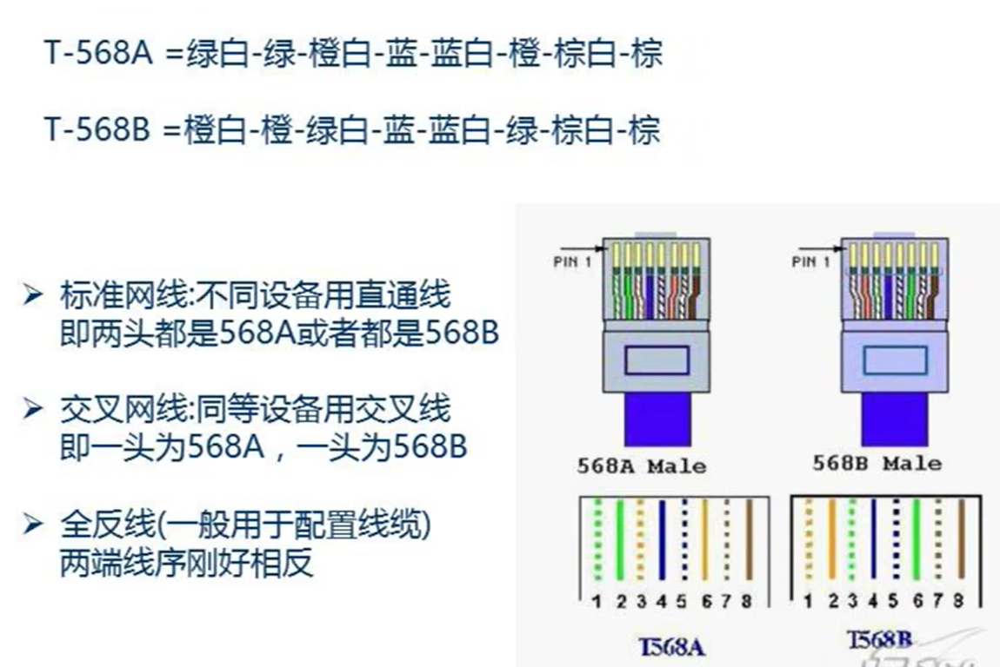
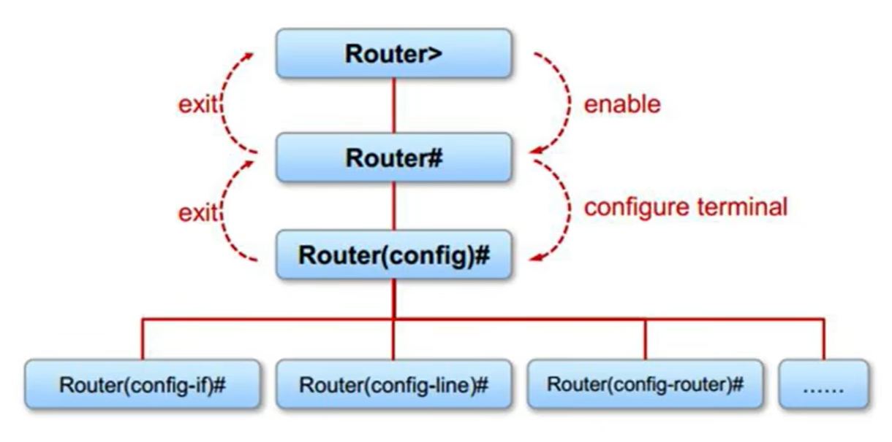
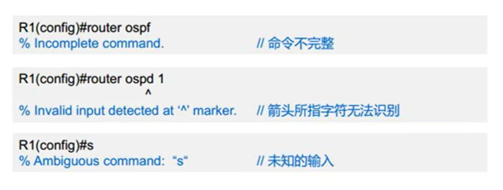
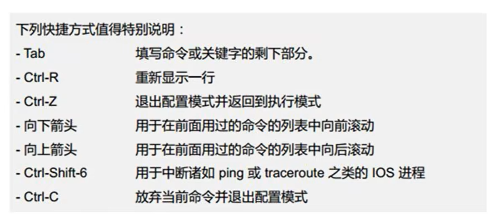
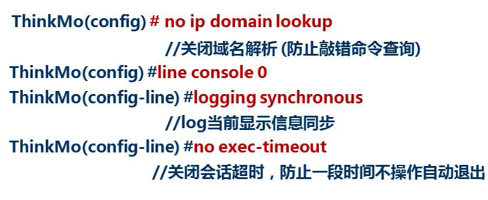
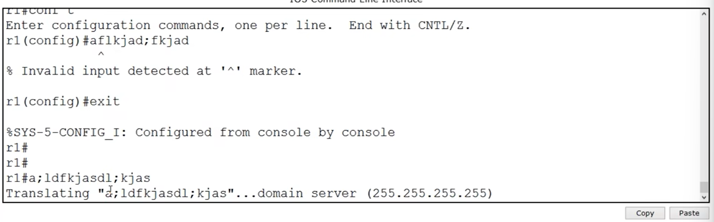
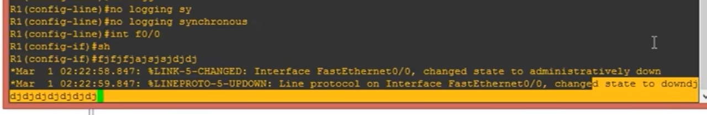

# 思科基础命令集

<!--


直通线：两头都是A或B，交叉线：一头A一头B。接口带自适应，一般都做两头B

Cisco Packet Tracer中要求相同设备用交叉线，不同设备用直通线。
-->

## Cisco IOS 模式



### 用户模式\>

**用户模式**(相当于登录前)对于Cisco IOS来说什么都做不了，只能查看用户等级，退出或者进入。

**使用命令enable进入特权模式**

Tab可以补全命令

不完整的命令打？，系统可以提示有哪些相关命令

```shell
Router> enable
```

### 特权模式\#

特权模式用于查询和测试。

**运行config terminal进入全局配置模式**

```shell
Router> enable
Router# configure terminal
Router(config)# 
```

很多配置都是基于全局配置模式。若要配置IP，只能在接口上配置，所以需要基于全局配置模式进入接口。

每个接口都有接口号，在全局模式下输入 interface [接口编号] 就能进入接口

接口类型+0/0，第一个数字是设备的插槽号，第二个数字是接口编号。

### 接口模式

```shell
Router> enable
Router# config terminal
Router(config)# interface f0/0
Router(config-if)# 
```

ip地址配置ip address + ip地址 + 子网掩码<br />
设备接口在默认情况下都是关闭的，用no shurdown启用接口

```shell
Router(config-if)# ip address 192.168.1.1 255.255.255.0
Router(config-if)# no shutdown
```

命令只要正常合法就不会有提示，出错会有报错


## 常用命令

### 退出

#### exit
返回上一级
```shell
Router(config-if)# exit
Router(config)# exit
Router# exit
Router>
```

#### end
直接回到**特权模式**

### 查询

在**特权模式**下查询

running-config 正在运行的配置，保存在RAM中。
```shell
# 查看正在运行的配置
Router# show run
Router# show running-config
# 命令回显配置情况
```

查看ip接口的配置情况
```shell
Router# show ip interface brief # 查看接口有没有配置ip地址，有没有开启
```

### 修改主机名

```shell
Router# hostname ?
    WORD This system's network name
Router# hostname rl
rl#
```

### 设置密码

进入特权模式需要输入的密码
```shell
Router(config)# enable password 123
```

enable password的密码能够被show run看到，进入全局模式删除enable password进行删除。

在某个模式下以某种方式运行的命令，在其之前加上一个no可以进行删除。若命令中有用户决定的输入，则在删除时将其去掉
```shell
Router(config)# enable password 123
Router(config)# no enable password
```

enable secret设置的密码不会被show run看到
```shell
Router(config)# enable secret 123
```

### 快捷键


### 工程三招(但是好像并没有用)



#### 关闭域名解析
关闭域名解析，防止在**特权模式**下敲错，防止在测试时敲错。全局模式敲错会报错，特权模式敲错的会将错误的命令当作域名。<br />
ip domain lookup 再次开启


#### 显示信息同步
line，线路，包括console，telnet vty，aux

line console 0 进入控制台

logging synchronous 显示信息同步。有时候可能正在输入的信息会被输出信息打断，设置同步后，弹出信息之后会把之前的信息缓过来，显示的是连续的


#### 关闭会话超时

no exec-timeout

在console 0中关闭会话超时。
