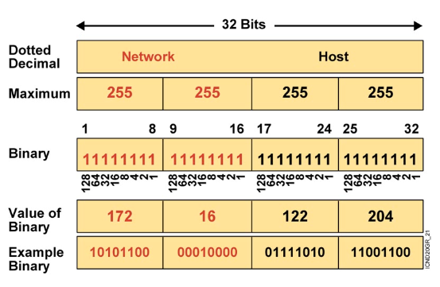
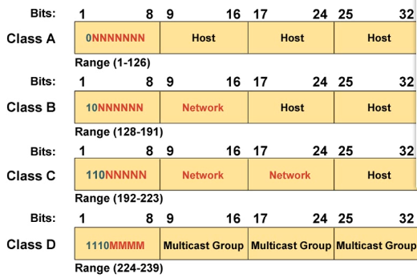
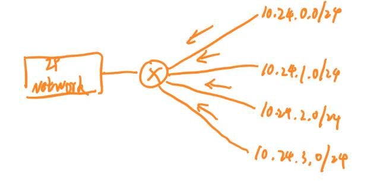
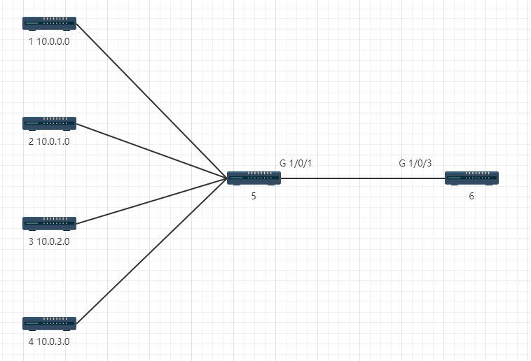

# IP子网划分

主机对IP地址通信的要求
1. 网络中IP地址必须唯一
2. 在一个交换网络中主机必须有相同的网络号才能通信
3. 在不同的交换网络中(路由器分开的网络)，主机不能有相同的网络号

## IP寻址



IP地址长度为32bits，分为四段，8bits为一段。每段之间用 . 分隔。

网络位和主机位由掩码区分，表示方式与IP一样，也是点分十进制，但是掩码是连续的1和连续的0

主机位全为0的地址是网络地址，即网段；主机位全为1的地址是广播地址。

## IP地址分类



A类地址第一个8位段第一位为0，最大为127，最小为0，IP范围为0.0.0.0~127.255.255.255。由于127是环回地址，所以A类地址实际用的只有1~126

B类地址第一个8位段前两位为10。范围为128.0.0.0~191.255.255.255

C类地址前三位为110，网络号24位，ip地址范围为 192.0.0.0~223.255.255.255

D类地址前4位为1110，网络号8位。

E类地址 240.0.0.0~255.255.255.255

通常情况下只会用到前3类地址，D类地址为组播地址，E类地址为保留地址。

## 私有地址

10.0.0.0-10.255.255.255

172.16.0.0-172.32.255.255

192.168.0.0-192.168.255.255

## 特殊地址

环回地址：127.0.0.0·127.255.255.255

0.0.0.0 默认地址，可以代表任何网段

255.255.255.255 表示所有的设备

## 子网划分

例如172.16.0.0/16段的地址，在没有经过子网划分时可以划分2^16-2个地址。但是如果组织规模小，只用了几百个地址，会造成地址的浪费。或者一个公司有多个部门，不用每个部门都专门申请一个网段。

为了解决这些情况，可以调整掩码位数为24位，每个网段中的ip地址数变少了，但是可以分出很多子网。

扩增的部分是子网号。

## CIDR

无类域间路由，互联网连接路由器，路由器下连四个局域网。路由器分别把四个网段的数据转发到互联网，会导致网络中路由表规模很大，路由条目过多，查表效率低。



无类域间路由：将相邻网段的路由做聚合。例如下图四个网段的前22位是相同的，通过减少网络位位数，将这四个网段汇聚成1条路由，用一条路由表示其他四条路由。该条路由的网络位能够代表其他四条路由的网络位，该条路由网络位需要与其他四条路由网络位相同，掩码为16+6为22位，ip地址表示为10.24.0.0/22。此时路由器向外通告路由时就能只通告这一条路由。而且这四个网段能由10.24.0.0/22划分出来，增加两位子网号就能划分四个子网。

:::warn
上述四个网段是**互相相邻**的，是一个等差数列，表示网段都只占用了两位。使用无类域间路由时最好是相邻的网段且占用位数相同。

有可能造成路由黑洞，包含了这个掩码范围内有，但是实际上不在网络中的网段。
:::

路由黑洞



1 2 3 4号路由器会把自己的路由传递给5号路由器

路由器5向路由器6传递路由时，是1 2 3 4的聚合路由10.0.0.0/22
```shell
# 路由器6添加路由
ip route-static 10.0.0.0 255.255.252.0 G1/0/3

# 路由器5配置路由
ip route-static 0.0.0.0 0 G1/0/1
```
单独来看，这两条命令没有问题。但是如果
* 6号路由器下接的设备要访问1~4号路由器，报文由6号路由器G1/0/3发出，到达路由器5时匹配路由，又由G1/0/1发出到达6号路由器，数据在56中不断循环。
* 1号路由器访问4号路由器，报文到达5号设备时发送给6号设备，6号设备又发给5号，来回转发。
