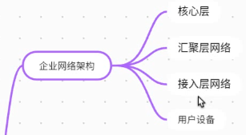
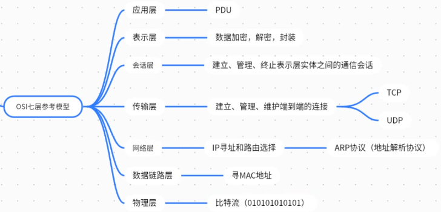
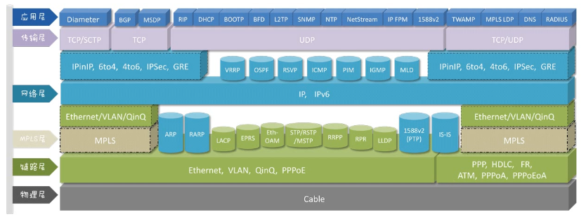

# 计算机网络基础

## 企业网络结构
企业网络基本的四层结构
* 底层：用户设备，如电脑、手机、打印机等
* 用户设备之上：接入层网络，用户设备通过接入层网络接入互联网中，也存在专门的设备，包括光传输网络。涉及交换机(二层设备)、路由器(三层设备)等设备。 电信号。接入方式：无线AP 2.4G/5G无线电波，有线网络(双绞线RJ45)
* 接入层网络之上：汇聚层网络，汇聚接入网锁接入的数据
* 汇聚层之上：核心层，对数据进行传递和交换

## OSI七层参考模型

* **应用层** 数据(**PDU**)一般由应用层下发
* **表示层** 对数据加密、解密和封装
* **会话层** 建立、维护、管理会话连接，管理和终止表示层实体之间建立的通信会话。
* **传输层** 建立、维护、管理端到端的连接。传输层提供本端设备和对端设备的连接，面向连接**TCP**，不面向连接**UDP**
* **网络层** 进行IP寻址和路由选择
* **数据链路层** 控制网络层和物理层之间的通信，通过地址寻址**MAC**。MAC地址与ip地址是对应的，网卡的ip地址可以随时更换(逻辑层面)，但是网卡的mac地址不能更换(物理层面)。通过**ARP**协议进行MAC地址和ip地址的转换。**网络中真正要寻找的是MAC地址**
* **物理层** 进行**比特流**传输

|层|数据名称|
|-|-|
|应用层|PDU|
|表示层|PDU|
|会话层|PDU|
|传输层|数据段Segment|
|网络层|数据包Packet|
|数据链路层|数据帧Frame|
|物理层|比特流Bit Stream|

### 数据包封装
PDU到达传输层后，完整数据分为若干段，每一段加上一个**头部**，有两种头部，与协议相关：TCP和UDP
**TCP头部**

<table>
    <tr>
        <td colspan="1">0</td><td colspan="1">1</td><td colspan="1">2</td><td colspan="1">3</td>
        <td colspan="1">4</td><td colspan="1">5</td><td colspan="1">6</td><td colspan="1">7</td>
        <td colspan="1">8</td><td colspan="1">9</td><td colspan="1">10</td><td colspan="1">11</td>
        <td colspan="1">12</td><td colspan="1">13</td><td colspan="1">14</td><td colspan="1">15</td>
        <td colspan="1">16</td><td colspan="1">17</td><td colspan="1">18</td><td colspan="1">19</td>
        <td colspan="1">20</td><td colspan="1">21</td><td colspan="1">22</td><td colspan="1">23</td>
        <td colspan="1">24</td><td colspan="1">25</td><td colspan="1">26</td><td colspan="1">27</td>
        <td colspan="1">28</td><td colspan="1">29</td><td colspan="1">30</td><td colspan="1">31</td>
    </tr>
    <tr>
        <td colspan="16" align="center">源端口</td>
        <td colspan="16" align="center">目的端口</td>
    </tr>
    <tr>
        <td colspan="32" align="center">序列号，数据段在PDU中的分段序号</td>
    </tr>
    <tr>
        <td colspan="32" align="center">确认号，接收端回传收到包的序列号+1的确认号ACK</td>
    </tr>
    <tr>
        <td colspan="4" align="center">头部长度</td>
        <td colspan="6" align="center">控制字段</td>
        <td colspan="4" align="center">数据偏移</td>
        <td colspan="16" align="center">窗口</td>
    </tr>
    <tr>
        <td colspan="24" align="center">选项(长度可变)</td>
        <td colspan="8" align="center">填充</td>
    </tr>
</table>

**UDP头部**

<table>
    <tr>
        <td colspan="16" align="center">0~15</td>
        <td colspan="16" align="center">16~31</td>
    </tr>
    <tr>
        <td colspan="16" align="center">源端口</td>
        <td colspan="16" align="center">目的端口</td>
    </tr>
    <tr>
        <td colspan="16" align="center">总长度</td>
        <td colspan="16" align="center">校验和</td>
    </tr>
    <tr>
        <td colspan="32" align="center">数据</td>
    </tr>
</table>

数据到达网络层后，数据段会被划分成数据包，并加上对应协议的头部。每一个包都会包含段的头部跟ip包的头部。

数据包加头部和尾部之后成为数据帧。尾部FCS，帧校验序列，检查帧传递过程中有没有丢失或者替换。数据链路层头部一般有两种格式，以太网二型和IEEE802.3。
* 以太网二型(EthernetⅡ)数据帧格式为 D1MAC，S1MAC，type, data和帧尾FCS。
* IEEE802.3帧格式为 目的MAC，源MAC，长度length(表示data部分字节数)，LLC(逻辑链路控制)，SNAP(由机构定义，机构定义和代码决定)，data，FCS。

所要传送数据帧大小超过1536字节时使用以太网二型，小于1500时采用IEEE802.3格式。

PDU(应用层表示层会话层)->数据段(传输层)->数据包(网络层)->数据帧(数据链路层)。

物理层将数据帧转变成比特流在介质中传输。传输介质包含同轴电缆，双绞线，光纤，无线电波等。

双绞线线序：
* 橙白，橙，绿白，蓝，蓝白，绿，棕白，棕
* 绿白，绿，橙白，蓝，蓝白，橙，棕白，棕

一些老设备不同种设备之间使用交叉线，一端是第一种线序，另一端是第二种线序 
同种设备使用直连线，两端线序一样。 
现在的设备有自适应功能，连线不需要考虑是交叉线还是直连线。

光纤标准
* 10base-f 传输距离2km
* 100base-fx 传输距离2km
* 1000base-lx 传输距离316m
* 1000base-se 
每一个标准下又分单模和多模，取决于光纤纤芯粗细，多模比较粗，单模比较细。单模光纤，只能传输单一的光，传输距离远。

### 数据包解封装

路由器接收到比特流后会转换成数据帧，查看帧中的MAC地址是不是自己的MAC地址；不是则继续解析到网络层，查看目的IP地址是不是自己的IP地址；不是则查路由表中对应的ip地址该从哪个接口发出。在发送数据前重新封装数据，发送给下一个地址。

当目的机器接收到数据包后，会将比特流转换为数据帧，判断数据帧的目的mac地址是否为自身mac地址。如果目的是自己，则一层层继续解封装，最后获取数据。

封装和解封装过程只涉及三层设备，例如防火墙，路由器，和三层交换机。二层设备，例如二层交换机，只解析到数据链路层。
* 三层设备根据路由表转发。
* 二层设备根据MAC地址表转发。

## 各层协议
