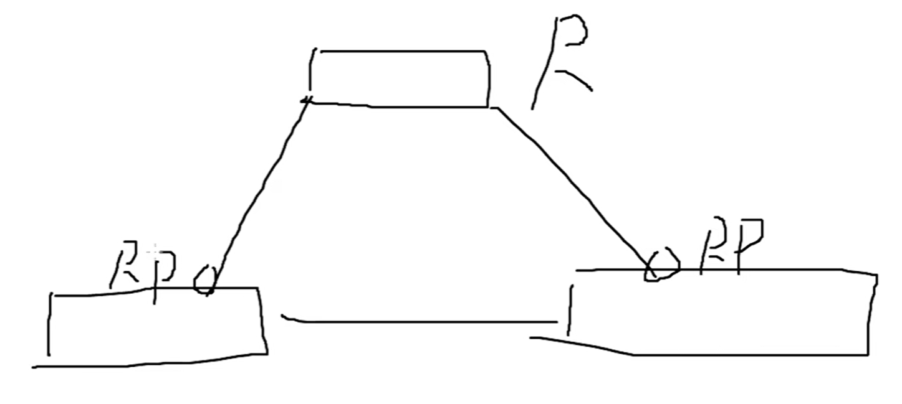

# STP

生成树协议

## 二层链路问题

二层链路中没有IP和路由，转发信息时若没有表项，则直接**泛洪**。

正常交换机可以动态学习MAC地址，建立MAC地址表进行单播，不像路由器有协议跟邻居等概念。若中间链路出现**单点故障**无法发包，数据可以通过其他交换机的冗余路线发送。但是
:::warning

1. 交换机靠MAC地址表单播转发或者泛洪，单点失效链路其中一方的MAC地址表项没有改变，任然由该接口发送数据。等300sMAC地址表项失效后才能断开原有链路。

2. 有冗余路线可能出现环路，产生广播风暴

:::

## STP协议

Spaning tree，解决两个问题**冗余**和**防环**。

<div align=center></div>>

由交换机连接一个环路，cisco交换机默认开启stp。大概30s后就能生成结果。

<div align=center></div>>

stp通过阻塞一些端口来防止环路。当其他接口down或者故障后，接口重新开启，并转发数据。

::: tip STP操作
1. 每个广播域选择一个根桥
2. 每个非根桥上选择一个根端口
3. 每个段选择一个指定端口
4. 阻塞非指定端口
:::

## 选举规则

所有的交换机启用生成树后，交换机开始向其他交换机广播类似于Hello包的东西，**BPDU(Bridge Protocol Data Unit)**。

### 根桥选举 BPDU

BPDU中包含：**Bridge I**D。Bridge ID包括**优先级**和**MAC地址**。

该MAC地址指交换机设备的主板MAC地址，可以叫主板/背板/管理MAC等。接口的MAC地址为主板MAC末尾加上接口号得到。

先对比优先级，默认32768，0-65535，**越小越优先**。优先级相同，对比背板MAC地址，也是**越小越优先**。选出最优先的设备，成为**root**，确立根桥。

确立根桥后所有非根桥都不再发送BPDU，只有根桥每2s发送一次BPDU，20s超时。根桥发送BPDU时，其中除了包含自己的Bridge ID以外，还包含**root ID**，根ID。根ID代表交换机在**自己的广播域内认可的根桥**的优先级和MAC地址。

实际上发送BPDU时发送的就是自己的Bridge ID和认可的根桥root ID。而最开始大家都处于默认状态，所以会认为自己的优先级最高，认为自己是根桥，所以发送的都是自己的优先级。

选举时对比的是收到的root ID。在最开始与对比所有人的Bridge ID一样。

选举对比出根桥后，其他设备就不再发送BPDU。

根桥的BPDU发送到下层设备后，下层设备继续转发，保持根ID不变，转发的桥ID是自己的。

### 根端口选举

选举出根桥后，每一个非根桥要选举出**当前设备最优的端口**作为去往根桥的端口，称为根端口。

评判标准：具有最低根路径的接口

::: tip 选举规则
1. 到根桥的最低路径成本
2. 最低的发送者网桥ID
3. 最低的发送者短裤ID
:::

最先看接口带宽，带宽平等再看后续条件

带宽开销值固定计算，沿途累加固定值。
<div align=center></div>

泛洪BPDU中包含根桥ID和Bridge ID。下层设备转发时将BridgeID替换成自己的BridgeID。

<div align=center></div>

例如sw2和sw3向sw4转发BPDU时，sw4的不同端口会收到sw2和sw3的数据，若带宽相同，查看sw2和sw3的BridgeID，最小的最优先，最优先的成为根端口。

若再选不出来（例如同一台设备接两根线），对比最低发送者**端口ID**。端口ID也在BPDU中，分为优先级和接口号。优先级默认128，结合端口号，例如f0/1，port ID就为128.1。

### 选举指定端口

每个段选举一个指定端口。段：两台设备之前的链路。每条线选择一个指定端口。
<div align=center></div>

根端口的对端一定是指定端口。没有选举根端口的链路需要选举指定端口两个接口对比彼此发送的BridgeID，优先的接口成为指定接口。

### 阻塞非指定端口

没有身份的端口都被阻塞，**AP**。

## 端口角色

指定端口发送BPDU，根端口收BPDU但不发送。根桥发送的BPDU不会回来。只有指定接口有资格发送BPDU。

非指定端口只能收BPDU，但是不能发送BPDU，并且不能转发流量。

## 端口状态

STP中除了端口角色外，还有端口状态。

### block

接口连线后接口的第一个状态。以及非指定端口的状态。

### listen

block过渡到listen。监听BPDU，不能学习MAC地址，不能转发数据，维持15s。在该状态**确认端口角色**。

最后非指定端口状态会回到block。根端口和指定端口进入learn状态。

### learn

决定端口角色后，根端口和指定端口进入该状态。监听BPDU，学习MAC地址，但是**不能转发数据**。维持大概15s。

### forward

学习完MAC地址后，根端口和指定端口进入forward状态。**可以转发数据**。根端口和指定端口最后停留状态

### disable

禁用。交换机开启生成树后，默认所有接口都进行生成树决策，无论接的是交换机还是终端。禁用之后就不参与决策。

## 链路冗余

在发生异常情况时，阻塞端口起到冗余作用。

<div align=center></div>

正常情况2s发送BPDU。若其中一条链路断开

因为sw3有阻塞端口，所以sw3时刻监视链路状态，随时开启阻塞端口，提供冗余。

若sw3直连链路端断开，sw3立刻感知到。sw3立刻开启阻塞端口，状态由block变为**listen**，到larn再到forward，历经30s左右。

非直连链路断开，根据BPDU判断。阻塞端口在超时时间内没有收到BPDU，确认该链路故障，再将阻塞端口开启，等待收敛，大概需要50s。

但是载开启了之后，其他设备额MAC地址表中没有该接口的MAC地址记录，不会向该接口发送数据。

之前的BPDU叫配置BPDU。还有一个特殊BPDU叫**TCN(topology change notification)**，拓扑变更通告。

在稍微复杂一些的拓扑中，能够最直接检测到链路故障的交换机会从它的根端口向上转发TCN BPDU。

接收到TCN BPDU的交换机先回复一个标准BPDU表示已收到，再继续向上转发TCN BPDU。

根桥收到TCN后，会转发一个新的配置BPDU。该BPDU中含有TC位，表示拓扑变更。其余交换机收到后将自己的MAC地址老化时间变为15s，15s后所有交换机的MAC地址表清空。

这样等阻塞端口开启后，能够重新通过广播饭泛洪学习新的路径。

## 其余生成树体系

### pvst

思科的生成树体系，**per vlan span tree**，每一vlan运行一个生成树。标准生成树针对交换机的流量，但是交换机的流量根vlan的流量是区分的。标准的生成树是所有vlan生成一颗。阻塞所有vlan的数据。

pvst把每一个vlan当作一个网桥。每一个vlan有一个根，阻塞的端口也只阻塞单vlan的流量。

但是每个vlan要发一个BPDU。**开销过大**。

每一个vlan的BPDU的优先级中加入了系统号。

::: warning
根不能是接入交换机，数据可能发上去在发下来再回去。一般手动指定根桥。
或者手动指定优先级，必须是4096的倍数。
:::

```sh
# primary和secondary 主根和备根
spamning-tree vlan 1 root primary/secondary
```

::: warning
配置stp前先将端口配置为access，表示接入的设备为终端/主机，只接受接口上的数据包，不接受BPDU等。防止主机模拟交换机参与选举成为根桥，窃取数据流量。
:::
