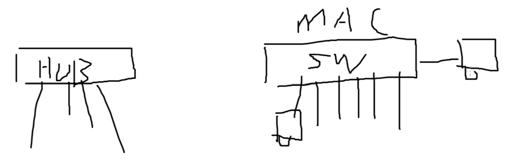
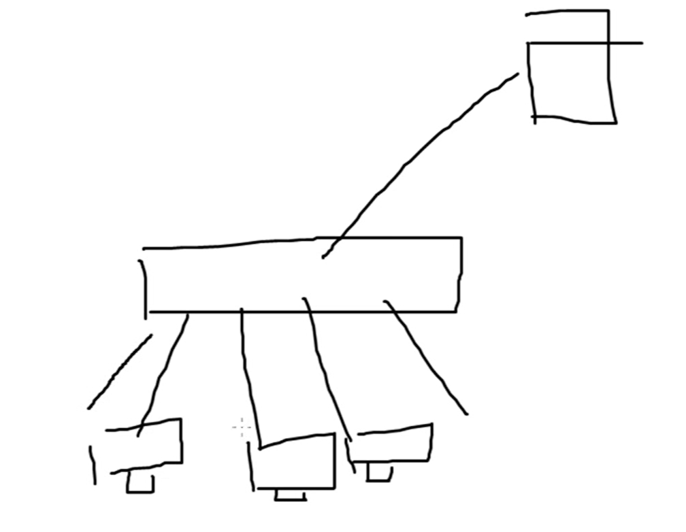

# 交换机基础原理

在网络层没有与路由器功能类似的设备，但是在二层**集线器**跟交换机功能、外形类似。

>

不同点如下：
1. 交换机有MAC地址，集线器没有MAC地址。交换机按照MAC地址**转发**；集线器向其他所有端口**泛洪**，占用其他端口带宽，速度比交换机慢。
2. 交换机可以学习MAC地址，才能转发二层数据帧。缓存整个数据包后再转发出去。
3. 交换机隔离**广播域**和**冲突域**。交换机连接的设备都属于一个网段，同一个广播域。通过vlan隔离广播域。冲突域指接口。
4. 交换机可以防环路，hub不能防环。

>
例如一个hub连接一个外部设备，下连四台设备。若这4台设备同时访问该外部设备。由于hub没有MAC地址，没有缓存，无法转发。该外联接口上4条线同时走，这就是冲突域。在该冲突域上通过CSMA/CD协商。

路由的环路是指路由信息互相更新，而交换的环路是设备拉成环。交换成环路后，如果已经学习了MAC地址，单播可以正常转发。但是如果有任意一个包属于广播，交换机互相泛洪，会出现一个数据包传回原来的地方。数据包在交换机见发不出去了，数据包多了之后就会产生**广播风暴**。

1. 交换机基于数据源MAC地址学习。

2. 基于数据目的MAC地址根据MAC地址表转发。

3. 对于数据的目的MAC地址没有学习过，没有MAC地址表项会执行泛洪。 

4. 交换机接口可以学习多个MAC地址。

5. 一个MAC地址只能被一个交换机接口学习，后到优先。

6. 对于广播、组播、未知单播数据，交换机一律泛洪。
