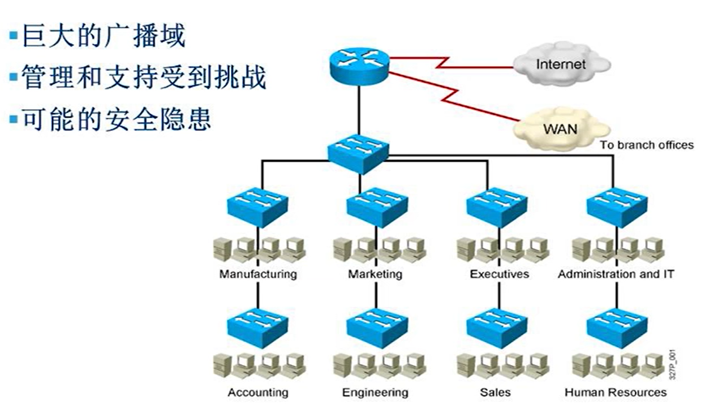
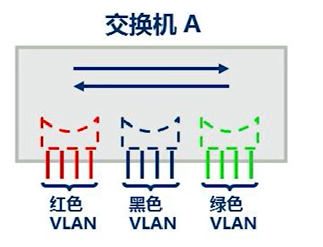
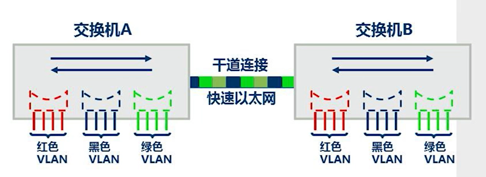

# VLAN

虚拟局域网，同一个交换机的不同vlan不能相互通信，不同交换机的相同vlan可以相互通信。

交换机是二层设备，计算机互相通讯是通过IP地址进行，而IP地址在二层是透传的。交换机连接的设备属于一个大的局域网，通过划分vlan可以在二层将其划分为不同的局域网。

<div align=center></div>>

巨大的广播域中广播量很大。未知单播、组播、广播全都是泛洪转发。

## access

<div align=center></div>>

交换机上分三个vlan（颜色）。每个逻辑vlan就像一个独立的物理桥，交换机上的每一个端口都可以分给不同的vlan。默认情况下每个端口都属于vlan1(公有)。

access一般接终端或者主机。

## trunk

VLAN干道：对于多个vlan交换机来说，vlan干道就是两个交换机之间的连接，它在两个或两个以上的VLAN之间传输通信。每个交换机必须确定它收到的帧属于哪个VLAN。

一个交换机的任何端口都必须属于且只能属于一个VLAN，但当端口配置成trunk干道后，该端口就失去了它自身的VLAN表示，可以为该交换机内的所有VLAN传输数据。

<div align=center></div>>

vlan可以跨越多台交换机，trunk可以承载多个vlan的数据，trunk使用特殊的封装区分不同的vlan。交换机之间的连接配置trunk。

数据在进入vlan2后进入trunk接口。trunk口在数据中打上vlan号标记，打在以太网层协议头再发出去。对端交换机trunk口接收到数据后查看vlan标记，摘除标记后发从vlan2口发出。

打标记->识别标记->摘除标记

交换机的vlan标记有两种协议，ISL和802.1Q。ISL思科私有，802.1Q公有。

ISL在原有数据之前加封装，802.1Q只在以太网头部加一个vlan标记。
 
802.1q中有本征vlan。本征vlan的数据经过trunk口不会打标记。对端trunk口接收到没有打标记的数据，会把收到的数据包放进自己的本征vlan中。中间链路本征vlan不匹配的话，两边通讯的vlan会不匹配。

## vlan号

交换机默认所有接口都属于vlan1。

交换机支持创建4096个vlan，0~4095，0和4095不能用，真正的编号是1~4094。

vlan1,vlan1002,vlan1003,vlan1004,vlan1005交换机初始就有，不能被删除， vlan1能使用，其余四个保留。

1~1001是标准vlan。1006~4094是扩展vlan。cisco 3560以上的型号才支持，vtp协议的transparent模式可用。

## cisco命令

```sh
# 查看vlan表
show vlan brief
# 特权模式下进入vlan database
vlan database
# 创建vlan10
vlan 10
# 退出使用exit，使配置生效并保存
exit
vlan 10 name [该vlan的名字]
# 进入全局配置
config terminal
# 创vlan20
vlan20
name [该vlan的名字]
# 进入接口将接口划分到vlan
int f0/1
switch port mode access
port default vlan10
```
