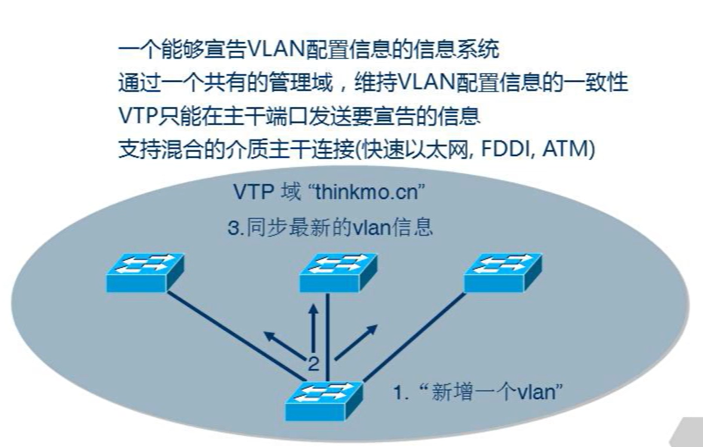

# VTP

思科私有，各个厂商也有自己的类似协议。VTP可以让多台交换机同步同一台交换机的vlan配置。

<div align=center></div>

VTP只能通过主干(trunk)传递，发送配置信息。只同步vlan信息，但是具体哪些端口还需要自己分配。

## VTP域

VTP的传播基于他们在同一个域内，所有设备配置同一个域名。

## VTP通告

基于相应VTP模式进行通告。

## VTP模式

### VTP服务器

服务器能够创建、删除、重命名、修改VLAN，并产生通告。每台交换机默认情况下都是服务器。

### VTP客户端

客户端只能发送通告，只在工作时保存VLAN信息。必须经过手动配置才能成为客户端模式。不能创建、修改、删除VLAN，只能同步其他交换机的vlan。其他交换机给发送通告，本机保存后再发送出去，只在工作时保存。

### VTP透明

透明模式可以创建修改删除VLAN但是不产生通告，只会透传别人的通告。

假设原有网络的VTP服务器被换成一台新的VTP服务器，新的服务器上没有之前配置的VLAN信息。新服务器的VLAN配置只能从老的客户端获取。

## 配置命令
```sh
# 查看VTP状态，其中VTP模式是VTP Operation Mode
show vtp status

# 修改VTP模式为客户端
vtp mode client

# 修改vtp模式为透明
vtp mode transparent

# 需要配置各台交换机VTP Domain Name，让各台交换机在同一个域内，才能传播VTP信息
vtp domain [域名]
```

由于Server client都能发通告，而只有server才能修改vlan。server和server，server和client都可以互相通告。一个网络中可能会有多台server，server之间可互相通告的优先级通过**Configuration Reversion**决定，越高越优先。交换机每做一个配置，该序号加一。

在配置了域名后，配置修订版本号会清空，并且立即通过trunk口发送通告。所有其他没有配置域名的设备也会同步该域名。

vtp信息同步后，平均5min发送一次更新。如果此时再连接一台设备进入网络，默认为server，vtp并没有获得同步，需要5min后才能同步。但是如果原有server再添加vlan设置，则会立即同步。但是一个域内有多个vtp server的话不稳定。

vtp还可以做密码认证
```sh
show vtp password
```
server和client的密码要相同

:::tip VTP能够传递的条件
1. trunk启动

2. 模式相对应正确

3. VTP域、相同的域、相同的密码
:::
