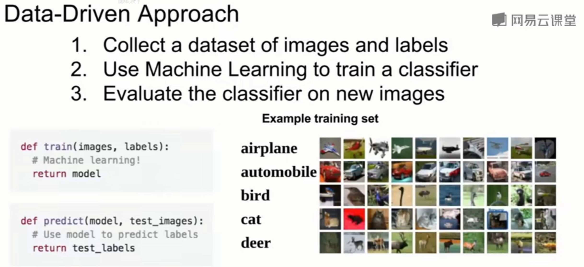
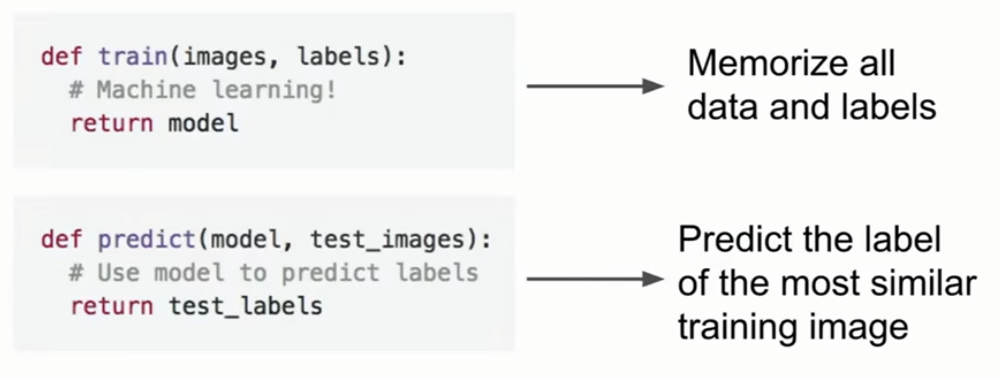

# 图像分类数据驱动方法

Image Classification pipeline

不写具体的分类规则来识别一只猫或者鱼，

1. 收集图片和标签组成的数据集
2. 使用机器学习训练一个分类器
3. 用新图像评估分类器

接口的形式： 
写两个函数，一个训练函数，一个预测函数。 
训练函数接收图片和标签，输出模型 
预测函数接收模型，对图片种类进行预测

## K邻近算法

## 线性分类器：SVM，Softmax

## 两层神经网络1

## 图像特征

