# Asp.net core 项目开发

适用于 .net 6.0 2022/7/25

## 项目创建

在visual studio中创建**ASP.NET Core Web API**项目。

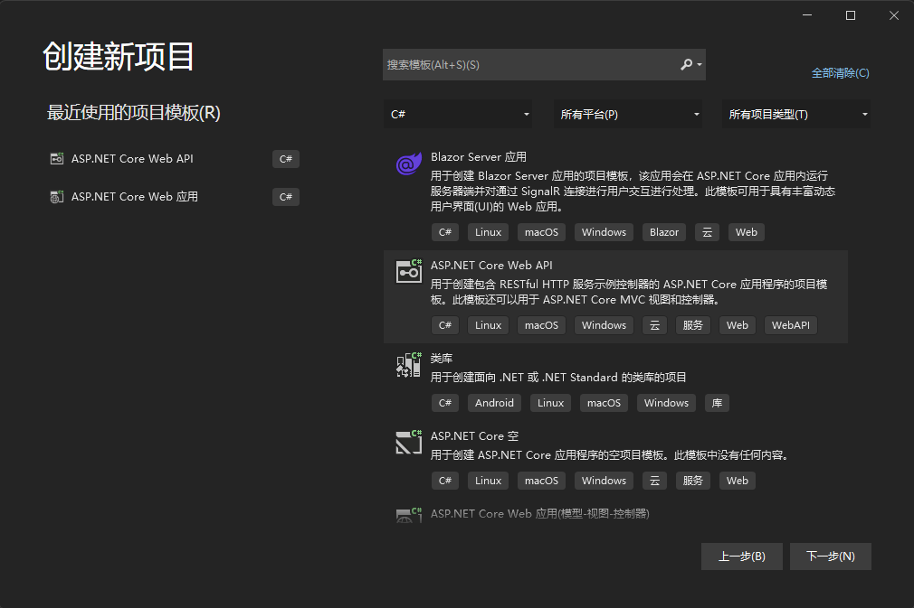

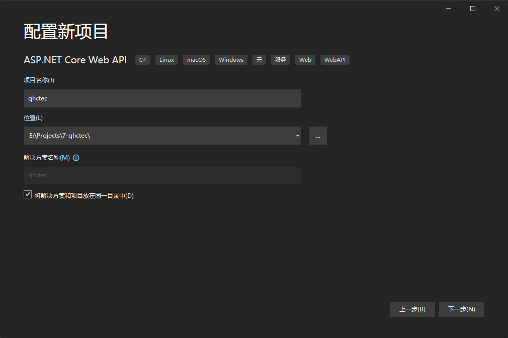

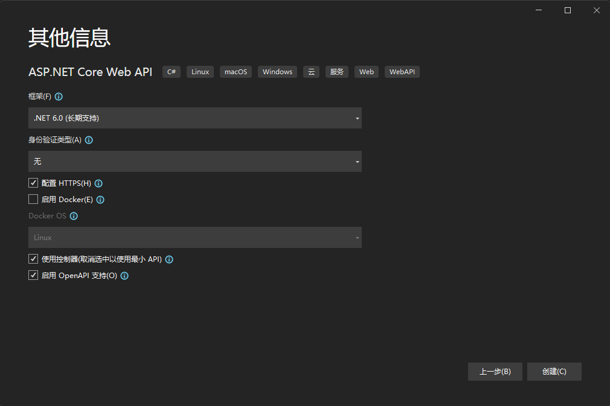

程序入口为Program.cs，其中的代码是对项目服务等的配置。
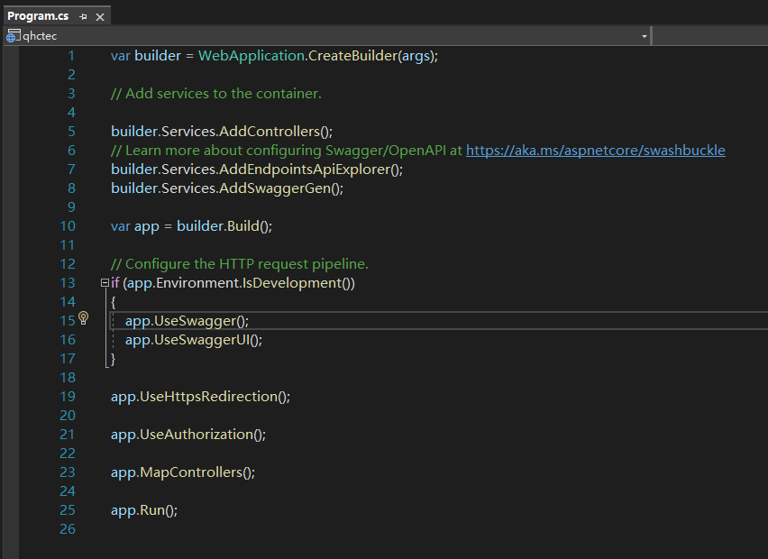

项目中默认包含一个WeatherForecast的类及其控制器。
<div align=center>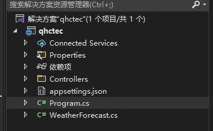</div>

## 跨域配置

跨域问题（Cross-Origin Resource Sharing，简称CORS）是由浏览器的同源策略（Same-Origin Policy）引起的。同源策略是一种安全机制，限制了一个网页从不用源加在的资源与当前页面进行交互。**同源是指两个页面的协议、域名和端口号都相同**。

当一个网页尝试从不用的域名、端口或协议加载资源时，浏览器会根据同源策略阻止这种跨域资源访问。例如，如果一个网页在域名A上加在的JavaScript代码试图向域名B发送Ajax请求，浏览器会阻止这个跨域请求。

跨域问题的产生时因为现代Web应用程序通常采用前后端分离架构，前端代码通常运行在浏览器中，而后端代码则运行在不同的服务器上。为了保护用户数据安全和防止恶意攻击，浏览器引入了同源策略，限制了跨域资源的访问。

跨域问题可以通过跨域资源共享（CORS）机制来解决。CORS时一种机制，允许服务器在响应中添加一些特定的HTTP头部，告诉浏览器允许跨域访问资源。通过在服务器端配置响应头，可以允许特定的域名或所有域名跨域访问资源。

通常情况下，服务器端需要设置以下HTTP头部来启用CORS：
1. Access-Control-Allow-Origin：指定允许访问资源的域名，可以是具体的域名或通配符表示允许所有域名访问
2. Access-Control-Allow-Methods：指定允许的HTTP请求方法，如GET、POST等
3. Access-Control-Allow-Headers：指定允许的自定义HTTP请求头部
4. Access-Control-Allow-Credentials：指定是否允许发送凭据，如Cookie，HTTP认证

通过设置这些HTTP头部，服务器可以告知浏览器允许跨域访问资源，从而解决跨域问题。

::: tip
CORS是一种浏览器机制，对于其他非浏览器环境，如服务器之间的请求，不受同源策略的限制。
:::

```csharp
// 配置跨域策略
builder.Services.AddCors(options => {
    options.AddPolicy("CorsPolicy", opt => opt.AllowAnyOrigin().AllowAnyHeader().AllowAnyMethod());
})

// builder.Services.AddCors(options =>
// {
//     options.AddPolicy(
//             name: "Cors",
//             build =>
//             {
//                 build.WithOrigins("*", "*", "*")
//                 .AllowAnyOrigin()
//                 .AllowAnyHeader()
//                 .AllowAnyMethod();
//             }
//         );
// });

// 使用跨域策略
app.UseCors("CorsPolicy");
```

::: warning
发生跨域时，请求是经过了后端的。只是后端返回数据以后，被浏览器拦截了，不给客户端。
:::

## Token认证

参考博客地址：<https://blog.csdn.net/weixin_44442366/article/details/124017306>

项目中使用jwt bearer token来标识前端用户身份，以及权限设置

所需要的nuget包：Microsoft.AspNetCore.Authentication.JwtBearer

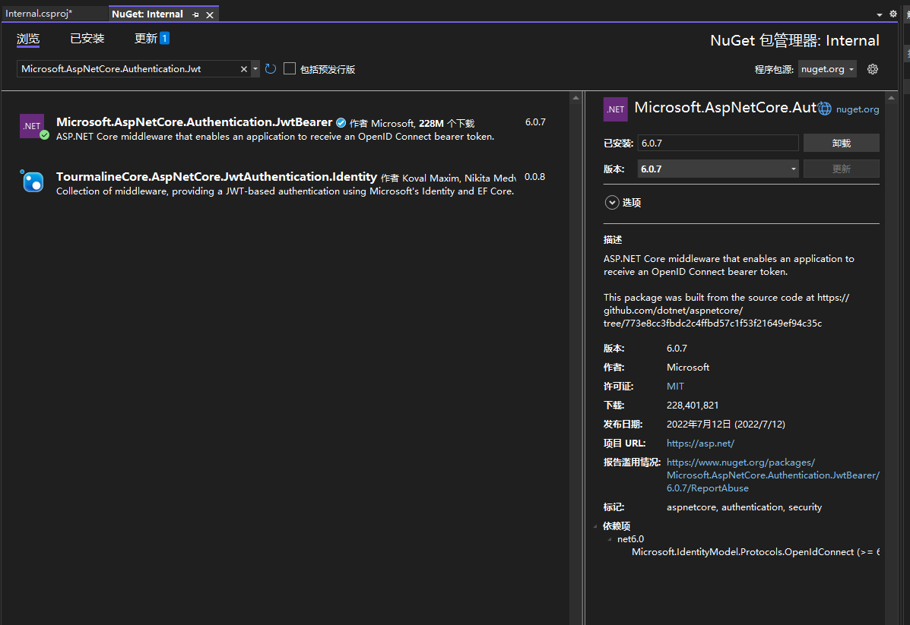

在appsettings.json中添加Jwt需要的认证，包括认证密钥、发布者、接收者等

```json
"Authentication": {
    "key": "",              // 满足一定长度要求的字符串，长度不够会报错
    "issuer": "S.Pt.V.",    //发布者
    "audience": "audience"  //接收者
}
```

Jwt的三部分：
1. 标头：包含令牌的类型和使用的签名算法
2. 有效载荷：存放用户信息，如用户id，权限等，但不存放敏感信息，如密码等（可以被破解）
3. 签名：使用编码后的header和payload

Jwt在登录成功后生成。生成Token的部分代码如下：

```csharp
public static string generateJwtToken(string name, string role, Guid uid, DateTime expiretime, string key)
{
    var tokenHandler = new JwtSecurityTokenHandler();
    var bytekey = Encoding.ASCII.GetBytes(key);
    var tokenDescriptor = new SecurityTokenDescriptor
    {
        Subject = new ClaimsIdentity(new Claim[]
        {
            new Claim(ClaimTypes.Name, name),
            new Claim(ClaimTypes.Role, role),
            new Claim(ClaimTypes.NameIdentifier, uid.ToString()),
            new Claim(ClaimTypes.Expiration, expiretime.ToString())
        }),
        Expires = DateTime.Now.AddDays(1),
        SigningCredentials = new SigningCredentials(new SymmetricSecurityKey(bytekey), SecurityAlgorithms.HmacSha256Signature)
    };
    var token = tokenHandler.CreateToken(tokenDescriptor);
    return tokenHandler.WriteToken(token);
}
```

取出token中存放的信息：

```csharp
Username = User.Claims.GetUserName();
AccountGuid = User.Claims.GetAccountUid();
Role = User.Claims.GetRole();
Expire = User.Claims.GetExpire();
```

在Program.cs注入Jwt认证服务

```csharp
builder.Services.UseJwt("[Token中使用的Key]");

// 还需要配置这两个中间件
app.UseAuthentication();
app.UseAuthorization();
```

## 日志框架

使用Serilog可以实现将asp.net的信息输出到不同的地方，如控制台、文件等。

### Nuget程序包

需要安装Serilog.AspNetCore、Serilog.Sinks.Console这两个Nuget程序包

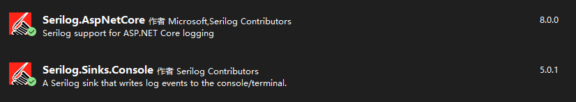

### appsettings.json

修改appsettings.json内容，配置日志输出到文件

```json
{
  "Serilog": {
    "MinimumLevel": {
      "Default": "Information",
      "Override": {
        "Microsoft": "Warning",
        "Microsoft.Hosting.Lifetime": "Information"
      }
    },
    "WriteTo": {
      // "Console": {
      //   "Name": "Console"
      /// },
      "File": {
        "Name": "File",
        "Args": {
          "path": "./logfile/log-.txt",
          "rollingInterval": "Day"
        }
      }
    }
  },
  "AllowedHosts": "*"
}
```

### Program.cs

在Program.cs中配置使用Serilog

```csharp
var builder = WebApplication.CreateBuilder(args);
// Configure Serilog
Log.Logger = new LoggerConfiguration()
    .ReadFrom.Configuration(builder.Configuration)
    .Enrich.FromLogContext()
    .WriteTo.Console()
    .WriteTo.File("logfile/log-.txt", rollingInterval: RollingInterval.Day)
    .CreateLogger();
builder.Host.UseSerilog();
```

### 注册

在控制器中注入Serilog

```csharp
using Microsoft.AspNetCore.Mvc;
using Microsoft.Extensions.Logging;

namespace SchoolVisionNet.Controllers
{
    [Route("api/[controller]/[action]")]
    [ApiController]
    public class TestController : ControllerBase
    {
        private readonly ILogger<TestController> _logger;

        public TestController(ILogger<TestController> logger)
        {
            _logger = logger;
        }

        /// <summary>
        /// 日志输出测试
        /// </summary>
        /// <returns></returns>
        [HttpGet]
        public ActionResult LoggerTest()
        {
            _logger.LogInformation("LogInformation " + DateTime.Now.ToString());
            return Ok();
        }
    }
}
```

## 连接数据库

### Mysql

连接Mysql数据库需要安装 **Pomelo.EntityFrameworkCore.MySql** 和 **Microsoft.EntityFrameworkCore.Tools** 程序包，在解决方案右键**管理NuGet程序包**，选择第一个，为所选的项目安装。

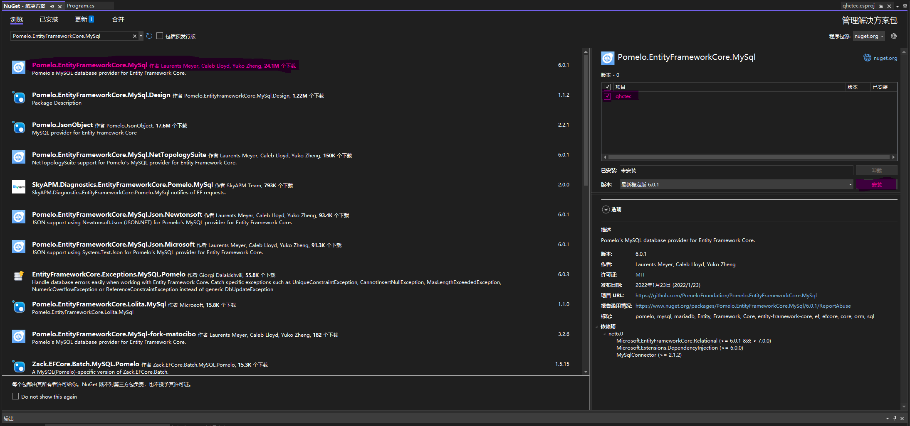
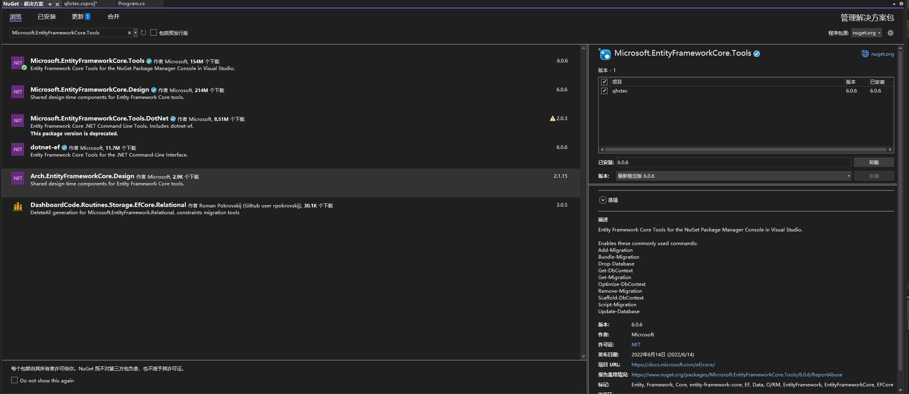

之后打开程序包管理器控制台
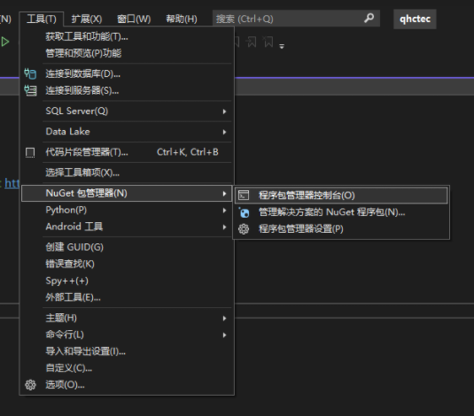

:::danger
需要在执行前创建Models文件夹，否则会报错
:::

在其中输入以下命令连接数据库，并按照数据库的表进行反向工程建立模型

```sh
Scaffold-DbContext "server=[服务器地址];userid=[用户名];pwd=[用户密码];port=[数据库端口(3306)];database=[数据库名];sslmode=none;" Pomelo.EntityFrameworkCore.MySql -OutputDir Models -Force

Scaffold-DbContext "server=192.168.51.250;userid=qhctec;pwd=qhctec@2023;port=3306;database=qhctec;sslmode=none;" Pomelo.EntityFrameworkCore.MySql -OutputDir Models -Force

Scaffold-DbContext "server=10.80.65.201;userid=qhctec;pwd=qhctec#1q2w3e;port=3306;database=qhctec;sslmode=none;" Pomelo.EntityFrameworkCore.MySql -OutputDir Models -Force
```

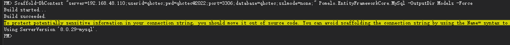

执行后生成的项目结构：<br />
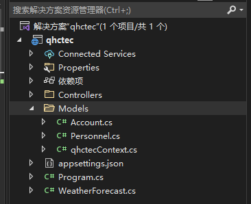

Account.cs、Personnel.cs、qhctecContext.cs均为生成的文件

Account.cs为根据数据库qhctec中account表生成的类

```csharp
using System;
using System.Collections.Generic;

namespace qhctec.Models
{
    public partial class Account
    {
        public int Id { get; set; }
        public Guid Uid { get; set; }
        public Guid Useruid { get; set; }
        public string Account1 { get; set; } = null!;
        public string Password { get; set; } = null!;
        public string Role { get; set; } = null!;
        public ulong Enabled { get; set; }
        public string Createdate { get; set; } = null!;
        public string Lastlogin { get; set; } = null!;
    }
}

```

Personnel.cs为根据数据库qhctec中personnel表生成的类

```csharp
using System;
using System.Collections.Generic;

namespace qhctec.Models
{
    public partial class Personnel
    {
        public int Id { get; set; }
        public Guid Uid { get; set; }
        public string Name { get; set; } = null!;
        public string? Telephone { get; set; }
        public string? Address { get; set; }
    }
}

```

qhctecContext.cs为数据库上下文

```csharp
using System;
using System.Collections.Generic;
using Microsoft.EntityFrameworkCore;
using Microsoft.EntityFrameworkCore.Metadata;

namespace qhctec.Models
{
    public partial class qhctecContext : DbContext
    {
        public qhctecContext()
        {
        }

        public qhctecContext(DbContextOptions<qhctecContext> options)
            : base(options)
        {
        }

        public virtual DbSet<Account> Accounts { get; set; } = null!;
        public virtual DbSet<Personnel> Personnel { get; set; } = null!;

        protected override void OnConfiguring(DbContextOptionsBuilder optionsBuilder)
        {
            if (!optionsBuilder.IsConfigured)
            {
#warning To protect potentially sensitive information in your connection string, you should move it out of source code. You can avoid scaffolding the connection string by using the Name= syntax to read it from configuration - see https://go.microsoft.com/fwlink/?linkid=2131148. For more guidance on storing connection strings, see http://go.microsoft.com/fwlink/?LinkId=723263.
                optionsBuilder.UseMySql("server=192.168.48.110;userid=qhctec;pwd=qhctec@2022;port=3306;database=qhctec;sslmode=none", Microsoft.EntityFrameworkCore.ServerVersion.Parse("8.0.29-mysql"));
            }
        }

        protected override void OnModelCreating(ModelBuilder modelBuilder)
        {
            modelBuilder.UseCollation("utf8mb4_0900_ai_ci")
                .HasCharSet("utf8mb4");

            modelBuilder.Entity<Account>(entity =>
            {
                entity.ToTable("account");

                entity.Property(e => e.Id).HasColumnName("id");

                entity.Property(e => e.Account1)
                    .HasMaxLength(45)
                    .HasColumnName("account");

                entity.Property(e => e.Createdate)
                    .HasMaxLength(45)
                    .HasColumnName("createdate");

                entity.Property(e => e.Enabled)
                    .HasColumnType("bit(1)")
                    .HasColumnName("enabled");

                entity.Property(e => e.Lastlogin)
                    .HasMaxLength(45)
                    .HasColumnName("lastlogin");

                entity.Property(e => e.Password)
                    .HasMaxLength(45)
                    .HasColumnName("password");

                entity.Property(e => e.Role)
                    .HasMaxLength(45)
                    .HasColumnName("role");

                entity.Property(e => e.Uid).HasColumnName("uid");

                entity.Property(e => e.Useruid).HasColumnName("useruid");
            });

            modelBuilder.Entity<Personnel>(entity =>
            {
                entity.ToTable("personnel");

                entity.Property(e => e.Id).HasColumnName("id");

                entity.Property(e => e.Address)
                    .HasMaxLength(45)
                    .HasColumnName("address");

                entity.Property(e => e.Name)
                    .HasMaxLength(45)
                    .HasColumnName("name");

                entity.Property(e => e.Telephone)
                    .HasMaxLength(45)
                    .HasColumnName("telephone");

                entity.Property(e => e.Uid).HasColumnName("uid");
            });

            OnModelCreatingPartial(modelBuilder);
        }

        partial void OnModelCreatingPartial(ModelBuilder modelBuilder);
    }
}

```

上述文件生成后，可以看到其中的OnConfiguring函数，其中连接数据库用的连接字符串是明文写在代码文件中的，可以将其写进appsettings.json中隐藏。

之后需要在Program.cs中注册数据库上下文：

```csharp
builder.Services.AddDbContext<qhctecContext>();
```

## 创建控制器

建立好各个类之后，需要为每个类创建一个控制器，在Controller文件夹中添加新建项选择API控制器。
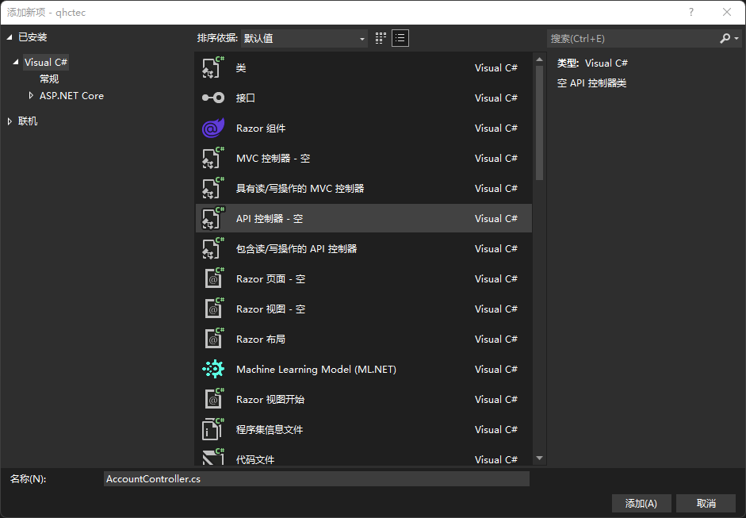

以PersonnelController为例展示web api的创建

PersonnelController.cs的原始代码为：

```csharp
using Microsoft.AspNetCore.Http;
using Microsoft.AspNetCore.Mvc;

namespace qhctec.Controllers
{
    [Route("api/[controller]")]
    [ApiController]
    public class PersonnelController : ControllerBase
    {
    }
}

```

修改如下，简单添加几个API

```csharp
using Microsoft.AspNetCore.Http;
using Microsoft.AspNetCore.Mvc;
using qhctec.Models;

namespace qhctec.Controllers
{
    [Route("api/[controller]/[action]")]
    [ApiController]
    public class PersonnelController : ControllerBase
    {
        private readonly qhctecContext _qhctecContext;

        public PersonnelController(qhctecContext qhctecContext)
        {
            _qhctecContext = qhctecContext;
        }
        /// <summary>
        /// 获取所有人员信息
        /// </summary>
        /// <returns></returns>
        [HttpGet]
        public ActionResult GetAll()
        {
            List<Personnel> personnels = _qhctecContext.Personnel.ToList();
            return Ok(personnels);
        }

        /// <summary>
        /// 添加人员信息
        /// </summary>
        /// <param name="input"></param>
        /// <returns></returns>
        [HttpPost]
        public ActionResult Add(Personnel input)
        {
            if (!ModelState.IsValid)
            {
                return BadRequest();
            }
            Personnel personnel = _qhctecContext.Personnel.Where(p => p.Uid == input.Uid).FirstOrDefault();
            if (personnel == null)
            {
                personnel = new Personnel
                {
                    Uid = input.Uid,
                    Name = input.Name,
                    Address = input.Address,
                    Telephone = input.Telephone
                };
                _qhctecContext.Personnel.Add(personnel);
                _qhctecContext.SaveChanges();
                return Ok();
            }
            else
            {
                return BadRequest("Personnel already exists.");
            }
        }

        /// <summary>
        /// 删除人员信息
        /// </summary>
        /// <param name="guid"></param>
        /// <returns></returns>
        [HttpPost]
        public ActionResult Delete(Guid guid)
        {
            if (!ModelState.IsValid)
            {
                return BadRequest();
            }
            Personnel personnel = _qhctecContext.Personnel.Where(_ => _.Uid == guid).FirstOrDefault();
            if(personnel == null)
            {
                return BadRequest("Personnel not found");
            }
            _qhctecContext.Personnel.Remove(personnel);
            _qhctecContext.SaveChanges(true);
            return Ok();
        }
        
        /// <summary>
        /// 查找人员信息
        /// </summary>
        /// <returns></returns>
        [HttpGet]
        public ActionResult Find()
        {
            return Ok();
        }

        /// <summary>
        /// 修改人员信息
        /// </summary>
        /// <returns></returns>
        [HttpPost]
        public ActionResult Edit(Personnel input)
        {
            if (!ModelState.IsValid)
            {
                return BadRequest(ModelState.IsValid);
            }
            Personnel personnel = _qhctecContext.Personnel.Where(p => p.Uid == input.Uid).FirstOrDefault();
            if(personnel == null)
            {
                return BadRequest("Personnel not found.");
            }
            personnel.Name = input.Name;
            personnel.Address = input.Address;
            personnel.Telephone = input.Telephone;
            _qhctecContext.SaveChanges();
            return Ok();
        }
    }
}

```

## Swagger页面

https://blog.csdn.net/qq_25086397/article/details/103742575?spm=1001.2101.3001.6650.1&utm_medium=distribute.pc_relevant.none-task-blog-2%7Edefault%7ECTRLIST%7ERate-1-103742575-blog-124109433.pc_relevant_default&depth_1-utm_source=distribute.pc_relevant.none-task-blog-2%7Edefault%7ECTRLIST%7ERate-1-103742575-blog-124109433.pc_relevant_default&utm_relevant_index=2

安装Swashbuckle.Asp.NetCore

在Program.cs中添加代码

```csharp
builder.Services.AddSwaggerGen(options =>
{
    options.SwaggerDoc("V1", new OpenApiInfo{
        Title = "API Demo",
        Version = "v1"
    });

    var xmlFile = $"{Assembly.GetExecutingAssembly().GetName()}.xml";
    var xmlPath = Path.Combine(AppContext.BaseDirectory, xmlFile);

    options.IncludeXmlComments(xmlPath, true);
    options.DocInclusionPredicate((string docName, ApiDescription description) => true);
    options.CustomSchemaIds((Type x) => x.FullName);
    options.ResolveConflictingActions((IENumberable<ApiDescription> p) => p.First());

    var securityScheme = new OpenApiSecurityScheme()
    {
        description = "Jwt认证，格式：Bearer <token>",
        Name = "Authorization",
        In = ParameterLocation.Header,
        Type = SecurityScheme.Http,
        Scheme = "bearer",
        BearerFormat = "JwT"
    };

    var securtiyRequirement = new OpenApiSecurityRequirement
    {
        {
            new OpenApiSecurityScheme
            {
                Reference = new OpenApiReference
                {
                    Type = ReferenceType.SecurityType.SecurityScheme,
                    Id = "bearerauth"
                }
            },
            new string[] {}
        }
    };

    options.AddSecurityDefinition("bearerauth", securityScheme);
    options.AddSecurityRequirement(securtiyRequirement);
})

app.UseSwagger();
app.UseSwaggerUI(option =>
{
    option.SwaggerEndpoint("/swagger/v1/swagger.json", "API Demo v1");
    option.DefaultModelsExpanDepth(-1);
});
```
