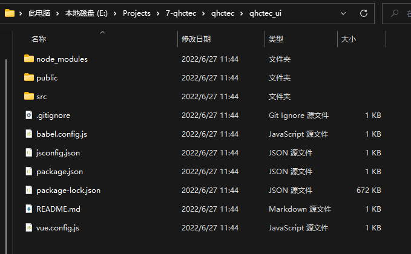
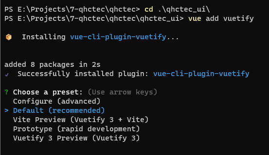
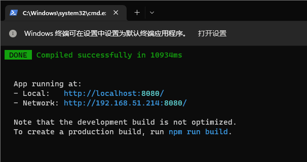

# 前端开发

## Vue项目创建
因为现在的开发基本是前端后端分离的模式，前端页面被当作静态资源放在后端项目中，所以喜欢把vue项目放在.net项目的文件夹里，在.net项目目录中执行命令
```sh
vue create [前端项目名称]

vue create qhctec_ui
```

创建时选择之前创建好的模板form，使用Vue2，因为Vue3添加vuetify会出问题


这一步操作会创建一个名为qhctec_ui的文件夹，该文件夹中的文件就是前端项目需要用到的文件。


::: TIP 报multi-word错误
在 vue.config.js 中添加 lintOnSave: false
:::

## 向项目中添加vuetify
vuetify官网，按照其步骤安装即可：
https://vuetifyjs.com/zh-Hans/getting-started/installation/

在Vue项目文件夹中执行：
```sh
vue add vuetify
```

选择默认


执行npm run serve运行vue项目，在浏览器中可以访问到页面：
```sh
npm run serve
```



## 项目结构
项目文件结构大致如下：


node_modules中是安装的各种npm包

public文件夹中存放一些静态资源，图片等等

src文件夹存放源文件<br />
&ensp;assets中存放静态资源<br />
&ensp;components中存放一些写好的组件的vue文件，方便其他页面调用<br />
&ensp;plugins下为一些插件的配置文件，例如vuetify<br />
&ensp;router为页面路由的配置，后续会修改<br />
&ensp;store为存放一些变量的配置，包括函数方法等等<br />
&ensp;views中一般为页面的vue文件<br />
&ensp;App.vue是页面的文件<br />
&ensp;main.js,应该算是应用的配置<br />

其余文件是创建项目时所选项目的配置，例如babel，以及项目中安装的node modules的配置(package.json以及package-lock.json)

## 页面路由

vue项目的页面路由定义在/src/router/index.js下，显示在<router-view/>组件中

默认目录结构定义如下，路由结构在routes中。routes中的每一个对象为一个页面，其component属性指定了该页面使用的vue文件，若在其下还有子页面，则放在children属性中。

```js
import Vue from 'vue'
import VueRouter from 'vue-router'
import HomeView from '../views/HomeView.vue'

Vue.use(VueRouter)

const routes = [
  {
    path: '/',
    name: 'home',
    component: HomeView
  },
  {
    path: '/about',
    name: 'about',
    // route level code-splitting
    // this generates a separate chunk (about.[hash].js) for this route
    // which is lazy-loaded when the route is visited.
    component: () => import(/* webpackChunkName: "about" */ '../views/AboutView.vue')
  }
]

const router = new VueRouter({
  routes
})

export default router

```

之前写过的示例：

```js
import Vue from "vue";
import VueRouter from "vue-router";

Vue.use(VueRouter);
//重写push
const originalPush = VueRouter.prototype.push
VueRouter.prototype.push = function push(location) {
   return originalPush.call(this, location).catch(err => err)
}

//重写replace
const originalReplace = VueRouter.prototype.replace;
VueRouter.prototype.replace = function replace(location) {
    return originalReplace.call(this, location).catch(err => err);
};

const routes = [
  {
    path: "/",
    name: "redirect",
    redirect: "/login"
  },
  {
    path: "/login",
    name: "login",
    component: () => import("@/views/Account/Login.vue")
  },
  {
    path: "/home",
    name: "home",
    redirect: "/home/personalinfo",
    component: () => import("@/layout/PageLayout.vue"),
    children:[
      {
        path: "/home/coursesavailable",
        name: "coursesavailable",
        component: () => import("@/views/Courses/CoursesAvailable.vue")
      },
      {
        path:"/home/coursesselected",
        name:"coursesselected",
        component: () => import("@/views/Courses/CoursesSelected.vue")
      },
      {
        path:"/home/personalinfo",
        name:"personalinfo",
        component: () => import("@/views/Account/PersonalInfo.vue")
      },
      {
        path:"/home/sortbyclasses",
        name:"records_classes",
        component: () => import("@/views/Records/SortbyClasses.vue")
      },
      {
        path:"/home/sortbycourses",
        name:"records_courses",
        component: () => import("@/views/Records/SortbyCourses.vue")
      }
    ]
  }
];

const router = new VueRouter({
  mode:"hash",
  routes
});

export default router;


```

## 连接后端API

### Axios

对接后端使用的是axios，具体的东西还得有空仔细研究，但是多次项目经验验验证了如下可行的写法：

在 /src/plugins 中新建的axios.js。其中主要作用是：
1. 请求拦截器，检测本地如果存在之前获取的token，则拦截请求，将本地token以后端格式嵌入请求头中。**需要提前在store中定义好对应的存储对象**，否则请求发不出去，会报错。
2. 响应拦截器，从响应中把返回信息解析出来（我猜是这样）
3. 重写了各个请求，如get、post、upload和download等，用于重新定义api

::: WARNING
注意，请求要与后端的输入匹配。例如在后端api入参为两个字符串时，正确的post请求是把参数带在url中。而按照之前重写的方式，请求参数是在载荷中的，这样请求会失败。当把后端入参修改为对象时，就可以正确响应。
:::

```js
//封装axios
import axios from "axios";
import store from "../store";
import setting from "../settings"

axios.defaults.timeout = 5000;
axios.defaults.baseURL = setting.apiurl
axios.defaults.headers.post["Content-Type"] = "application/json,charset=UTF-8";
axios.defaults.headers.get["Content-Type"] = "application/json";

// 请求拦截器
axios.interceptors.request.use(
  config => {
    if (store.state.user.token) {
      config.headers.Authorization = "Bearer " + store.state.user.token;
    }
    return config;
  },
  error => {
    return Promise.reject(error);
  }
);
//响应拦截器
axios.interceptors.response.use(
  response => {
    //console.log("response");
    return response;
  },
  error => {
    return Promise.reject(error);
  }
);
function get(url, params = {}) {
  return new Promise((resolve, reject) => {
    axios
      .get(url, {
        params: params
      })
      .then(response => {
        resolve(response.data);
      })
      .catch(err => {
        reject(err);
      });
  });
}
function post(url, data = {}) {
  return new Promise((resolve, reject) => {
    axios.post(url, data).then(
      response => {
        resolve(response.data);
      },
      err => {
        reject(err);
      }
    );
  });
}
function upload(url, data = {}) {
  var instance = axios.create({
    baseURL: defaultsettings.apiurl,
    timeout: 500000,
    headers: {
      "Content-Type": "multipart/form-data",
      Authorization: "Bearer " + store.state.user.token
    }
  });
  return instance.post(url, data);
}

function download(url, data = {}) {
  return new Promise((resolve, reject) => {
    axios.post(url, data, { responseType: "blob" }).then(
      response => {
        resolve(response.data);
      },
      err => {
        reject(err);
      }
    );
  });
}

export { get, post, upload, download };
export default {
  install: function(Vue) {
    Vue.prototype.$get = get;
    Vue.prototype.$post = post;
  }
};

```

### api接口定义

从axios中引入重写后的get和post，再加上后端接口的url。

```js
import { get, post } from "@/plugins/axios";

export function api_account_login(data) {
    return post("/api/Account/Login", data);
}

```

### 调用

在页面对应位置调用

```js
<script>
import { api_account_login } from "@/api";
export default ({
    name: "LoginCard",
    data: () => ({
        username: "S_Pt_V",
        password: "159753",
    }),
    mounted() {},
    computed: {},
    methods: {
        login() {
            console.log(this.username);
            console.log(this.password);
            api_account_login({
                UserName: this.username,
                Password: this.password
            }).then(res => {
                console.log(res);
            })
        }
    }
})
</script>
```

## 地图

### Leaflet

Leaflet 是一个开源的 JavaScript 库，用于创建交互式的地图应用程序。它提供了一系列简单易用的 API，可以帮助开发者在网页上嵌入地图，并添加各种交互和图层，如标记、多边形、折线、热点、地图图层等。

#### 安装

安装leafelet
```sh
npm install leaflet
```

#### 引入

```js
import L from 'leaflet';\
import 'leaflet/dist/leaflet.css';
```

#### 添加地图容器

```html
<template>
  <div id="map"></div>
</template>

<style>
#map {
    width: 100%;
    height: 100vh;
}
</style>
```

#### 初始化地图

```js
<script>
import L from "leaflet";
import "leaflet/dist/leaflet.css";

export default {
    name: "Map",
    mounted() {
        // 创建地图
        // const map = L.map('map').setView([0, 0], 3); // 将地图设置为整个世界，缩放级别为2
        const map = L.map('map').setView([36.6171, 101.7782], 14);
        
        // 使用CartoDB的Dark Matter地图图块
        L.tileLayer('https://{s}.basemaps.cartocdn.com/dark_all/{z}/{x}/{y}{r}.png', {
            // attribution: 'Map tiles by CartoDB, under CC BY 3.0. Data by OpenStreetMap, under ODbL.',
            maxZoom: 19
        }).addTo(map);

        // 当地图加载完毕后，手动触发地图大小重新计算
        this.map.on('load', () => {
            this.map.invalidateSize();
        })
    }
};
</script>
```
