# OpencV

## 环境配置

opencv可以直接下载官方build好的库，github下载的exe也是将库函数解压到某个指定的目录中。

使用时需要在Visual Studio中配置库及二进制文件的引用路径。

在系统环境变量中添加库文件目录

:::tip
需要添加到系统变量的Path中，重启生效
:::

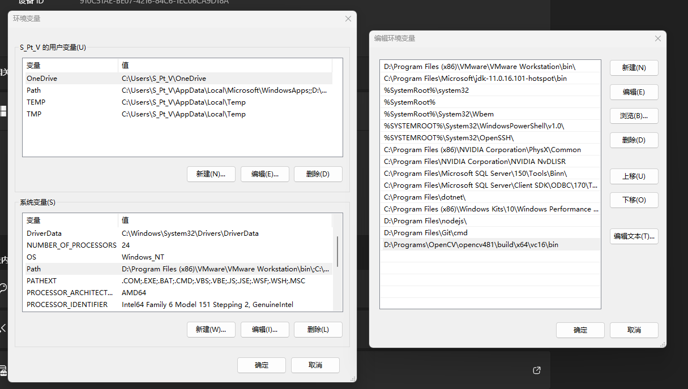

VS创建新项目：
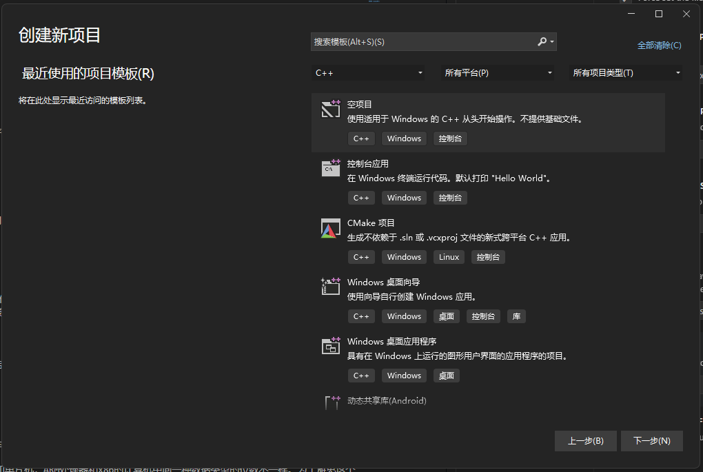

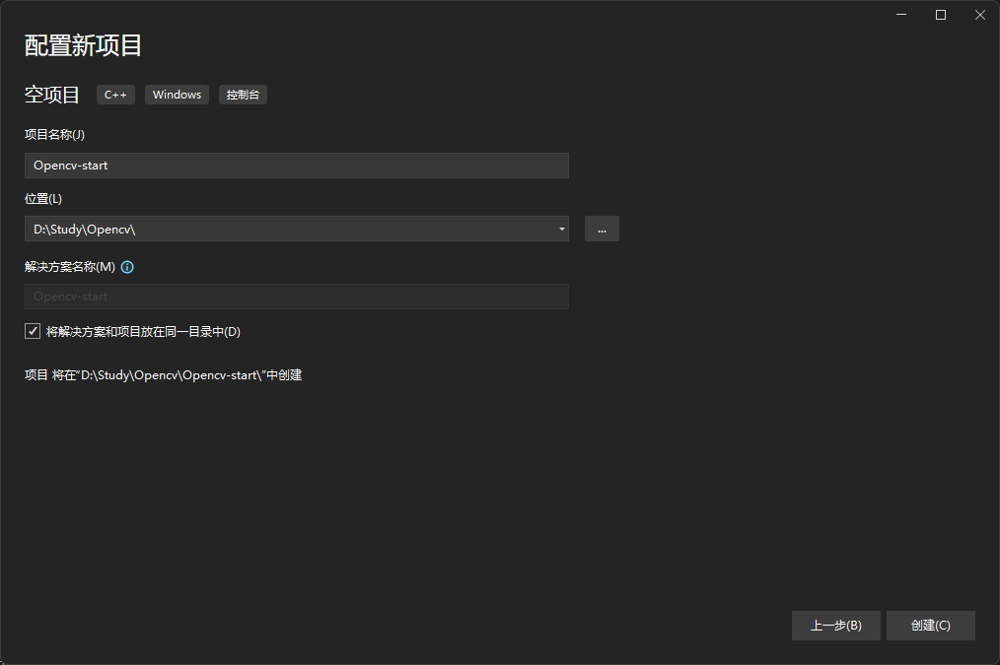

打开项目的属性管理器

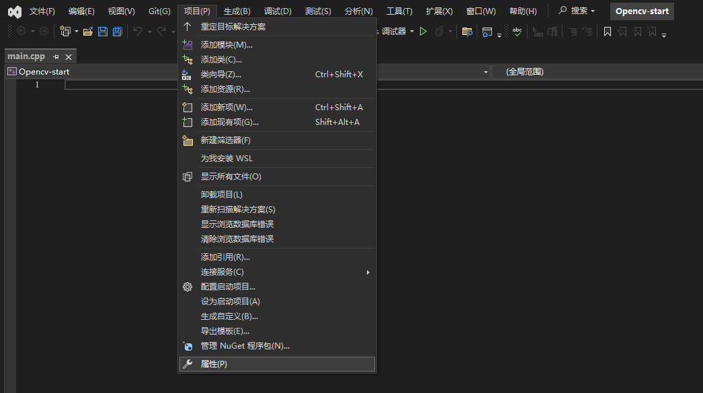

配置VC++的包含目录，向**包含目录**中添加解压出来的include目录

:::tip
好像只用添加include就可以
:::

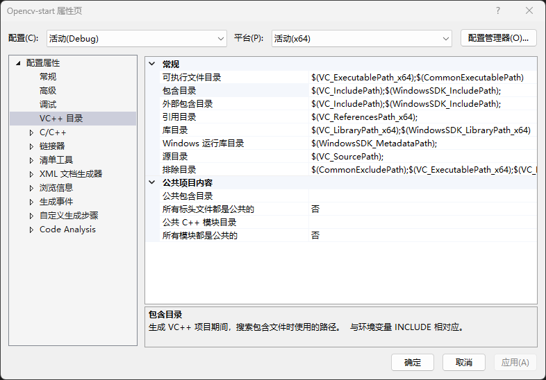

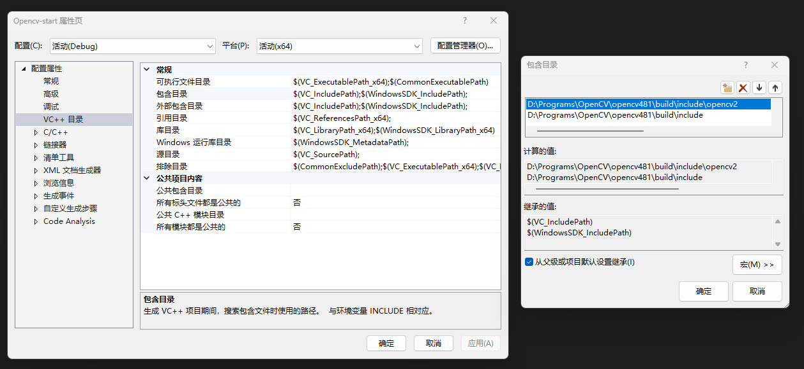

在**库目录**中配置库的路径

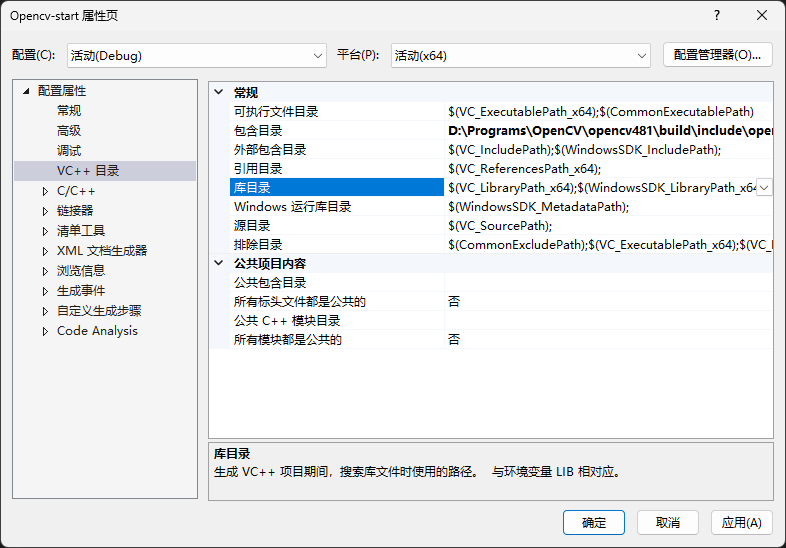

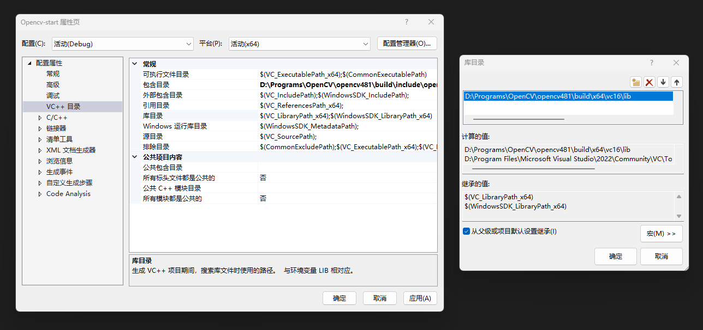

在**附加依赖项**中配置release版本的库文件，该文件在库目录lib中。

:::tip
需要添加那个结尾带d的文件，不然可能报错
:::

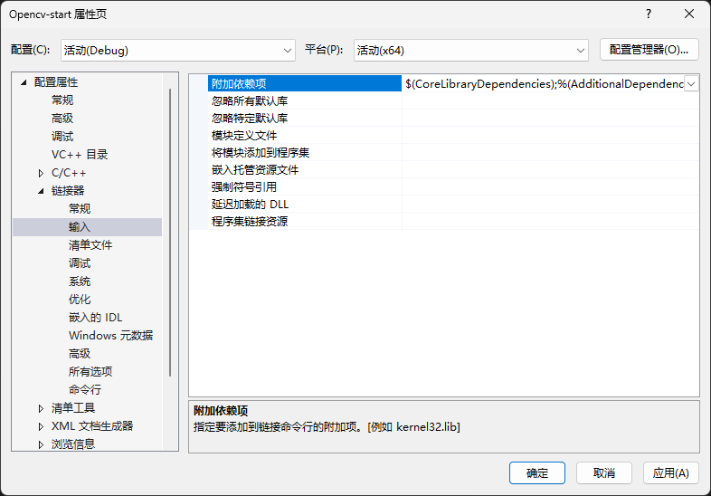

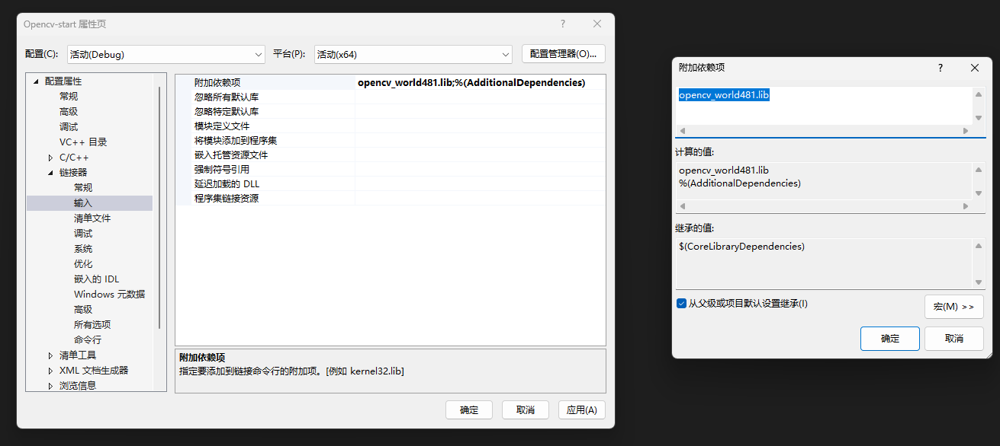

:::warning
debug和release的内容可能需要分开配置
:::

新建main.cpp文件进行测试
```cpp
#include <opencv2/opencv.hpp>
#include <iostream>

using namespace cv;
using namespace std;

int main()
{
	Mat src = imread("D:/images/test.png");
	imshow("imput", src);
	waitKey(0);
	destroyAllWindows();
	return 0;
}
```

## MAT容器

图像在OpenCV中的存储形式

### MAT类

图像以离散数字的形式存储在计算机中。

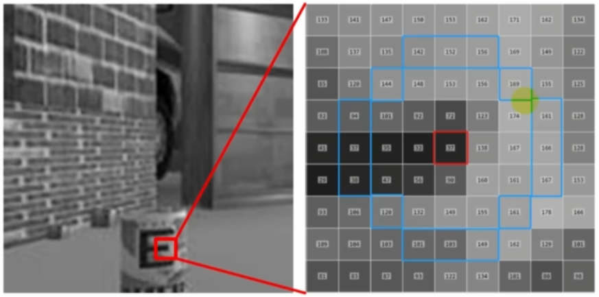

MAT类相当于一种数据类型，该类中存储矩阵形式的数据，可以是多维的，比如2x3x3。

其数据结构包含矩阵头，跟数据部分

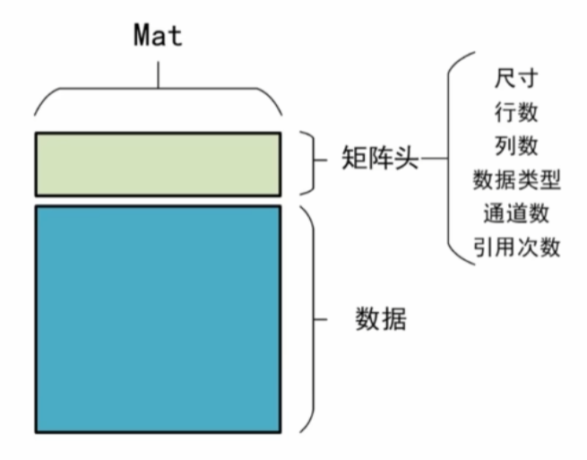
### 矩阵头

矩阵头包含MAT类的尺寸，行数，列数，数据类型，通道数，引用次数。

假设数据的大小为 a x b x c

尺寸为axb，行数为a，列数为b，通道数为c。

假设在程序中定义了两个MAT a和b，a和b在内存中共用的是同一份数据img。当内存中的img被删除后，a和b引用的就是一个空的数据。此时用引用次数表示该数据被引用了多少次，避免在删除b的时候导致a引用的数据为空。

### 数据

数据可以是图像，也可以是离散的矩阵，比如相机参数，或者神经网络的权值参数。

官方给出的MAT可以存储以下几种数据类型：

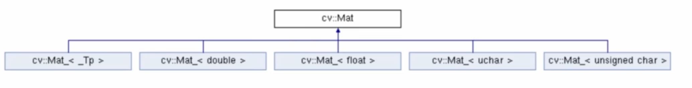

cv::Mat_<_Tp>: 用户自定义MAT中存储的数据类型，其余的就为途中所写的那些数据类型。

但是不同数据类型的位数可能会根据计算机的更新发生变化，比如单片机，ARM处理器和x86的计算机中同一种数据类型的位数不一样。为了避免这个问题，Opencv进行了一个强制的对应，只指明对应数据类型有多少位。

如图所示，数字表示数据的位数，U：unsigned，S：signed，F：float

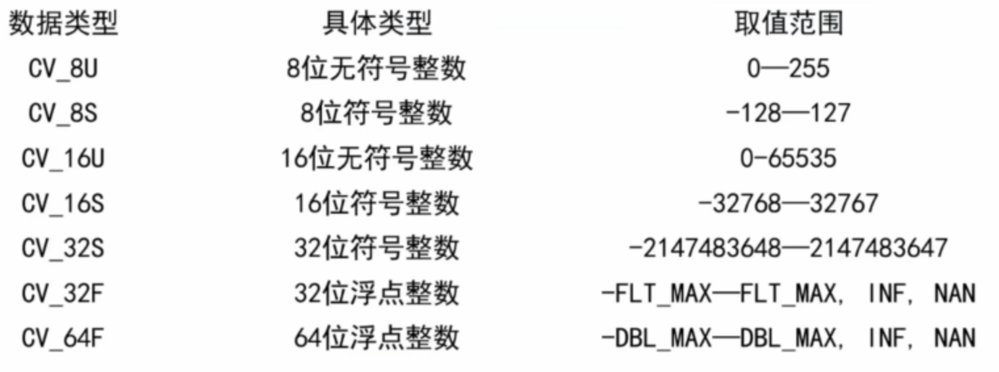

### MAT类的创建和赋值

#### 利用矩阵的宽、高和类型参数创建Mat类

```cpp
cv::Mat::Mat(
    int rows,   // 构造矩阵的行数
    int cols,   // 构造矩阵的列数
    int type    // 构造矩阵的数据类型
)
```

数据类型即为之前讲过的那些数据类型，除了CV_8UC1、CV_64FC4等1到4通道以外，还提供了更多通道的参数，通过CV_8UC(n)中的n来构建多通道矩阵，其中最大可取到512。不用C时默认为1通道。

例如：
```cpp
// 创建3x3 3通道的矩阵
Mat(3, 3, CV_8UC(3))
```

##### 利用矩阵Size()结构和数据类型参数创建Mat类

```cpp
cv::Mat::Mat(
    Size size,  // 2D数组变量尺寸，通过Size(cols, rows)赋值
    int type    // 数据类型
)
```

例如：
```cpp
Mat(Size(3, 3), CV_8UC(2))
```

#### 利用已有的Mat类创建新的Mat类

```cpp
cv::Mat::Mat(
    const Mat & m,          // 已创建的Mat类矩阵数据
    const Range & rowRange, // 在已有矩阵中需要截取的行数范围，例如2到5行为 Range(2, 5)
    const Range & colRange  // 在已有矩阵中需要截取的列数范围，例如2到5列为 Range(2, 5)，当不输入任何范围时，表示所有列都会被截取
)
```

需要注意的是，行和列是从0开始计数的，Range(2, 5)截取的其实是第三行到第六行。

#### 赋值

##### 在创建时赋值

在后面加上参数

```cpp
cv::Mat::Mat(
    int rows,           // 矩阵行数
    int cols,           // 矩阵列数
    int type,           // 数据类型
    const Scalar & s    // 给矩阵中每个像素赋值的参数变量， 例如Scalar(0, 0, 255)
)
```

例如

```cpp
Mat f(3, 3, CV_8U, Scalar(1))
```

需要注意的是，参数中可以输入任意位数据，例如五位 Scalar(0, 0, 0, 0, 0)，此时假设定义的Mat只有三个通道，赋值过程是依次向三个通道中赋值，若Scalar中的位数大于通道数，则多余的数据会被丢弃。

类方法中定义了一些能够直接实现的矩阵类型

##### 类方法赋值

1. **eye**：单位阵
2. **diag**：对角矩阵
3. **ones**：元素权威1的矩阵
4. **zeros**：元素全为0的矩阵

对角阵要求输入量位一个已有的矩阵

##### 枚举法赋值

```cpp
// 先定义Mat对象，然后声明存储的数据类型，及Mat类的尺寸，最后将数据输入

cv::Mat a = (cv::Mat_<int>(3, 3) << 1, 2, 3, 4, 5, 6, 7, 8 ,9);

cv::Mat b = (cv::Mat_<double>(2, 3) << 1.0, 2.0, 3.0, 4.0 ,5.1, 6.2);
```

在之前类方法赋值方式中，无法保证每一位是任意的，此方法中的每一位都是指定的。

此时写的类型不是Opencv自己定义的，而是C中常见的那些数据类型。

### 代码片段

```cpp
#include <opencv2/opencv.hpp>
#include <iostream>

using namespace cv;
using namespace std;

int main()
{
	Mat a(3, 3, CV_8UC1);
	Mat b(Size(4, 4), CV_8UC1);
	Mat c0(5, 5, CV_8UC1, Scalar(4, 5, 6));
	Mat c1(5, 5, CV_8UC2, Scalar(4, 5, 6));
	Mat c2(5, 5, CV_8UC3, Scalar(4, 5, 6));
	Mat d = (cv::Mat_<int>(1, 5) << 1, 2, 3, 4, 5);
	Mat e = Mat::diag(d);
	Mat f = Mat(e, Range(2, 4), Range(2, 4));

    cout << c0 << endl;
    cout << c1 << endl;
    cout << c2 << endl;
}
```

## MAT类数据读取

### Mat类元素的读取

一张彩色图像通常由三个通道蓝绿红BGR组成。一个元素(像素)有多个通道，在内存中以邻近方式存储，比如在内存中先存储该像素的蓝色，再存储该像素的绿色，最后存储红色，每一个通道数据都存储之后就是下一个像素的数据。

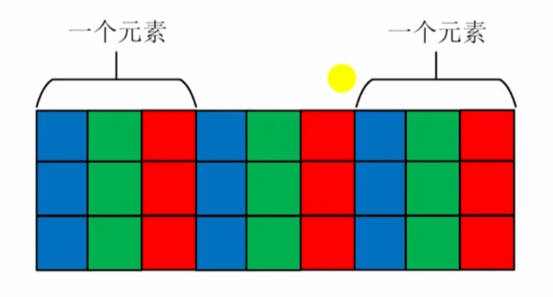

例如一个3x3x3的矩阵，在内存中为3行9列的数据。

### Mat类矩阵的常用属性

|属性|作用|
|---|---|
|cols|矩阵的行数|
|rows|矩阵的列数|
|step|以字节为单位的矩阵有效宽度|
|elemSize()|矩阵中元素的字节数|
|total()|矩阵中元素的个数|
|channels()|矩阵通道数|

#### 使用at读取矩阵元素

**需要知道数据类型和通道数**

```cpp
at(int row, int col)

// 单通道 可以直接at到，需要知道数据类型
int value = (int)a.at<uchar>(0, 0);

// 多通道 
cv::Vec3b vc3 = b.at<cv::Vec3b>(0, 0);
int first = (int)vc3.val[0];
```

多通道Mat的每个地址中存储的是该像素的多个通道数据，直接at到的是多个数据。

Opencv中定义的Vec3b就是 一个元素有三个通道，每个通道元素为b代表的类型(uchar)。Vec3d中的就是double类型。

之后在通道类型中寻址得到所需要的具体数据。

#### 矩阵元素地址定位方式

无论是单通道还是多通道，均转换为单通道，以x，y，z方式读取行、列、通道的数据。

实际上就是通过Mat的行列属性及step和channel计算出来的元素位置。

单通道：
```cpp
(int)(*(b.data + b.step[0]*row + b.step[1]*col + channel));
```

#### 代码片段

不是很想写

## MAT类运算

### 四则运算

#### 符号运算

与常识相符合的加减乘除，直接利用数学符号表示矩阵的运算。两个矩阵进行加法，乘法，乘或除一个系数，整体加或减去一个数。

矩阵的乘法，需要两个Mat类的尺寸和类中存储的数据量一样。OpenCV不会进行类型的自动转换。

Mat类减去一个数时，是所有元素减去这个数。

```cpp
e = a + b;
f = c - d;
g = 2 * a;
h = d / 20;
i = a - 1;
```

#### 矩阵乘法

##### 矩阵乘积

正常的矩阵乘法运算。

##### 向量内积

.dot，向量(矩阵)对应元素相乘，最后求和。

```cpp
a.dot(b)
```

要求两个Mat类元素个数相同，不要求维度相同。

##### 对应位元素乘积

.mul()，要求两个矩阵维度、数据类型相同。

### 运算函数

可以查官网的使用手册。常用函数如下

|函数名|作用|
|---|---|
|absdiff()|两个矩阵对应元素差的绝对值|
|add()|两个矩阵求和|
|addWeighted()|两个矩阵线性求和|
|divide()|矩阵除法|
|invert()|矩阵求逆|
|log()|矩阵求对数|
|max()/min()|两个矩阵计算最大值/最小值|

## 图像读取、显示和保存

### 图像加载

```cpp
Mat cv::imread( const String & filenmae, int flags = IMREAD_COLOR )
```
filename：需要读取图像的文件名称的字符串，包含图像地址、名称和图像文件扩展名。<br />
flags：读取图像形式的标志。以哪种颜色方式读取。<br />

### 图像显示

```cpp
void cv::namedWindow(const String & winname, int flags = WINDOW_AUTOSIZE)
```

winname，窗口名称<br />
flags，窗口属性设置标志<br />
命名一个窗口，可以自适应显示图片。但是有些版本的Opencv无法自动释放窗口内存，使用namedWindow创建的窗口需要用destroyWindow函数释放。但是使用imshow可以自动创建窗口并释放，不过这样就无法自适应显示，可能原本的图片很大，显示出来后在屏幕上只有一小部分。

```cpp
void cv::imshow(const String & winname, inputArray mat)
```
winname，要显示图像窗口的名字<br />
mat，要显示的图像矩阵<br />

### 图像保存

```cpp
bool cv::imwrite(const String & filenmae, inputArray img, const std::vector<int> & params = std::vector<int>())
```

filename，保存图像的地址和文件名，需要包含文件格式。<br />
img，将要保存的Mat类矩阵变量。<br />
params，保存图片个数属性设置标志<br />

该函数可以保存图片，也可以将已有的矩阵数据以图片形式保存下来。
