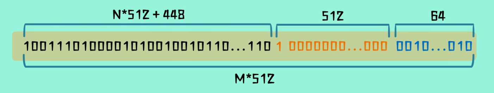
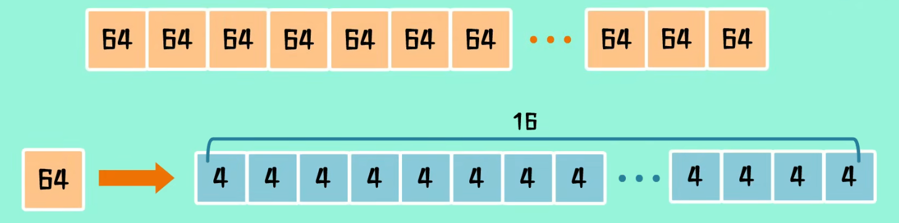

# MD5

Message Digest Algorithm 5，信息摘要算法

## 简介

MD5是一种使用广泛的散列函数，用于提供消息的完整性保护，是计算机使用广泛的哈希算法之一。

固定长度128位，16字节。

1. 长度固定
2. 不可逆
3. 高度离散性
4. 抗碰撞？

一般用于密码保护，完整性校验，数字签名，云盘文件秒传。

## 计算过程

### 填充对齐

补齐输入内容长度，使长度变为**Nx512+448位**，先补1个1，再补多个0。即使原始数据长度满足N*512+448也需要进行补位，再补512位。

需要有448余数的原因是，512-448=64，**剩下64位用于记录原始数据长度**，即补位前的数据长度，为小端在前格式。

### 数据分块

补位后的数据长度+记录原始数据长度的64位，最终数据长度为**M*64字节**，将数据分为M组64字节数据。



### 多轮压缩

准备四个标准幻数，每个幻数为4字节，共16字节，32个16进制字面值依次排列。

```c
A = 0x01234567
B = 0x89ABCDEF
C = 0xFEDCBA98
D = 0x76543210
```

这四个标准幻数为循环计算初始值，多轮哈希运算之后为MD5初始值。

:::warn
程序中变量存储为小端字节序，内存中高字节在前，低字节在后，所以定义时应该写为：
```c
A = 0x67452301
B = 0xFECDAB89
C = 0x98BADCFE
D = 0x10325476
```
:::

原始数据被处理位n个512位，n个64字节，每次只计算其中一份。每一份64字节被分为16个4字节。



定义有4个函数，前四个输入为四个标准幻数，X为每一小份的四字节数据，S和AC为固定常数。

```c
FF(A, B, C, D, X, S, AC)
GG(A, B, C, D, X, S, AC)
HH(A, B, C, D, X, S, AC)
II(A, B, C, D, X, S, AC)
```

具体函数定义

```C
#define F(x, y, z) (((x)&(y))|((~x)&(z)))
#define G(x, y, z) (((x)&(z))|((y)&(~z)))
#define H(x, y, z) ((x)^(y)^(z))
#define I(x, y, z) ((y)^((x)|(~z)))

#define ROTATELEFT(num, n) (((num)<<(n))|((num)>>(32-n)))

#define FF((a), (b), (c), (d), (x), (s), (ac)) {\
    (a) += F((b), (c), (d)) + (x) + (ac);\
    (a) = ROTATLEEFT((a), (s));\
    (a) += (b);
}

#define GG((a), (b), (c), (d), (x), (s), (ac)) {\
    (a) += G((b), (c), (d)) + (x) + (ac);\
    (a) = ROTATELEFT((a), (s));\
    (a) += (b);\
}

#define HH((a), (b), (c), (d), (x), (s), (ac)) {\
    (a) += H((b), (c), (d)) + (x) + (ac);\
    (a) = ROTATELEFT((a), (s));\
    (a) += (b);\
}

#define II((a), (b), (c), (d), (x), (s), (ac)) {\
    (a) += I((b), (c), (d)) + (x) + (ac);\
    (a) = ROTATELEFT((a), (s));\
    (a) += (b);\
}

```

经过以上逻辑运算，改变第一个入参的数值，通过以下顺序运行16次

```C
FF(a, b, c, d, x[0], s11, 0xd76aa478);
FF(d, a, b, c, x[1], s12, 0xe8c7b756);
FF(c, d, a, b, x[2], s13, 0x242070db);
FF(b, c, d, a, x[3], s14, 0xc1bdceee);
FF(a, b, c, d, x[4], s11, 0xf57c0faf);
FF(d, a, b, c, x[5], s12, 0x4787c62a);
FF(c, d, a, b, x[6], s13, 0xa8304613);
FF(b, c, d, a, x[7], s14, 0xfd469501);
FF(a, b, c, d, x[8], s11, 0x698098d8);
FF(d, a, b, c, x[9], s12, 0x8b44f7af);
FF(c, d, a, b, x[10], s13, 0xffff5bb1);
FF(b, c, d, a, x[11], s14, 0x895cd7be);
FF(a, b, c, d, x[12], s11, 0x6b901122);
FF(d, a, b, c, x[13], s12, 0xfd987193);
FF(c, d, a, b, x[14], s13, 0xa679438e);
FF(b, c, d, a, x[15], s14, 0x49b40821);

GG(a, b, c, d, x[1], s21, 0xf61e2562);
GG(d, a, b, c, x[6], s22, 0xc040b340);
GG(c, d, a, b, x[11], s23, 0x265e5a51);
GG(b, c, d, a, x[0], s24, 0xe9b6c7aa);
GG(a, b, c, d, x[5], s21, 0xd62f105d);
GG(d, a, b, c, x[10], s22, 0x2441453);
GG(c, d, a, b, x[15], s23, 0xd8a1e681);
GG(b, c, d, a, x[4], s24, 0xe7d3fbc8);
GG(a, b, c, d, x[9], s21, 0x21e1cde6);
GG(d, a, b, c, x[14], s22, 0xc33707d6);
GG(c, d, a, b, x[3], s23, 0xf4d50d87);
GG(b, c, d, a, x[8], s24, 0x455a14ed);
GG(a, b, c, d, x[13], s21, 0xa9e3e905);
GG(d, a, b, c, x[2], s22, 0xfcefa3f8);
GG(c, d, a, b, x[7], s23, 0x676f02d9);
GG(b, c, d, a, x[12], s24, 0x8d2a4c8a);

HH(a, b, c, d, x[5], 0xfffa3942);
HH(d, a, b, c, x[8], 0x8771f681);
HH(c, d, a, b, x[11], 0x6d9d6122);
HH(b, c, d, a, x[14], 0xfde5380c);
HH(a, b, c, d, x[1], 0xa4beea44);
HH(d, a, b, c, x[4], 0x4dbecfa9);
HH(c, d, a, b, x[7], 0xf6bb4b60);
HH(b, c, d, a, x[10], 0xbebfbc70);
HH(a, b, c, d, x[13], 0x289b);
HH(d, a, b, c, x[0], 0xeaa127fa);
HH(c, d, a, b, x[3], 0xd4ef3085);
HH(b, c, d, a, x[6], 0x4881d05);
HH(a, b, c, d, x[9], 0x9d4d039);
HH(d, a, b, c, x[12], 0xe6db99e5);
HH(c, d, a, b, x[15], 0x1fa27cf8);
HH(b, c, d, a, x[2], 0xc4ac5665);

II(a, b, c, d, x[0], 0xf4292244);
II(d, a, b, c, x[7], 0x432aff97);
II(c, d, a, b, x[14], 0xab9423a7);
II(b, c, d, a, x[5], 0xfc93a039);
II(a, b, c, d, x[12], 0x655b59c3);
II(d, a, b, c, x[3], 0x8f0ccc92);
II(c, d, a, b, x[10], 0xffeff47d);
II(b, c, d, a, x[1], 0x85845dd1);
II(a, b, c, d, x[8], 0x6fa87e4f);
II(d, a, b, c, x[15], 0xfe2ce6e0);
II(c, d, a, b, x[6], 0xa3014314);
II(b, c, d, a, x[13], 0x4e0811a1);
II(a, b, c, d, x[4], 0xf7537e82);
II(d, a, b, c, x[11], 0xbd3af235);
II(c, d, a, b, x[2], 0x2ad7d2bb);
II(b, c, d, a, x[9], 0xeb86d391);
```

a、b、c、d依次作为第一个参数输入，一组中的16个4字节数据依次作为第五个数据代入，经过这一次计算后，四个标准幻数已经改变，将新的四个标准幻数与原值相加得到更新后的四个标准幻数。以上为一轮计算，**处理64字节数据，并更新标准幻数**。

更新后的标准幻数作为第二轮的标准幻数，并载入第二个64字节进行运算。重复该过程直至N个64字节全部计算完成。

最终的标准幻数用16进制按照顺序显示出来即为最终MD5结果。

## 攻击MD5

MD5仅为一个产生信息摘要的散列函数，而非加密算法。由大量数据生成128位，存在信息损失，无法由密文解出明文。

任何输入都会输出一个128位的MD5值，意味着：<br />
1. MD5值长度固定，有边界。只有128^16种结果
2. md5的输入为任意内容，有∞种可能，没有边界<br />

:::warn
以有穷对无穷，MD5的原始输入和输出并不是一一对应的，可以进行碰撞。鸽巢原理：三只鸽子放进两个鸽笼，至少有一个笼子里的格子不少于两只。一个MD5值对应的内容应该是无穷个。
:::

虽然不存在由MD5值破解得到输入的过程，但是既然一个MD5值可能有无穷多个对应的消息内容，能否够找到任意一个能产生这个MD5的消息，也就是**原像攻击**。抗原像攻击是人们对MD5的第一个基本安全要求，但是原像攻击到今天都没有一个通用的可行方案。

**暴力穷举**？理论上可行，但是工程上不可行。

**第二原像攻击**：给出一个MD5值和对应的原始消息，找到一个与其MD5相同的消息。抗第二原像攻击（抗弱碰撞）是人们对MD5的第二个基本安全要求。对MD4的弱消息可行，但是对于MD5没有有效方案。

对MD5的第三个基本安全要求：抗碰撞性。不指定MD5，也不指定原始消息，只要能找到任意两个MD5值相同的消息就算成功。

1993年，B.den Boer和A.Bosselaers发现一种同样消息在不同初始值下的MD伪碰撞。

2004年山东大学王小云团队找到了快速发现大量MD5真碰撞的方法。利用模块化差分，先找到局部碰撞，然后分析差分如何传播找到差分路径，在利用消息修改技术最后得到能产生碰撞的消息对。学术角度看，完全攻破了MD的第三个基本安全要求，但是从工程角度看，没什么用。

2007年埃因霍芬理工大学Marc Stevens，在基于王小云团队研究基础上发布了两项成果：

### 相同前缀碰撞

由一个内容在几秒内生成另外两个MD5值一样的消息，并且可以有意义，**fastcoll**。会发现原始消息与两个新消息的前缀相同，但是后缀不同，这就是相同前缀碰撞。原始内容作为前缀，并不断尝试构造两个不同的后缀数据，直到MD5一样。利用可执行程序文件作为前缀，攻击者可以绕过审核发布恶意钓鱼软件。可以通过后缀让程序执行正常或者恶意行为。在执行正常行为的文件被检测通过后，再替换为恶意文件，如果检测者依赖文件的MD5值判断差异，就无法意识到替换的发生。但是相同前缀碰撞产生的正常版本，和恶意版本的代码是一样的，只是触发条件不同。在提交正常版本时，杀毒和检测技术能够检测出可疑之处，所以最好是正常版本和恶意版本是两个毫不相干的程序。

### 选择前缀碰撞

自由选择前缀消息内容，生成两个MD5一样但前缀内容也不同的文件，称之为**选择前缀碰撞**。除文件校验外，该方式还能对数字签名产生巨大威胁。使用MD5做数字签名的MD5算法，原始内容可能不一样。

## 死而不僵

安全问题并非全场景覆盖，君子不立于危墙之下。