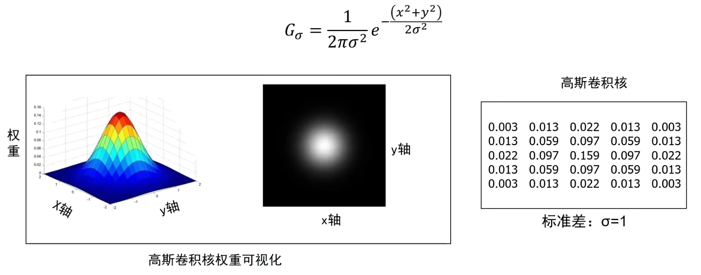
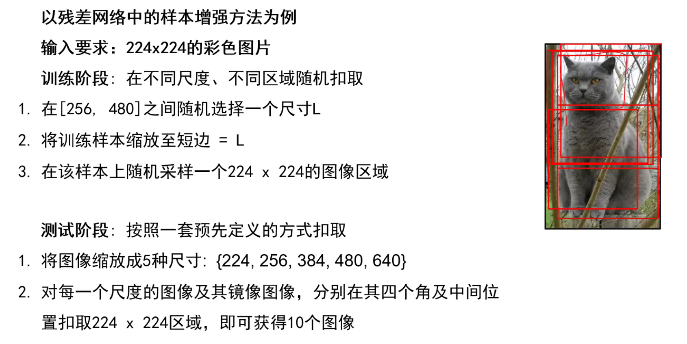

# 卷积神经网络

## 卷积与图像去噪

### 卷积
噪声图像：一个点和周围点差别比较大。 
去除噪声的思想：将该点与周围的点平均。最简单的方式：平均求和。 
该过程即为对图像中一个点进行的卷积操作。 

卷积核，也叫滤波核。

卷积的数学公式：

卷积核180°翻转后再到图像上滤波才叫卷积，不反转的话叫做相关。但是在真实的情况中，模板基本都是对称的，翻转不翻转都一样。

卷积的性质：
1. 叠加性

2. 平移不变性(所有的平移操作都可以用卷积来实现)

3. 其他性质

### 边界填充
在处理图像边界时，模板中心与像素对齐，但是模板周围的权值没有对应的像素，需要进行边界填充。

除了0填充外，还有其他填充方式

卷积操作后的图像要小于输入时图像，通过边界填充，我们可与实现卷积前后图像的尺寸不变。常用常数填充。

示例： 
单位脉冲核卷积后图像无变化

这两个模板图像左移或右移1个像素

平滑操作

锐化操作

原图减去平滑后的图剩下的是边缘图

### 高斯卷积核
平均卷积核捐出来会出现振铃现象(有水平竖直的条纹) 
根据领域像素与中心的远近程度分配权重可以解决振铃现象，高斯核 

高斯卷积核： 

产生步骤：
1. 确定卷积核的尺寸
2. 设置高斯函数的标准差σ

3. 计算卷积核各个位置的权重值，将xy代入高斯函数计算
4. 对权重进行归一化，使所有权重相加为1

#### 卷积核方差设置
σ=2时信号比较集中，中心位置权重更大，与周边的平滑没有那么厉害。 
σ越大，平滑效果越明显

#### 窗宽变化
在方差不变的情况下，中心的值时一样的。在归一化后小窗口中间的值会比较大窗口的大，平滑能力弱。模板尺寸越大，平滑能力越强。

1. 大方差或者大尺寸卷积核平滑能力强
2. 小方差或者小尺寸卷积核平滑能力弱
3. 经验法则：将卷积核的半窗宽度设置为3σ，最终卷积模板尺寸为2x3σ+1

#### 高斯卷积核特性
去除图像中的高频成分(噪声、边缘)(低通滤波器) 
两个高斯卷积核卷积后得到的还是高斯卷积核 
&ensp;&ensp;&ensp;&ensp;使用多次小方差卷积核连续卷积，可以得到与大方差卷积核相同地结果 
&ensp;&ensp;&ensp;&ensp;使用标准差为σ的高斯卷积核进行两次卷积与使用标准差σ√2的高斯核进行一次卷积相同 
可分离性 
&ensp;&ensp;&ensp;&ensp;可分解为两个一维高斯的乘积 

将大模板分解为小模版能够降低运算量

### 图像噪声与中值滤波器

#### 噪声

椒盐噪声：黑色像素和白色像素随机出现

脉冲噪声：白色像素随机出现

高斯噪声：噪声强度变化服从高斯分布(正态分布)

#### 高斯噪声

0.5，0.1，0.2是在纯灰度图上叠加的高斯噪声的σ，1、2是滤波使用的高斯核的σ

噪声方差越大，卷积核需要的方差也越大，但是在去除噪声时，也会影响原图，平滑有用信号。

#### 椒盐噪声和脉冲噪声
使用中值滤波器，该模板中没有权重。该模板逃入原图后将所有值排序，以中间位置的中值替代原值。

高斯滤波是线性操作，中值滤波是非线性操作。

## 卷积与边缘提取
边缘：图像中亮度明显而急剧变化的点

图像中边缘的种类，不同任务关注的边不同。

### 边缘检测
信号急剧变化的点，是导数最大的点

图像求导 
ε近似为1

可以通过卷积核实现

左边是x方向导数，右边是y方向导数

图像的梯度：两个方向导数组成的向量，梯度指向灰度变化最快的方向

通过模值图像可以看出图像的边缘信息

噪声对边缘的影响，直接求导无法提取边缘信息

解决方法：先平滑再求导。微分也是一种卷积，通过卷积的交换律和结合性可以将其变为高斯一阶偏导核。

高斯一阶导模板的参数：σ

不同的方差关注的是不同颗粒度的信息，小方差关注细粒度，大方差关注粗粒度。

高斯核：
1. 消除高频成分(低通滤波器)
2. 卷积核中的权值不可为负数
3. 权值总和为1(恒定区域不受卷积影响)

高斯一阶偏导核：
1. 高斯的导数
2. 卷积核中的权值可以为负
3. 权值总和为0
4. 高对比度点的影响值大

### Canny边缘检测器

由于信号缓慢变化，所以无法得到很准确的边

非极大值抑制

但是上下的q点与r点的坐标通常不是整数，其对应的强度需要通过周边几个点的值加权求和得到

改进：双阈值。与高阈值相连接的低阈值边缘保留，其余低阈值边缘舍弃

总结：
1. 用高斯一阶偏导核卷积图像
2. 计算每个点的幅值和方向
3. 非极大值抑制将宽的边缘细化至单个像素宽度
4. 连接与阈值(滞后)：定义两个阈值，使用高阈值开始边缘曲线，使用低阈值继续边缘曲线

## 卷积与纹理表示

### 纹理

图像可以以纹理区别，例如人脸，由眼睛鼻子嘴巴等固定的纹理组成；纹理表示了一些材质等的属性。

### 纹理的表示方法

直接对图像进行边缘提取，会出现很多比较杂乱的边，很难有效表示纹理。

#### 基于卷积核组的纹理表示方法

两件事：利用卷积核组提取图像中的纹理基，利用基元的统计信息来表示图像中的纹理。

卷积核组： 
都是高斯偏导核，检测边缘及方向，最后一个检测圆形(斑点)。

1. 设计卷积核组
2. 利用卷积核组对图像进行卷积操作获得对应的特征响应图组
3. 利用特征响应图的某种统计信息来表示图像中的纹理

用卷积核就得到了图像中表示的基元信息，将得到的每个特征响应图展开为一行一行的向量，最后一起表示为一个行向量

另外一种表示方法：基元提取过程不变。基元的位置对纹理分类任务没有影响。

将特征响应图展开为向量的过程中保留了纹理基元的位置信息。在新的表示方法中，忽略基元的位置，只关注哪种基元对应的纹理以及基元出现的频率。

用特征响应图的平均值代替该特征响应图，平均值越高表示响应图中含有大量的该特征基元。得到一个特征基元个数的向量。

卷积核组设计重点：
1. 卷积核类型，边缘、条形以及点状
2. 卷积核尺度：3-6个尺度
3. 卷积核方向：6个角度

常用设计方式： 
边缘：高斯一阶偏导 
条状：高斯二阶偏导 
点状 

假设一张图以上述的卷积核组卷积后，可以生成四十八个特征响应图像。图像的每一个点都可以表示为48维稀疏向量。

将纹理核生成的事情交给神经网络去做：卷积神经网络

## 卷积神经网络
卷积神经网络任务：图像分类

### 图像表示
直接利用原始像素为特征，展开为列向量。

### 分类模型

#### 全连接神经网络的瓶颈

全连接神经网络：每一层的每一个神经元都与前一层的每个神经元相连，例如CIFAR10用的神经元权值为3072+1(偏置)。

瓶颈在于图像越大，权值就越多。且全连接神经网络对一些已经表示为向量，简洁的东西或者小图像比较有效，例如得到的特征响应向量。

卷积神经网络：通过卷积核将图像表示为特征向量，再用全连接神经网络

网络结构： 
图像->卷积核组->特征向量->全连接神经网络->分类

#### 卷积神经网络
通常由卷积层，激活层，池化层，全连接层组成。

**卷积层**
卷积层由卷积核组成，卷积核组在滤波器中叫做纹理滤波器组。
卷积神经网络中的卷积核： 
不仅具有宽和高，还具有深度，常写成：宽度x高度x深度。 
卷积核参数不仅包括核中存储的权值，还包括一个偏置值。 

当其跟图像(rgb3个通道)作用时，将卷积核展成一个5x5x3的向量，同时将其覆盖的图像区域按相同的展开方式展成5x5x3的向量，计算二者的点乘，并加上偏移量，计算结果为一实数

如果在第一个卷积层中有6个卷积核，会得到6个特征响应图。 
特征响应图组深度等于卷积核的个数。 
不同的特征响应图反映了输入图像对不同卷积核的响应结果。 
同一特征响应图上不同位置的值表示输入图像上不同位置对同一卷积核的响应结果。 
卷积核的深度需要与输入信号的深度相同。 
如下图，在6个卷积核卷积后如果再接一层卷积层，后面的卷积核深度应为6，得到的结果深度由后面一个卷积层的卷积核个数决定。 

**卷积步长**
卷积核可以按照指定的间隔进行卷积操作，该间隔即为卷积步长。不同卷积步长得到的输出结果尺寸不同。 
卷积后结果尺寸计算公式：

**边界填充**
常用0填充。

设计卷积层需要考虑的因素： 
卷积核的宽、高 
是否采用边界填充 
卷积步长 
该层的卷积核个数 

**池化层**
卷积->relu->卷积->relu->pool->卷积->relu->卷积->relu->pool->卷积->relu->卷积->relu->pool 

池化的作用：对每一个特征响应图独立进行，降低特征响应图组中每个特征响应图的宽度核高度，减少后续卷积层的参数的数量，降低计算资源耗费，进而控制过拟合。 
将特征响应图变小。 

在卷积神经网路中用到的卷积核尺寸一般比较小，3x3或者5x5或11x11，通过池化缩小输入图像尺寸，能够使卷积核看到更大尺寸的东西，增大感受野。

池化操作：对特征响应图某个区域进行池化就是在该区域上指定一个值来代表整个区域。

常见的池化操作： 
最大池化--使用区域内的最大值来代表这个区域 
平均池化--采用区域内所有值的均值作为代表 

池化层超参数：池化窗口和池化步长。下图为例，丢掉75%的信息，但不改变特征响应图的个数。

池化操作与canny中的非最大化抑制相似，保留最强的信号。

损失函数、优化算法等跟之前讲的一样

### 图像增强
存在问题：过拟合的原因使学习样本太少，导致无法训练出能够泛化到数据的模型

数据增强：是从现有的训练样本中生成更多的训练数据，其方法是利用多种能够生成可信图像的随机变换来增加样本。

数据增强的目标：模型在训练时不会两次查看完全相同的图像。这让模型能够观察到数据的更多内容，从而具有更好的泛化能力。

样本增强： 
翻转:

随机缩放&抠图：

色彩抖动：

