# 全连接神经网络

图像表示：直接利用原始像素作为特征，拉开为列向量

线性分类器：
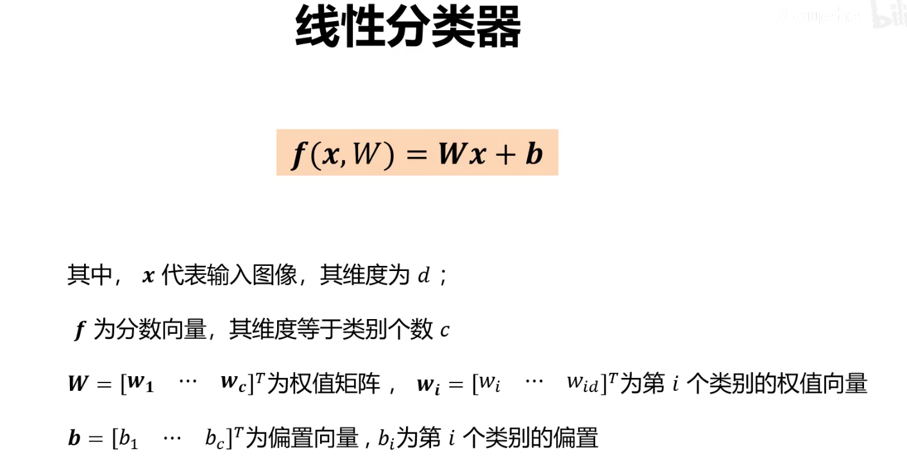

权值矩阵W维数：类别数x特征维度 
f(x,W)=Wx+b，每个类别都有一个权值向量，W行数为类别数，列数为图像列向量维数。

全连接神经网络：级联多个线性变换来实现输入到输出的映射。
## 分类模型
### 多层感知器
两层全连接神经网络，先与W1 b1变换，得到的结果与W2 b2变换。max激活函数，处理第一个变换后给第二层。**非线性操作不可以去掉。**
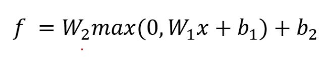
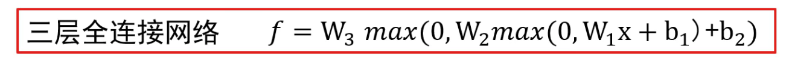

#### 全连接神经网络的权值
线性分类器的权值W可以看作模板，模板个数由类别个数决定。

全连接神经网络中的W1也可以看作模板，模板个数认为指定，与类别数无关，需要W2行数与类别数相等。

为什么要人为指定W1行数？以马的模板为例，模板中有两个马头，是不准确的，因为马可能朝左也可能朝右。第一层权值如果模板数够多，就可以记录更多方向的马，能够学到真正的马。

指定W1行数，即指定类别数，可以使用好几个类别记录马。W2融合这多个模板的匹配结果来实现最终类别打分。

#### 全连接神经网络与线性不可分
线性分类器解决的是线性可分的任务。线性可分：一定存在一个线性的分界面把各类样本没有错误地分开。
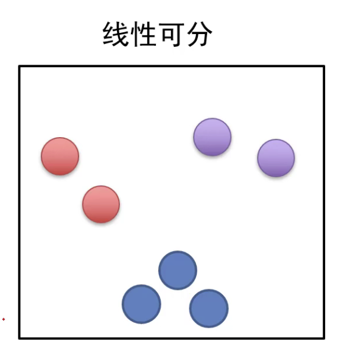

并不是所有情况样本都是线性可分的。需要全连接神经网络的非线性映射。
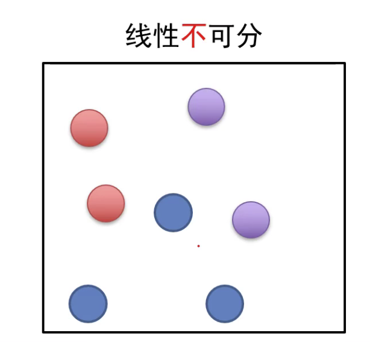

#### 全连接神经网络绘制与命名
通常画成这两种形式。常用第二种。
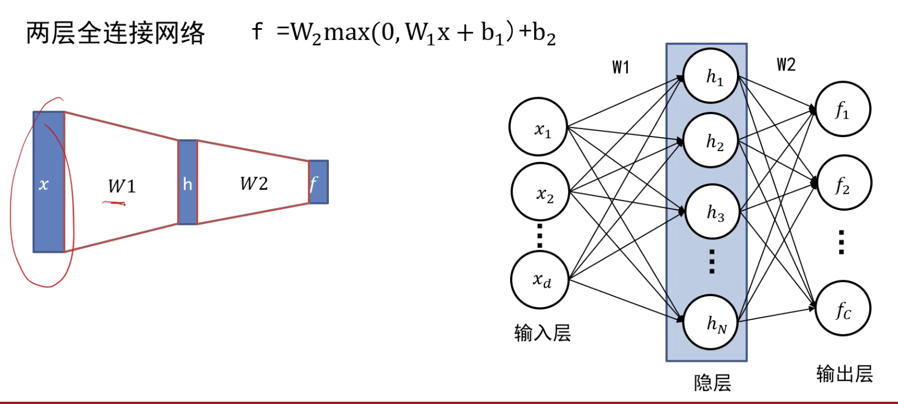
输入层维度为输入向量，隐层数目为模板个数，输出层为类别数。每个连接的边即为权值。
N层全连接神经网络-----除输入层之外其他层的数量为N的网络。
N个隐层的全连接神经网络。
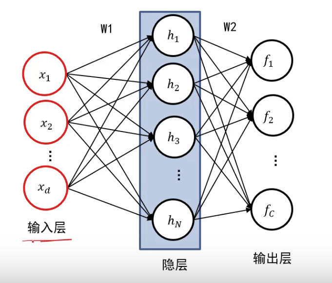

### 激活函数
如果没有max操作，退化成一个线性分类器。
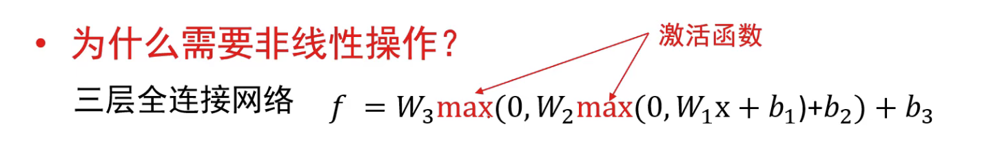
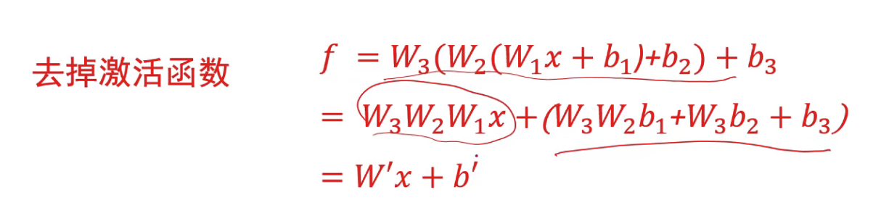

常用激活函数：
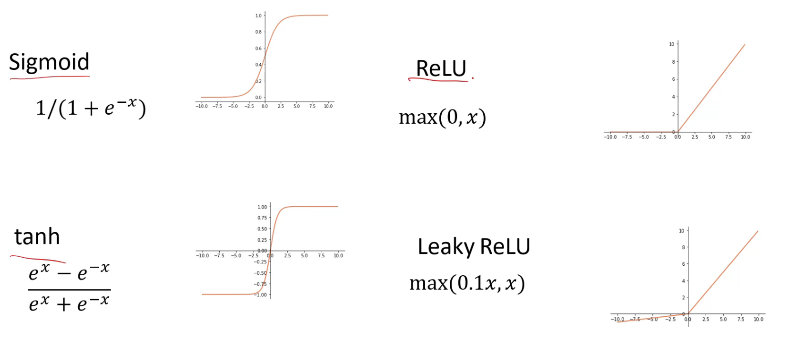

#### Sigmoid
在-5之后趋近于0，+5后趋近于1，将数值压缩到0~1之间，输出值大于0，不中心对称。

#### ReLU
就是max。大于0输出本身，小于0输出0。

#### tanh
双曲正切，将数据压缩到-1~1之间。数据是对称的。

#### Leaky ReLU
与ReLU相似，小于0也有输出。

网络的宽度和深度如何设计，没有统一的答案。
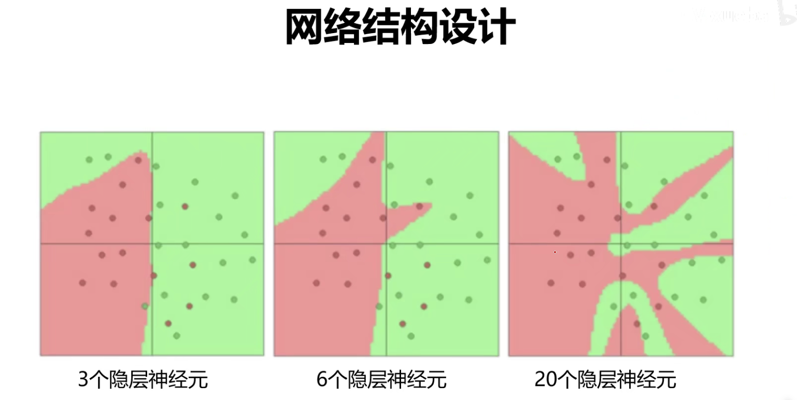
神经元个数越多，分界面越复杂，在集合上的分类能力就越强。但是可能会过拟合。

依据分类任务的难易程度来调整神经网络模型的复杂程度。分类任务越难，设计的神经网络结构就应该越深，越宽。但是需要主义的是对训练集分类精度高的全连接神经网络模型在真实场景下识别性能未必是最好的。

### 小结

## 损失函数

### SOFTMAX与交叉熵

**SOFTMAX**：对于两层全连接网络，给一个x输出f，看哪一个f输出最大则判断为哪一类。但是想知道该决策正确的概率有多少。对输出做一个SOFTMAX操作，得到概率分布。不是直接对f归一化，在取指数次方后归一化。
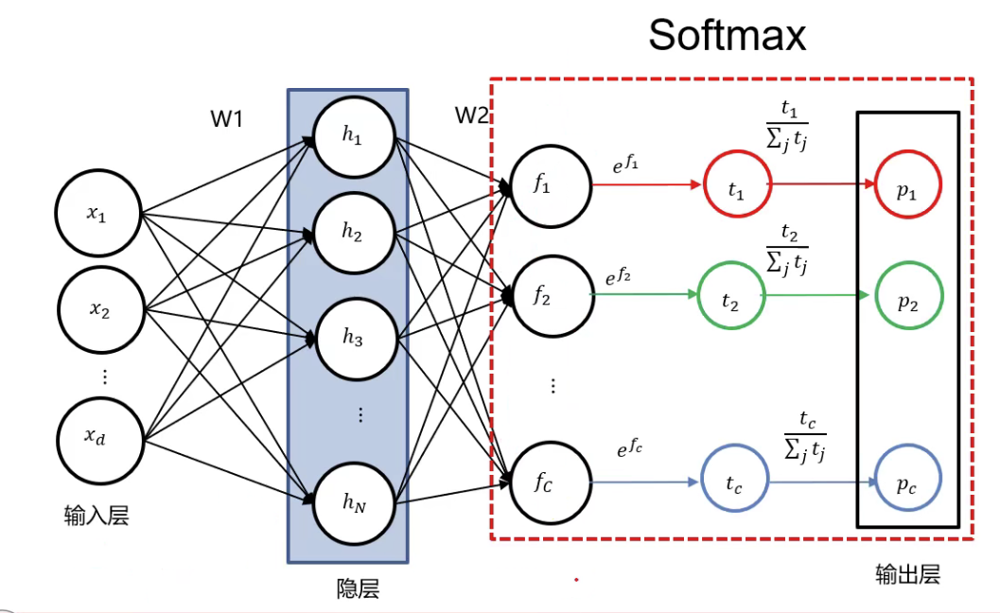
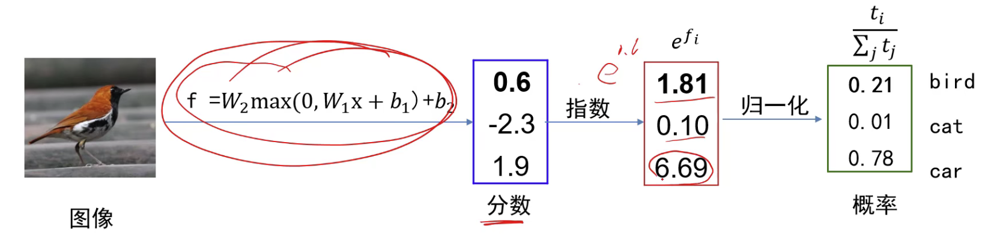

**交叉熵损失**：
将真实分布p(x)中正确类别的概率设置为1，其余概率设置为0(one-hot)，与分类器预测分布q(x)比较，度量二者之间的距离(交叉熵损失)。 
熵：信息量的体现 

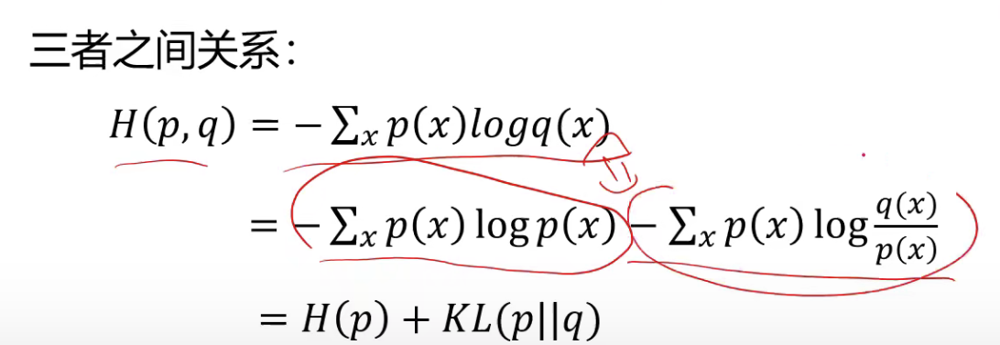

### 对比多类支撑向量机损失
计算过程不同，多类支撑向量机直接拿输出计算，交叉熵使用softmax后的数据计算。

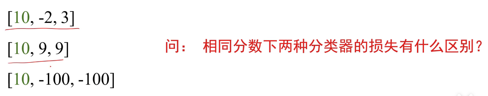

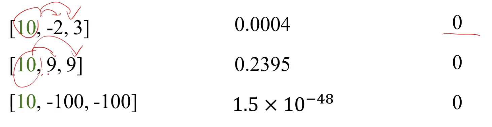

[10,9,9]是比其他类别大，但是概率差不多。期望判断为鸟类，并且概率大。

## 优化算法

### 计算图与反向传播
计算图是一种有向图，它用来表达输入、输出以及中间变量之间的计算关系，图中每个几点对应着一种数学运算。

让计算机实现任意复杂函数的推导问题。
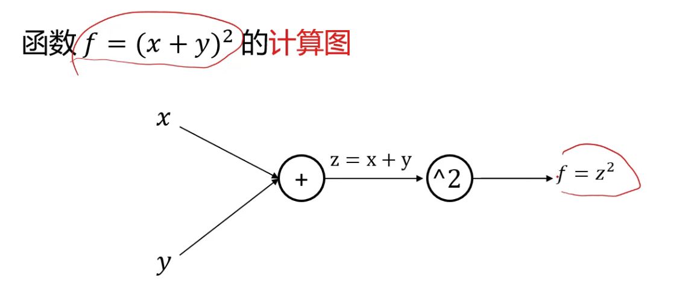
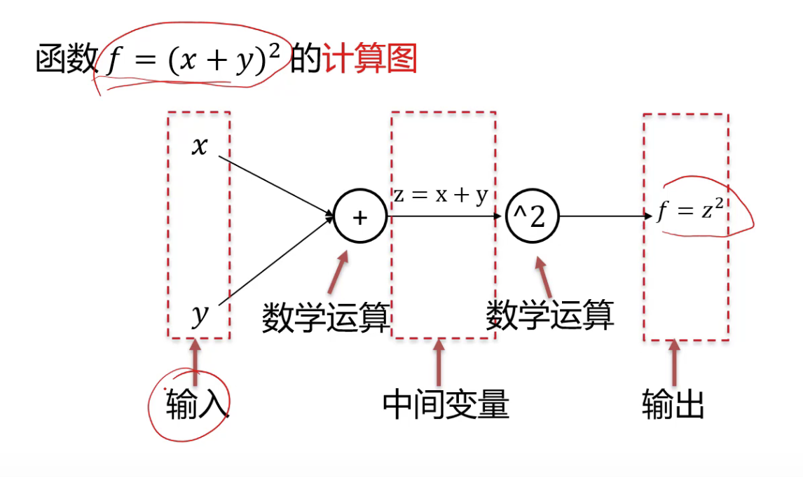

计算图的前向计算：从左到右直接推，每次算一个局部，最终算到输出，还可以算出局部的导数。反向可以算出局部梯度，反向推导之后相乘(链式法则)。

1. 任意复杂的函数都可以用计算图的形式表示
2. 再整个计算图中，每个们单元都会得到一些输入，然后计算出该门的输出值以及其输出值关于输入值的局部梯度。
3. 利用链式法则，门单元应该将回传的梯度诚意它对其输入的局部梯度，从而得到整个网络的输出对该门单元的每个输入值的梯度。

可能会出现梯度消失的问题。

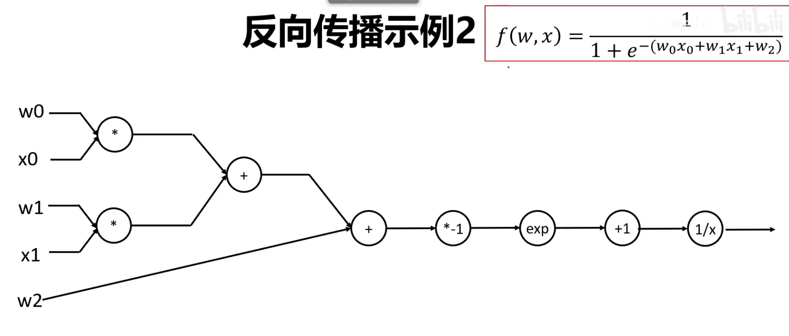

### 再看激活函数

#### Sigmoid
Sigmoid导数： 
梯度回传连乘，若某个sigmoid梯度为0，可能导致梯度消失。
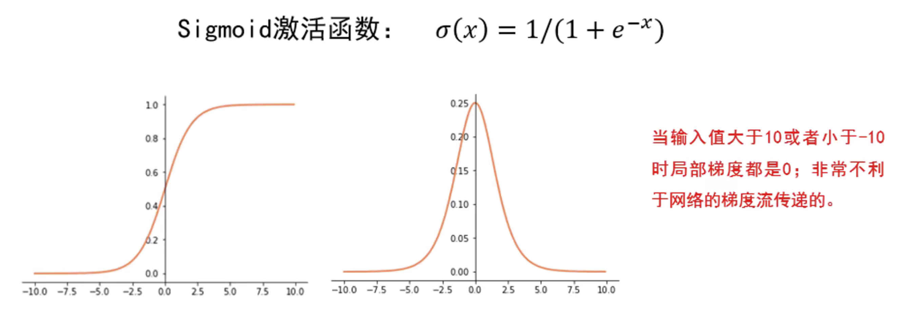

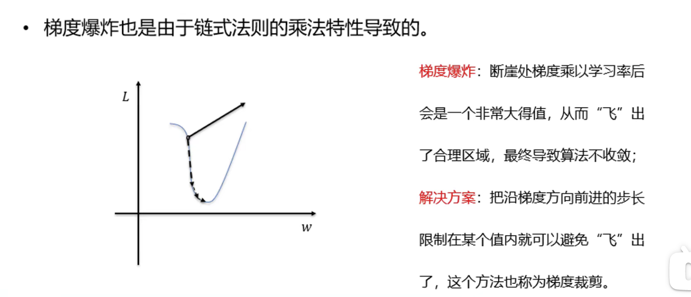

#### tanh
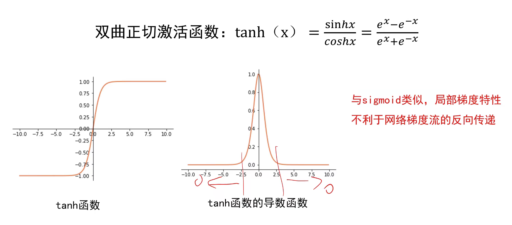

#### ReLU

但是ReLU小于0时梯度为0

#### leakly ReLU
基本没有死区
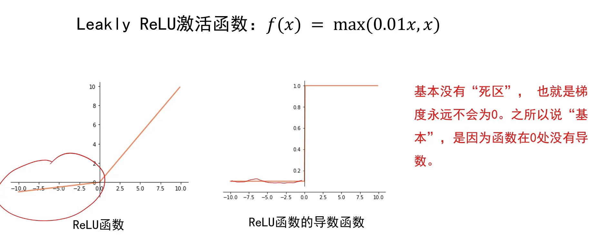

尽量选择ReLU或者Leakly ReLU，相对于Sigmoid/tanh，ReLU函数或者Leakly ReLU会让梯度流更加顺畅，训练过程收敛更快。

### 动量法与自适应梯度

#### 梯度下降算法存在的问题
损失函数特性：一个方向上变化迅速而在另一个方向上变化缓慢

有可能在变化迅速的方向振荡，但是在变化缓慢的方向行进较慢。

#### 动量法
利用累加历史梯度信息更新梯度，减少震荡，加速通往谷底。

利用累加可以抵消变化快方向的震荡，加快变化缓慢方向的行进速度。

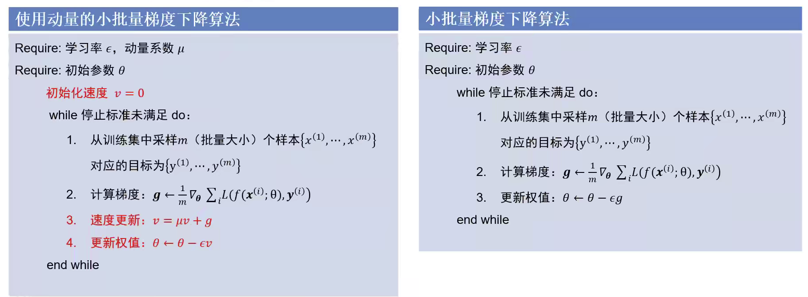

梯度下降法无法通过局部最小点以及鞍点，动量法能够冲出局部最小点和鞍点。

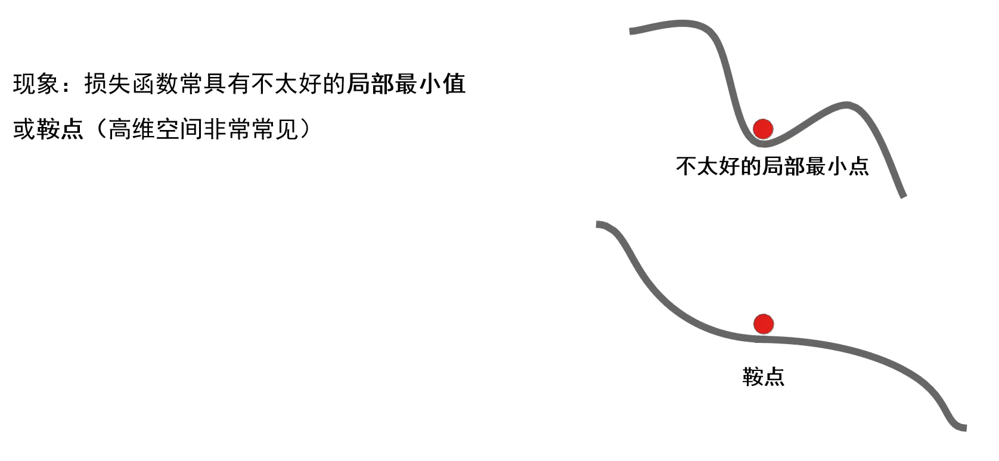

#### 自适应梯度与RMSProp
自适应梯度法通过减小震荡方向步长，增大平坦方向步长来减小震荡，加速通往谷底方向。

梯度幅度的平方较大的方向时震荡方向，梯度幅度的平方较小的方向时平坦方向。

AdaGrad
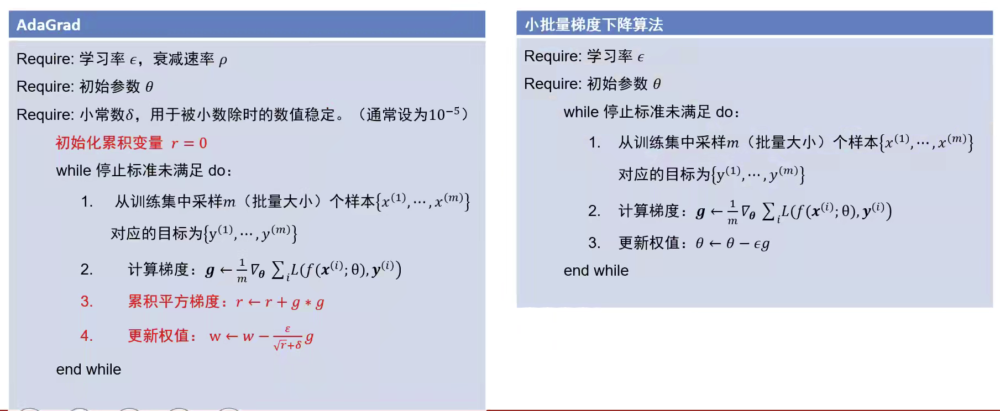

存在问题：r会累加，w会减小，失去调节作用

改进，RMSProp。

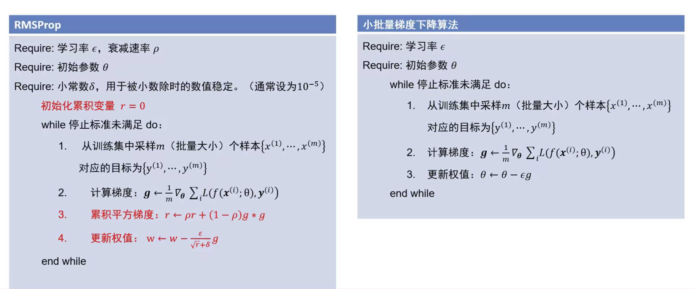

#### ADAM
将动量法与自适应梯度合在一起
一个是历史梯度的累加值，一个是历史梯度平方的累加值。
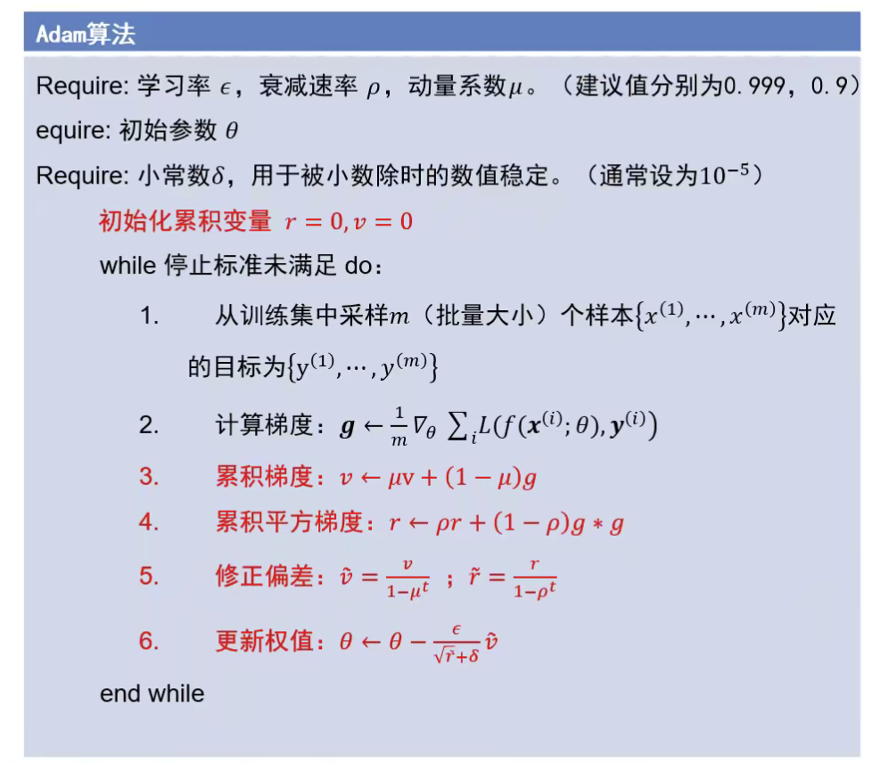

## 训练过程

### 权值初始化
全零初始化：网络中不同的神经元有相同的输出，进行同样的参数更新，因此这些神经元学到的参数都一样，等价于一个神经元。 
建议采用随机初始化。
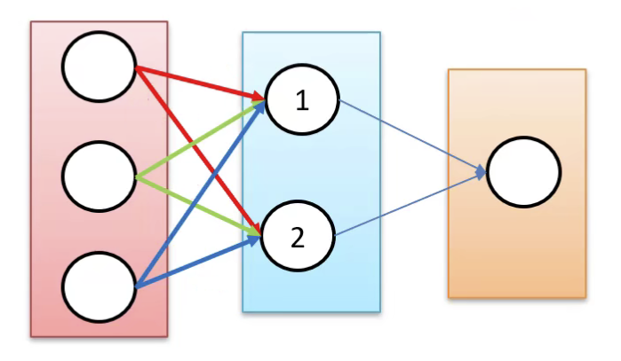

随机权值初始化：权值采样自N(0,0.01)的高斯分布

网络结构：10层隐层，1个输出层，每层500个神经元，双曲正切激活函数
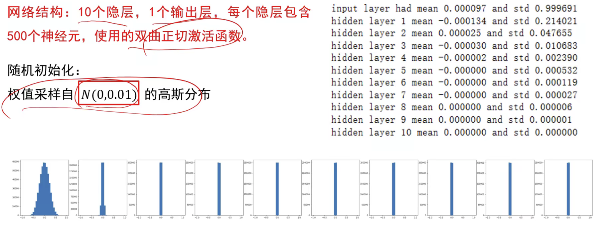
从第三层开始，所有输出均为0，局部梯度为0，输入信息传不到后面。

使用权值采样自N(0,1)的高斯分布
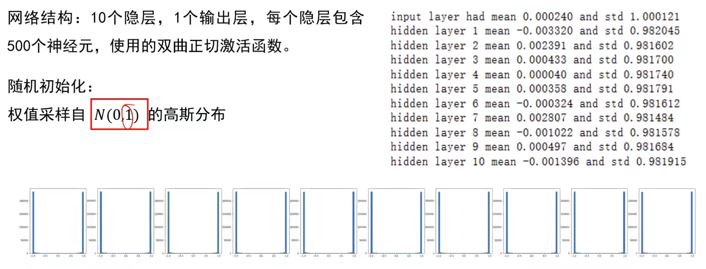
输出大部分为-1或1，神经元全处于饱和状态，局部梯度为0

权值设置太小，信息传不到后面，权值太大，信息能传递到后面，但是梯度传递不回来。信息流消失，梯度消失，无法训练。

初始化时让权值不相等，并不能保证网络能够正常训练 
有效的初始化方法：使网络各层的激活值和局部梯度的方差在传播过程中尽量保持一致；以保持网络中正向和反向数据流动。

**Xavier初始化**
一个神经元，其输入为z1,z2,...zn，这N个输入时独立同分布的；其权值为w1,w2......wn，他们也是独立同分布的，且w与z是独立的；其激活函数为f；其最终输出y的表达式：
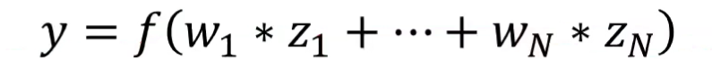
目标：使输出的y与输入的z有相同的分布(均值，方差)，y与下一层输出也有相同的分布，信息就能正常流动到后面，梯度也能正常传播。
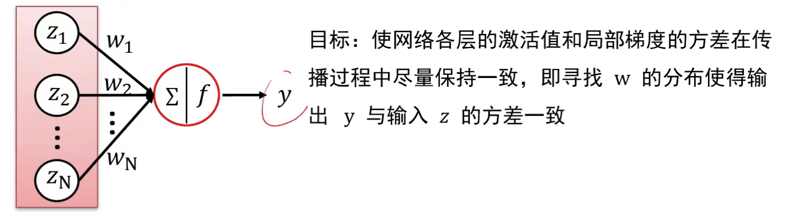

假设f为双曲正切函数，w1...wn独立同分布，z1....zn独立同分布，随机变量w与z独立，且均值均为0，则有
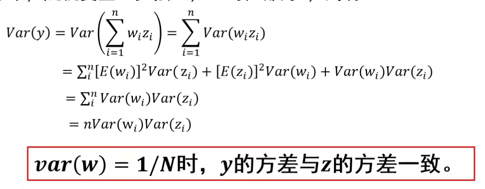

权值采样自N(0,1/N)的高斯分布，N为输入神经元个数。**均值0，方差1/N**

小结： 
好的初始化方法可以防止前向传播过程中的信息消失，也可以解决反向传播过程中的梯度消失。 
激活函数西安则双曲正切或者sigmoid时，建议使用Xavier初始化方法。 
激活函数选择ReLU或Leakly ReLU时，推荐使用He初始化 

### 批归一化
刚才希望通过调整权值使输出与输入具有相同的分布。批归一化直接对神经元输出进行批归一化 
小批量梯度下降算法：每次迭代时会读入一批数据，比如32个样本；经过当前神经元后会有32个输出值y1....y32; 
批归一化操作：对这32个输出进行减均值除方差操作；可保证当前神经元的输出值的分布符合0均值1方差。 

如果每一层的每个神经元进行批归一化，就能解决前向传递过程中的信号消失问题。

批归一化经常插入到全连接层后，作用在非线性激活前。

### 欠拟合、过拟合与Dropout

过拟合：学习时选择的模型所包含的参数过多，以至于出现这一模型对已知数据预测的很好，但对未知数据预测得很差得现象。这种情况下模型可能只是记住了训练集数据，而不是学习到了数据特征。

欠拟合：模型描述能力太弱，以至于不能很好地学习到数据中得规律。（模型过于简单）

机器学习的根本问题：优化和泛化的问题。 
优化：调节模型以在训练数据上得到最佳性能。 
泛化：训练好的模型在前所未见的数据上的性能好坏。
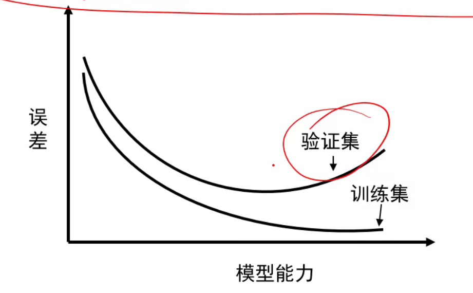

训练储器：优化和泛化时相关的，训练集上的误差越小，验证集上的误差也越小，模型的泛化能力逐渐增强。

训练后期：模型在验证集上的错误率不再降低，转而开始变高。模型出现过拟合，开始学习仅和训练数据有关的模式。

应对过拟合：最优方案，获取更多训练数据。次优方案，调节模型允许存储的信息量或者对模型允许存储的信息加以约束，该类方法也称为正则化。调节模型大小，为损失函数增加正则项分散权值。

L2正则化
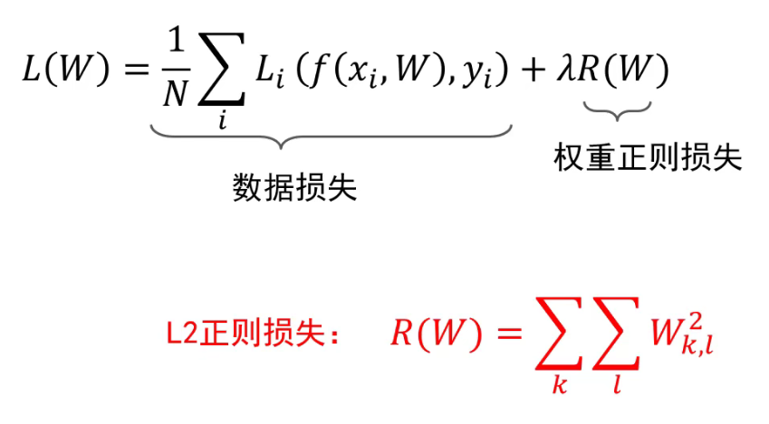
L2正则损失对于大数值的权值向量进行严厉惩罚，鼓励更加分散的权重向量，使模型倾向于使用所有输入特征做决策，此时的模型泛化性能好。

**随机失活Dropout**

让隐层神经元以一定的概率不被激活。

实现方式：训练过程中，对某一层使用Dropout，就是随机将该层的一些输出舍弃(输出值设置为0)，这些被舍弃的神经元就好像被网络删除了一样。

随机失活比率(Dropout ratio)：是被设为0的特征所占的比例，通常在0.2~0.5范围内。
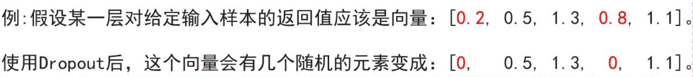

随机失活使得每次更新梯度时参与计算的网络参数减少了，降低了模型容量，所以能防止过拟合。 
随机失活鼓励权重分散，从这个角度来看随机失活也能起到正则化的作用，进而防止过拟合。 
Dropout可以看作模型集成，将网络分成多个小网络 
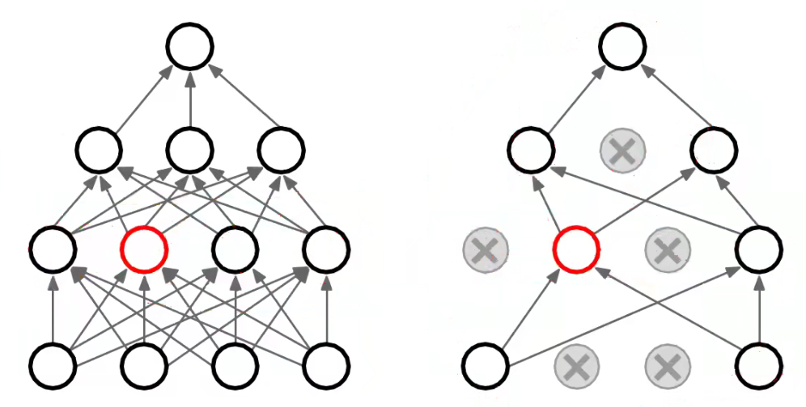

若50%概率失活，有4种情况。A输出的期望为1/2。 
测试阶段所有神经元打开，不失活，输出乘以p。 
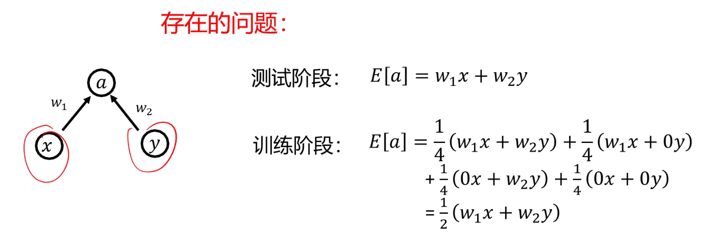

### 模型正则与超参数优化

#### 神经网络的超参数

网络结构--隐层神经元个数，网络结构，非线性单元选择等。

优化相关--学习率、dropout比率、正则项强度等。

#### 学习率设置
学习率过大训练过程无法收敛 
学习率偏大，在最小值附近震荡，达不到最优。 
学习率偏小，收敛时间长。 
不同学习率的损失函数： 
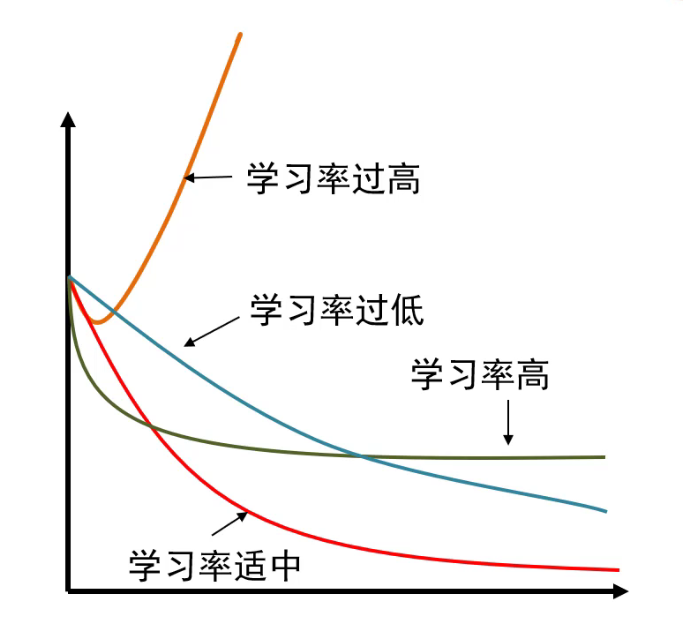

退火：取一个指数次方，使ε减小。

#### 超参数优化方法
网格搜索法：
1. 每个超参数分别取几个值，组合这些超参数，形成多组超参数；
2. 在验证集上评估每组超参数的模型性能；
3. 选择性能最优的模型所采用的那组值作为最终的超参数值；
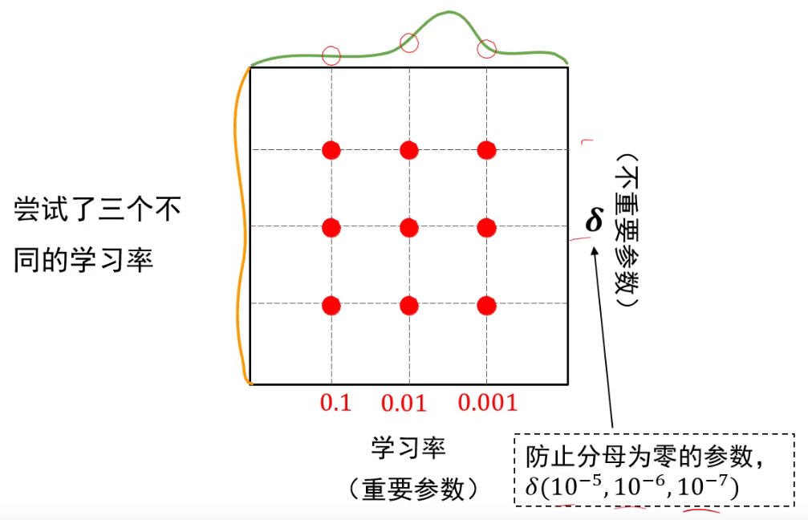

超参数搜索策略： 
粗搜索：利用随机法在较大范围里采样超参数，训练一个周期，依据验证集正确率缩小超参数范围。
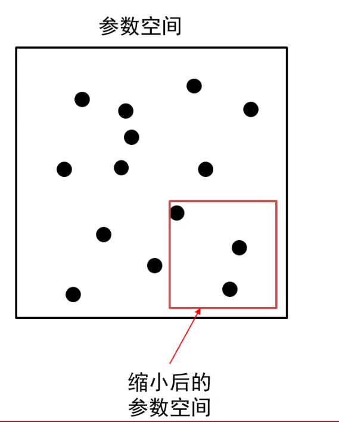

再将缩小后的空间分成网格细搜索。

超参数的标尺空间：

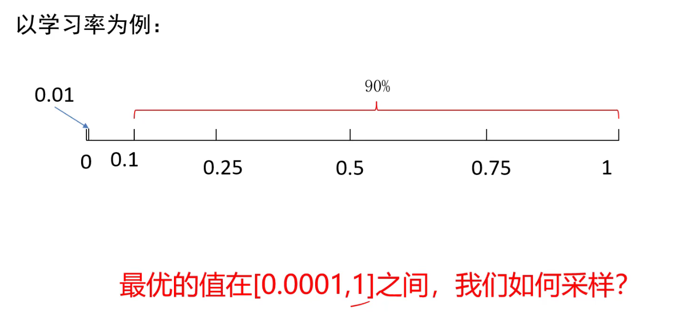

在log空间里采样
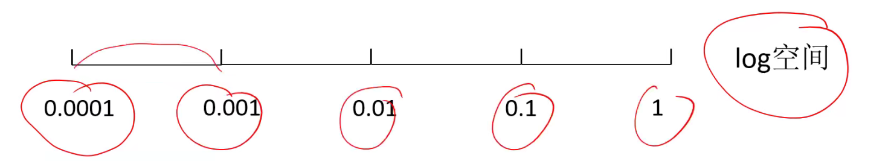

