# 计算机视觉与深度学习

## 图像分类

### 图像分类应用场合
**图像分类**：从已知的标签集合中为给定的输入图片选定一个类别标签，根据图像数据中的特征把图像区分开。

**应用场合**：识别动植物等等

### 图像分类难点
跨越"语义鸿沟"，建立像素到语义的映射。

视角，光照，尺度，遮挡，形变，背景杂波，类内形变，运动模糊，类别繁多。

各个对应的难点都有对应的解决方法。

### 基于规则的方法是否可行
例如通过硬编码的方法识别猫：提取边缘后记录特征等等。 
通过**硬编码**的方法识别猫或其他类，是一件**很困难**的事情。

### 什么是数据驱动的图像分类范式
* 数据集构建
* 分类器设计与学习
* 分类器决策

核心步骤：分类器设计与学习

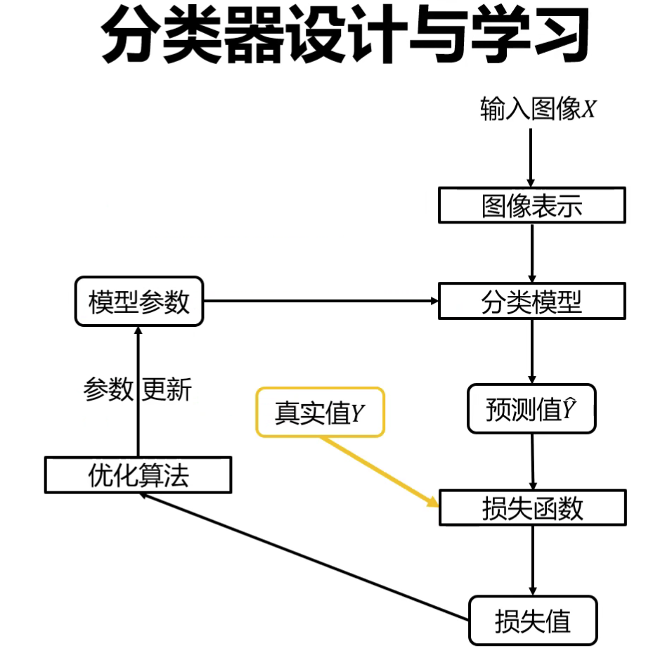

决策： 

**图像表示**： 
像素表示，RGB三通道矩阵。 
全局特征表示(GIST)，从图像中抽取一些特征表示整图，例如频率适合场景类，不适合猫狗等，因为计算过程依赖于所有的限速，如果存在遮挡，会丢失特征。 
局部特征表示，例如SIFT特征+词袋模型。在图像中抽出100个具有典型意义的区块，用区块表示整图。 

**分类器：** 
近邻分类器 
贝叶斯分类器 
线性分类器 
支撑向量机分类器 
神经网络分类器 
随机森林 
Adaboost 

**优化算法：** 
一阶方法： 
&ensp;&ensp;&ensp;&ensp;梯度下降 
&ensp;&ensp;&ensp;&ensp;随机梯度下降 
&ensp;&ensp;&ensp;&ensp;小批量随机梯度下降 
二阶方法： 
&ensp;&ensp;&ensp;&ensp;牛顿法 
&ensp;&ensp;&ensp;&ensp;BFGS 
&ensp;&ensp;&ensp;&ensp;L-BFGS 

**训练过程：** 
数据集划分 
数据集预处理 
数据增强 
欠拟合与过拟合 
&ensp;&ensp;&ensp;&ensp;减小算法复杂度 
&ensp;&ensp;&ensp;&ensp;使用权重正则项 
&ensp;&ensp;&ensp;&ensp;使用dropout正则化 
超参数调整 
模型集成 

### 常用的分类任务评价指标是什么
正确率，错误率。

## 线性分类器

### 数据集介绍
CIFAR 10 
包含50000张训练样本，10000张测试样本，分为飞机、汽车、鸟、猫等十个类，均为彩色图像，大小为32*32。

### 分类器设计

### 图像表示
#### 图像类型：
1. 二进制图像，只有黑和白.内存中像素为0或1
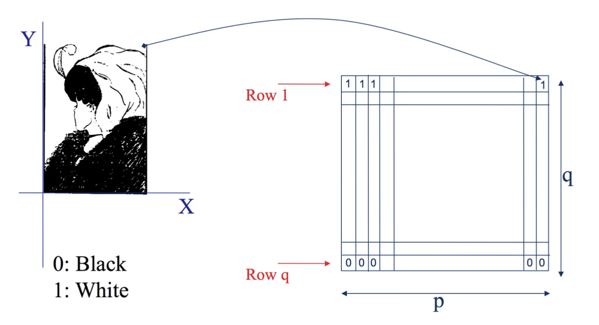
2. 灰度图像，像素取值范围为0~255.
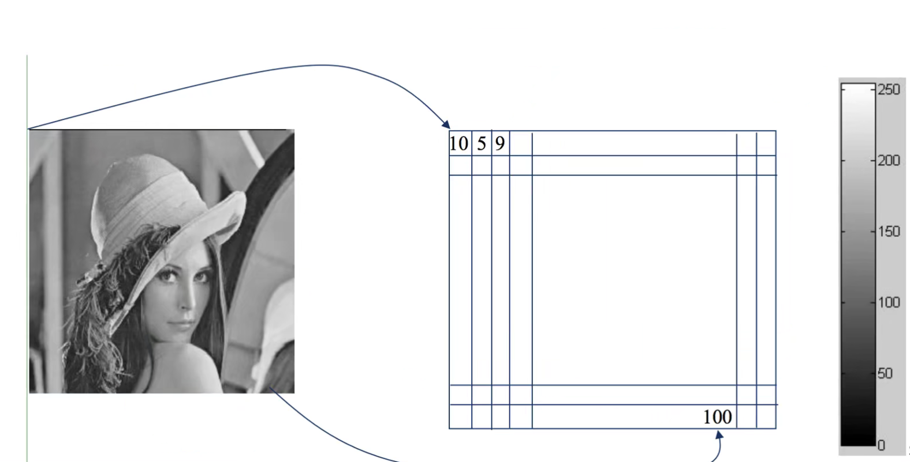
3. 彩色图像，每个点RGB 0~255

**大多数分类算法要求输入向量**

最简单的方法：将图像矩阵转成向量：
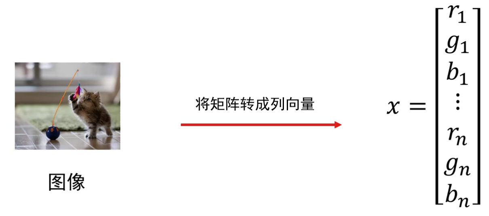

### 线性分类器

#### 线性分类器定义

线性分类器是一种线性映射，将输入的图像特征映射为类别分数。

通过层级结构(神经网络)或者高维映射(支撑向量机)可以形成功能强大的非线性模型。 
线性分类器是神经网络基础，是支撑向量机的基础，支撑向量机就是一种线性分类器。小样本环境下**支撑向量机**是绝对的王者之一，在大样本环境下**神经网络**是绝对的王者之一。

**线性分类器是一种线性映射，将输入的图像特征映射为类别分数。** 
转换的过程是线性的，所以叫线性分类器。

x代表输入的d维图像向量，c为类别个数。(例如cifar10中d为32x32x3=3072，c为10) 

第i个类的线性分类器定义为： 

* **x**为输入的d维图像向量 
* **f**为线性分类器的分数，i取值为1到c。 
* **c**为类别个数 
* **wi**为第i个类别的权值向量，**bi**为偏置。wi的维数与x一致，为列向量，转置后为行向量。 

#### 决策规则
如果某一个样本在某一个类别的打分比其他类别都要高，则认为当前图像属于该类别。

决策步骤：
1. 将图像表示成向量。
2. 计算当前图片每个类别的分数。
3. 按类别得分判定当前图像。

#### 线性分类器的权值
 
可以按照将32x32的图像表示为向量的方式（并且将权值转化为0~255范围内），将W反向表示为32x32的图像。 

**权值可以看做一种模板**，模板记录了数据集中同一类别的统计信息。当x与w匹配值越大，点乘值越大。

#### 线性分类器的分界面
从几何的角度理解权值，是一种分界面(高维的)。将样本空间分为几个区域，落在哪个区域就判定为哪一类。 
**分类问题的本质**：找一些分界面把图像分开，决策边界。 
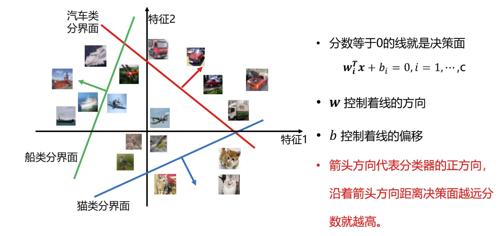

### 损失函数
#### 损失函数定义

定量地反映模型性能。模型性能由模型参数决定。

考虑以下两组权值不一样的分类器： 

可以看出分类器1预测正确，分类器2预测错误，对于示例样本分类器1更好。

我们希望损失函数跟参数之间有一定的关联，参数和函数之间是对应的。

损失函数搭建了**模型性能**与**模型参数**之间的桥梁，指导模型参数优化。 
损失函数是一个函数，用于度量给定分类器的预测值与真实值的不一致程度，其输出通常是一**非负实数**。 
其输出的非负实值可以作为反馈信号来对分类器参数进行调整，以降低当前示例对应的损失值，提升分类器的分类效果。 

损失函数的一般定义： 

**使用所有样本的平均损失做损失函数，单个样本损失求和取平均。**
 
#### 多类支撑向量机损失

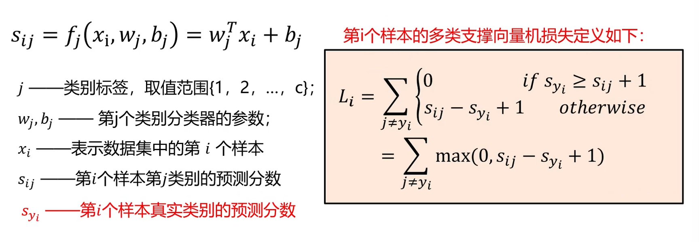

判断正确的类别的得分比其他类别得分高于1分(边界)，则没有损失。否则有损失 

常被称为折页损失hingeloss，折页损失，合页损失。 
Syi在Sij+1右侧损失为0，Sij+1左侧损失为Sij+1-syi 
 

:::tip

* 当w和b均为0时，损失L的值应为类别个数减一。

* 若考虑所有类别，包含正确类别j=yi，会时损失函数加一。不会有什么影响，但是一般不用。

* 如果求和时不取平均，总损失会放大N倍。大家都放大N倍，不影响。

* 若损失函数换成平均，损失会函数会放大，大的更大，小的更小。会改变分类器性能。
:::

#### 正则项与超参数

假设存在一W使损失函数L=0，这个W是唯一的吗？ 
**不唯一**。 

W2=2W1，分类器又没有偏置b，所以第二个分类器的打分是第一个分类器打分的2倍，两个分类器的损失都是0。在这种情况下如何选择W，就需要引入正则项来判断。

**在损失函数后加入一个与W有关的项。**

第一项叫做**数据损失**，模型预测需要和训练集相匹配。 
第二项叫做**正则损失**，防止模型在训练集上学习得太好。

R(W)是一个仅与权值有关，跟图像数据无关的函数。 
λ是一个超参数，控制着正则损失在总损失中所占的比重。

**超参数**：超参数是在开始学习过程之前设置的参数，而不是学习得到；一般都对模型性能由重要影响。W是要学习到的。 
神经网络中的超参数：神经元个数，层数。 
λ=0，优化结果仅与数据损失相关；λ=∞，优化结果与数据损失无关，仅考虑权重损失，此时系统最优解为W=0。

**L2正则项：** 
L2正则损失对大数值权值进行惩罚，喜欢分散权值，鼓励分类器将所有维度的特征都用起来，而不是强烈依赖其中少数几维特征。 
**正则项让模型有了一定的偏好。** 
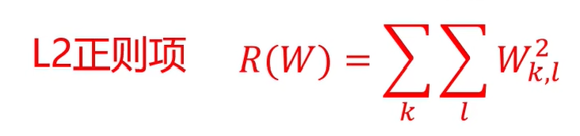

常用的正则项损失：
* L1正则项
* L2正则项
* 弹性网络正则项
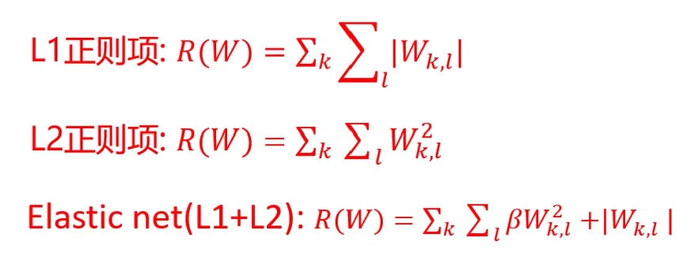

正则项作用：
* 使解唯一
* 对抗过拟合

### 优化算法

**参数优化**是机器学习的核心步骤之一，利用损失函数的输出值作为反馈信号来调整分类器参数，以提升分类器对训练样本的预测性能。

提升的是对**训练样本**的预测性能，因为损失函数是训练样本上的。

损失函数与参数W有关，优化的目标是找到使损失函数L达到最优的那组参数W。 
最直接的方法：找到L对W的偏导为0的W。若L为一凸函数，则该导数为零的点为全局最优点。 
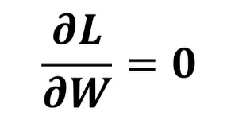

通常L形式比较复杂，很难从该等式直接解出W。

#### 梯度下降法
目标：求使L最小的W。 
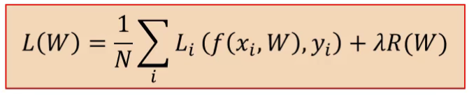

沿着**负梯度**方向，按照一定的步长(**学习率**)一步一步走到最小值，因为局部的信息是已知的。

:::danger
最难调整的参数就是学习率。
:::

利用损失函数，算出起始位置的梯度值，得到梯度方向，乘以学习率，沿着初始值走该步长。直到两次权值没有什么差异，就完成了分类器的学习。

梯度如何计算？ 

1. 数值法：
一维变量函数求导。计算量大，不精确。 

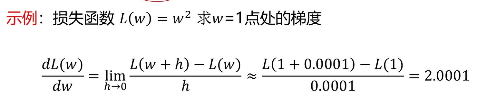
缺点：每次所有样本都要算一次，当N很大时，权值的梯度计算量很大，效率低下。

2. 解析法：
牛顿，莱布尼茨。写出导数函数。精确，速度快，导数函数易错。 
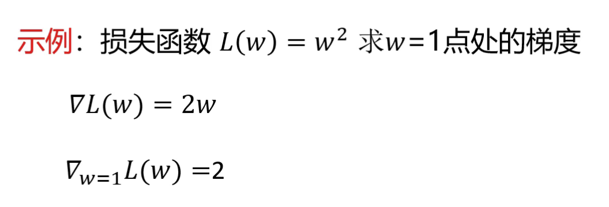
缺点：导数函数递推比较麻烦。

:::tip
**一般使用解析法，用数值法验证解析梯度的正确性。**
:::

#### 随机梯度下降法
每次随机选择一个样本xi计算损失并更新梯度。

单个样本训练可能带来很多噪声，不是每次迭代都向着整体最优化方向，但是总体而言是向着优化方向走的。

#### 小批量梯度下降算法
每次随机选择m(批量大小)个样本，计算损失并更新梯度。m为超参数。

通常取2的幂数作为批量大小，例如每次取32或64或128个样本。

iteration：表示1次迭代，每次迭代更新1次网络结构的参数。每选择一次m个样本就算迭代一次。 
batch-size：1次迭代所使用的样本量。 
epoch：1个epoch表示训练过了1遍训练集中的所有样本。 

### 训练过程

#### 数据集划分
使用数据集主要做两件事：训练分类器，以及用于近似评估分类器性能。

一般将数据集划分为训练集和测试集。用训练集寻找最优的分类器，用测试集评测模型的泛化能力。但是很多任务模型存在超参数，不能简单划分。

问题：如果模型存在超参数(例如正则化强度)，如何找到泛化能力最好的超参数？ 

一种简单的方法如：训练集调超参数，测试机选超参数。例如λ=0.1，λ=0.2等等分别训练出模型，再在测试集上选择。这样**不可行**。因为在选择λ时已经使用了测试集上的信息，因为这也是确定模型的过程。这个模型的精度不是模型真正泛化能力的度量，因为真正度量泛化能力是在给出模型前没有见过数据。

在真正的训练过程中会将训练集划成三份： 
* **训练集**用于给定的超参数时分类器参数的学习
* **验证集**用于选择超参数
* **测试集**用于评估泛化能力
测试集在模型给出之前当作不可见。不同的λ在训练集训练，训练出的模型在验证集比较，选择之后再测试集测试。**测试前的模型没有见过测试集数据，这才是合理的。**

##### K折交叉验证
问题：如果数据很少，验证集包含的样本很少，从而无法在统计上代表数据。 
这个问题很容易发现：如果在划分数据前进行不同的随机打乱，最终得到的模型性能差别很大，就存在这个问题。 

**K折交叉验证：** 
把数据分成k份，依次切换验证集，分别训练得到相同λ的不同模型。将不同模型得到的平均分当作该λ模型的分数。k：分的个数。真实的实验中一般用五折或十折交叉验证。 

**带打乱数据的重复K折交叉验证：** 
每次分K折时打乱数据。打乱数据，取一次；打乱数据，取一次。。。。。。
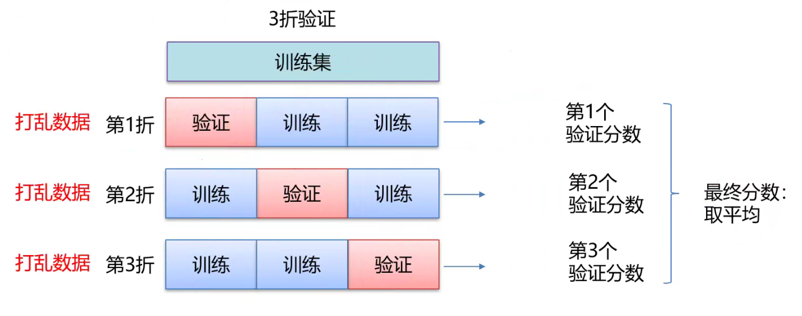

#### 数据集预处理

##### 去均值和归一化
一般不直接使用原始数据；会对数据去均值；数据的绝对值一般没有意义，一般看相对值，例如考试成绩的分数和排名； 
在去均值后，还会使数据在各个方向上的方差相同。比如某些时候不同方向上的尺度不同(例如一个方向单位为吨，数据差异可能不明显；另一个单位为毫米，数据差异可能会很明显)，需要将数据归一化到相同的尺度上比较。操作：每个维度上的数据减去均值再除以方差。去除量纲和数值范围的影响。

##### 去相关
例如原始数据中x方向增加，y方向也增加。但是很多时候数据的维度很高，我们希望x方向的增加与y方向增加没有关系，就可以分开考虑x和y。例如当某些情况下，x方向数据变化范围很大，y方向基本不变，所以就不需要考虑y这个维度的信息了，可以做到一定的降维效果。
**去相关一是为了让数据独立出来，二是为了达到一定的降维效果。** 
去相关后再做白化操作，相关的基础上再做归一化。 
去相关和白化通常应用在SVM以及一些其他传统机器学习方法中，神经网络中一般不常用，更多用的去均值和归一化。
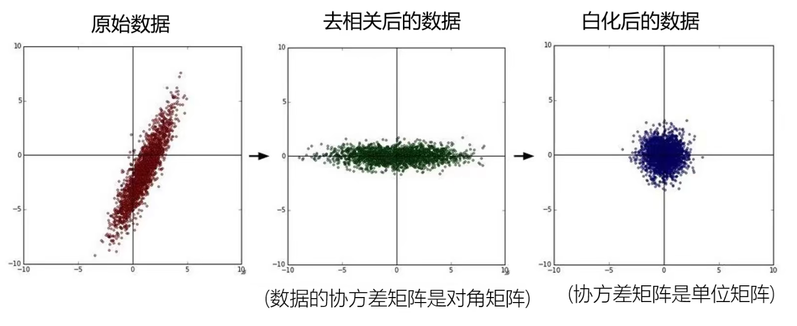

### 一些资料

斯坦福线性分类器的一个例子 
http://vision.stanford.edu/teaching/cs231n-demos/linear-classify/

# 全连接神经网络

图像表示：直接利用原始像素作为特征，拉开为列向量

线性分类器：
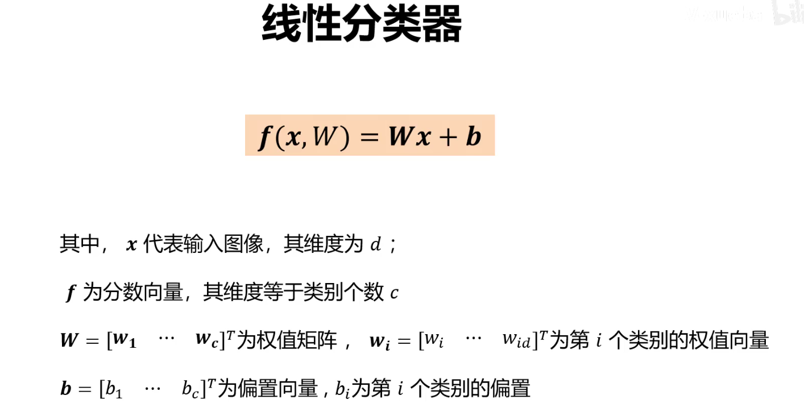

权值矩阵W维数：类别数x特征维度 
f(x,W)=Wx+b，每个类别都有一个权值向量，W行数为类别数，列数为图像列向量维数。

全连接神经网络：级联多个线性变换来实现输入到输出的映射。
## 分类模型
### 多层感知器
两层全连接神经网络，先与W1 b1变换，得到的结果与W2 b2变换。max激活函数，处理第一个变换后给第二层。**非线性操作不可以去掉。**

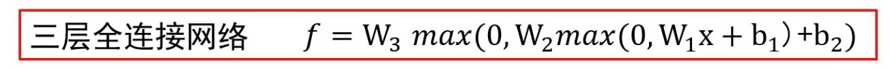

#### 全连接神经网络的权值
线性分类器的权值W可以看作模板，模板个数由类别个数决定。

全连接神经网络中的W1也可以看作模板，模板个数认为指定，与类别数无关，需要W2行数与类别数相等。

为什么要人为指定W1行数？以马的模板为例，模板中有两个马头，是不准确的，因为马可能朝左也可能朝右。第一层权值如果模板数够多，就可以记录更多方向的马，能够学到真正的马。
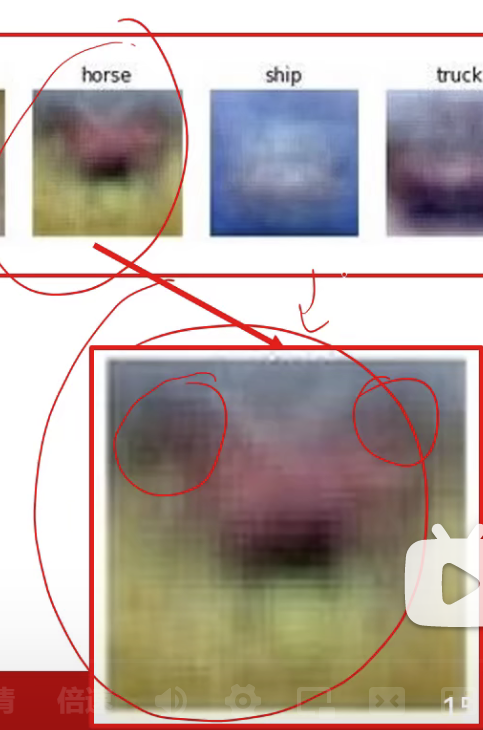

指定W1行数，即指定类别数，可以使用好几个类别记录马。W2融合这多个模板的匹配结果来实现最终类别打分。

#### 全连接神经网络与线性不可分
线性分类器解决的是线性可分的任务。线性可分：一定存在一个线性的分界面把各类样本没有错误地分开。

并不是所有情况样本都是线性可分的。需要全连接神经网络的非线性映射。
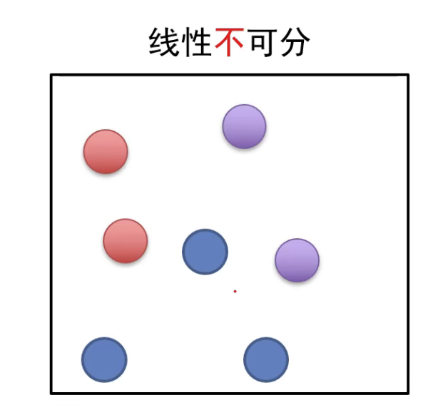

#### 全连接神经网络绘制与命名
通常画成这两种形式。常用第二种。
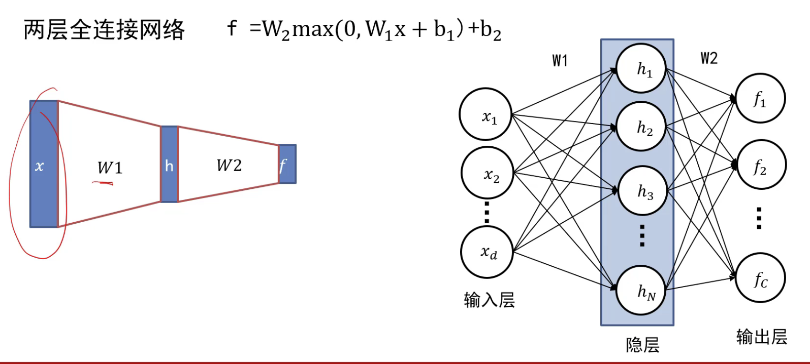
输入层维度为输入向量，隐层数目为模板个数，输出层为类别数。每个连接的边即为权值。
N层全连接神经网络-----除输入层之外其他层的数量为N的网络。
N个隐层的全连接神经网络。

### 激活函数
如果没有max操作，退化成一个线性分类器。
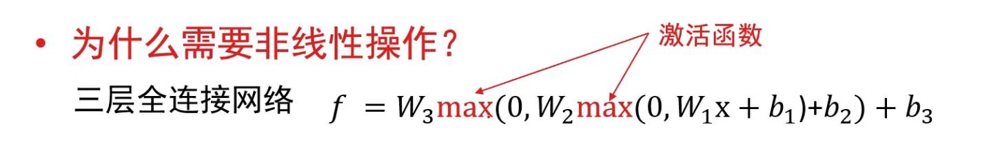
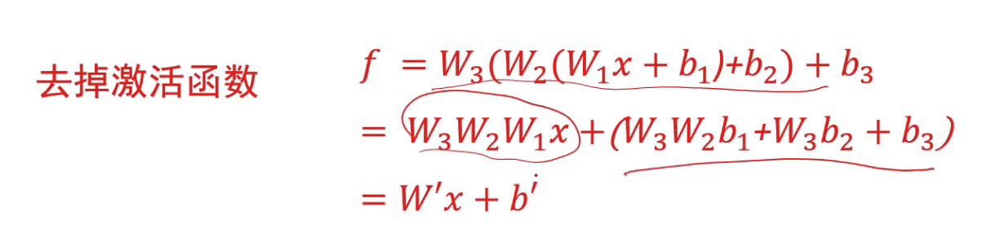

常用激活函数：

#### Sigmoid
在-5之后趋近于0，+5后趋近于1，将数值压缩到0~1之间，输出值大于0，不中心对称。

#### ReLU
就是max。大于0输出本身，小于0输出0。

#### tanh
双曲正切，将数据压缩到-1~1之间。数据是对称的。

#### Leaky ReLU
与ReLU相似，小于0也有输出。

网络的宽度和深度如何设计，没有统一的答案。
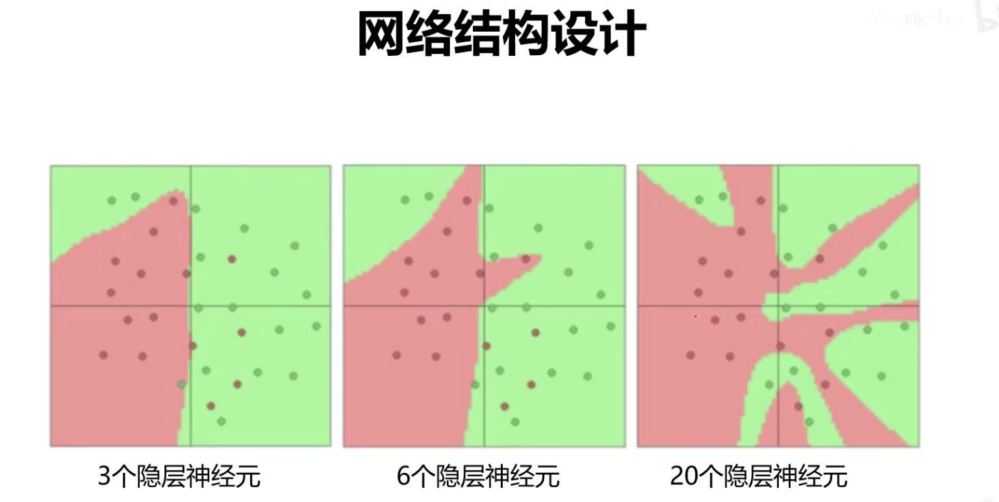
神经元个数越多，分界面越复杂，在集合上的分类能力就越强。但是可能会过拟合。

依据分类任务的难易程度来调整神经网络模型的复杂程度。分类任务越难，设计的神经网络结构就应该越深，越宽。但是需要主义的是对训练集分类精度高的全连接神经网络模型在真实场景下识别性能未必是最好的。

### 小结
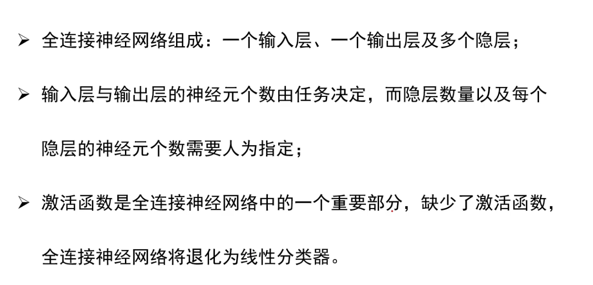

## 损失函数

### SOFTMAX与交叉熵

**SOFTMAX**：对于两层全连接网络，给一个x输出f，看哪一个f输出最大则判断为哪一类。但是想知道该决策正确的概率有多少。对输出做一个SOFTMAX操作，得到概率分布。不是直接对f归一化，在取指数次方后归一化。

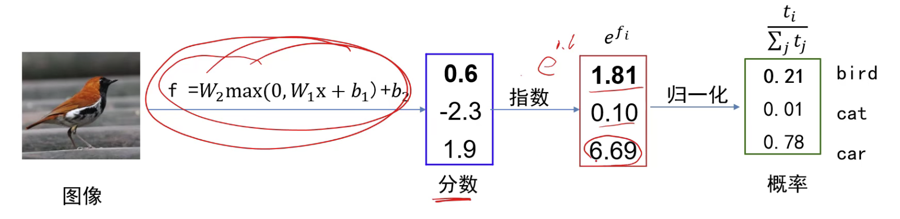

**交叉熵损失**：
将真实分布p(x)中正确类别的概率设置为1，其余概率设置为0(one-hot)，与分类器预测分布q(x)比较，度量二者之间的距离(交叉熵损失)。 
熵：信息量的体现 

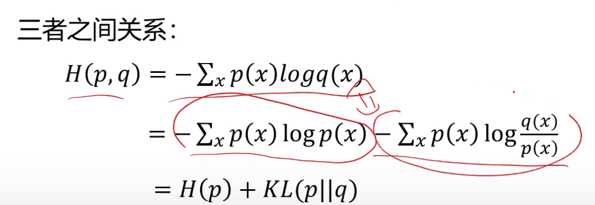

### 对比多类支撑向量机损失
计算过程不同，多类支撑向量机直接拿输出计算，交叉熵使用softmax后的数据计算。

[10,9,9]是比其他类别大，但是概率差不多。期望判断为鸟类，并且概率大。

## 优化算法

### 计算图与反向传播
计算图是一种有向图，它用来表达输入、输出以及中间变量之间的计算关系，图中每个几点对应着一种数学运算。

让计算机实现任意复杂函数的推导问题。

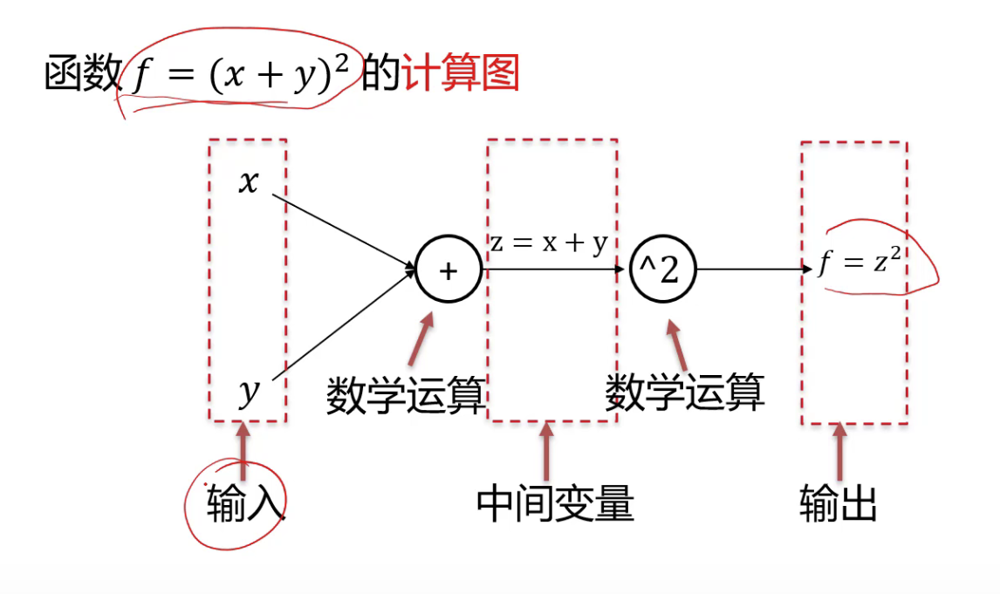

计算图的前向计算：从左到右直接推，每次算一个局部，最终算到输出，还可以算出局部的导数。反向可以算出局部梯度，反向推导之后相乘(链式法则)。

1. 任意复杂的函数都可以用计算图的形式表示
2. 再整个计算图中，每个们单元都会得到一些输入，然后计算出该门的输出值以及其输出值关于输入值的局部梯度。
3. 利用链式法则，门单元应该将回传的梯度诚意它对其输入的局部梯度，从而得到整个网络的输出对该门单元的每个输入值的梯度。

可能会出现梯度消失的问题。

### 再看激活函数

#### Sigmoid
Sigmoid导数： 
梯度回传连乘，若某个sigmoid梯度为0，可能导致梯度消失。
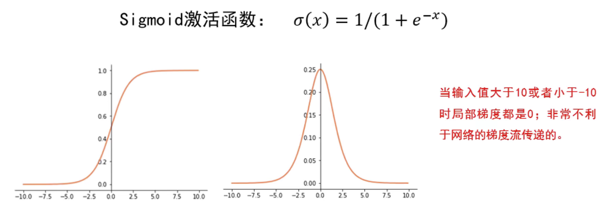
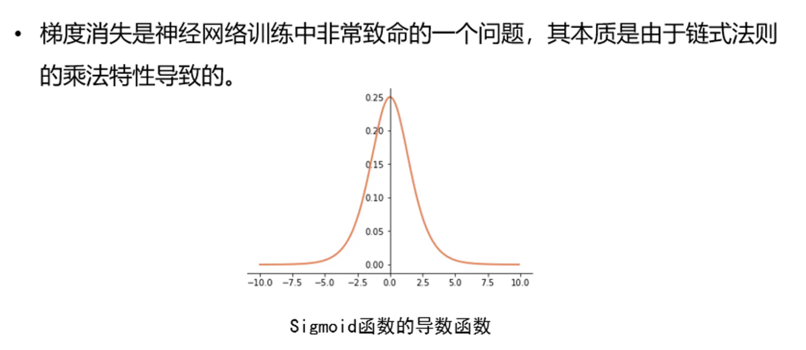

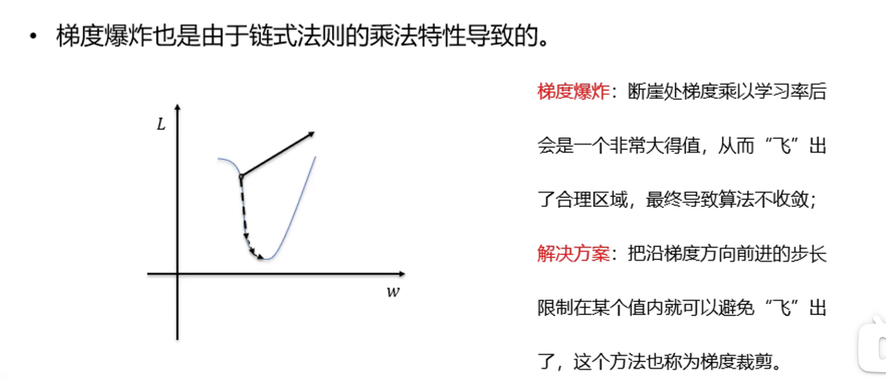

#### tanh
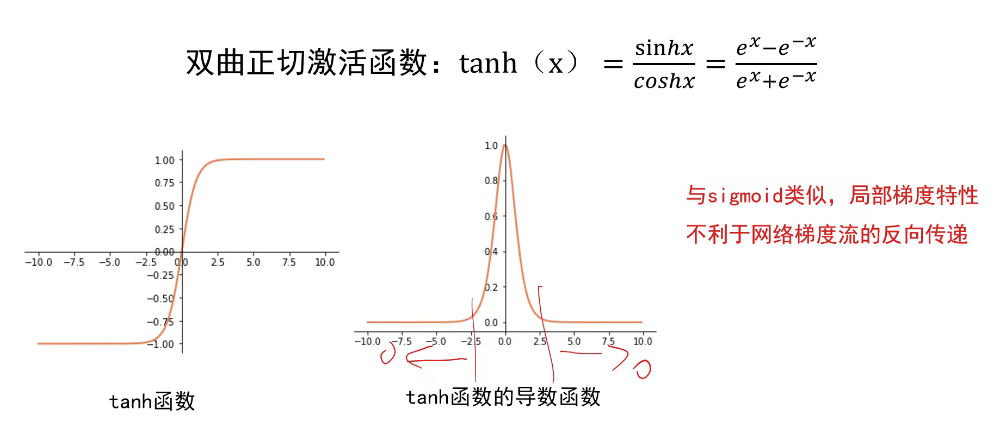

#### ReLU
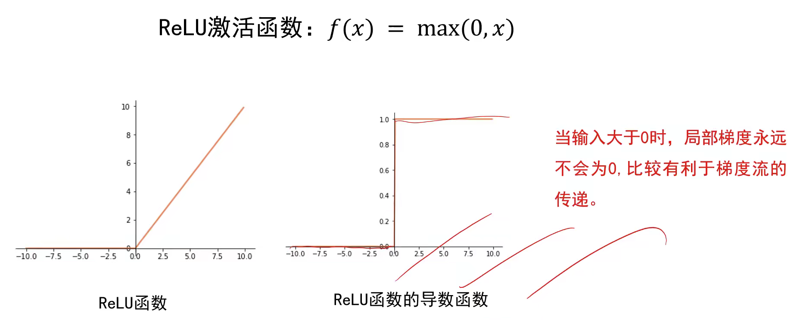
但是ReLU小于0时梯度为0

#### leakly ReLU
基本没有死区

尽量选择ReLU或者Leakly ReLU，相对于Sigmoid/tanh，ReLU函数或者Leakly ReLU会让梯度流更加顺畅，训练过程收敛更快。

### 动量法与自适应梯度

#### 梯度下降算法存在的问题
损失函数特性：一个方向上变化迅速而在另一个方向上变化缓慢

有可能在变化迅速的方向振荡，但是在变化缓慢的方向行进较慢。

#### 动量法
利用累加历史梯度信息更新梯度，减少震荡，加速通往谷底。

利用累加可以抵消变化快方向的震荡，加快变化缓慢方向的行进速度。

梯度下降法无法通过局部最小点以及鞍点，动量法能够冲出局部最小点和鞍点。

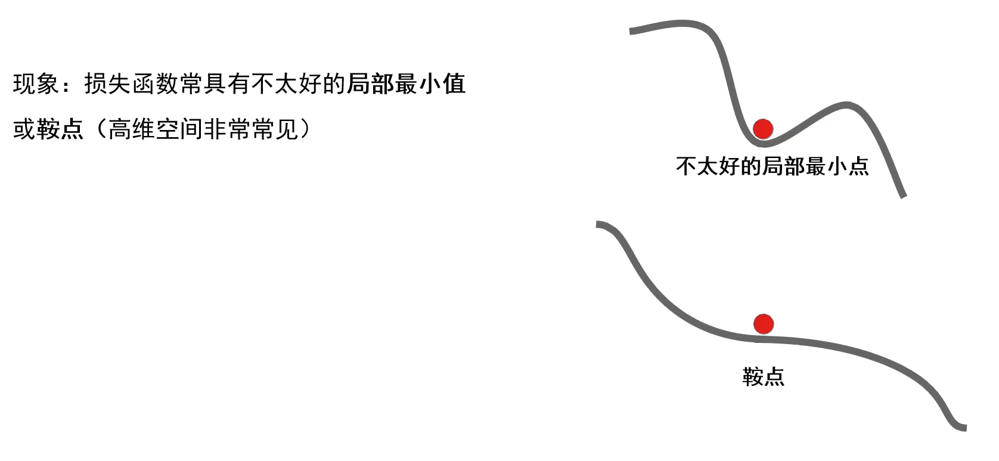

#### 自适应梯度与RMSProp
自适应梯度法通过减小震荡方向步长，增大平坦方向步长来减小震荡，加速通往谷底方向。

梯度幅度的平方较大的方向时震荡方向，梯度幅度的平方较小的方向时平坦方向。

AdaGrad

存在问题：r会累加，w会减小，失去调节作用

改进，RMSProp。

#### ADAM
将动量法与自适应梯度合在一起
一个是历史梯度的累加值，一个是历史梯度平方的累加值。

## 训练过程

### 权值初始化
全零初始化：网络中不同的神经元有相同的输出，进行同样的参数更新，因此这些神经元学到的参数都一样，等价于一个神经元。 
建议采用随机初始化。

随机权值初始化：权值采样自N(0,0.01)的高斯分布

网络结构：10层隐层，1个输出层，每层500个神经元，双曲正切激活函数

从第三层开始，所有输出均为0，局部梯度为0，输入信息传不到后面。

使用权值采样自N(0,1)的高斯分布

输出大部分为-1或1，神经元全处于饱和状态，局部梯度为0

权值设置太小，信息传不到后面，权值太大，信息能传递到后面，但是梯度传递不回来。信息流消失，梯度消失，无法训练。

初始化时让权值不相等，并不能保证网络能够正常训练 
有效的初始化方法：使网络各层的激活值和局部梯度的方差在传播过程中尽量保持一致；以保持网络中正向和反向数据流动。

**Xavier初始化**
一个神经元，其输入为z1,z2,...zn，这N个输入时独立同分布的；其权值为w1,w2......wn，他们也是独立同分布的，且w与z是独立的；其激活函数为f；其最终输出y的表达式：

目标：使输出的y与输入的z有相同的分布(均值，方差)，y与下一层输出也有相同的分布，信息就能正常流动到后面，梯度也能正常传播。
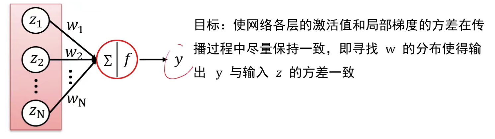

假设f为双曲正切函数，w1...wn独立同分布，z1....zn独立同分布，随机变量w与z独立，且均值均为0，则有
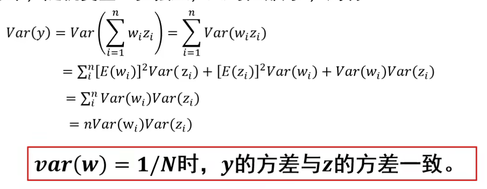

权值采样自N(0,1/N)的高斯分布，N为输入神经元个数。**均值0，方差1/N**
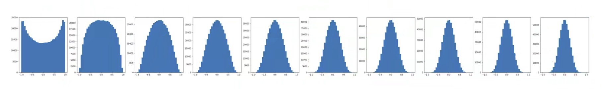

小结： 
好的初始化方法可以防止前向传播过程中的信息消失，也可以解决反向传播过程中的梯度消失。 
激活函数西安则双曲正切或者sigmoid时，建议使用Xavier初始化方法。 
激活函数选择ReLU或Leakly ReLU时，推荐使用He初始化 

### 批归一化
刚才希望通过调整权值使输出与输入具有相同的分布。批归一化直接对神经元输出进行批归一化 
小批量梯度下降算法：每次迭代时会读入一批数据，比如32个样本；经过当前神经元后会有32个输出值y1....y32; 
批归一化操作：对这32个输出进行减均值除方差操作；可保证当前神经元的输出值的分布符合0均值1方差。 

如果每一层的每个神经元进行批归一化，就能解决前向传递过程中的信号消失问题。

批归一化经常插入到全连接层后，作用在非线性激活前。

### 欠拟合、过拟合与Dropout

过拟合：学习时选择的模型所包含的参数过多，以至于出现这一模型对已知数据预测的很好，但对未知数据预测得很差得现象。这种情况下模型可能只是记住了训练集数据，而不是学习到了数据特征。

欠拟合：模型描述能力太弱，以至于不能很好地学习到数据中得规律。（模型过于简单）

机器学习的根本问题：优化和泛化的问题。 
优化：调节模型以在训练数据上得到最佳性能。 
泛化：训练好的模型在前所未见的数据上的性能好坏。

训练储器：优化和泛化时相关的，训练集上的误差越小，验证集上的误差也越小，模型的泛化能力逐渐增强。

训练后期：模型在验证集上的错误率不再降低，转而开始变高。模型出现过拟合，开始学习仅和训练数据有关的模式。

应对过拟合：最优方案，获取更多训练数据。次优方案，调节模型允许存储的信息量或者对模型允许存储的信息加以约束，该类方法也称为正则化。调节模型大小，为损失函数增加正则项分散权值。

L2正则化
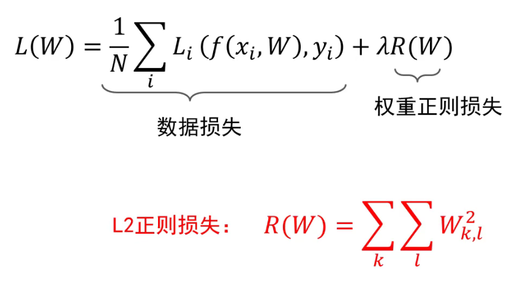
L2正则损失对于大数值的权值向量进行严厉惩罚，鼓励更加分散的权重向量，使模型倾向于使用所有输入特征做决策，此时的模型泛化性能好。

**随机失活Dropout**

让隐层神经元以一定的概率不被激活。

实现方式：训练过程中，对某一层使用Dropout，就是随机将该层的一些输出舍弃(输出值设置为0)，这些被舍弃的神经元就好像被网络删除了一样。

随机失活比率(Dropout ratio)：是被设为0的特征所占的比例，通常在0.2~0.5范围内。
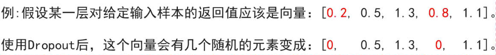

随机失活使得每次更新梯度时参与计算的网络参数减少了，降低了模型容量，所以能防止过拟合。 
随机失活鼓励权重分散，从这个角度来看随机失活也能起到正则化的作用，进而防止过拟合。 
Dropout可以看作模型集成，将网络分成多个小网络 
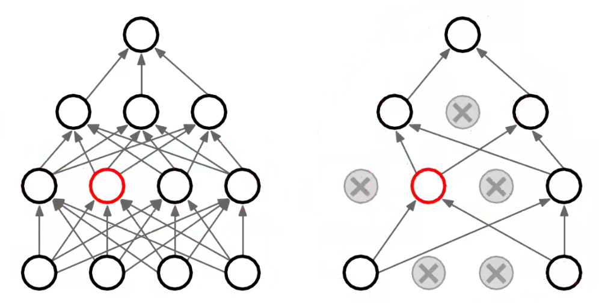

若50%概率失活，有4种情况。A输出的期望为1/2。 
测试阶段所有神经元打开，不失活，输出乘以p。 
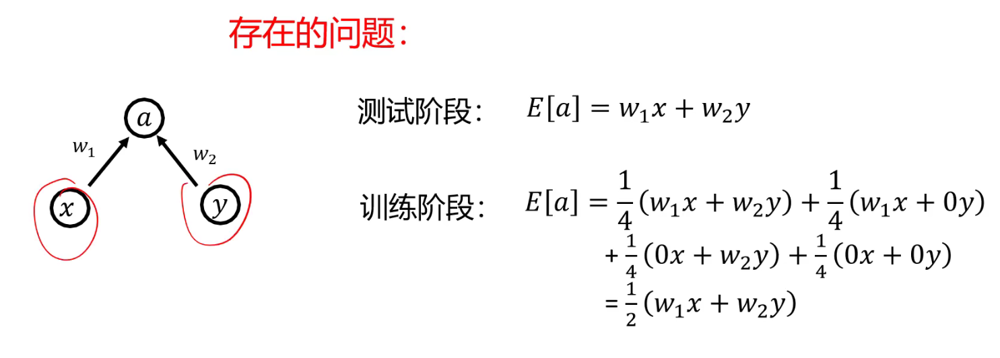

### 模型正则与超参数优化

#### 神经网络的超参数

网络结构--隐层神经元个数，网络结构，非线性单元选择等。

优化相关--学习率、dropout比率、正则项强度等。

#### 学习率设置
学习率过大训练过程无法收敛 
学习率偏大，在最小值附近震荡，达不到最优。 
学习率偏小，收敛时间长。 
不同学习率的损失函数： 
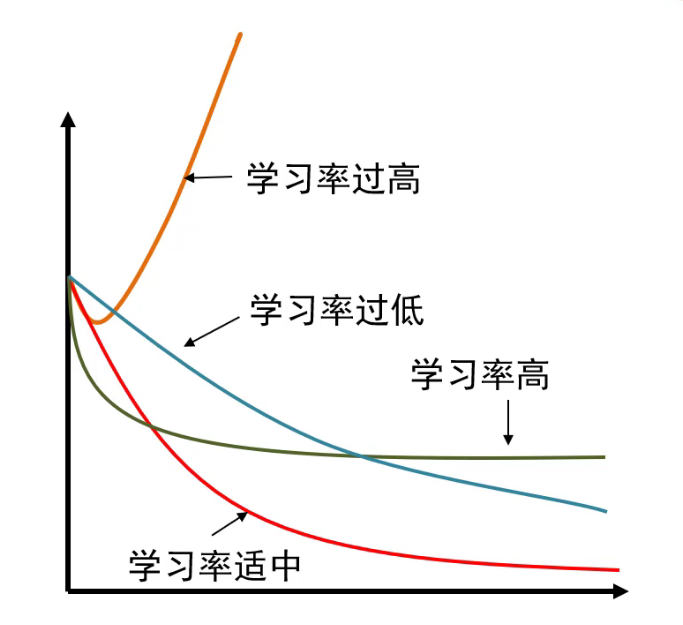

退火：取一个指数次方，使ε减小。

#### 超参数优化方法
网格搜索法：
1. 每个超参数分别取几个值，组合这些超参数，形成多组超参数；
2. 在验证集上评估每组超参数的模型性能；
3. 选择性能最优的模型所采用的那组值作为最终的超参数值；

超参数搜索策略： 
粗搜索：利用随机法在较大范围里采样超参数，训练一个周期，依据验证集正确率缩小超参数范围。

再将缩小后的空间分成网格细搜索。

超参数的标尺空间：

在log空间里采样

# 卷积神经网络

## 卷积与图像去噪

### 卷积
噪声图像：一个点和周围点差别比较大。 
去除噪声的思想：将该点与周围的点平均。最简单的方式：平均求和。 
该过程即为对图像中一个点进行的卷积操作。 

卷积核，也叫滤波核。

卷积的数学公式：
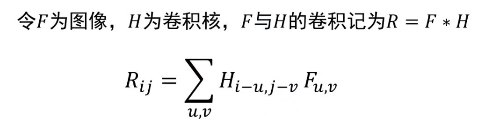

卷积核180°翻转后再到图像上滤波才叫卷积，不反转的话叫做相关。但是在真实的情况中，模板基本都是对称的，翻转不翻转都一样。

卷积的性质：
1. 叠加性
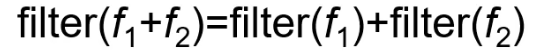
2. 平移不变性(所有的平移操作都可以用卷积来实现)
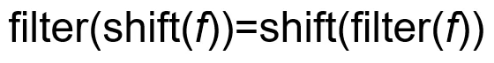
3. 其他性质

### 边界填充
在处理图像边界时，模板中心与像素对齐，但是模板周围的权值没有对应的像素，需要进行边界填充。

除了0填充外，还有其他填充方式

卷积操作后的图像要小于输入时图像，通过边界填充，我们可与实现卷积前后图像的尺寸不变。常用常数填充。

示例： 
单位脉冲核卷积后图像无变化

这两个模板图像左移或右移1个像素

平滑操作
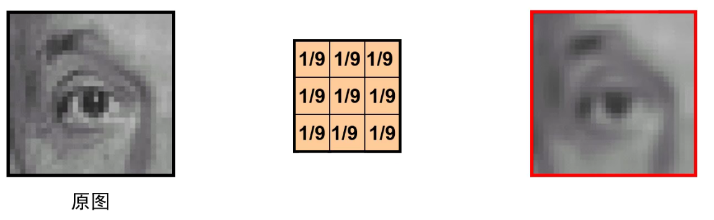
锐化操作
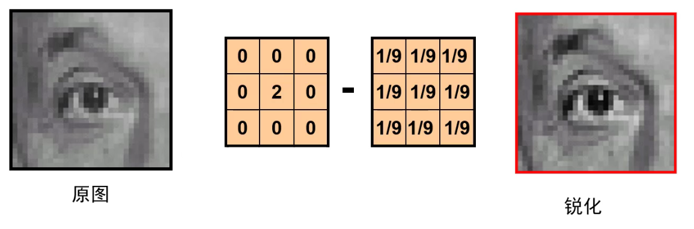

原图减去平滑后的图剩下的是边缘图
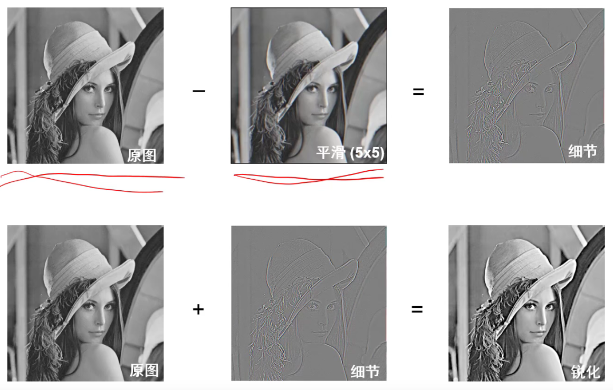

### 高斯卷积核
平均卷积核捐出来会出现振铃现象(有水平竖直的条纹) 
根据领域像素与中心的远近程度分配权重可以解决振铃现象，高斯核 
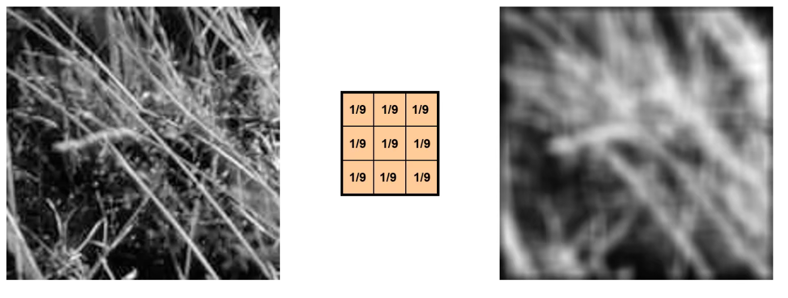

高斯卷积核： 

产生步骤：
1. 确定卷积核的尺寸
2. 设置高斯函数的标准差σ

3. 计算卷积核各个位置的权重值，将xy代入高斯函数计算
4. 对权重进行归一化，使所有权重相加为1

#### 卷积核方差设置
σ=2时信号比较集中，中心位置权重更大，与周边的平滑没有那么厉害。 
σ越大，平滑效果越明显

#### 窗宽变化
在方差不变的情况下，中心的值时一样的。在归一化后小窗口中间的值会比较大窗口的大，平滑能力弱。模板尺寸越大，平滑能力越强。

1. 大方差或者大尺寸卷积核平滑能力强
2. 小方差或者小尺寸卷积核平滑能力弱
3. 经验法则：将卷积核的半窗宽度设置为3σ，最终卷积模板尺寸为2x3σ+1

#### 高斯卷积核特性
去除图像中的高频成分(噪声、边缘)(低通滤波器) 
两个高斯卷积核卷积后得到的还是高斯卷积核 
&ensp;&ensp;&ensp;&ensp;使用多次小方差卷积核连续卷积，可以得到与大方差卷积核相同地结果 
&ensp;&ensp;&ensp;&ensp;使用标准差为σ的高斯卷积核进行两次卷积与使用标准差σ√2的高斯核进行一次卷积相同 
可分离性 
&ensp;&ensp;&ensp;&ensp;可分解为两个一维高斯的乘积 

将大模板分解为小模版能够降低运算量

### 图像噪声与中值滤波器

#### 噪声

椒盐噪声：黑色像素和白色像素随机出现

脉冲噪声：白色像素随机出现

高斯噪声：噪声强度变化服从高斯分布(正态分布)

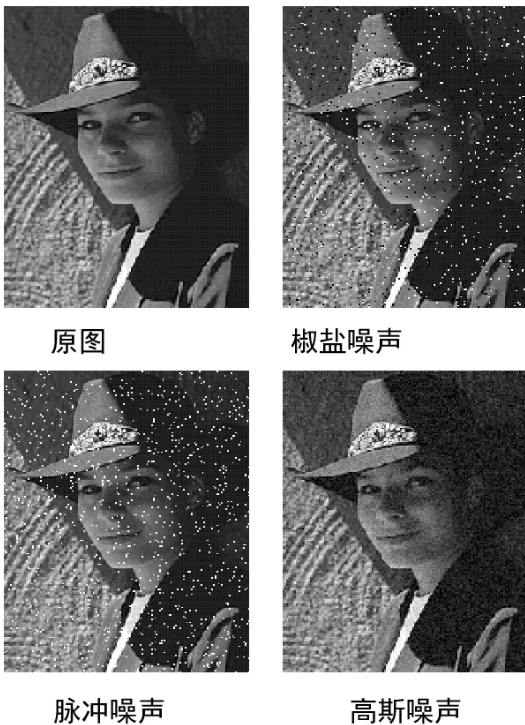

#### 高斯噪声

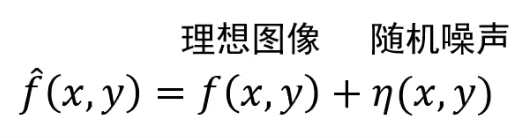
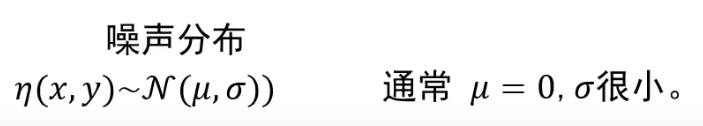

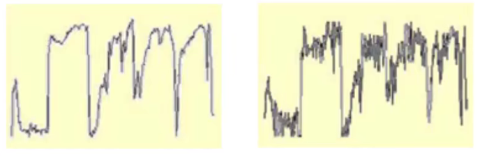

0.5，0.1，0.2是在纯灰度图上叠加的高斯噪声的σ，1、2是滤波使用的高斯核的σ
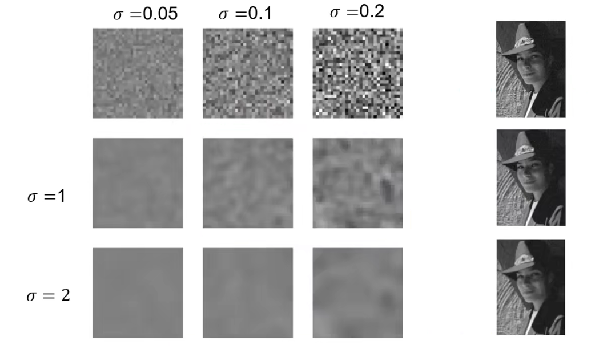
噪声方差越大，卷积核需要的方差也越大，但是在去除噪声时，也会影响原图，平滑有用信号。

#### 椒盐噪声和脉冲噪声
使用中值滤波器，该模板中没有权重。该模板逃入原图后将所有值排序，以中间位置的中值替代原值。
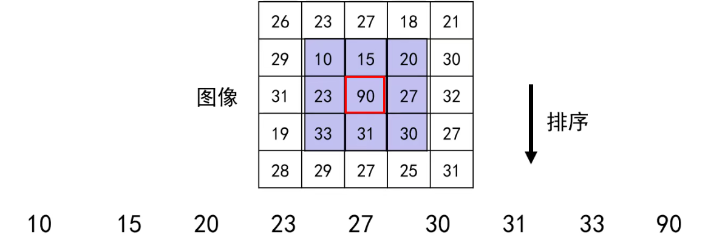
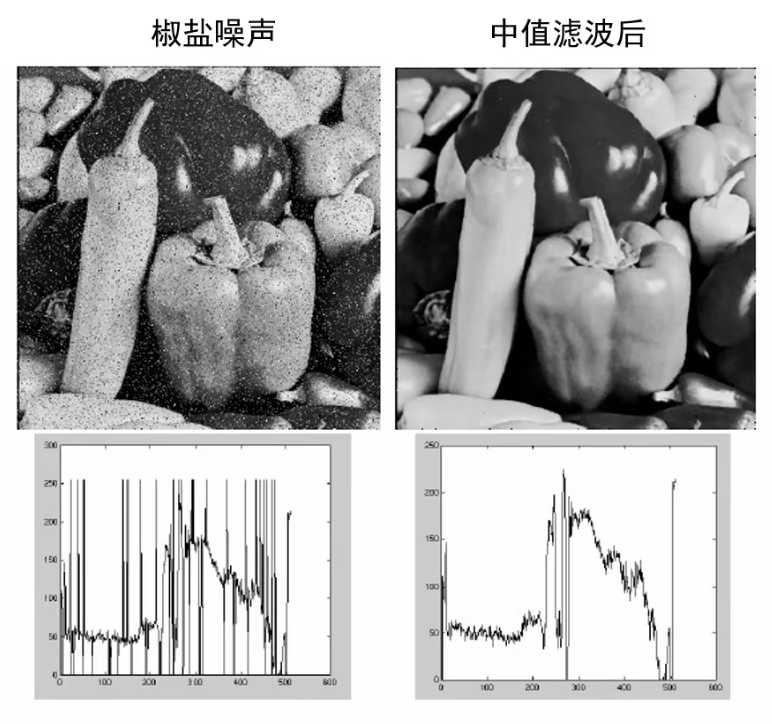

高斯滤波是线性操作，中值滤波是非线性操作。

## 卷积与边缘提取
边缘：图像中亮度明显而急剧变化的点

图像中边缘的种类，不同任务关注的边不同。
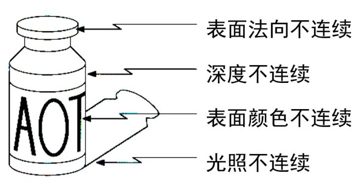

### 边缘检测
信号急剧变化的点，是导数最大的点

图像求导 
ε近似为1

可以通过卷积核实现

左边是x方向导数，右边是y方向导数

图像的梯度：两个方向导数组成的向量，梯度指向灰度变化最快的方向
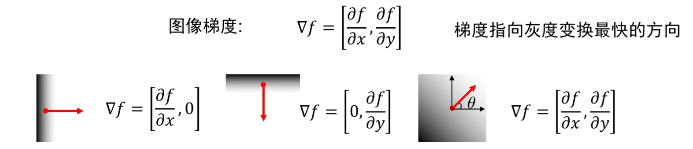

通过模值图像可以看出图像的边缘信息

噪声对边缘的影响，直接求导无法提取边缘信息
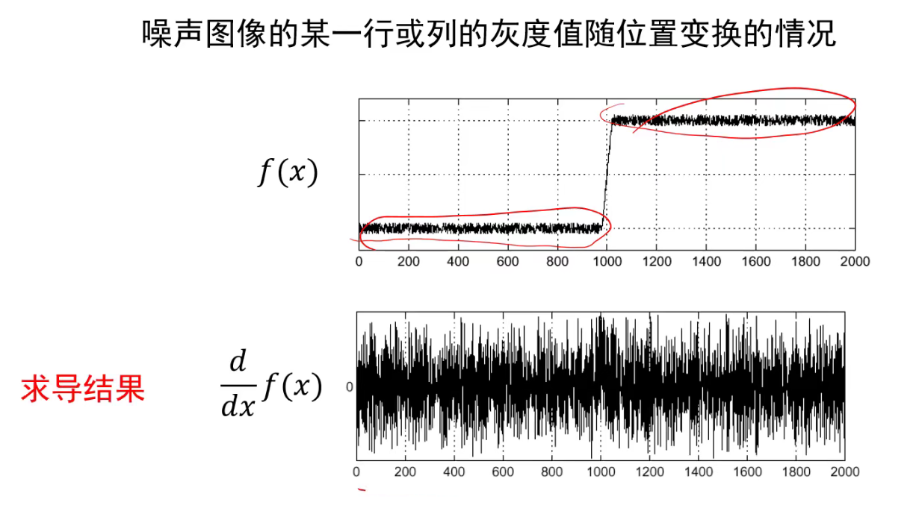

解决方法：先平滑再求导。微分也是一种卷积，通过卷积的交换律和结合性可以将其变为高斯一阶偏导核。

高斯一阶导模板的参数：σ

不同的方差关注的是不同颗粒度的信息，小方差关注细粒度，大方差关注粗粒度。

高斯核：
1. 消除高频成分(低通滤波器)
2. 卷积核中的权值不可为负数
3. 权值总和为1(恒定区域不受卷积影响)

高斯一阶偏导核：
1. 高斯的导数
2. 卷积核中的权值可以为负
3. 权值总和为0
4. 高对比度点的影响值大

### Canny边缘检测器

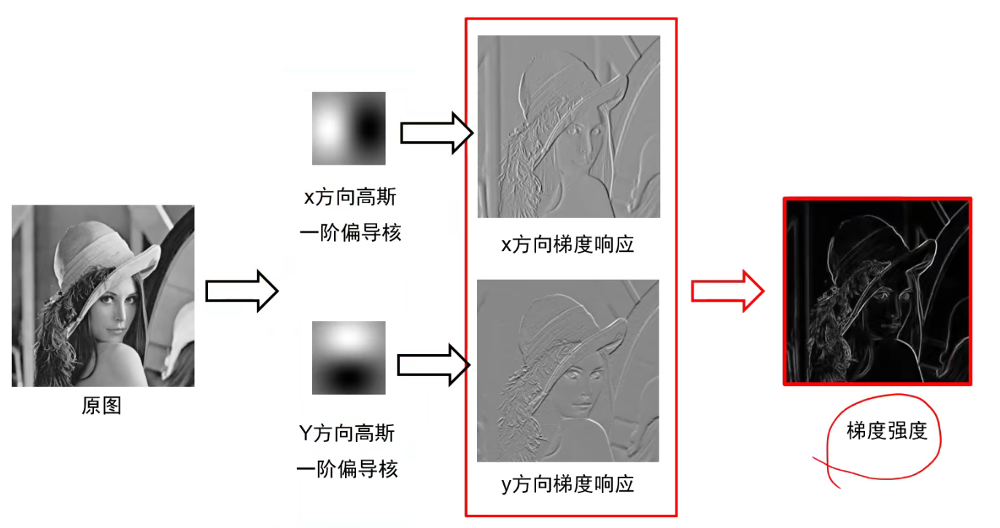

由于信号缓慢变化，所以无法得到很准确的边
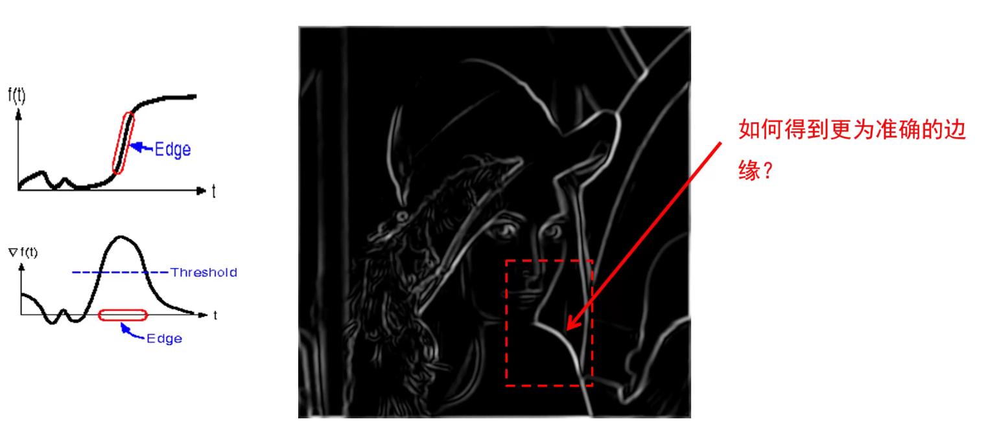

非极大值抑制

但是上下的q点与r点的坐标通常不是整数，其对应的强度需要通过周边几个点的值加权求和得到

改进：双阈值。与高阈值相连接的低阈值边缘保留，其余低阈值边缘舍弃
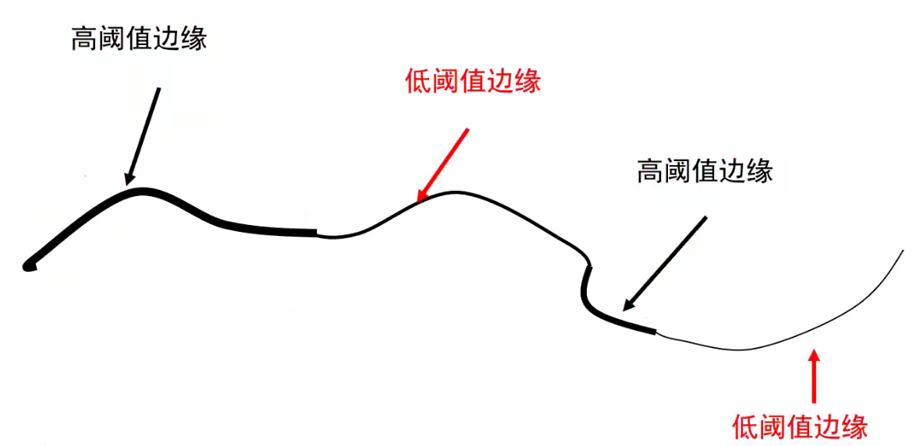

总结：
1. 用高斯一阶偏导核卷积图像
2. 计算每个点的幅值和方向
3. 非极大值抑制将宽的边缘细化至单个像素宽度
4. 连接与阈值(滞后)：定义两个阈值，使用高阈值开始边缘曲线，使用低阈值继续边缘曲线

## 卷积与纹理表示

### 纹理

图像可以以纹理区别，例如人脸，由眼睛鼻子嘴巴等固定的纹理组成；纹理表示了一些材质等的属性。
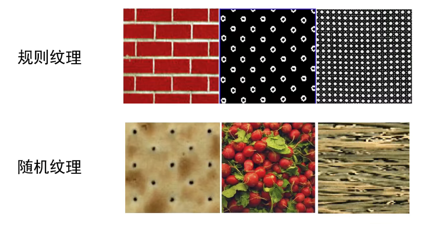

### 纹理的表示方法

直接对图像进行边缘提取，会出现很多比较杂乱的边，很难有效表示纹理。

#### 基于卷积核组的纹理表示方法

两件事：利用卷积核组提取图像中的纹理基，利用基元的统计信息来表示图像中的纹理。

卷积核组： 
都是高斯偏导核，检测边缘及方向，最后一个检测圆形(斑点)。
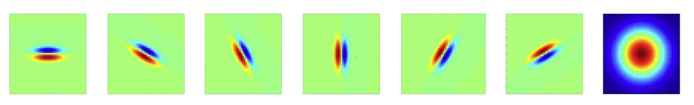

1. 设计卷积核组
2. 利用卷积核组对图像进行卷积操作获得对应的特征响应图组
3. 利用特征响应图的某种统计信息来表示图像中的纹理

用卷积核就得到了图像中表示的基元信息，将得到的每个特征响应图展开为一行一行的向量，最后一起表示为一个行向量
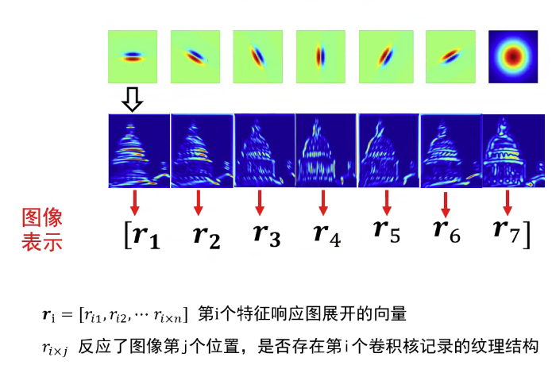

另外一种表示方法：基元提取过程不变。基元的位置对纹理分类任务没有影响。

将特征响应图展开为向量的过程中保留了纹理基元的位置信息。在新的表示方法中，忽略基元的位置，只关注哪种基元对应的纹理以及基元出现的频率。

用特征响应图的平均值代替该特征响应图，平均值越高表示响应图中含有大量的该特征基元。得到一个特征基元个数的向量。

卷积核组设计重点：
1. 卷积核类型，边缘、条形以及点状
2. 卷积核尺度：3-6个尺度
3. 卷积核方向：6个角度

常用设计方式： 
边缘：高斯一阶偏导 
条状：高斯二阶偏导 
点状 
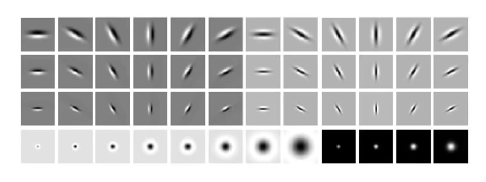

假设一张图以上述的卷积核组卷积后，可以生成四十八个特征响应图像。图像的每一个点都可以表示为48维稀疏向量。

将纹理核生成的事情交给神经网络去做：卷积神经网络

## 卷积神经网络
卷积神经网络任务：图像分类
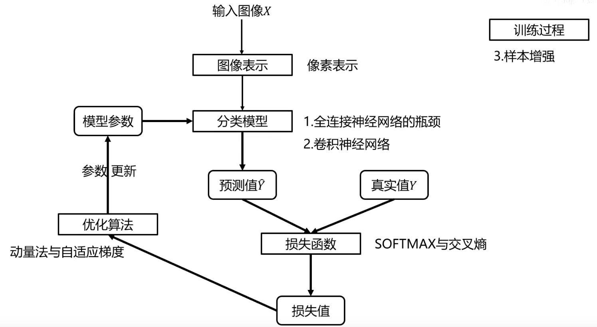

### 图像表示
直接利用原始像素为特征，展开为列向量。

### 分类模型

#### 全连接神经网络的瓶颈

全连接神经网络：每一层的每一个神经元都与前一层的每个神经元相连，例如CIFAR10用的神经元权值为3072+1(偏置)。

瓶颈在于图像越大，权值就越多。且全连接神经网络对一些已经表示为向量，简洁的东西或者小图像比较有效，例如得到的特征响应向量。

卷积神经网络：通过卷积核将图像表示为特征向量，再用全连接神经网络

网络结构： 
图像->卷积核组->特征向量->全连接神经网络->分类

#### 卷积神经网络
通常由卷积层，激活层，池化层，全连接层组成。
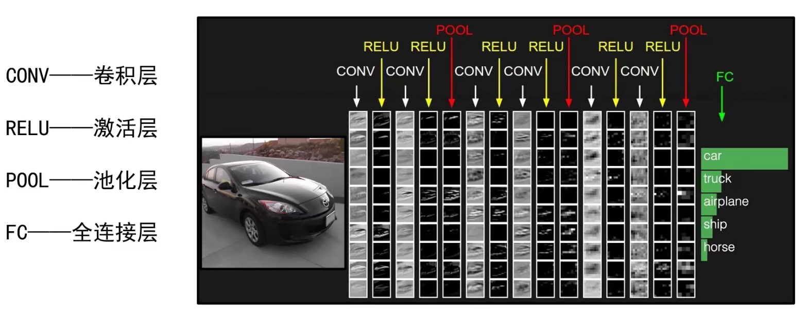

**卷积层**
卷积层由卷积核组成，卷积核组在滤波器中叫做纹理滤波器组。
卷积神经网络中的卷积核： 
不仅具有宽和高，还具有深度，常写成：宽度x高度x深度。 
卷积核参数不仅包括核中存储的权值，还包括一个偏置值。 

当其跟图像(rgb3个通道)作用时，将卷积核展成一个5x5x3的向量，同时将其覆盖的图像区域按相同的展开方式展成5x5x3的向量，计算二者的点乘，并加上偏移量，计算结果为一实数
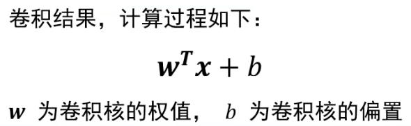

如果在第一个卷积层中有6个卷积核，会得到6个特征响应图。 
特征响应图组深度等于卷积核的个数。 
不同的特征响应图反映了输入图像对不同卷积核的响应结果。 
同一特征响应图上不同位置的值表示输入图像上不同位置对同一卷积核的响应结果。 
卷积核的深度需要与输入信号的深度相同。 
如下图，在6个卷积核卷积后如果再接一层卷积层，后面的卷积核深度应为6，得到的结果深度由后面一个卷积层的卷积核个数决定。 
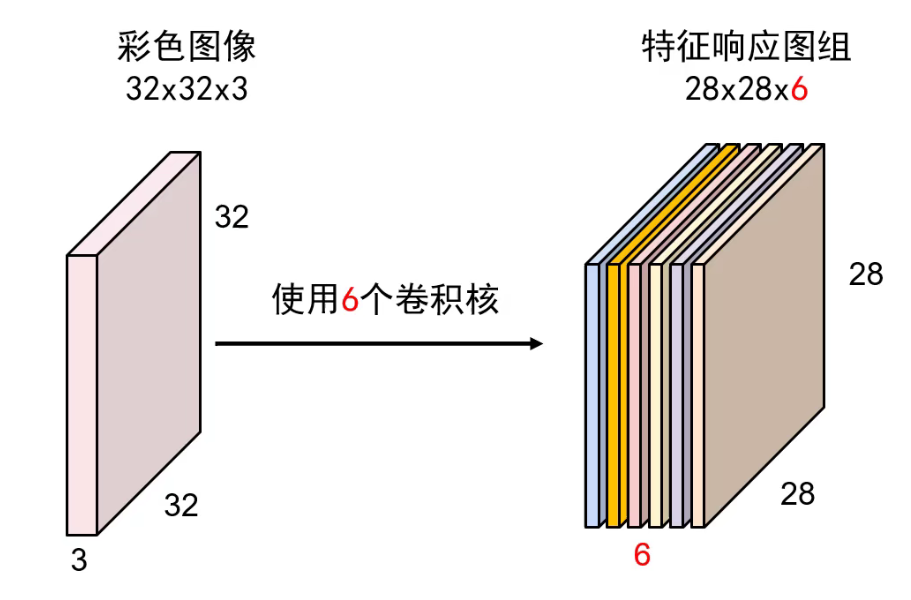

**卷积步长**
卷积核可以按照指定的间隔进行卷积操作，该间隔即为卷积步长。不同卷积步长得到的输出结果尺寸不同。 
卷积后结果尺寸计算公式：
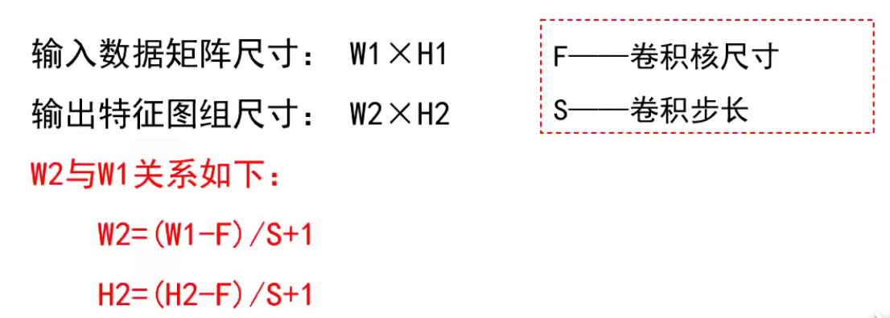

**边界填充**
常用0填充。

设计卷积层需要考虑的因素： 
卷积核的宽、高 
是否采用边界填充 
卷积步长 
该层的卷积核个数 
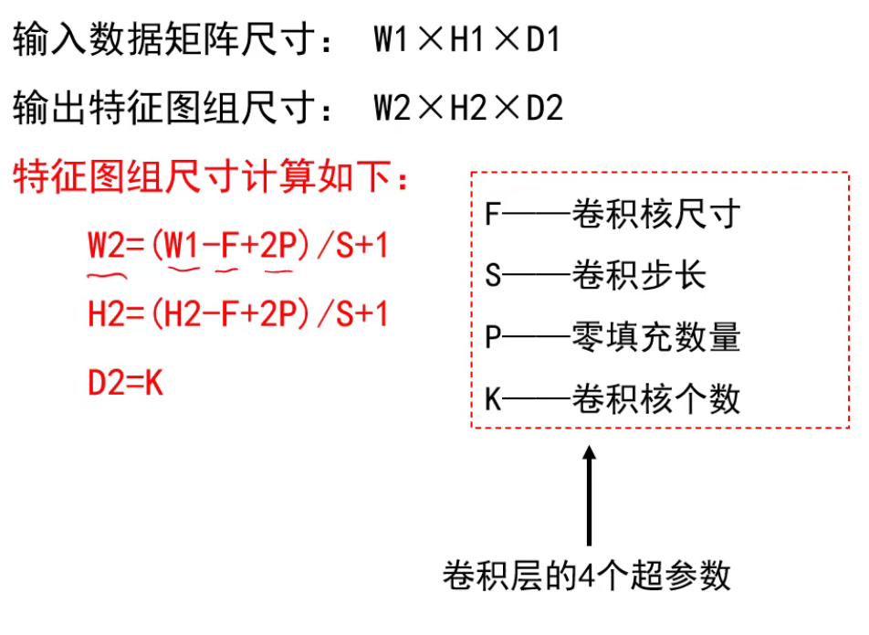

**池化层**
卷积->relu->卷积->relu->pool->卷积->relu->卷积->relu->pool->卷积->relu->卷积->relu->pool 

池化的作用：对每一个特征响应图独立进行，降低特征响应图组中每个特征响应图的宽度核高度，减少后续卷积层的参数的数量，降低计算资源耗费，进而控制过拟合。 
将特征响应图变小。 

在卷积神经网路中用到的卷积核尺寸一般比较小，3x3或者5x5或11x11，通过池化缩小输入图像尺寸，能够使卷积核看到更大尺寸的东西，增大感受野。

池化操作：对特征响应图某个区域进行池化就是在该区域上指定一个值来代表整个区域。

常见的池化操作： 
最大池化--使用区域内的最大值来代表这个区域 
平均池化--采用区域内所有值的均值作为代表 

池化层超参数：池化窗口和池化步长。下图为例，丢掉75%的信息，但不改变特征响应图的个数。

池化操作与canny中的非最大化抑制相似，保留最强的信号。

损失函数、优化算法等跟之前讲的一样

### 图像增强
存在问题：过拟合的原因使学习样本太少，导致无法训练出能够泛化到数据的模型

数据增强：是从现有的训练样本中生成更多的训练数据，其方法是利用多种能够生成可信图像的随机变换来增加样本。

数据增强的目标：模型在训练时不会两次查看完全相同的图像。这让模型能够观察到数据的更多内容，从而具有更好的泛化能力。

样本增强： 
翻转:

随机缩放&抠图：

色彩抖动：
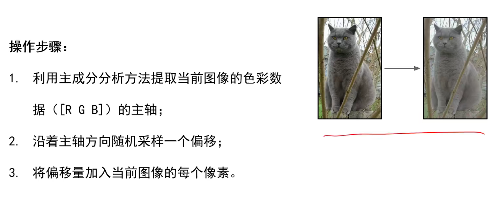

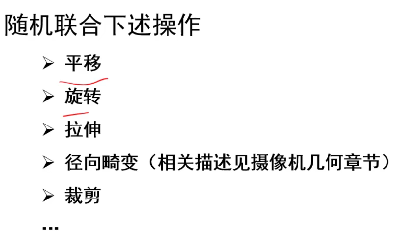

# 经典网络分析

## AlexNet
AlexNet于2012年提出，但是与其相近似的LeNet出现于90年代，用于解决手写邮政编码识别。
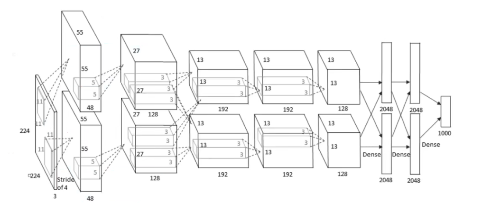
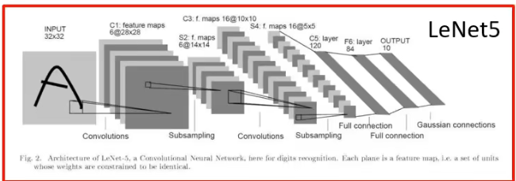

AlexNet主体贡献：
1. 提出了一种卷积层加全连接层的卷积神经网络结构，卷积提取特征，全连接分类。
2. 首次使用ReLu函数作为神经网络的激活函数
3. 首次提出Dropout正则化来控制过拟合，随机失活
4. 使用加入动量的小批量梯度下降算法加速了训练过程的收敛
5. 使用数据增强策略极大地抑制了训练过程的过拟合
6. 利用了GPU的并行计算能力，加速了网络的训练与推断

结构： 
计算网络层数是仅统计卷积层与全连接层。 
池化层和归一化层都是对前面卷积层输出的特征图进行后处理，不单独算一层。 
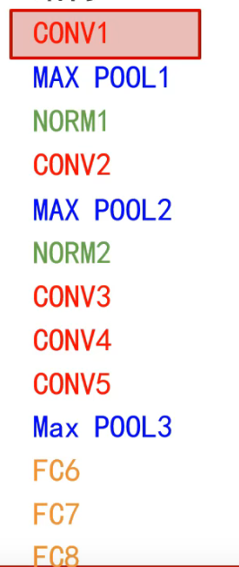

第一层，96个11x11卷积核(深度由输入图像决定)，步长为4，没有零填充。 
(输入图像为227x227x3，样本在训练时进行了去均值处理，既每张样本都减去了数据集的平均矩阵) 
MAX POOL1:窗口大小为3x3，步长为2。有一个像素重叠，重叠有助于对抗过拟合，降低特征图尺寸，对抗轻微的目标偏移带来的影响。 
NORM1，局部响应归一化层，对局部神经元的活动创建竞争机制，响应比较大的值变得相对更大，抑制其他反馈较小的神经元，增强模型的泛化能力。但是后来研究表明在更深层的网络中该层对分类性能的提升效果并不明显，且会增加计算量与存储空间。 

第二层：256个5x5卷积核，步长为1，使用零填充。增加了卷积核，增加了基元的描述能力。此时5x5卷积核实际上处理的是原图中更大区域的内容。

第三、四层：输入为13x13x256，使用384个3x3卷积核，步长为1，零填充p=1

第五层：256个3x3卷积核，步长为1，使用零填充。

第六到八层：全连接神经网络分类器。
MAX POOL3的输出为特征响应图组，而FC6的期望输入为向量。将每个特征响应图都拿出来，依次按行展为向量，既得到9216维向量。

用于提取图像特征的卷积层以及用于分类的全连接层是同时学习的，梯度可以回传回来。在学习过程中二者会相互影响、相互促进。

重要技巧： 
Dropout策略防止过拟合 
使用加入动量的随机梯度下降算法加速收敛 
验证集损失不下降时，手动降低10倍学习率 
采用样本增强策略增加训练样本数量，防止过拟合 
集成多个模型，进一步提高精度 

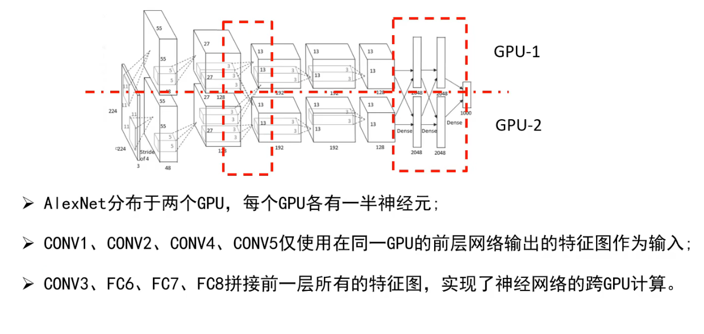

AlexNet卷积层在做什么：
从数据中学习对于分类有意义的结构特征
描述输入图像中的结构信息
描述结果存储在256个6x6的特征响应图里

## ZFNet
(2013)结构与AlexNet基本一致，主要改进： 
将第一个卷积层的卷积核大小改为7x7，能够感受更细粒度的东西 
第二、三个卷积层的卷积步长都设置为2，分辨率不会迅速下降，像素信息损失慢 
增加了第三和第四个卷积层的卷积核个数，能够描述更多结构 

## VGG
使用尺寸更小的3x3卷积核串联来获得更大的感受野 
放弃使用11x11和5x5这样的大尺寸卷积核 
深度更深、非线性更强，网络参数更少 
去掉了AlexNet中的局部响应归一化层 
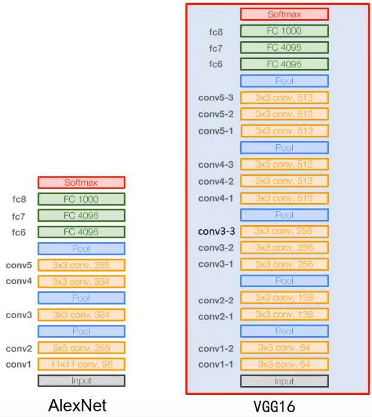

将图像的每一个点都拿出来，算所有点的rgb均值，用这个去均值-

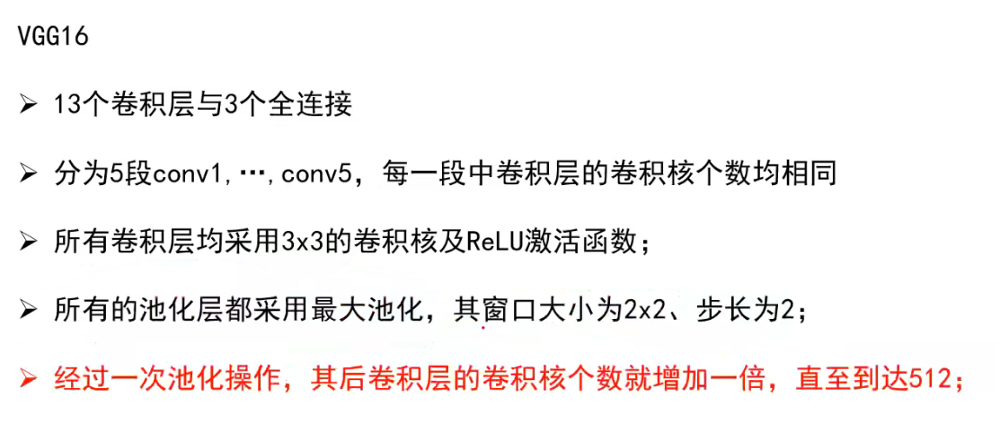

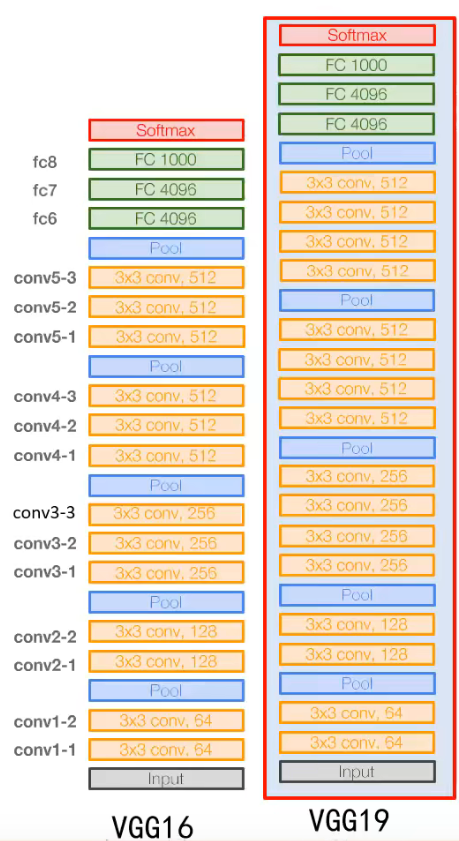
VGG19更深，精度略微提升，但所需内存更多。

VGG16包含13个卷积层与3个全连接层 
分为5段conv1~conv5，每段中卷积核个数均相同。 
所有卷积层均采用3x3的卷积核及ReLU激活函数。 
池化层均采用最大池化，窗口大小为2x2，步长为2 
每池化操作一次，其后卷积核个数增加一倍，直到达到512 
全连接层中使用dropout策略 

VGG19相对于VGG16增加了3个非线性操作，精度略微提升，但是所需内存更多，一般不用。
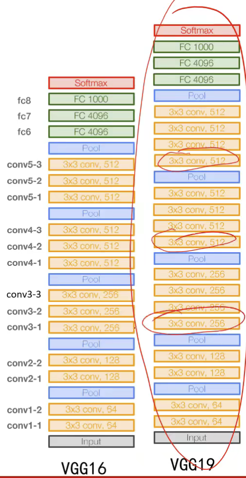

小卷积核的优势：多个小尺度卷积核能够得到与大尺寸卷积核相同的感受野，非线性能力更强 
使用小卷积核串联构建的网络深度更深，非线性更强，参数也更少。
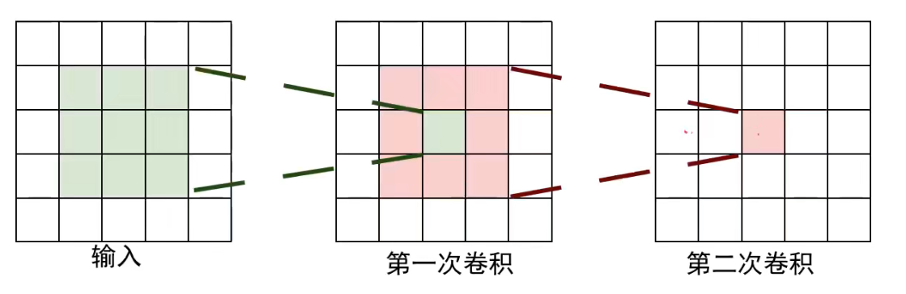

为什么每池化一次，卷积核个数就增加？ 
池化操作可以减小特征图尺寸，降低显存占用。 
增加卷积核个数有利于学习更多的结构特征，但会增加网络参数数量以及内存消耗 
一减一增的设计平衡了识别精度与存储、计算开销。 

为什么卷积核个数增加到512后不再增加？
第一个全连接层含有102M参数（7x7x512x4096），占总参数的74%，如果再增加一倍，就需要204M，权值太多，不好训练。 
该层参数个数是特征图的尺寸与个数的乘积。 
参数过多容易过拟合，且不易被训练。 

## GoogleNet
(2014) 
创新点：
1. 提出了一种Inception结构，能够保留输入信号中的更多特征信息；
2. 去掉了AlexNet的前两个全连接层，并且采用了平均池化，这一设计使得GoogleNet只有500万参数，比AlexNet少了12倍
3. 在网络中加入了辅助分类器，克服了训练过程中的梯度消失问题
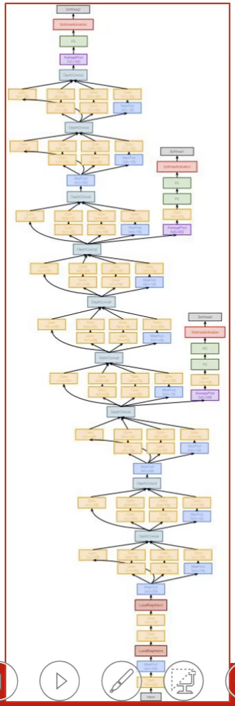

串联结构如VGG存在的问题 
后面的卷积层只能处理千层输出的特征图，前层因某些原因(比如感受野限制)丢失重要信息，后层无法找回。 
一个输入，进行四种操作，再将四个结果合并输出。 
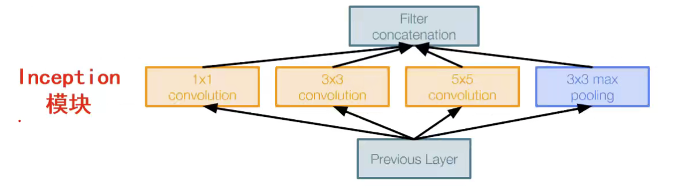
该方法直接使用会很慢，在3x3 5x5卷积前增加1x1的卷积，可以降低3x3 5x5的深度。
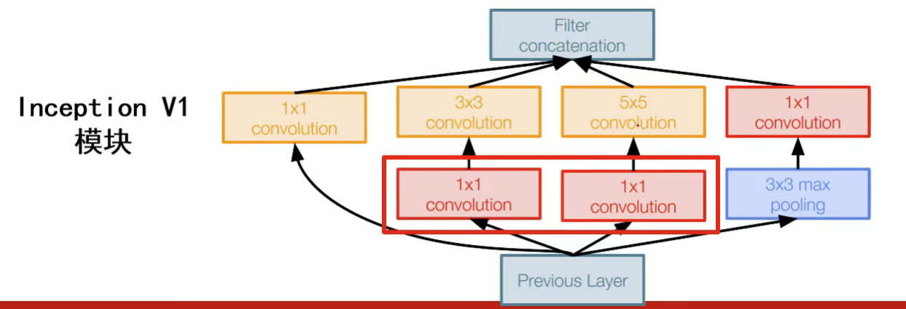

## ResNet

# 图像分割

语义分割：给每个像素分配类别标签不区分实例，只考虑像素类别。
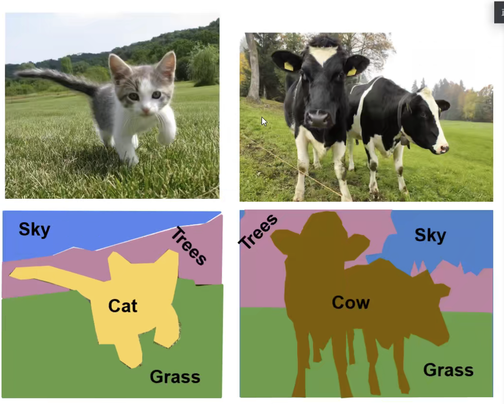

## 全卷积网络
整个网络只包含卷积层，一次性输出所有像素的类别预测

输入图像，每层加padding，输入输出尺寸相同，C:类别个数。 
弊端：算不过来，占用显存过多。

解决方案：让整个网络之包含卷积层，并在网络中嵌入下采样与上采样过程。下采样后学到高级语义特征，再上采样学到语义特征与像素的映射

下采样pooling，strided convolution，上采样可以使用 
最简单的是近邻法，第二种是直接填0。用的比较少，因为人为的添加了一些信息。第二种方法中往回填的位置可能不正确。

index操作。下采样取到信息并计算后，上采样时将数据填回到原来的位置。在代码中是写死的

常用的从小特征图到大特征图的方法：转置卷积。不是写死的，从小特征图到大特征图转换的过程是可以学习的。 
红色区域得到红色像素，蓝色区域得到蓝色像素，在这种情况下两个区域有两个像素是重叠的。

转置卷积，两个点来自两个地方。红色像素会给红色区域一个至，蓝色像素会给蓝色区域一个值，重叠区域的值需要求和。求和时需要注意，以什么样的权值进行累加，需要由神经网络学习。

例子：
输入两个特征值，中间是滤波核，需要将输入分配到上采样的特征中。通过学习xyz将输入变成输出。
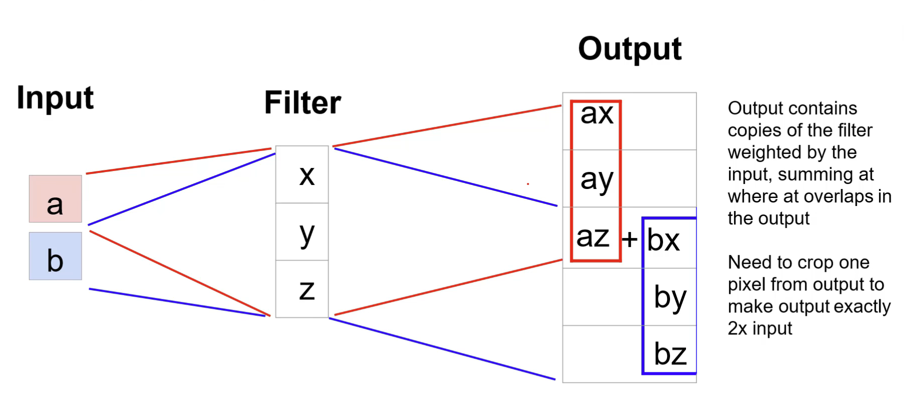
x为一维卷积模板，a为一四维向量，padding补零。两个矩阵的乘积就完成了卷积操作。
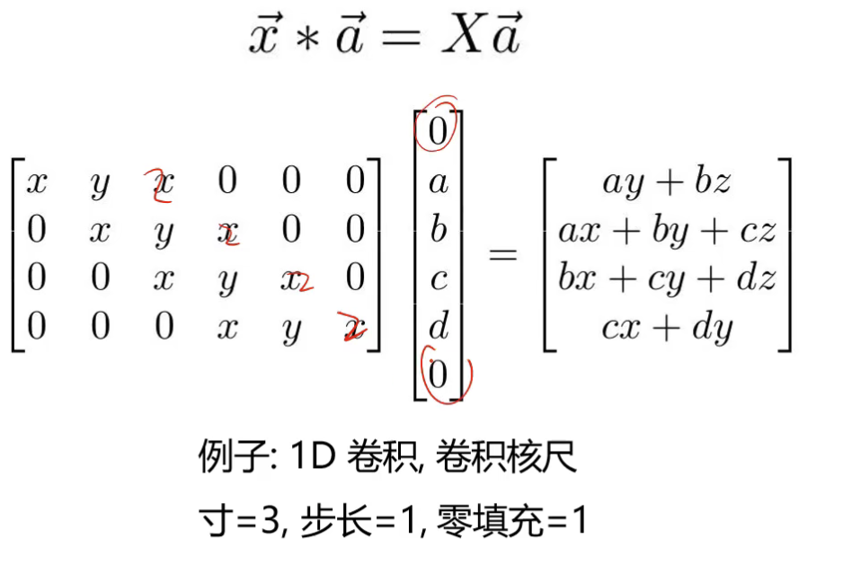
将卷积模板转置之后就可以将其变为六维
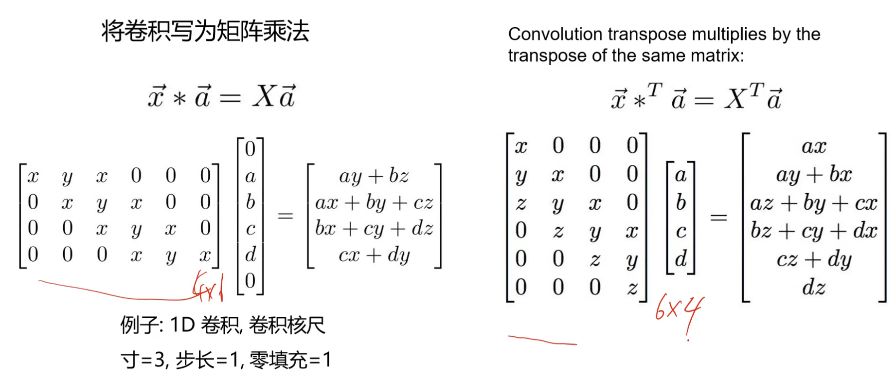
以上为步长为1的卷积，下面是步长为2的卷积
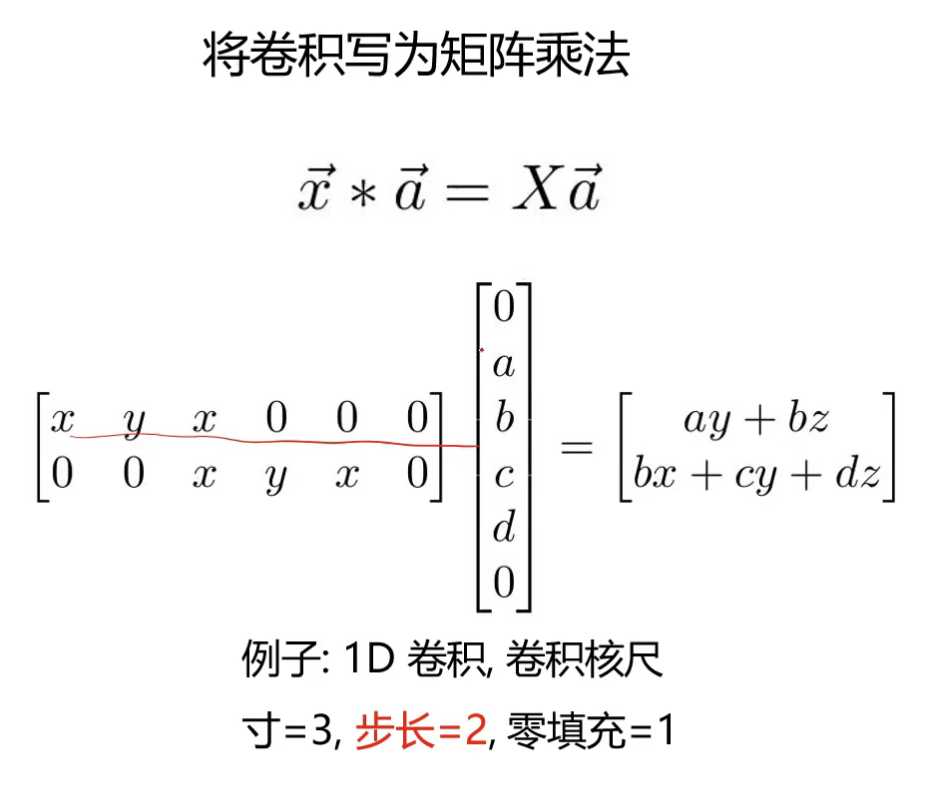
使用某一卷积核下采样，再用该卷积核的转置做上采样。

# 目标检测

## 目标检测：单目标(分类+定位)
在分类的同时定位，1000维的输出分类，4维输出定位

相当于一个多任务网络，使用总损失训练网络。

还可以检测关键点位置，例如额头、手等。（姿态估计）

## 多目标检测
问题：不知道有多少个目标，无法设计网络。
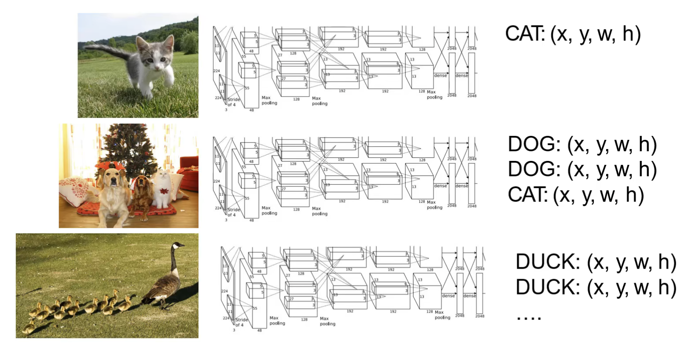

使用滑动窗口方案。问题是不知道目标的位置和大小

区域建议：找出所有潜在可能包含目标的区域；运行速度相对较快