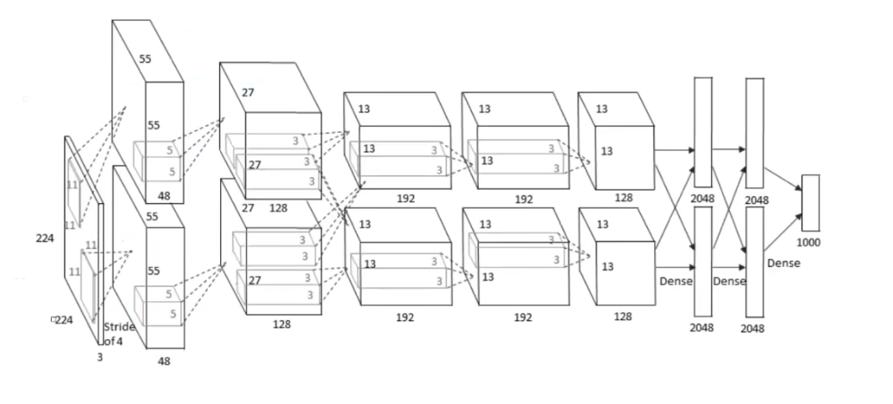
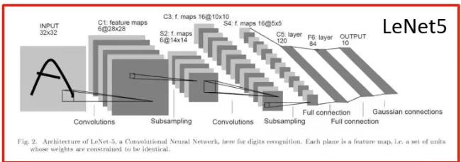
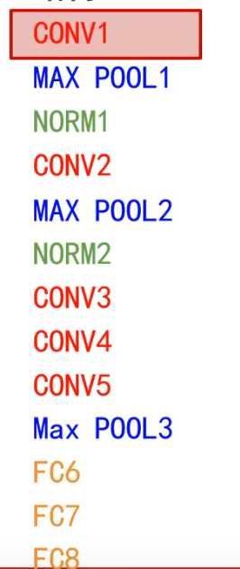
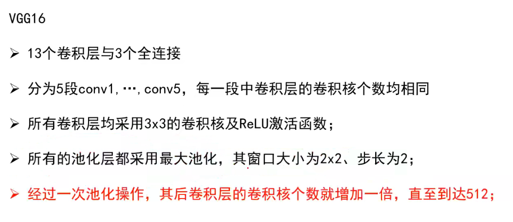
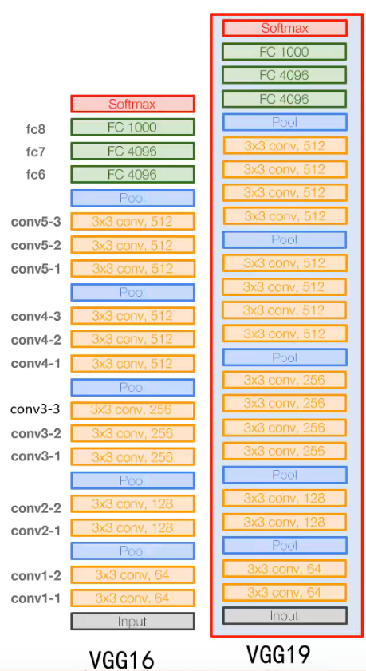
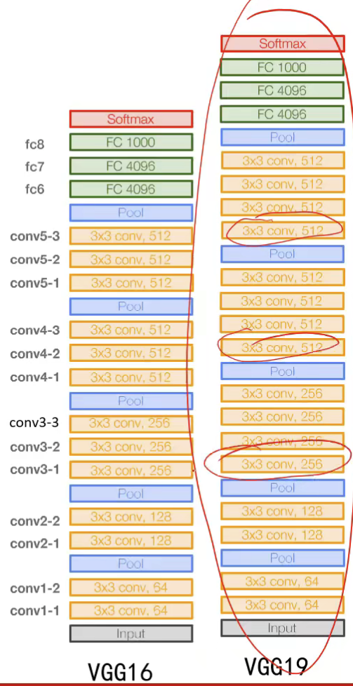
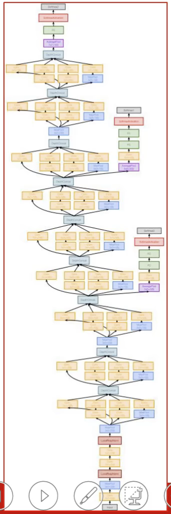
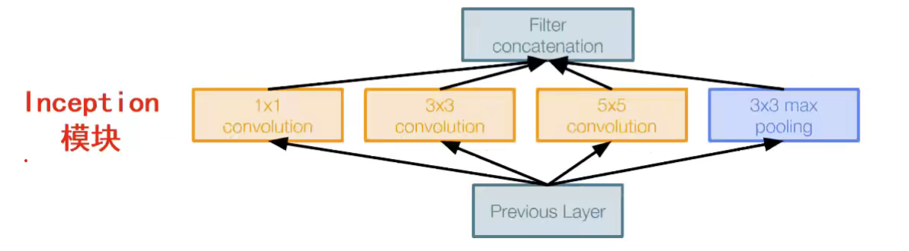
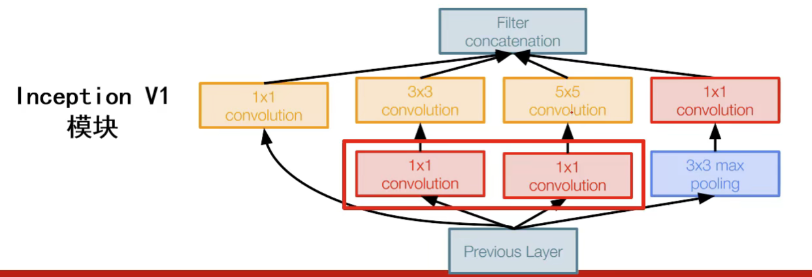

# 经典网络分析

## AlexNet
AlexNet于2012年提出，但是与其相近似的LeNet出现于90年代，用于解决手写邮政编码识别。

AlexNet主体贡献：
1. 提出了一种卷积层加全连接层的卷积神经网络结构，卷积提取特征，全连接分类。
2. 首次使用ReLu函数作为神经网络的激活函数
3. 首次提出Dropout正则化来控制过拟合，随机失活
4. 使用加入动量的小批量梯度下降算法加速了训练过程的收敛
5. 使用数据增强策略极大地抑制了训练过程的过拟合
6. 利用了GPU的并行计算能力，加速了网络的训练与推断

结构： 
计算网络层数是仅统计卷积层与全连接层。 
池化层和归一化层都是对前面卷积层输出的特征图进行后处理，不单独算一层。 

第一层，96个11x11卷积核(深度由输入图像决定)，步长为4，没有零填充。 
(输入图像为227x227x3，样本在训练时进行了去均值处理，既每张样本都减去了数据集的平均矩阵) 
MAX POOL1:窗口大小为3x3，步长为2。有一个像素重叠，重叠有助于对抗过拟合，降低特征图尺寸，对抗轻微的目标偏移带来的影响。 
NORM1，局部响应归一化层，对局部神经元的活动创建竞争机制，响应比较大的值变得相对更大，抑制其他反馈较小的神经元，增强模型的泛化能力。但是后来研究表明在更深层的网络中该层对分类性能的提升效果并不明显，且会增加计算量与存储空间。 

第二层：256个5x5卷积核，步长为1，使用零填充。增加了卷积核，增加了基元的描述能力。此时5x5卷积核实际上处理的是原图中更大区域的内容。

第三、四层：输入为13x13x256，使用384个3x3卷积核，步长为1，零填充p=1

第五层：256个3x3卷积核，步长为1，使用零填充。

第六到八层：全连接神经网络分类器。
MAX POOL3的输出为特征响应图组，而FC6的期望输入为向量。将每个特征响应图都拿出来，依次按行展为向量，既得到9216维向量。

用于提取图像特征的卷积层以及用于分类的全连接层是同时学习的，梯度可以回传回来。在学习过程中二者会相互影响、相互促进。

重要技巧： 
Dropout策略防止过拟合 
使用加入动量的随机梯度下降算法加速收敛 
验证集损失不下降时，手动降低10倍学习率 
采用样本增强策略增加训练样本数量，防止过拟合 
集成多个模型，进一步提高精度 

AlexNet卷积层在做什么：
从数据中学习对于分类有意义的结构特征
描述输入图像中的结构信息
描述结果存储在256个6x6的特征响应图里

## ZFNet
(2013)结构与AlexNet基本一致，主要改进： 
将第一个卷积层的卷积核大小改为7x7，能够感受更细粒度的东西 
第二、三个卷积层的卷积步长都设置为2，分辨率不会迅速下降，像素信息损失慢 
增加了第三和第四个卷积层的卷积核个数，能够描述更多结构 

## VGG
使用尺寸更小的3x3卷积核串联来获得更大的感受野 
放弃使用11x11和5x5这样的大尺寸卷积核 
深度更深、非线性更强，网络参数更少 
去掉了AlexNet中的局部响应归一化层 

将图像的每一个点都拿出来，算所有点的rgb均值，用这个去均值-

VGG19更深，精度略微提升，但所需内存更多。

VGG16包含13个卷积层与3个全连接层 
分为5段conv1~conv5，每段中卷积核个数均相同。 
所有卷积层均采用3x3的卷积核及ReLU激活函数。 
池化层均采用最大池化，窗口大小为2x2，步长为2 
每池化操作一次，其后卷积核个数增加一倍，直到达到512 
全连接层中使用dropout策略 

VGG19相对于VGG16增加了3个非线性操作，精度略微提升，但是所需内存更多，一般不用。

小卷积核的优势：多个小尺度卷积核能够得到与大尺寸卷积核相同的感受野，非线性能力更强 
使用小卷积核串联构建的网络深度更深，非线性更强，参数也更少。

为什么每池化一次，卷积核个数就增加？ 
池化操作可以减小特征图尺寸，降低显存占用。 
增加卷积核个数有利于学习更多的结构特征，但会增加网络参数数量以及内存消耗 
一减一增的设计平衡了识别精度与存储、计算开销。 

为什么卷积核个数增加到512后不再增加？
第一个全连接层含有102M参数（7x7x512x4096），占总参数的74%，如果再增加一倍，就需要204M，权值太多，不好训练。 
该层参数个数是特征图的尺寸与个数的乘积。 
参数过多容易过拟合，且不易被训练。 

## GoogleNet
(2014) 
创新点：
1. 提出了一种Inception结构，能够保留输入信号中的更多特征信息；
2. 去掉了AlexNet的前两个全连接层，并且采用了平均池化，这一设计使得GoogleNet只有500万参数，比AlexNet少了12倍
3. 在网络中加入了辅助分类器，克服了训练过程中的梯度消失问题

串联结构如VGG存在的问题 
后面的卷积层只能处理千层输出的特征图，前层因某些原因(比如感受野限制)丢失重要信息，后层无法找回。 
一个输入，进行四种操作，再将四个结果合并输出。 

该方法直接使用会很慢，在3x3 5x5卷积前增加1x1的卷积，可以降低3x3 5x5的深度。

## ResNet
