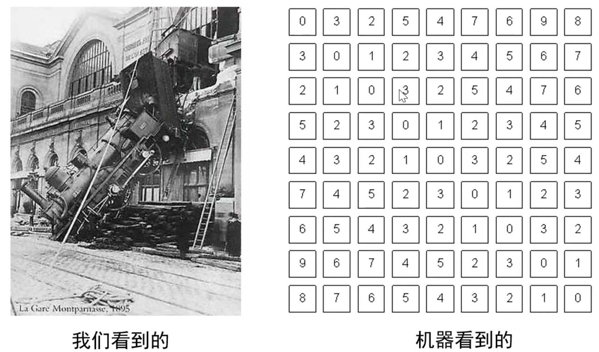
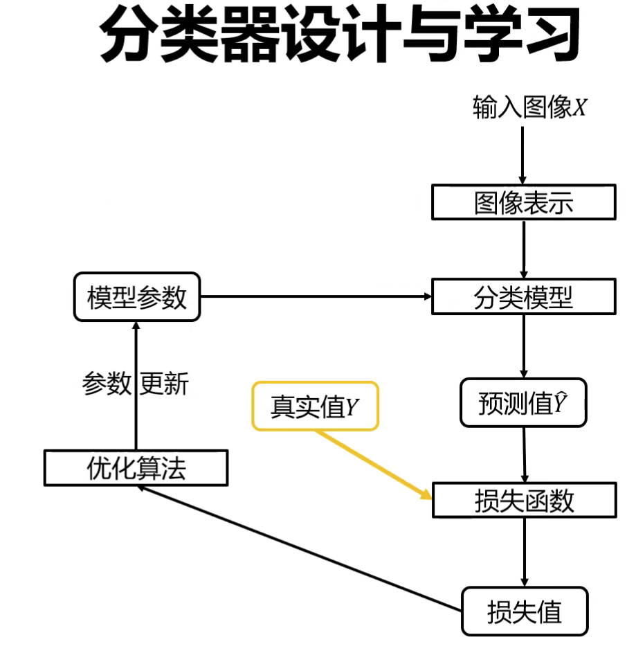
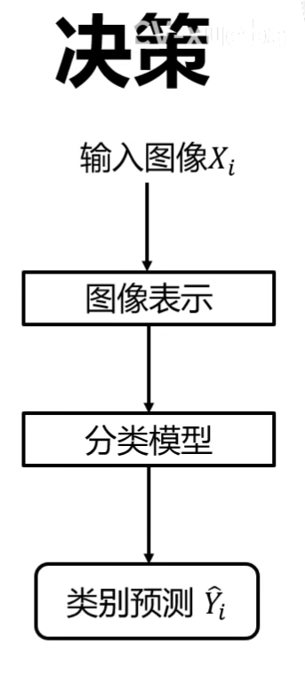

# 图像分类

## 图像分类应用场合
**图像分类**：从已知的标签集合中为给定的输入图片选定一个类别标签，根据图像数据中的特征把图像区分开。

**应用场合**：识别动植物等等

## 图像分类难点
跨越"语义鸿沟"，建立像素到语义的映射。

视角，光照，尺度，遮挡，形变，背景杂波，类内形变，运动模糊，类别繁多。

各个对应的难点都有对应的解决方法。

## 基于规则的方法是否可行
例如通过硬编码的方法识别猫：提取边缘后记录特征等等。 
通过**硬编码**的方法识别猫或其他类，是一件**很困难**的事情。

## 什么是数据驱动的图像分类范式
* 数据集构建
* 分类器设计与学习
* 分类器决策

核心步骤：分类器设计与学习

决策： 

**图像表示**： 
像素表示，RGB三通道矩阵。 
全局特征表示(GIST)，从图像中抽取一些特征表示整图，例如频率适合场景类，不适合猫狗等，因为计算过程依赖于所有的限速，如果存在遮挡，会丢失特征。 
局部特征表示，例如SIFT特征+词袋模型。在图像中抽出100个具有典型意义的区块，用区块表示整图。 

**分类器：** 
近邻分类器 
贝叶斯分类器 
线性分类器 
支撑向量机分类器 
神经网络分类器 
随机森林 
Adaboost 

**优化算法：** 
一阶方法： 
&ensp;&ensp;&ensp;&ensp;梯度下降 
&ensp;&ensp;&ensp;&ensp;随机梯度下降 
&ensp;&ensp;&ensp;&ensp;小批量随机梯度下降 
二阶方法： 
&ensp;&ensp;&ensp;&ensp;牛顿法 
&ensp;&ensp;&ensp;&ensp;BFGS 
&ensp;&ensp;&ensp;&ensp;L-BFGS 

**训练过程：** 
数据集划分 
数据集预处理 
数据增强 
欠拟合与过拟合 
&ensp;&ensp;&ensp;&ensp;减小算法复杂度 
&ensp;&ensp;&ensp;&ensp;使用权重正则项 
&ensp;&ensp;&ensp;&ensp;使用dropout正则化 
超参数调整 
模型集成 

## 常用的分类任务评价指标是什么
正确率，错误率。

