# 线性分类器

## 数据集介绍
CIFAR 10 
包含50000张训练样本，10000张测试样本，分为飞机、汽车、鸟、猫等十个类，均为彩色图像，大小为32*32。

## 分类器设计
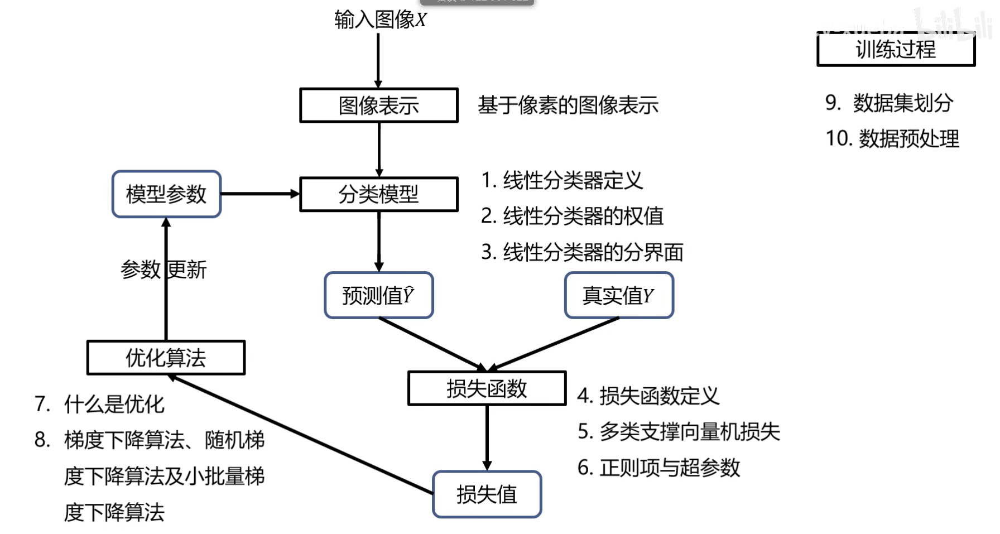

## 图像表示
### 图像类型：
1. 二进制图像，只有黑和白.内存中像素为0或1
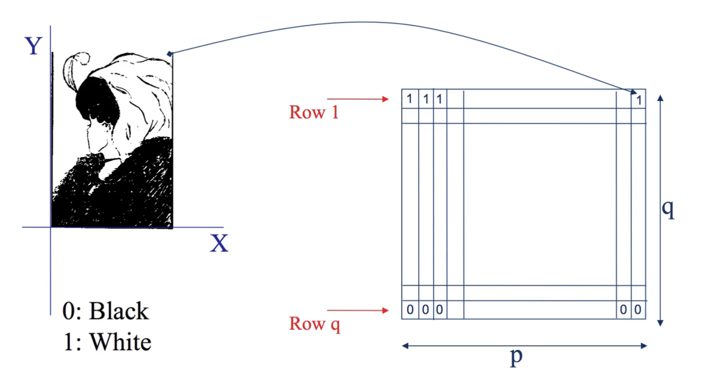
2. 灰度图像，像素取值范围为0~255.
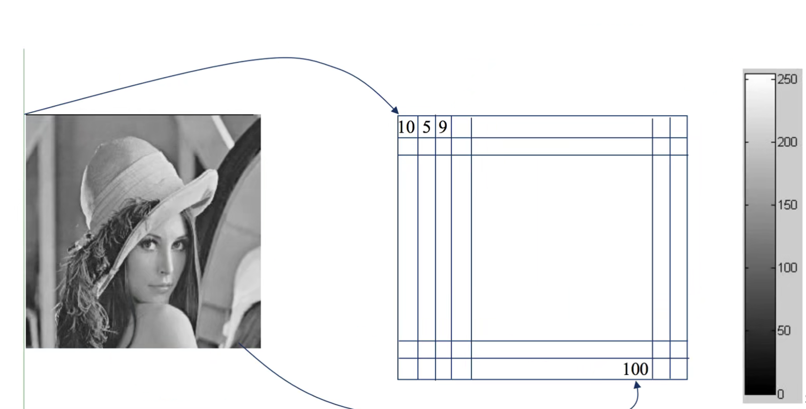
3. 彩色图像，每个点RGB 0~255
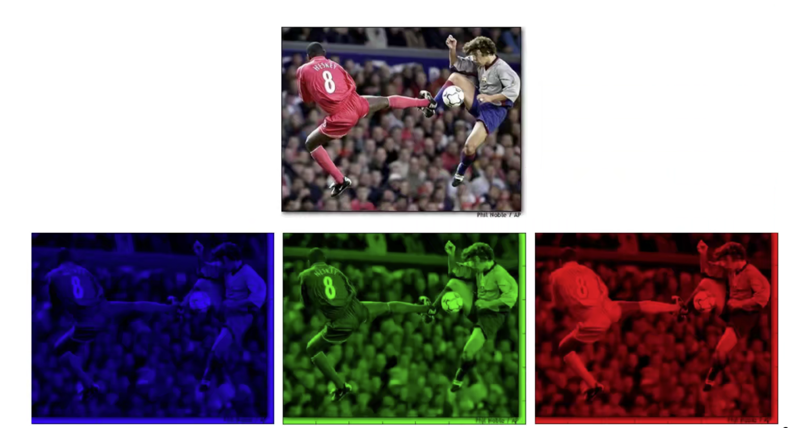

**大多数分类算法要求输入向量**

最简单的方法：将图像矩阵转成向量：
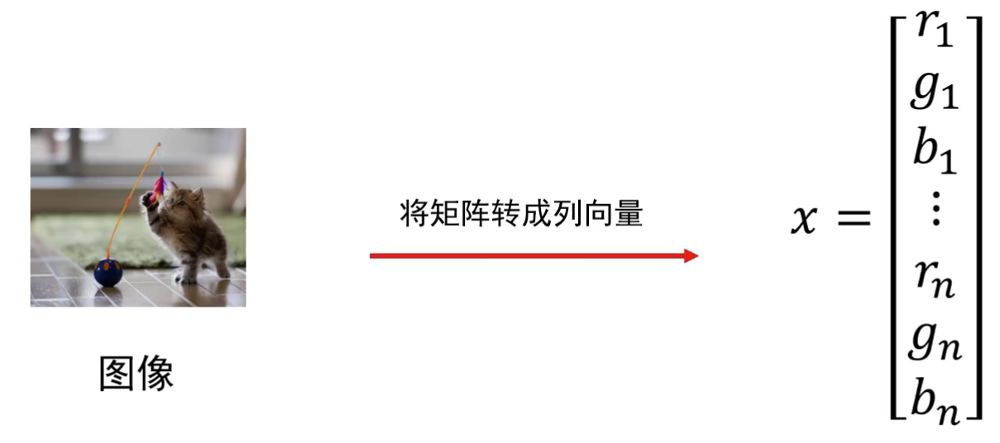

## 线性分类器

### 线性分类器定义

线性分类器是一种线性映射，将输入的图像特征映射为类别分数。

通过层级结构(神经网络)或者高维映射(支撑向量机)可以形成功能强大的非线性模型。 
线性分类器是神经网络基础，是支撑向量机的基础，支撑向量机就是一种线性分类器。小样本环境下**支撑向量机**是绝对的王者之一，在大样本环境下**神经网络**是绝对的王者之一。

**线性分类器是一种线性映射，将输入的图像特征映射为类别分数。** 
转换的过程是线性的，所以叫线性分类器。

x代表输入的d维图像向量，c为类别个数。(例如cifar10中d为32x32x3=3072，c为10) 

第i个类的线性分类器定义为： 
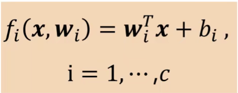

* **x**为输入的d维图像向量 
* **f**为线性分类器的分数，i取值为1到c。 
* **c**为类别个数 
* **wi**为第i个类别的权值向量，**bi**为偏置。wi的维数与x一致，为列向量，转置后为行向量。 

### 决策规则
如果某一个样本在某一个类别的打分比其他类别都要高，则认为当前图像属于该类别。
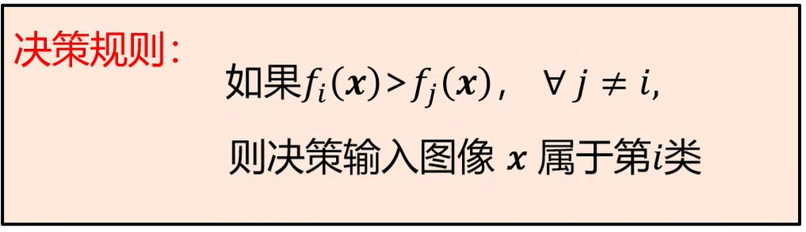
决策步骤：
1. 将图像表示成向量。
2. 计算当前图片每个类别的分数。
3. 按类别得分判定当前图像。

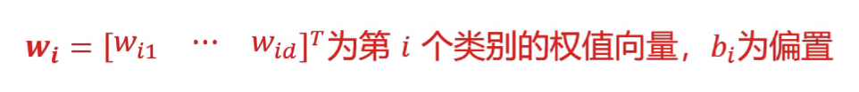

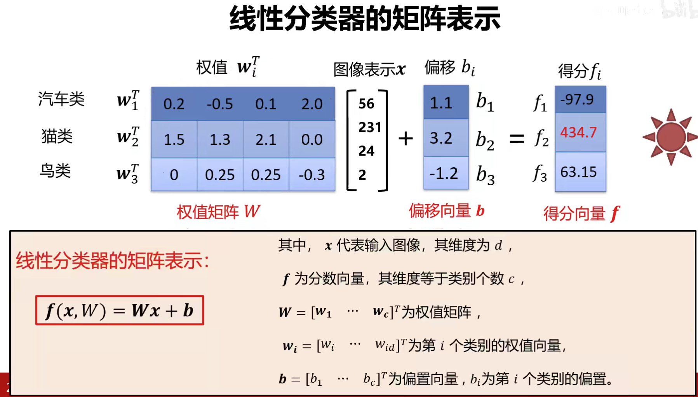

### 线性分类器的权值
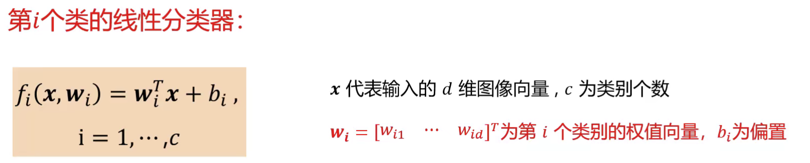 
可以按照将32x32的图像表示为向量的方式（并且将权值转化为0~255范围内），将W反向表示为32x32的图像。 
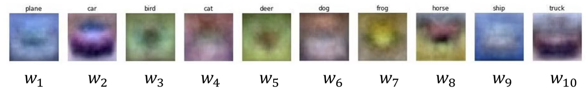

**权值可以看做一种模板**，模板记录了数据集中同一类别的统计信息。当x与w匹配值越大，点乘值越大。

### 线性分类器的分界面
从几何的角度理解权值，是一种分界面(高维的)。将样本空间分为几个区域，落在哪个区域就判定为哪一类。 
**分类问题的本质**：找一些分界面把图像分开，决策边界。 
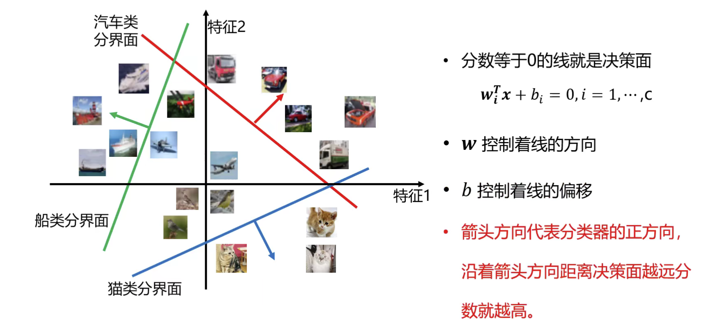

## 损失函数
### 损失函数定义

定量地反映模型性能。模型性能由模型参数决定。

考虑以下两组权值不一样的分类器： 
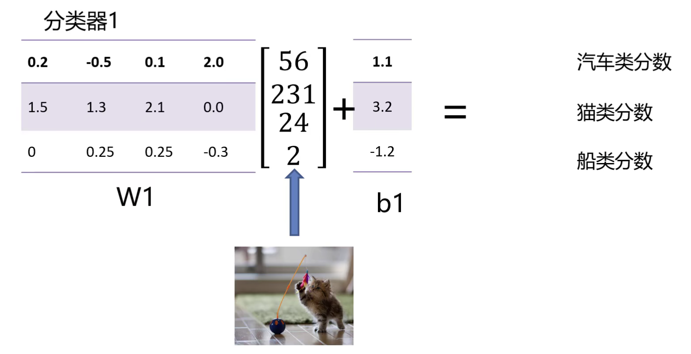
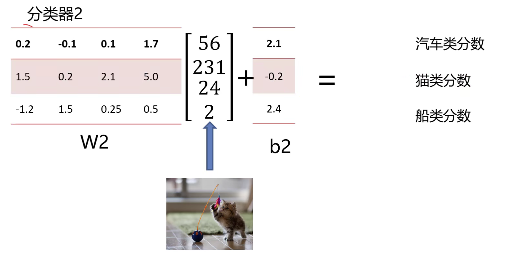
可以看出分类器1预测正确，分类器2预测错误，对于示例样本分类器1更好。

我们希望损失函数跟参数之间有一定的关联，参数和函数之间是对应的。

损失函数搭建了**模型性能**与**模型参数**之间的桥梁，指导模型参数优化。 
损失函数是一个函数，用于度量给定分类器的预测值与真实值的不一致程度，其输出通常是一**非负实数**。 
其输出的非负实值可以作为反馈信号来对分类器参数进行调整，以降低当前示例对应的损失值，提升分类器的分类效果。 

损失函数的一般定义： 
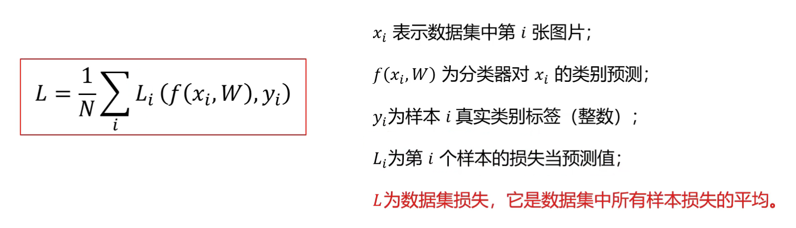

**使用所有样本的平均损失做损失函数，单个样本损失求和取平均。**
 
### 多类支撑向量机损失

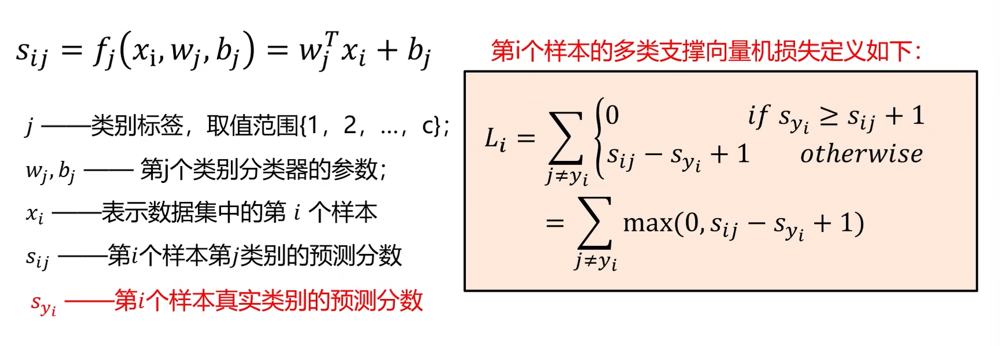

判断正确的类别的得分比其他类别得分高于1分(边界)，则没有损失。否则有损失 

常被称为折页损失hingeloss，折页损失，合页损失。 
Syi在Sij+1右侧损失为0，Sij+1左侧损失为Sij+1-syi 
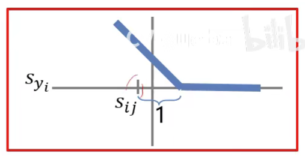 

:::tip

* 当w和b均为0时，损失L的值应为类别个数减一。

* 若考虑所有类别，包含正确类别j=yi，会时损失函数加一。不会有什么影响，但是一般不用。

* 如果求和时不取平均，总损失会放大N倍。大家都放大N倍，不影响。

* 若损失函数换成平均，损失会函数会放大，大的更大，小的更小。会改变分类器性能。
:::

### 正则项与超参数
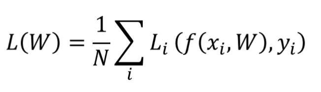
假设存在一W使损失函数L=0，这个W是唯一的吗？ 
**不唯一**。 
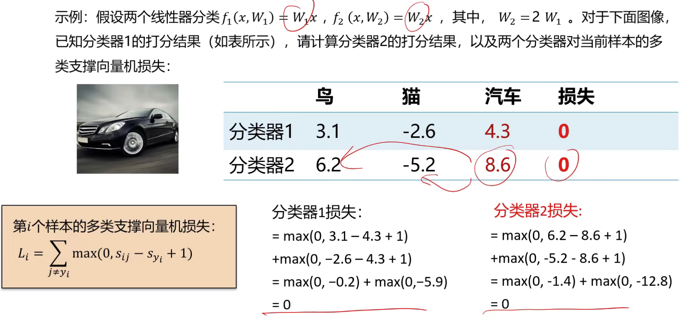
W2=2W1，分类器又没有偏置b，所以第二个分类器的打分是第一个分类器打分的2倍，两个分类器的损失都是0。在这种情况下如何选择W，就需要引入正则项来判断。

**在损失函数后加入一个与W有关的项。**
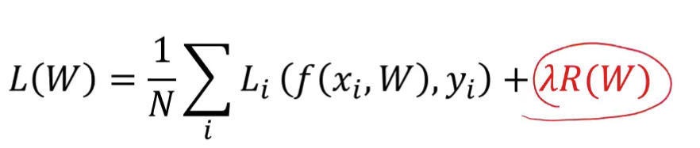
第一项叫做**数据损失**，模型预测需要和训练集相匹配。 
第二项叫做**正则损失**，防止模型在训练集上学习得太好。

R(W)是一个仅与权值有关，跟图像数据无关的函数。 
λ是一个超参数，控制着正则损失在总损失中所占的比重。

**超参数**：超参数是在开始学习过程之前设置的参数，而不是学习得到；一般都对模型性能由重要影响。W是要学习到的。 
神经网络中的超参数：神经元个数，层数。 
λ=0，优化结果仅与数据损失相关；λ=∞，优化结果与数据损失无关，仅考虑权重损失，此时系统最优解为W=0。

**L2正则项：** 
L2正则损失对大数值权值进行惩罚，喜欢分散权值，鼓励分类器将所有维度的特征都用起来，而不是强烈依赖其中少数几维特征。 
**正则项让模型有了一定的偏好。** 
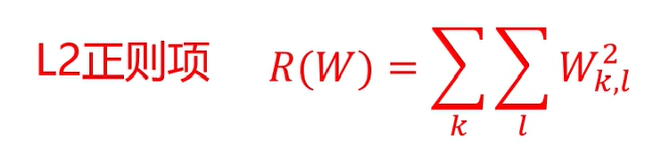

常用的正则项损失：
* L1正则项
* L2正则项
* 弹性网络正则项
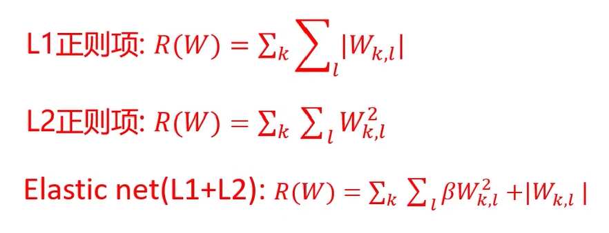

正则项作用：
* 使解唯一
* 对抗过拟合

## 优化算法

**参数优化**是机器学习的核心步骤之一，利用损失函数的输出值作为反馈信号来调整分类器参数，以提升分类器对训练样本的预测性能。

提升的是对**训练样本**的预测性能，因为损失函数是训练样本上的。

损失函数与参数W有关，优化的目标是找到使损失函数L达到最优的那组参数W。 
最直接的方法：找到L对W的偏导为0的W。若L为一凸函数，则该导数为零的点为全局最优点。 
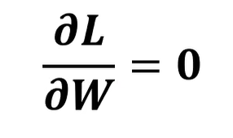

通常L形式比较复杂，很难从该等式直接解出W。

### 梯度下降法
目标：求使L最小的W。 
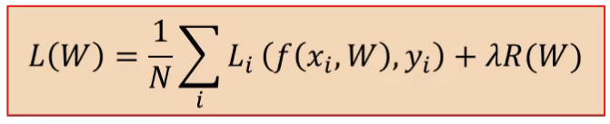
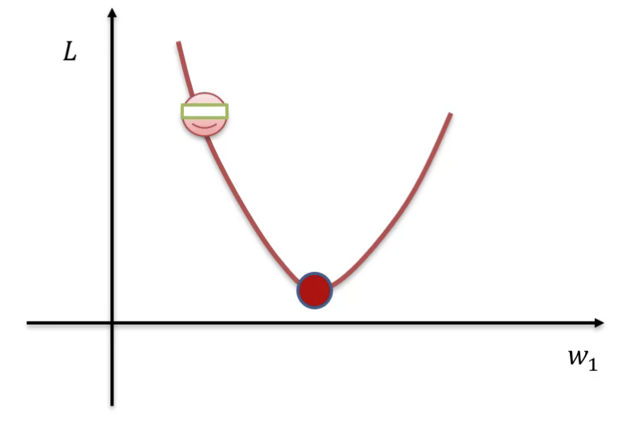
沿着**负梯度**方向，按照一定的步长(**学习率**)一步一步走到最小值，因为局部的信息是已知的。

:::danger
最难调整的参数就是学习率。
:::

利用损失函数，算出起始位置的梯度值，得到梯度方向，乘以学习率，沿着初始值走该步长。直到两次权值没有什么差异，就完成了分类器的学习。
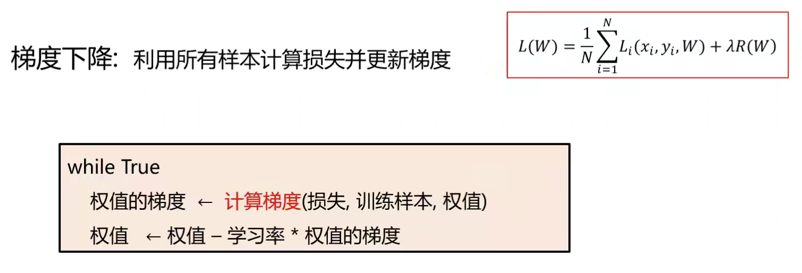

梯度如何计算？ 

1. 数值法：
一维变量函数求导。计算量大，不精确。 
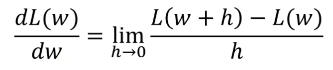
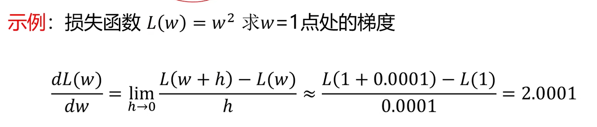
缺点：每次所有样本都要算一次，当N很大时，权值的梯度计算量很大，效率低下。

2. 解析法：
牛顿，莱布尼茨。写出导数函数。精确，速度快，导数函数易错。 
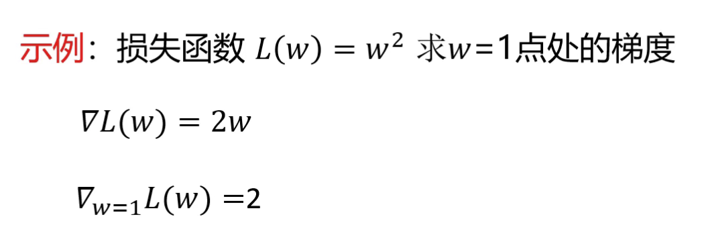
缺点：导数函数递推比较麻烦。

:::tip
**一般使用解析法，用数值法验证解析梯度的正确性。**
:::

### 随机梯度下降法
每次随机选择一个样本xi计算损失并更新梯度。

单个样本训练可能带来很多噪声，不是每次迭代都向着整体最优化方向，但是总体而言是向着优化方向走的。

### 小批量梯度下降算法
每次随机选择m(批量大小)个样本，计算损失并更新梯度。m为超参数。

通常取2的幂数作为批量大小，例如每次取32或64或128个样本。

iteration：表示1次迭代，每次迭代更新1次网络结构的参数。每选择一次m个样本就算迭代一次。 
batch-size：1次迭代所使用的样本量。 
epoch：1个epoch表示训练过了1遍训练集中的所有样本。 

## 训练过程

### 数据集划分
使用数据集主要做两件事：训练分类器，以及用于近似评估分类器性能。

一般将数据集划分为训练集和测试集。用训练集寻找最优的分类器，用测试集评测模型的泛化能力。但是很多任务模型存在超参数，不能简单划分。

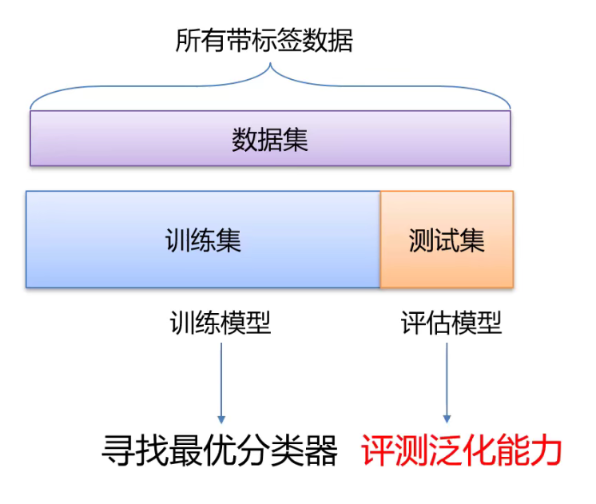

问题：如果模型存在超参数(例如正则化强度)，如何找到泛化能力最好的超参数？ 

一种简单的方法如：训练集调超参数，测试机选超参数。例如λ=0.1，λ=0.2等等分别训练出模型，再在测试集上选择。这样**不可行**。因为在选择λ时已经使用了测试集上的信息，因为这也是确定模型的过程。这个模型的精度不是模型真正泛化能力的度量，因为真正度量泛化能力是在给出模型前没有见过数据。

在真正的训练过程中会将训练集划成三份： 
* **训练集**用于给定的超参数时分类器参数的学习
* **验证集**用于选择超参数
* **测试集**用于评估泛化能力
测试集在模型给出之前当作不可见。不同的λ在训练集训练，训练出的模型在验证集比较，选择之后再测试集测试。**测试前的模型没有见过测试集数据，这才是合理的。**

#### K折交叉验证
问题：如果数据很少，验证集包含的样本很少，从而无法在统计上代表数据。 
这个问题很容易发现：如果在划分数据前进行不同的随机打乱，最终得到的模型性能差别很大，就存在这个问题。 

**K折交叉验证：** 
把数据分成k份，依次切换验证集，分别训练得到相同λ的不同模型。将不同模型得到的平均分当作该λ模型的分数。k：分的个数。真实的实验中一般用五折或十折交叉验证。 
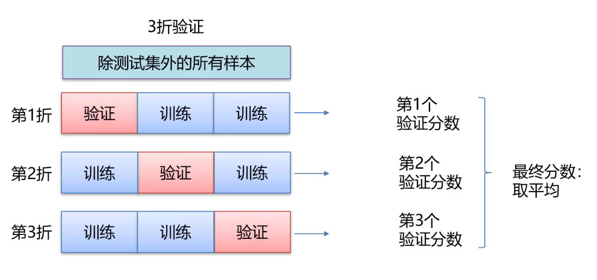

**带打乱数据的重复K折交叉验证：** 
每次分K折时打乱数据。打乱数据，取一次；打乱数据，取一次。。。。。。
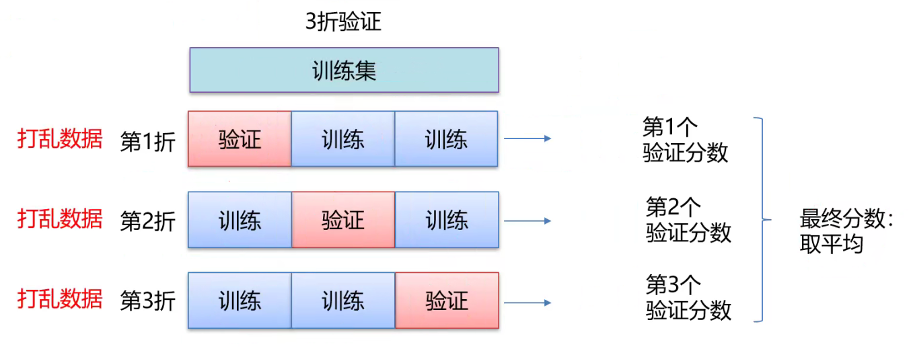

### 数据集预处理

#### 去均值和归一化
一般不直接使用原始数据；会对数据去均值；数据的绝对值一般没有意义，一般看相对值，例如考试成绩的分数和排名； 
在去均值后，还会使数据在各个方向上的方差相同。比如某些时候不同方向上的尺度不同(例如一个方向单位为吨，数据差异可能不明显；另一个单位为毫米，数据差异可能会很明显)，需要将数据归一化到相同的尺度上比较。操作：每个维度上的数据减去均值再除以方差。去除量纲和数值范围的影响。
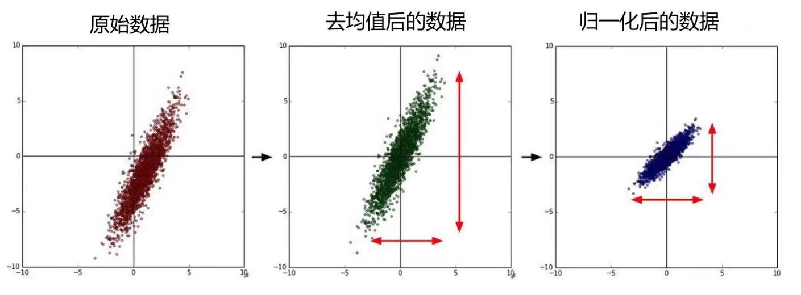

#### 去相关
例如原始数据中x方向增加，y方向也增加。但是很多时候数据的维度很高，我们希望x方向的增加与y方向增加没有关系，就可以分开考虑x和y。例如当某些情况下，x方向数据变化范围很大，y方向基本不变，所以就不需要考虑y这个维度的信息了，可以做到一定的降维效果。
**去相关一是为了让数据独立出来，二是为了达到一定的降维效果。** 
去相关后再做白化操作，相关的基础上再做归一化。 
去相关和白化通常应用在SVM以及一些其他传统机器学习方法中，神经网络中一般不常用，更多用的去均值和归一化。
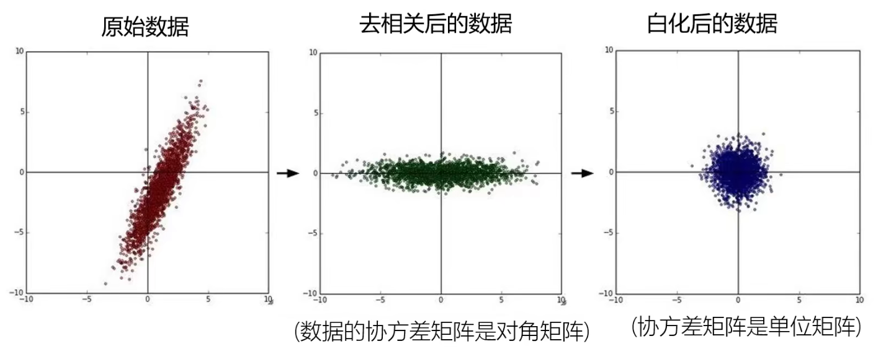

## 一些资料

斯坦福线性分类器的一个例子 
http://vision.stanford.edu/teaching/cs231n-demos/linear-classify/