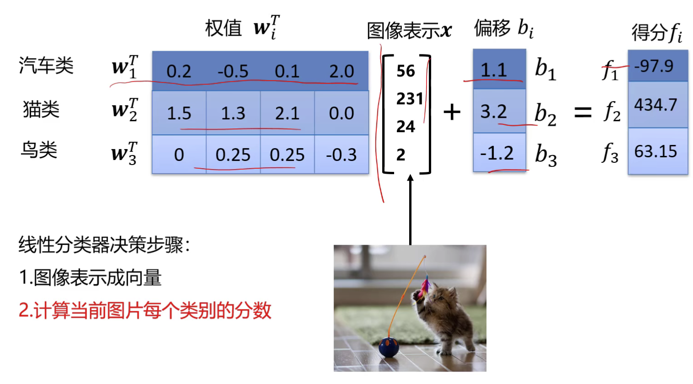

# 线性分类器

## 数据集介绍
CIFAR 10 
包含50000张训练样本，10000张测试样本，分为飞机、汽车、鸟、猫等十个类，均为彩色图像，大小为32*32。

## 分类器设计

## 图像表示
### 图像类型：
1. 二进制图像，只有黑和白.内存中像素为0或1

2. 灰度图像，像素取值范围为0~255.

3. 彩色图像，每个点RGB 0~255

**大多数分类算法要求输入向量**

最简单的方法：将图像矩阵转成向量：

## 线性分类器

### 线性分类器定义

线性分类器是一种线性映射，将输入的图像特征映射为类别分数。

形式简单，易于理解； 
通过层级结构(神经网络)或者高维映射(支撑向量机)可以形成功能强大的非线性模型。 

x代表输入的d维图像向量，c为类别个数。(例如cifar10中d为32x32x3=3072) 

第i个类的线性分类器定义为： 
 
f为线性分类器的分数，i取值为1到c。 
wi为列向量，维数与d相同。 

每一个类别都有自己的w和b。

每一个输入x，经过w和b的线性变换得到其分数。

决策规则：如果图像在某一类别的打分在其他类别的打分都要高，则认为其属于该类 
 
 

### 线性分类器的权值
 
可以按照将32x32的图像表示为向量的方式（并且将权值转化为0~255范围内），将W反向表示为32x32的图像。 

**权值可以看做一种模板**，模板记录了该类别的统计信息，当x与w匹配值越大，点乘值越大。

### 线性分类器的分界面
从几何的角度理解权值，是一种分界面(高维的)。将样本空间分为几个区域，落在哪个区域就判定为哪一类。 
分类问题的本质：找一些分界面把图像分开。 

## 损失函数
### 损失函数定义

定量地反映模型性能。模型性能由模型参数决定。

考虑以下两组权值不一样的分类器： 

损失函数搭建了模型性能与模型参数之间的桥梁，指导模型参数优化。 
损失函数是一个函数，用于度量给定分类器的预测值与真实值的不一致程度，其输出通常是一**非负实数**。 
其输出的非负实值可以作为反馈信号来对分类器参数进行调整，以降低当前示例对应的损失值，提升分类器的分类效果。 

损失函数的一般定义： 

### 多分类支撑向量机损失
Sij为第i个样本在第j个类别下的得分。 

判断正确的类别的得分比其他类别得分高于1(边界)分，则没有损失。否则有损失 

 
max(0,·)常被称为折页损失hingeloss 
 

### 正则项与超参数

假设存在一W使损失函数L=0，这个W是唯一的吗？ 
不唯一。 

既然W不唯一，如何选择W？引入**正则项**。

在损失函数后加入一个与W有关的项。 
第一项叫做**数据损失**，模型预测需要和训练集相匹配。 
第二项叫做**正则损失**，防止模型在训练集上学习得太好。 
R(W)是一个仅与权值有关，跟图像数据无关的函数。 
λ是一个超参数，控制着正则损失在总损失中所占的比重。 

**超参数**：超参数是在开始学习过程之前设置的参数，而不是学习得到；一般都对模型性能由重要影响。W是要学习到的。 
神经网络中的超参数：神经元个数，层数。 
λ=0，优化结果仅与数据损失相关；λ=∞，优化结果与数据损失无关，仅考虑权重损失，此时系统最优解为W=0。

**L2正则项：** 
L2正则损失对大数值权值进行惩罚，喜欢分散权值，鼓励分类器将所有维度的特征都用起来，而不是强烈依赖其中少数几维特征。 
**正则项让模型有了偏好。** 

常用的正则项损失：

## 优化算法

### 什么是优化算法
参数优化是机器学习的核心步骤之一，利用损失函数的输出值作为反馈信号来调整分类器参数，以提升分类器对训练样本的预测性能。

损失函数与参数W有关，优化的目标是找到是损失函数L打到最有的那组参数W。 

通常L形式比较复杂，很难从该等式直接解出W。

### 梯度下降法
目标：求使L最小的W。 

沿着**负梯度**方向，按照一定的**步长(学习率)**一步一步走到最小值。

利用损失函数，算出起始位置的梯度值，得到梯度方向，乘以学习率，沿着初始值走该步长。直到两次权值没有什么差异，就完成了分类器的学习。

梯度如何计算？ 

1. 数值法：
一维变量函数求导。计算量大，不精确。

2. 解析法：
牛顿，莱布尼茨。写出导数函数。精确，速度快，导数函数易错。

一般使用解析法，用数值发验证解析梯度的正确性。

问题：每次所有样本都要算一次，当N很大时，权值的梯度计算量很大，效率低下。

### 随机梯度下降法
每次随机选择一个样本xi计算损失并更新梯度。

单个样本训练可能带来很多噪声，不是每次迭代都向着整体最优化方向，但是总体而言是向着优化方向走的。

### 小批量梯度下降算法
每次随机选择m(批量大小)个样本，计算损失并更新梯度。m为超参数。

通常取2的幂数作为批量大小，例如每次取32或64或128个样本。

iteration：表示1次迭代，每次迭代更新1次网络结构的参数 
batch-size：1次迭代所使用的样本量 
epoch：1个epoch表示过了1遍训练集中的所有样本 

## 训练过程
### 数据集划分
使用数据集主要做两件事：训练分类器，以及用于近似评估分类器性能。

一般将数据集划分为训练集和测试集。

问题：如果模型存在超参数(例如正则化强度)，如何找到泛化能力最好的超参数？ 
使用验证集。

在真正的训练过程中会将训练集划成三份： 
训练集用于给定的超参数时分类器参数的学习 
验证集用于选择超参数 
测试集用于评估泛化能力

### K折交叉验证
如果数据很少，验证集包含的样本很少，从而无法在统计上代表数据。 
如果在划分数据前进行不同的随机打乱，最终得到的模型性能差别很大，就存在这个问题。 

**K折交叉验证：** 
选定一个λ在三份样本上分别训练，再将得到的三个分数的平均分作为该λ的分数。

**带打乱数据的重复K折交叉验证：** 

### 数据集预处理
一般不直接使用原始数据；会对数据去均值(归到中心附近)；归一化(使两个方向的方差一样)

去相关，x方向增加与y方向无关；白化。
