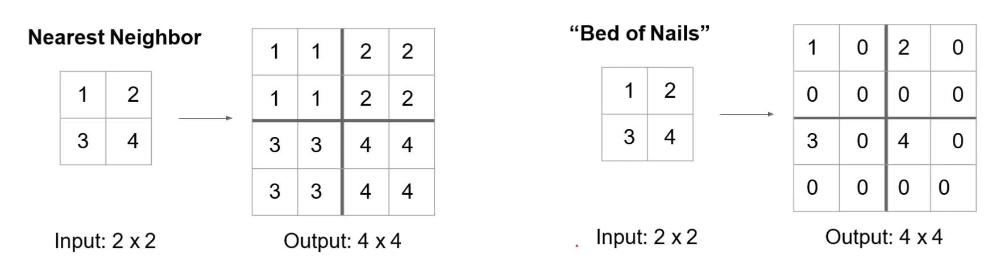

# 图像分割

语义分割：给每个像素分配类别标签不区分实例，只考虑像素类别。

## 全卷积网络
整个网络只包含卷积层，一次性输出所有像素的类别预测

输入图像，每层加padding，输入输出尺寸相同，C:类别个数。 
弊端：算不过来，占用显存过多。

解决方案：让整个网络之包含卷积层，并在网络中嵌入下采样与上采样过程。下采样后学到高级语义特征，再上采样学到语义特征与像素的映射

下采样pooling，strided convolution，上采样可以使用 
最简单的是近邻法，第二种是直接填0。用的比较少，因为人为的添加了一些信息。第二种方法中往回填的位置可能不正确。

index操作。下采样取到信息并计算后，上采样时将数据填回到原来的位置。在代码中是写死的

常用的从小特征图到大特征图的方法：转置卷积。不是写死的，从小特征图到大特征图转换的过程是可以学习的。 
红色区域得到红色像素，蓝色区域得到蓝色像素，在这种情况下两个区域有两个像素是重叠的。

转置卷积，两个点来自两个地方。红色像素会给红色区域一个至，蓝色像素会给蓝色区域一个值，重叠区域的值需要求和。求和时需要注意，以什么样的权值进行累加，需要由神经网络学习。

例子：
输入两个特征值，中间是滤波核，需要将输入分配到上采样的特征中。通过学习xyz将输入变成输出。

x为一维卷积模板，a为一四维向量，padding补零。两个矩阵的乘积就完成了卷积操作。

将卷积模板转置之后就可以将其变为六维

以上为步长为1的卷积，下面是步长为2的卷积

使用某一卷积核下采样，再用该卷积核的转置做上采样。

# 目标检测

## 目标检测：单目标(分类+定位)
在分类的同时定位，1000维的输出分类，4维输出定位

相当于一个多任务网络，使用总损失训练网络。

还可以检测关键点位置，例如额头、手等。（姿态估计）

## 多目标检测
问题：不知道有多少个目标，无法设计网络。

使用滑动窗口方案。问题是不知道目标的位置和大小

区域建议：找出所有潜在可能包含目标的区域；运行速度相对较快