# Asp.net core 项目开发

适用于 .net 6.0 2022/7/25

## 项目创建

在visual studio中创建**ASP.NET Core Web API**项目。

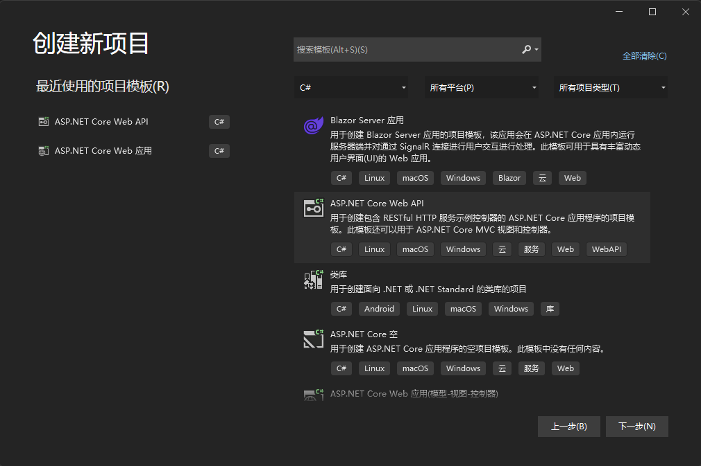

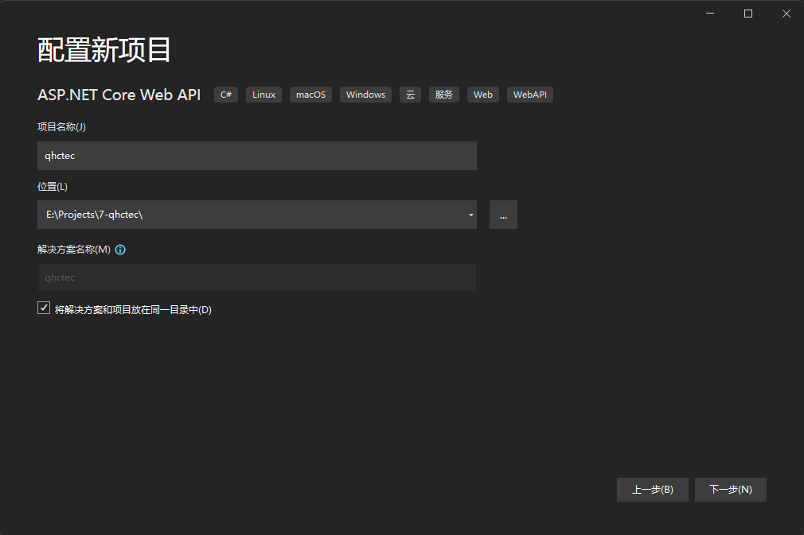

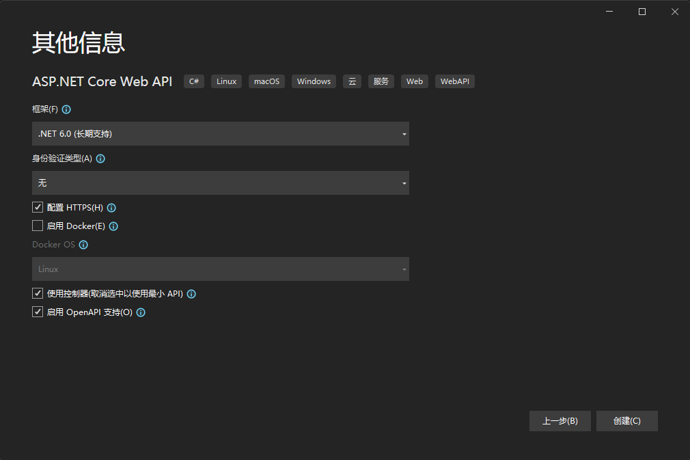

程序入口为Program.cs，其中的代码是对项目服务等的配置。
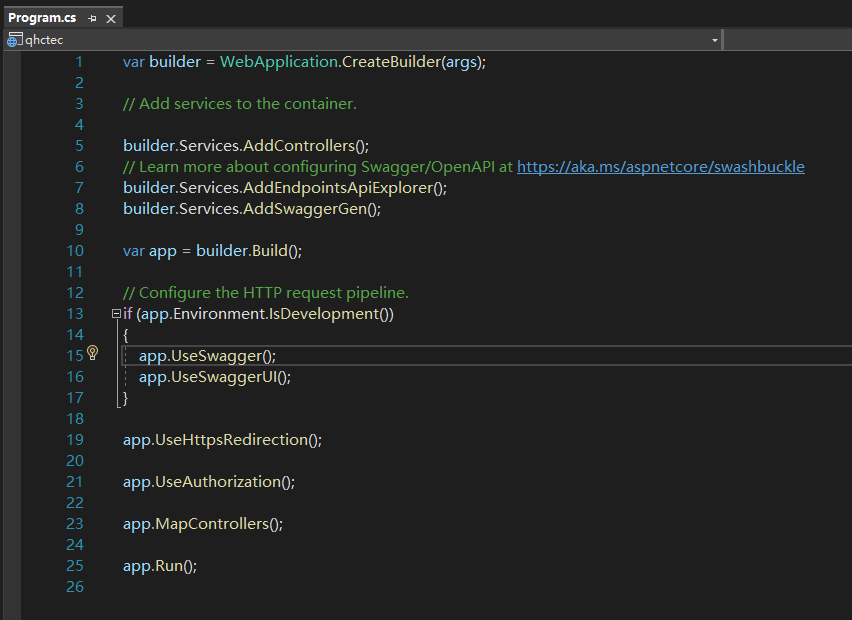

项目中默认包含一个WeatherForecast的类及其控制器。
<div align=center>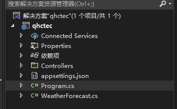</div>

## 跨域配置

在Program.cs中添加如下代码

```csharp
builder.Services.AddCors(options =>
{
    options.AddPolicy(
            name: "Cors",
            build =>
            {
                build.WithOrigins("*", "*", "*")
                .AllowAnyOrigin()
                .AllowAnyHeader()
                .AllowAnyMethod();
            }
        );
});

app.UseCors("Cors");
```

## Token认证

参考博客地址：<https://blog.csdn.net/weixin_44442366/article/details/124017306>

项目中使用jwt bearer token来标识前端用户身份，以及权限设置

所需要的nuget包：Microsoft.AspNetCore.Authentication.JwtBearer

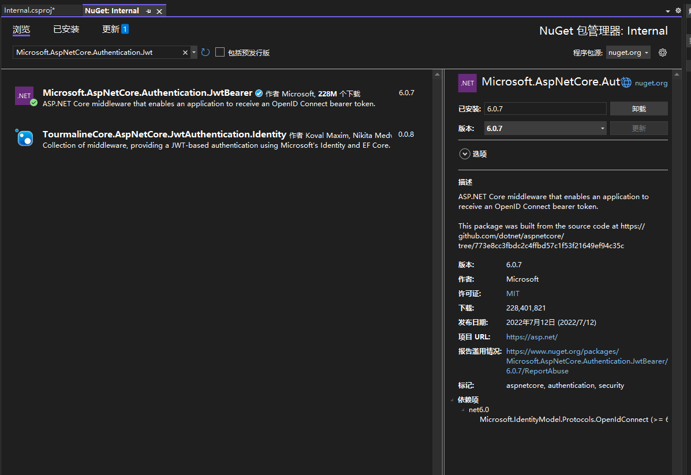

在appsettings.json中添加Jwt需要的认证，包括认证密钥、发布者、接收者等

```json
"Authentication": {
    "key": "",              // 满足一定长度要求的字符串，长度不够会报错
    "issuer": "S.Pt.V.",    //发布者
    "audience": "audience"  //接收者
}
```

Jwt的三部分：</br>
&ensp;&ensp;&ensp;&ensp;标头：</br>
&ensp;&ensp;&ensp;&ensp;&ensp;&ensp;&ensp;&ensp;包含令牌的类型和使用的签名算法
&ensp;&ensp;&ensp;&ensp;有效载荷：</br>
&ensp;&ensp;&ensp;&ensp;&ensp;&ensp;&ensp;&ensp;存放用户信息，如用户id，权限等，但不存放敏感信息，如密码等（可以被破解）
&ensp;&ensp;&ensp;&ensp;签名：</br>
&ensp;&ensp;&ensp;&ensp;&ensp;&ensp;&ensp;&ensp;使用编码后的header和payload

Jwt在登录成功后生成：

```csharp
private readonly IConfiguration _configuration;
public AccountController(IConfiguration configuration)
{
    _configuration = configuration;
}

[HttpPost]
public ActionResult Login()
{
    //登录认证策略省略
    // Header的签名算法
    var signingAlgorithm = SecurityAlgorithms.HmacSha256;
    // payload存放用户信息, "user_id"处为存放的用户信息
    var claim = new[]
    {
        new Claim(JwtRegisteredClaimNames.Sub, "user_id")
    };
    // Signature
    // 取出私钥的UTF8二进制编码
    var key_byte = Encoding.UTF8.GetBytes(_configuration["Authentication:key"]);
    // 使用非对称算法加密
    var signingKey = new SymmetricSecurityKey(key_byte);
    // 使用HmacSha256验证加密后的私钥生成数字签名
    var signingCredentials = new SigningCredentials(signingKey, signingAlgorithm);
    // 生成Token
    var token = new JwtSecurityToken(
        issuer: _configuration["Authentication:issuer"],
        audience: _configuration["Authentication:audience"],
        claims: claim,
        notBefore: DateTime.UtcNow,
        expires: DateTime.UtcNow.AddDays(1),
        signingCredentials
        );
    var Token = new JwtSecurityTokenHandler().WriteToken(token);
    return Ok(Token);
}
```

取出用户信息：

```csharp
// "user_id"为键名
var id = HttpContext.User.Claims.First(c => c.Type == "user_id");
```

在Program.cs注入Jwt认证服务

```csharp
builder.Services.AddAuthentication(JwtBearerDefaults.AuthenticationScheme)
    .AddJwtBearer(options =>
    {
        var secretKey = Encoding.UTF8.GetBytes(builder.Configuration["Authentication:key"]);
        options.TokenValidationParameters = new TokenValidationParameters()
        {
            ValidateIssuer = true,
            ValidIssuer = builder.Configuration["Authentication:issuer"],
            ValidateAudience = true,
            ValidAudience = builder.Configuration["Authentication:audience"],
            ValidateLifetime = true,
            IssuerSigningKey = new SymmetricSecurityKey(secretKey)
        };
    });
// 还需要配置这两个中间件
app.UseAuthentication();
app.UseAuthorization();
```

## 日志框架

使用Serilog记录应用运行过程中的日志。在项目中安装以下nuget包：</br>
Serilog</br>
Serilog.AspNetCore</br>
Serilog.Extensions.Logging</br>
Serilog.Settiings.Configuration</br>
Serilog.Sinks.Async</br>
Serilog.Sinks.Console</br>
Serilog.Sinks.File</br>

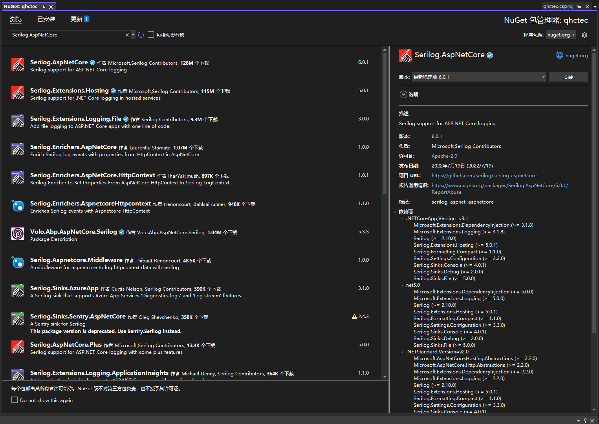

修改项目的appsettings.json

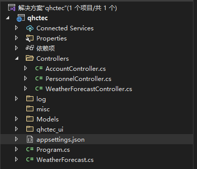

```json
{
  "Logging": {
    "LogLevel": {
      "Default": "Information",
      "Microsoft.AspNetCore": "Warning"
    }
  },
  "AllowedHosts": "*",
  //serilog  begin
  "Serilog": {
    "MinimumLevel": {
      "Default": "Debug", //最小日志记录级别
      "Override": { //系统日志最小记录级别
        "Default": "Warning",
        "System": "Warning",
        "Microsoft": "Warning"
      }
    },
    "WriteTo": [
      { "Name": "Console" }, //输出到控制台
      {
        "Name": "Async", //Serilog.Sinks.Async
        "Args": {
          "configure": [
            {
              "Name": "File", //输出文件
              "Args": {
                "path": "log/log.txt",
                "outputTemplate": "{NewLine}Date:{Timestamp:yyyy-MM-dd HH:mm:ss.fff} Exception:{Exception}{NewLine}[{Level}]: {Message}",
                "rollingInterval": "3" //按天记录
              }
            }
          ]
        }
      }
    ]
  }
  //serilog  end
}
```

在Program.cs中添加如下代码，注册Serilog服务

```csharp
using Serilog;

#region Serilog
builder.Host.UseSerilog((context, logger) =>
{
    logger.ReadFrom.Configuration(context.Configuration);
    logger.Enrich.FromLogContext();
});
#endregion
```

在控制器中注册Serilog

```csharp
// ContrrlloerName是当前的控制器名称
private readonly ILogger<ControllerName> _logger;
public ControllerName(ILogger<ControllerName> logger)
{
    _logger = logger;
}
```

## 连接数据库

### Mysql

连接Mysql数据库需要安装 **Pomelo.EntityFrameworkCore.MySql** 和 **Microsoft.EntityFrameworkCore.Tools** 程序包，在解决方案右键**管理NuGet程序包**，选择第一个，为所选的项目安装。

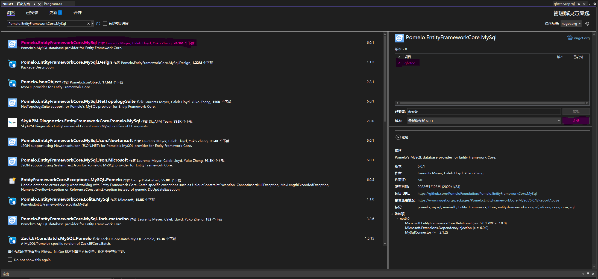
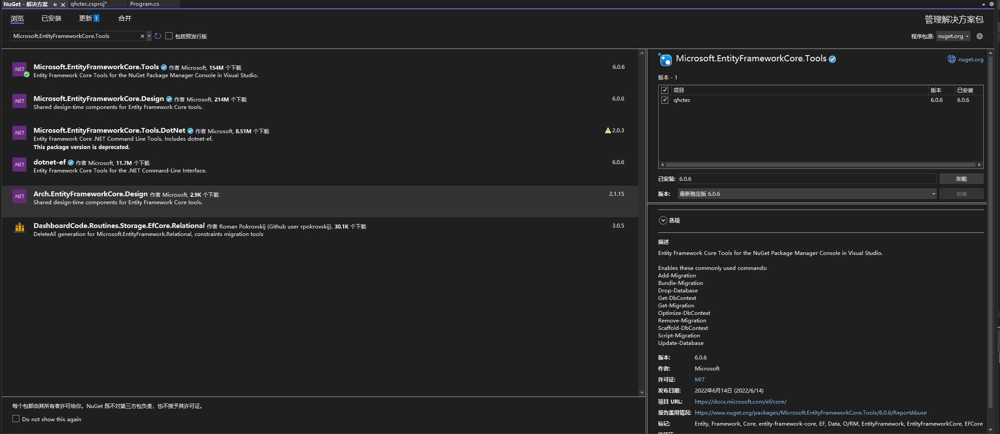

之后打开程序包管理器控制台
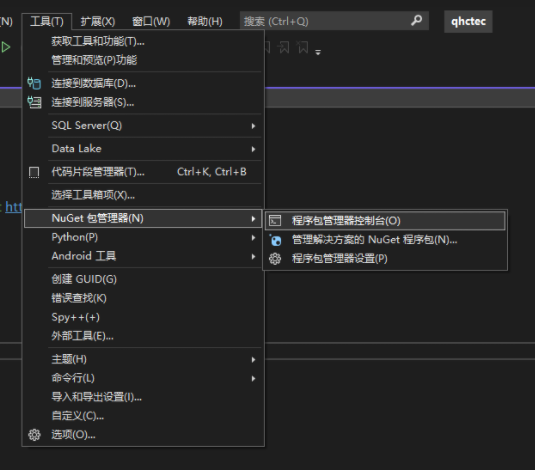

:::danger
需要在执行前创建Models文件夹，否则会报错
:::

在其中输入以下命令连接数据库，并按照数据库的表进行反向工程建立模型

```sh
Scaffold-DbContext "server=[服务器地址];userid=[用户名];pwd=[用户密码];port=[数据库端口(3306)];database=[数据库名];sslmode=none;" Pomelo.EntityFrameworkCore.MySql -OutputDir Models -Force

Scaffold-DbContext "server=192.168.51.250;userid=qhctec;pwd=qhctec@2023;port=3306;database=qhctec;sslmode=none;" Pomelo.EntityFrameworkCore.MySql -OutputDir Models -Force
```

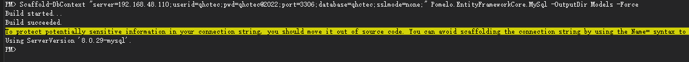

执行后生成的项目结构：<br />
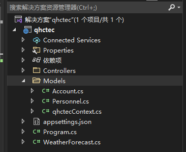

Account.cs、Personnel.cs、qhctecContext.cs均为生成的文件

Account.cs为根据数据库qhctec中account表生成的类

```csharp
using System;
using System.Collections.Generic;

namespace qhctec.Models
{
    public partial class Account
    {
        public int Id { get; set; }
        public Guid Uid { get; set; }
        public Guid Useruid { get; set; }
        public string Account1 { get; set; } = null!;
        public string Password { get; set; } = null!;
        public string Role { get; set; } = null!;
        public ulong Enabled { get; set; }
        public string Createdate { get; set; } = null!;
        public string Lastlogin { get; set; } = null!;
    }
}

```

Personnel.cs为根据数据库qhctec中personnel表生成的类

```csharp
using System;
using System.Collections.Generic;

namespace qhctec.Models
{
    public partial class Personnel
    {
        public int Id { get; set; }
        public Guid Uid { get; set; }
        public string Name { get; set; } = null!;
        public string? Telephone { get; set; }
        public string? Address { get; set; }
    }
}

```

qhctecContext.cs为数据库上下文

```csharp
using System;
using System.Collections.Generic;
using Microsoft.EntityFrameworkCore;
using Microsoft.EntityFrameworkCore.Metadata;

namespace qhctec.Models
{
    public partial class qhctecContext : DbContext
    {
        public qhctecContext()
        {
        }

        public qhctecContext(DbContextOptions<qhctecContext> options)
            : base(options)
        {
        }

        public virtual DbSet<Account> Accounts { get; set; } = null!;
        public virtual DbSet<Personnel> Personnel { get; set; } = null!;

        protected override void OnConfiguring(DbContextOptionsBuilder optionsBuilder)
        {
            if (!optionsBuilder.IsConfigured)
            {
#warning To protect potentially sensitive information in your connection string, you should move it out of source code. You can avoid scaffolding the connection string by using the Name= syntax to read it from configuration - see https://go.microsoft.com/fwlink/?linkid=2131148. For more guidance on storing connection strings, see http://go.microsoft.com/fwlink/?LinkId=723263.
                optionsBuilder.UseMySql("server=192.168.48.110;userid=qhctec;pwd=qhctec@2022;port=3306;database=qhctec;sslmode=none", Microsoft.EntityFrameworkCore.ServerVersion.Parse("8.0.29-mysql"));
            }
        }

        protected override void OnModelCreating(ModelBuilder modelBuilder)
        {
            modelBuilder.UseCollation("utf8mb4_0900_ai_ci")
                .HasCharSet("utf8mb4");

            modelBuilder.Entity<Account>(entity =>
            {
                entity.ToTable("account");

                entity.Property(e => e.Id).HasColumnName("id");

                entity.Property(e => e.Account1)
                    .HasMaxLength(45)
                    .HasColumnName("account");

                entity.Property(e => e.Createdate)
                    .HasMaxLength(45)
                    .HasColumnName("createdate");

                entity.Property(e => e.Enabled)
                    .HasColumnType("bit(1)")
                    .HasColumnName("enabled");

                entity.Property(e => e.Lastlogin)
                    .HasMaxLength(45)
                    .HasColumnName("lastlogin");

                entity.Property(e => e.Password)
                    .HasMaxLength(45)
                    .HasColumnName("password");

                entity.Property(e => e.Role)
                    .HasMaxLength(45)
                    .HasColumnName("role");

                entity.Property(e => e.Uid).HasColumnName("uid");

                entity.Property(e => e.Useruid).HasColumnName("useruid");
            });

            modelBuilder.Entity<Personnel>(entity =>
            {
                entity.ToTable("personnel");

                entity.Property(e => e.Id).HasColumnName("id");

                entity.Property(e => e.Address)
                    .HasMaxLength(45)
                    .HasColumnName("address");

                entity.Property(e => e.Name)
                    .HasMaxLength(45)
                    .HasColumnName("name");

                entity.Property(e => e.Telephone)
                    .HasMaxLength(45)
                    .HasColumnName("telephone");

                entity.Property(e => e.Uid).HasColumnName("uid");
            });

            OnModelCreatingPartial(modelBuilder);
        }

        partial void OnModelCreatingPartial(ModelBuilder modelBuilder);
    }
}

```

之后需要在Program.cs中注册数据库上下文：

```csharp
builder.Services.AddDbContext<qhctecContext>();
```

## 创建控制器

建立好各个类之后，需要为每个类创建一个控制器，在Controller文件夹中添加新建项选择API控制器。
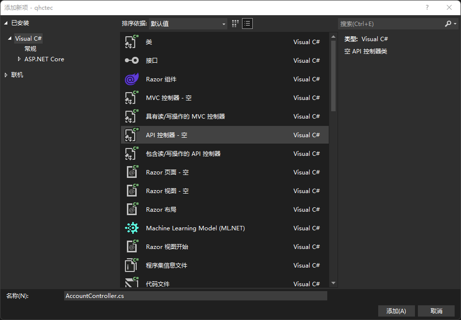

以PersonnelController为例展示web api的创建

PersonnelController.cs的原始代码为：

```csharp
using Microsoft.AspNetCore.Http;
using Microsoft.AspNetCore.Mvc;

namespace qhctec.Controllers
{
    [Route("api/[controller]")]
    [ApiController]
    public class PersonnelController : ControllerBase
    {
    }
}

```

修改如下，简单添加几个API

```csharp
using Microsoft.AspNetCore.Http;
using Microsoft.AspNetCore.Mvc;
using qhctec.Models;

namespace qhctec.Controllers
{
    [Route("api/[controller]/[action]")]
    [ApiController]
    public class PersonnelController : ControllerBase
    {
        private readonly qhctecContext _qhctecContext;

        public PersonnelController(qhctecContext qhctecContext)
        {
            _qhctecContext = qhctecContext;
        }
        /// <summary>
        /// 获取所有人员信息
        /// </summary>
        /// <returns></returns>
        [HttpGet]
        public ActionResult GetAll()
        {
            List<Personnel> personnels = _qhctecContext.Personnel.ToList();
            return Ok(personnels);
        }

        /// <summary>
        /// 添加人员信息
        /// </summary>
        /// <param name="input"></param>
        /// <returns></returns>
        [HttpPost]
        public ActionResult Add(Personnel input)
        {
            if (!ModelState.IsValid)
            {
                return BadRequest();
            }
            Personnel personnel = _qhctecContext.Personnel.Where(p => p.Uid == input.Uid).FirstOrDefault();
            if (personnel == null)
            {
                personnel = new Personnel
                {
                    Uid = input.Uid,
                    Name = input.Name,
                    Address = input.Address,
                    Telephone = input.Telephone
                };
                _qhctecContext.Personnel.Add(personnel);
                _qhctecContext.SaveChanges();
                return Ok();
            }
            else
            {
                return BadRequest("Personnel already exists.");
            }
        }

        /// <summary>
        /// 删除人员信息
        /// </summary>
        /// <param name="guid"></param>
        /// <returns></returns>
        [HttpPost]
        public ActionResult Delete(Guid guid)
        {
            if (!ModelState.IsValid)
            {
                return BadRequest();
            }
            Personnel personnel = _qhctecContext.Personnel.Where(_ => _.Uid == guid).FirstOrDefault();
            if(personnel == null)
            {
                return BadRequest("Personnel not found");
            }
            _qhctecContext.Personnel.Remove(personnel);
            _qhctecContext.SaveChanges(true);
            return Ok();
        }
        
        /// <summary>
        /// 查找人员信息
        /// </summary>
        /// <returns></returns>
        [HttpGet]
        public ActionResult Find()
        {
            return Ok();
        }

        /// <summary>
        /// 修改人员信息
        /// </summary>
        /// <returns></returns>
        [HttpPost]
        public ActionResult Edit(Personnel input)
        {
            if (!ModelState.IsValid)
            {
                return BadRequest(ModelState.IsValid);
            }
            Personnel personnel = _qhctecContext.Personnel.Where(p => p.Uid == input.Uid).FirstOrDefault();
            if(personnel == null)
            {
                return BadRequest("Personnel not found.");
            }
            personnel.Name = input.Name;
            personnel.Address = input.Address;
            personnel.Telephone = input.Telephone;
            _qhctecContext.SaveChanges();
            return Ok();
        }
    }
}

```

## Swagger页面

https://blog.csdn.net/qq_25086397/article/details/103742575?spm=1001.2101.3001.6650.1&utm_medium=distribute.pc_relevant.none-task-blog-2%7Edefault%7ECTRLIST%7ERate-1-103742575-blog-124109433.pc_relevant_default&depth_1-utm_source=distribute.pc_relevant.none-task-blog-2%7Edefault%7ECTRLIST%7ERate-1-103742575-blog-124109433.pc_relevant_default&utm_relevant_index=2

安装Swashbuckle.Asp.NetCore

在Program.cs中添加代码

```csharp
builder.Services.AddSwaggerGen(options =>
{
    options.SwaggerDoc("V1", new OpenApiInfo{
        Title = "API Demo",
        Version = "v1"
    });

    var xmlFile = $"{Assembly.GetExecutingAssembly().GetName()}.xml";
    var xmlPath = Path.Combine(AppContext.BaseDirectory, xmlFile);

    options.IncludeXmlComments(xmlPath, true);
    options.DocInclusionPredicate((string docName, ApiDescription description) => true);
    options.CustomSchemaIds((Type x) => x.FullName);
    options.ResolveConflictingActions((IENumberable<ApiDescription> p) => p.First());

    var securityScheme = new OpenApiSecurityScheme()
    {
        description = "Jwt认证，格式：Bearer <token>",
        Name = "Authorization",
        In = ParameterLocation.Header,
        Type = SecurityScheme.Http,
        Scheme = "bearer",
        BearerFormat = "JwT"
    };

    var securtiyRequirement = new OpenApiSecurityRequirement
    {
        {
            new OpenApiSecurityScheme
            {
                Reference = new OpenApiReference
                {
                    Type = ReferenceType.SecurityType.SecurityScheme,
                    Id = "bearerauth"
                }
            },
            new string[] {}
        }
    };

    options.AddSecurityDefinition("bearerauth", securityScheme);
    options.AddSecurityRequirement(securtiyRequirement);
})

app.UseSwagger();
app.UseSwaggerUI(option =>
{
    option.SwaggerEndpoint("/swagger/v1/swagger.json", "API Demo v1");
    option.DefaultModelsExpanDepth(-1);
});
```
