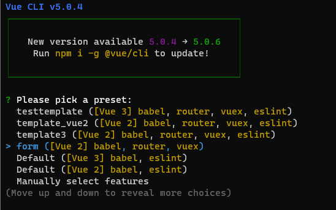
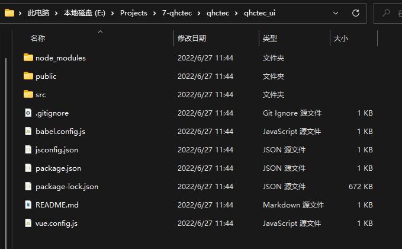
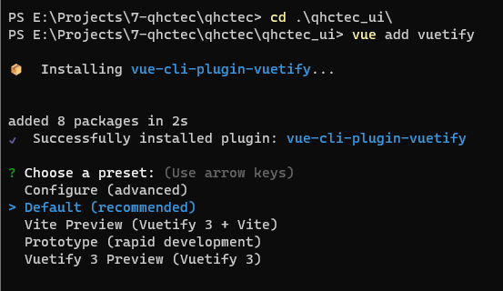
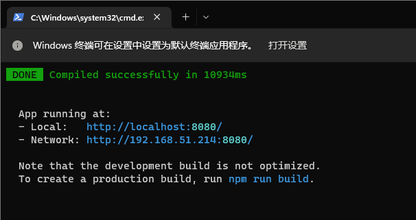
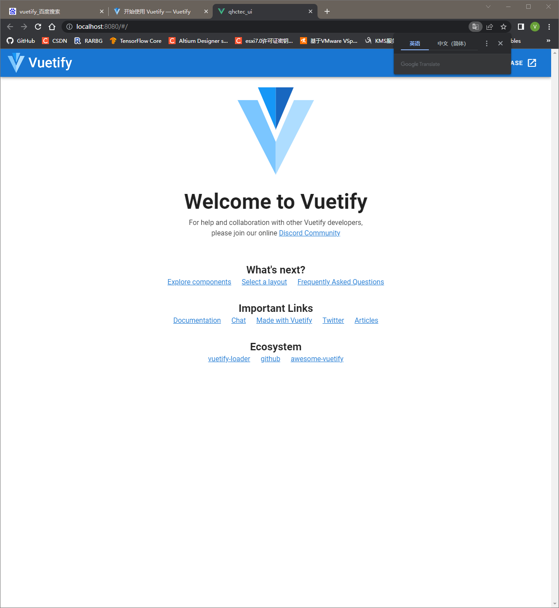
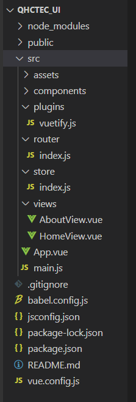

# 前端开发

## Vue项目创建
因为现在的开发基本是前端后端分离的模式，前端页面被当作静态资源放在后端项目中，所以喜欢把vue项目放在.net项目的文件夹里，在.net项目目录中执行命令
```sh
vue create [前端项目名称]

vue create qhctec_ui
```

创建时选择之前创建好的模板form，使用Vue2，因为Vue3添加vuetify会出问题


这一步操作会创建一个名为qhctec_ui的文件夹，该文件夹中的文件就是前端项目需要用到的文件。


## 向项目中添加vuetify
vuetify官网，按照其步骤安装即可：
https://vuetifyjs.com/zh-Hans/getting-started/installation/

在Vue项目文件夹中执行：
```sh
vue add vuetify
```

选择默认


执行npm run serve运行vue项目，在浏览器中可以访问到页面：
```sh
npm run serve
```



## 项目结构
项目文件结构大致如下：


node_modules中是安装的各种npm包

public文件夹中存放一些静态资源，图片等等

src文件夹存放源文件<br />
&ensp;assets中存放静态资源<br />
&ensp;components中存放一些写好的组件的vue文件，方便其他页面调用<br />
&ensp;plugins下为一些插件的配置文件，例如vuetify<br />
&ensp;router为页面路由的配置，后续会修改<br />
&ensp;store为存放一些变量的配置，包括函数方法等等<br />
&ensp;views中一般为页面的vue文件<br />
&ensp;App.vue是页面的文件<br />
&ensp;main.js,应该算是应用的配置<br />

其余文件是创建项目时所选项目的配置，例如babel，以及项目中安装的node modules的配置(package.json以及package-lock.json)

## 页面路由

vue项目的页面路由定义在/src/router/index.js下，显示在<router-view/>组件中

默认目录结构定义如下，路由结构在routes中。routes中的每一个对象为一个页面，其component属性指定了该页面使用的vue文件，若在其下还有子页面，则放在children属性中。

```js
import Vue from 'vue'
import VueRouter from 'vue-router'
import HomeView from '../views/HomeView.vue'

Vue.use(VueRouter)

const routes = [
  {
    path: '/',
    name: 'home',
    component: HomeView
  },
  {
    path: '/about',
    name: 'about',
    // route level code-splitting
    // this generates a separate chunk (about.[hash].js) for this route
    // which is lazy-loaded when the route is visited.
    component: () => import(/* webpackChunkName: "about" */ '../views/AboutView.vue')
  }
]

const router = new VueRouter({
  routes
})

export default router

```

之前写过的示例：

```js
import Vue from "vue";
import VueRouter from "vue-router";

Vue.use(VueRouter);
//重写push
const originalPush = VueRouter.prototype.push
VueRouter.prototype.push = function push(location) {
   return originalPush.call(this, location).catch(err => err)
}

//重写replace
const originalReplace = VueRouter.prototype.replace;
VueRouter.prototype.replace = function replace(location) {
    return originalReplace.call(this, location).catch(err => err);
};

const routes = [
  {
    path: "/",
    name: "redirect",
    redirect: "/login"
  },
  {
    path: "/login",
    name: "login",
    component: () => import("@/views/Account/Login.vue")
  },
  {
    path: "/home",
    name: "home",
    redirect: "/home/personalinfo",
    component: () => import("@/layout/PageLayout.vue"),
    children:[
      {
        path: "/home/coursesavailable",
        name: "coursesavailable",
        component: () => import("@/views/Courses/CoursesAvailable.vue")
      },
      {
        path:"/home/coursesselected",
        name:"coursesselected",
        component: () => import("@/views/Courses/CoursesSelected.vue")
      },
      {
        path:"/home/personalinfo",
        name:"personalinfo",
        component: () => import("@/views/Account/PersonalInfo.vue")
      },
      {
        path:"/home/sortbyclasses",
        name:"records_classes",
        component: () => import("@/views/Records/SortbyClasses.vue")
      },
      {
        path:"/home/sortbycourses",
        name:"records_courses",
        component: () => import("@/views/Records/SortbyCourses.vue")
      }
    ]
  }
];

const router = new VueRouter({
  mode:"hash",
  routes
});

export default router;


```

## 连接后端API
