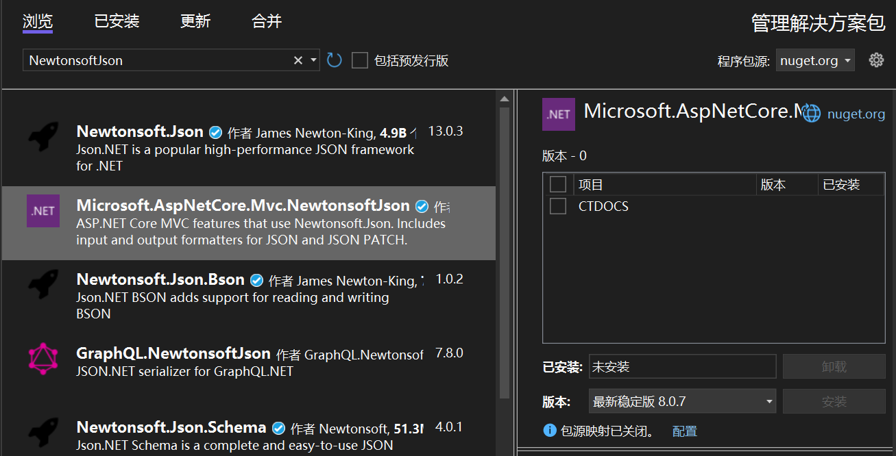

# Asp.net

## 模型验证

Asp.Net Core MVC通过使用数据注释验证属性修饰模型对象来支持验证。验证属性在值发布到服务器前在客户端上进行检查，并在调用控制器操作前在服务器上进行检查。

```csharp
using System。ComponectModel.DataAnnotations;

public class LoginViewModel
{
    [Required]
    [EmailAddress]
    public string Email { get; set; }

    [Required]
    [DateType(DataTyp.Password)]
    public string Password { get; set; }

    [Display(Name = "Remember me?")]
    public bool RememberMe { get; set; }
}
```

控制器操作：

```csharp
public async Task<IActionResult> Login(LoginViewModel model, string retrunUrl = null)
{
    if(ModelState.IsValid)
    {
        // work woth the model
    }
    // At this point, something failed, redisplayform
    return View(model);
}
```


## 绑定源参数推理

绑定源特性定义可以找到操作参数值的位置。存在以下绑定源特性：

|特性|绑定源|
|-|-|
|[FromBody]|请求正文|
|[FromForm]|请求正文中的表单数据|
|[FromQuery]|请求标头|
|[FromHeader]|请求查询字符串参数|
|[FromRoute]|当前请求中的路由数据|
|[FromServices]|作为操作参数插入的请求服务|
|[AsParameters]|方法参数|

[ApiController]属性将推理规则应用于操作参数的默认数据源。借助这些规则，无需通过将属性应用于操作参数来手动识别绑定源，绑定源推理规则的行为如下：

1. [FromServices]针对在DI容器中注册的复杂类型参数进行推断。
2. [FromBody]针对未在DI容器中注册过的复杂类型参数进行推断。[FromBody]不适用于具有特殊含义的任何复杂的内置类型，如IFromCollection和CancellationToken。绑定源推理代码将忽略这些特殊类型。
3. [FromForm]针对IFromFile和IFromFileCollection类型的操作参数进行推断。该特性不针对任何简单类型或用户定义类型进行推断。
4. [FromRoute]针对与路由模板中的参数相匹配的任何操作参数名称进行推断。当多个路由与一个操作参数匹配时，任何路由值都视为[FromRoute]。
5. [FromQuery]针对任何其他操作参数进行推断。

## 设置JSON返回格式

项目默认返回后的数据在前端显示的变量名称，会与后端代码定义的模型变量名称不一致，全为小写，并且有默认的时间字符串格式。

在项目中添加依赖项：Microsoft.Asp.NetCore.Mvc.NewtonsoftJson，并在Program.cs中添加服务，配置在AddController()之后。



```csharp
// Program.cs

builder.Services.AddController().AddNewtonsoftJson(options => {
    // 设置返回JSON与模型定义大小写一致
    options.SerializerSettings.ContractResolver = new DefaultContractResolver();
    // 设置返回日期格式
    options.SerializerSettings.DateFormatString = "yyyy-MM-dd HH:mm:ss";
});
```

## Swagger配置

在项目中添加过滤器，使Swagger页面中测试时API时参数为默认值。

```csharp
// ./Config/DefaultValueSchemaFilter.cs

using Microsoft.OpenApi.Any;
using Microsoft.OpenApi.Models;
using Swashbuckle.AspNetCore.SwaggerGen;

namespace CTDOCS.Config
{
    public class DefaultValueSchemaFilter : ISchemaFilter
    {
        public void Apply(OpenApiSchema schema, SchemaFilterContext context)
        {
            if(schema == null)
            {
                return;
            }

            var objectSchema = schema;
            // 遍历模型的每个属性
            foreach(var property in objectSchema.Properties)
            {
                if(property.Value.Type == "string" && property.Value.Default == null)
                {
                    property.Value.Default = new OpenApiString("");
                }
            }
        }
    }
}
```
在Program.cs的Swagger配置中引用

```csharp
// Program.cs
builder.Services.AddSwaggerGen(options => {
    options.SchemaFilter<DefaultValueSchemaFilter>();
});
```

在过滤器中添加一些判断，根据字段名设置默认值

```csharp
// 遍历模型的每个属性
foreach(var property in objectSchema.Properties)
{
    if(property.Value.Type == "string" && property.Value.Default == null)
    {
        property.Value.Default = new OpenApiString("");
    }
    // 根据属性名指定
    if(property.Key == "pageIndex")
    {
        property.Value.Default = new OpenApiInteger(1);
    }
    else if(property.Key == "pageSize")
    {
        property.Value.Default = new OpenApiInteger(20);
    }
}
```

存在多个字段时，可能会出现很多else if，通用的做法是利用.net的特性在模型上指定默认值。

```csharp
public class SearchReq
{
    [DefaultValue("zhangsan")]
    public string Name { get; set; }
}

// 遍历模型的每个属性
foreach(var property in objectSchema.Properties)
{
    if(property.Value.Type == "string" && property.Value.Default == null)
    {
        property.Value.Default = new OpenApiString("");
    }
    // 根据属性名指定
    if(property.Key == "pageIndex")
    {
        property.Value.Default = new OpenApiInteger(1);
    }
    else if(property.Key == "pageSize")
    {
        property.Value.Default = new OpenApiInteger(20);
    }
    // 通过特性实现
    DefaultValueAttribute defaultAttribute = context.ParameterInfo?.GetCustomAttribute<DefaultValueAttribute>();
    if(defaultAttribute != null)
    {
        propety.Value.Default = (IOpenApiAny)defaultAttribute.Value;
    }
}
```

## 序列化和反序列化

项目接口中的数据会默认以Json的形式呈现，一般不需要关注。如果在接口中需要将类似List这样的对象转手动换成Json字符串，

```csharp
using System.Text.Json;
// 对象序列化为字符串
JsonSerializer.Serialize(req);
// 字符串反序列化为对象
JsonSerializer.Deserialize<ApiResult>(readStr);
```

## 跨域

跨域问题 Cross-Origin Resource Sharing, 简称CORS，是有浏览器同源策略Same-Origin Policy引起的。同源策略是一种安全机制，限制了一个网页从不同源加载的资源与当前页面进行交互。同源是指两个页面的**协议**、**域名**、和**端口号**均相同。

当一个网页尝试从不同域名、端口或协议加载资源时，浏览器会根据同源策略阻止这种跨域资源访问。例如，一个网页在域名A上加载的JavaScript代码试图向域名B发送Ajax请求，浏览器会阻止这个跨域请求。

跨域问题的产生是因为现代Web应用程序通常采用前后端分离架构，前端代码通常运行在浏览器中，而后端代码则运行在不同的服务器上。为了保护用户数据安全和防止恶意攻击，浏览器引入了同源策略，限制了跨域资源的访问。

跨域问题可以通过跨域资源共享(CORS)机制来解决。CORS是一种机制，允许服务器在响应中添加一些特定的HTTP头部，告诉浏览器允许跨域访问资源。通过在服务器端配置响应头，可以允许特定的域名或所有域名跨域访问资源。

通常情况下，服务器端需要设置以下HTTP头部来启用CORS:
1. Access-Control-Allow-Origin: 指定允许访问资源的域名，可以是具体的域名或通配符(如*)表示允许所有域名访问。
2. Access-Control-Allow-Methods: 指定允许的HTTP请求方法，如get、post等。
3. Access-Control-Allow-Headers: 指定允许的自定义HTTP请求头部。
4. Access-Control-Allow-Credentials: 指定是否允许发送凭据(如Cookie、Http认证)。

通过设置这些头部，服务器可以告知浏览器允许跨域访问资源，从而解决跨域问题。

CORS是一种浏览器机制，对于其他非浏览器环境，如服务器之间的请求，不受同源策略限制。

```csharp
// Program.cs

// 添加跨域策略
builder.Services.AddCors(options => {
    options.AddPolicy("CorsPolicy", options => oprionts
        .AllowAnyOrigin()
        .AllowAnyHeader()
        .AllowAnyMethod());
})

// 使用跨域策略
app.UseCors("CorsPolicy");
```

::: tip 提示
发生跨域时，请求是经过后端的，而浏览器拦截了后端返回数据。
:::

## 发起HTTP请求

有时需要在自身的WebAPI或者MVC中调用别人写好的Api。

前置条件：

``` csharp
// 添加服务
builder.Services.AddHttpClient();

class RequestModel
{
    public string userName { get; set; }
    public string passWord { get; set; }
}
class ApiResult
{
    bool IsSuccess { get; set; }
    object Result { get; set; }
    string Msg { get; set; }
}
```

### 发起Get请求

```csharp
app.MapGet("get", async (IHttpClientFactory httpClientFactory) =>
{
    var httpClient = httpClientFactory.CreateClient();

    var httpRequestMessage = new HttpRequestMessage(HttpMethod.Get, "http://localhost:5201/api/Tool/Test")
    {
        Headers = {
            // 设置请求头
        }
    };

    var httpResponseMessage = httpClient.Send(httpRequestMessage);
    if (httpResponseMessage.IsSuccessStatusCode)
    {
        var result = await httpResponseMessage.Content,ReadAsStringAsync();
        return result;
    }
    else
    {
        return "请求失败";
    }
});
```

### 发送Post请求

```csharp
app.MApGet("post", async (IHttpClientFactory httpClientFactory) => 
{
    RequestModel req = new RequestModel();
    req.userName = "admin";
    req.passWord = "123456";

    // 包装参数
    var reqJson = new StringContent(
        JsonSerializer.Serialize(req),
        Encoding.UTF8,
        Application.JSON // using static System.Net.Mime.MediaTypeName;
    );

    var httpClient = httpClientFactory.CreateClient();

    using var httpResponseMessage = await httpClient.PostAsync("http://localhost:5210/Login/GetToken", reqJson);
    var readStr = await httpResponseMessage.Content.ReadAsStringAsync();
    return readStr;
})
```
