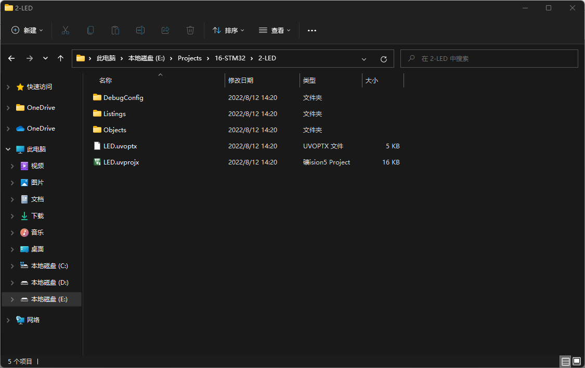

# STM32

## 工程模板

在keil中新建项目，选择存放项目文件的文件夹，以及开发使用的芯片型号(如果没有需要安装器件支持包)


新建的原始工程文件如下所示。


我们需要在项目中添加芯片的启动文件，官方会有提供。其中一般包含中断向量等的设置，其实也可以自己写。如果使用官方提供的库函数开发，则需要添加库函数文件。此外有一些已经固化了的代码，为了方便使用也可以添加到工程中。所以新建以下几个文件夹：<br />
Start，存放启动文件<br />
Library，存放库函数文件<br />
System，存放固化的代码<br />
User，主要用于开发的代码<br />


此外需要把相应的文件复制进去。一般都会把用到的外部文件复制到工程文件夹中，因为如果外部文件路径改变，keil就找不到文件了。

Start文件夹添加的文件：


Library文件夹添加的文件，图中只截取了一部分，基本上官方库函数的所有.h .c文件都在这里：


System文件夹存放例如延时等函数，User文件夹存放主函数等文件。

接下来在keil中将文件添加到工程中，并设置编译下载选项

点击上方的三个方块按钮


在该窗口中建好对应的组


向各个组中添加文件

Start组中添加Start文件夹下的文件，所有.c .h文件都需要添加。.s结尾的文件是启动文件，不同的芯片根据集成规模选择不同的启动文件。现在用的芯片是stm32f103c8t6，属于medium density，选择md.s的那个。其余组中直接添加所有文件即可。


文件添加完成后如下：


完成后右键User组，向其中添加新项目，即主程序main函数, 选择文件位置为User文件夹即可。


之后点击魔术棒按钮，在C/C++选项卡中添加引用文件夹路径，将Start、Library、System、User都添加进去


在debug选项卡中选择调试器，并配置下载后自动执行。选择STLink，勾选Reset and Run


使用库函数开发还需要再C/C++选项卡中定义这个变量USE_STDPERIPH_DRIVER


在main.c中添加一段简单代码
```c
#include "stm32f10x.h"                  // Device header
#include "Delay.h"

int main(void)
{
	RCC_APB2PeriphClockCmd(RCC_APB2Periph_GPIOC,ENABLE);
	
	GPIO_InitTypeDef GPIO_InitStructure;
	GPIO_InitStructure.GPIO_Mode = GPIO_Mode_Out_PP;
	GPIO_InitStructure.GPIO_Pin = GPIO_Pin_13;
	GPIO_InitStructure.GPIO_Speed = GPIO_Speed_50MHz;
	
	GPIO_Init(GPIOC, &GPIO_InitStructure);
	
	//GPIO_SetBits(GPIOC, GPIO_Pin_13);
	//GPIO_ResetBits(GPIOC, GPIO_Pin_13);
	
	while(1)
	{
		GPIO_WriteBit(GPIOC, GPIO_Pin_13, Bit_SET);
		Delay_ms(500);
		GPIO_WriteBit(GPIOC, GPIO_Pin_13, Bit_RESET);
		Delay_s(1);
	}
}
```

之后就可以编译并将生成的文件下载到芯片中了。

## GPIO

**General Purpose Input Output** 通用输入输出口

可以配置为8种模式，在输出模式下可以控制端口输出高低电平，用以驱动LED，模拟通信协议输出时许等；输入模式可以读取端口高低电平电压，读取按键输入、电平输入、ADC电压采集、模拟通信协议接收数据等。

STM32的所有GPIO都挂载在APB2外设总线上.

### 介绍


每个GPIO中有寄存器和驱动器，内核通过APB2总线对寄存器读写来控制GPIO的输入输出。寄存器的每一位对应GPIO的一个引脚（仅低16为对应引脚）。


IO端口具体电路如上图所示。上方为输入部分，下方为输出部分。

在IO引脚侧有两个保护二极管，用于限制电压于0~3.3V之间。如果引脚上的电压高于3.3V，上方的二极管导通，电流通过上方保护二极管流入VDD，不会流入GPIO。如果引脚电压低于0V，下方二极管导通，电流通过下方的保护二极管从VSS流出到引脚，而不会从GPIO中流出。

输入驱动器中有两个电阻，上拉电阻和下拉电阻。上拉电阻到VDD，下拉电阻到VSS，由开关控制。<br />
上拉电阻导通，下拉电阻断开是上拉输入模式，下拉电阻导通，上拉电阻断开是下拉输入模式。<br />
二者都断开是浮空输入模式。上拉和下拉给端口提供一个默认电平，因为数字端口输入只有高低电平两种。如果引脚悬空，引脚的输入电平会随外界干扰而改变。接入上拉电阻，当引脚悬空时输入为高电平，接入下拉电阻时，为低电平。<br />
肖特基触发器(好像实际上应该时施密特触发器)对输入电压整形。整形后电平输入到输入寄存器中。

输出控制接到两个MOS管，一个PMOS一个NMOS，通过控制其导通将IO口接到VDD或者VSS。可以设置为推挽，开漏和关闭三种输出方式。<br />
推挽模式下，PMOS和NMOS均有效，上管导通下管断开输出高电平，上管关断下管导通输出低电平。<br />
开漏模式下，PMOS无效，只有NMOS有效。数据寄存器为1，下管断开，输出断开，为高阻模式，数据寄存器为0时下管导通，输出低电平，此时只有低电平有驱动能力，高电平没有。开漏模式可以作为通信协议的驱动方式，例如I2C。此外开漏模式还可以用于输出5V电平信号(IO接口接上拉电阻到5V)。<br />
当引脚配置为输入模式时，两个mos管都无效，输出关闭，端口电平由外部信号控制。

### 8种工作模式
|模式|性质|特征|
|-|-|-|
|浮空输入|数字输入|可以读取引脚电平，若引脚悬空，则电平不确定|
|上拉输入|数字输入|可以读取引脚电平，内部接上拉电阻，悬空时默认高电平|
|下拉输入|数字输入|可以读取引脚电平，内部接下拉电阻，悬空时默认低电平|
|模拟输入|模拟输入|GPIO无效，引脚直接接入内部ADC|
|开漏输出|数字输出|可输出引脚电平，高电平为高阻态，低电平接VSS|
|推挽输出|数字输出|可输出引脚电平，高电平接VDD，低电平接VSS|
|复用开漏输出|数字输出|由片上外设控制，高电平为高阻态，低电平接VSS|
|复用推挽输出|数字输出|由片上外设控制，高电平接VDD，低电平接VSS|


复用的输出引脚电平由片上外设控制


