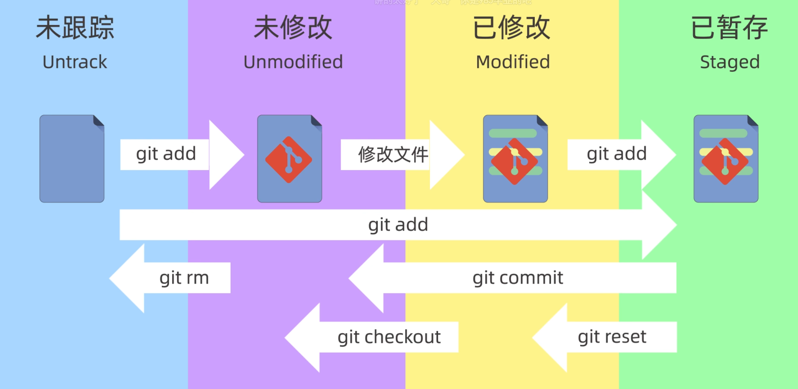
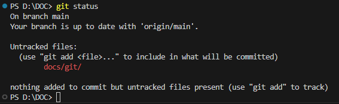
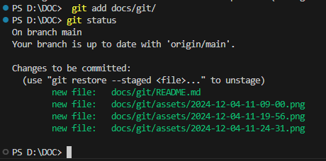
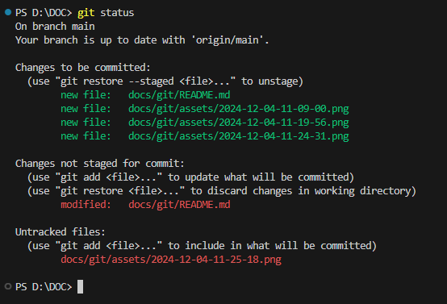
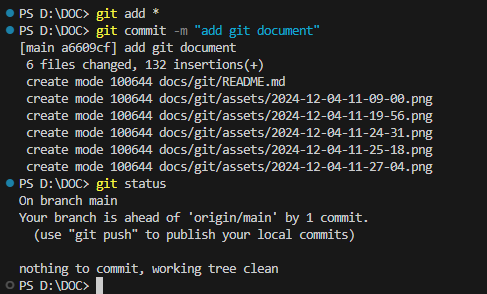

# git

一个免费开源的**分布式版本控制系统**，使用**仓库Repository**数据库记录文件变化，仓库中的每个文件都有一个完整的版本历史记录，可以跟踪文件变化，谁在什么时间修改了哪些内容，也可以将文件恢复到一个时间的状态。

## 安装配置

直接官网下安装包

```sh
# 查看版本命令
git -v
```

windows安装完成后会自动安装git bash。

可以通过命令行、图形化工具或者一些编辑器的第三方插件使用。

### 配置用户名和邮箱

```sh
# 查看所有配置信息
git config --list
# 查看全局配置信息
git config --global --list
# global：全局配置，所有仓库生效
# system：系统配置，对所有用户生效

# 配置用户名
git config --global user.name "xxx"
# 配置邮箱
git config --global user.email "xxx@xx.com"
# 保存用户名和密码
git config --gloable credential.helper store
```

## 新建版本库

版本库又叫仓库，Repository。可以理解为目录，目录中的每一个文件都可以被git管理，文件的修改、删除、添加等操作都能被跟踪，并且可以恢复。

### 电脑本地直接创建仓库

在本地文件夹中运行命令，以在该位置初始化一个空的仓库：

```sh
git init
```

命令执行完毕后，目录中会生成一个.git隐藏目录。该目录中的文件是仓库的重要组成部分，不要**随意删除和修改**。删除该目录即删除git仓库。

在git init后可以指定目录名称，会在当前位置创建一个新的目录，在该目录下创建仓库。

```sh
# 会在当前目录下创建my-repo文件夹，在该文件夹下生成仓库
git init my-repo
```

### 从远程服务器克隆仓库

在需要克隆的位置运行命令，从github或者gitee等地方克隆。
```sh
# 后接已经存在的仓库地址
git clone https://github.com/xxx/xxx.git
```

## 工作区域和文件状态

### 工作区域

git的本地数据管理分为三个区域，分别是工作区、暂存区和本地仓库。工作区即为工作目录，就是本地电脑上的目录，资源管理器中能看到的文件夹就是。暂存区是临时存储区域，用于保存即将提交到git仓库的内容，在版本控制中非常重要。本地仓库即为git init时创建的本地仓库，包含了完整的项目历史和元数据。


在修改完工作区的文件后，需要将它们添加到暂存区，再将暂存区的修改提交到本地仓库中，命令如下。在该过程中可以使用git命令来查看、比较或者撤销修改。

```sh
# 将修改的文件添加到暂存区
git add
# 将暂存区文件提交到本地仓库
git commit
```

### 文件状态

git中的文件存在未跟踪(Untrack)、未修改(Unmodified)、已修改(Modified)、已暂存(Staged)、已提交几种状态。

未跟踪就是我们新创建的，未被git管理的文件。

未修改是已经被git管理起来，但是文件内容未变化的文件。

已修改是已经修改，但是未被添加到暂存区里的文件。

已暂存就是修改后，并且添加到暂存区内的文件。



## 添加和提交文件

```sh
# 创建仓库
git init
# 查看仓库状态
git status
# 添加到暂存区
git add
# 提交
git commit
```

### git status

查看当前仓库在哪个分支，有哪些文件以及这些文件处在怎样的一个状态。例如下图的docs/git/文件夹显示为红色，表示这个文件夹是新创建的，未被跟踪。



### git add

创建文件后，使用git add命令将文件添加到暂存区，等待后续的提交操作。如下图所示，将docs/git文件夹添加到暂存区了，并且docs/git/README.md(就是现在正在写的文档)为已修改状态。





可以使用通配符的方式添加文件，例如
```sh
git add *
git add *.txt
```

### git commit

使用git commit可以将暂存区的文件添加到仓库中。文件被提交到仓库中后才算被保管起来。该命令只会提交暂存区中的文件，而不会提交工作区中的其他文件。

git commit 在使用时需要添加-m参数，填写提交信息。如果不使用-m参数，则会进入一个交互式界面，默认使用vim编辑提交信息。

```sh
git commit -m "initial commit"
```




