## vue
### vuetify

#### 第一步，创建vuecli项目

创建并进入新项目的目录，以demo1为例

```sh
vue create demo1
```

运行结果如下，在创建过程中可以选择不同的配置。其中vue自带的是两个default和Manually select features，model1是根据我们需要的插件/模块配置好之后保存的自定义选项。

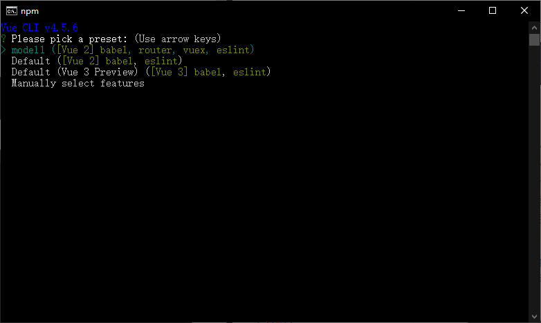

现在我们选择Manually select features重新进行创建过程，在出现的选项中使用空格勾选Bable，Router，Vuex，Linter/Formatter，

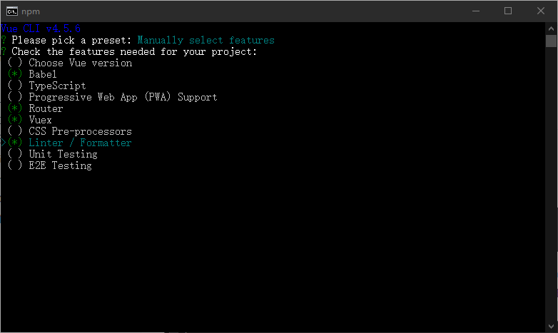


Use history mode for router，选择n。router不使用history模式，使用默认的hash模式。

hash模式：使用URL的hash来模拟一个完整的URL，当URL改变时，页面不会重新加载。

history模式：充分利用history.pushState API来完成URL跳转而无需重新加载页面

使用history模式会比较好看，但是需要后台配置。我们做的是单页客户端应用，如果后台没有正确的配置，用户在浏览器访问URL时会返回404。


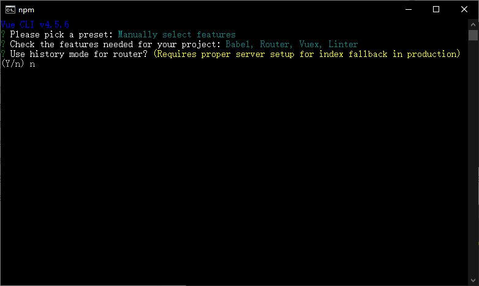


linter/formatter配置中选择ESLint+Prettier


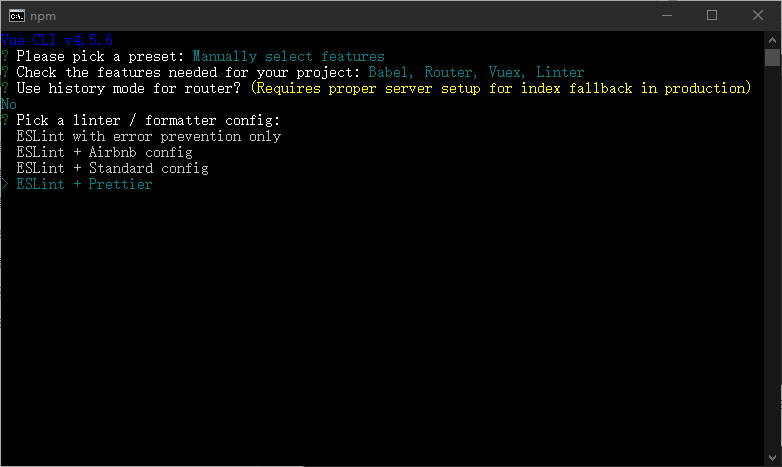


之后的选项选择Lint on save


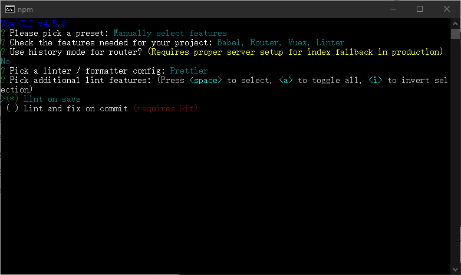


选择Babel ESLint等配置文件的位置，在同一个文件夹中或者在package.json中。选择package.json，将配置选项的代码添加到package.json中

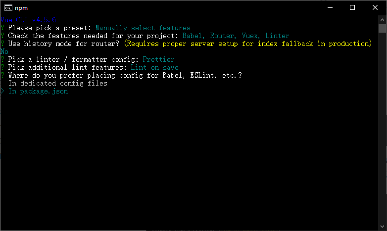


以上步骤就完成了一个项目的配置，此时可以选择是否将其保存为一个预置的选项。


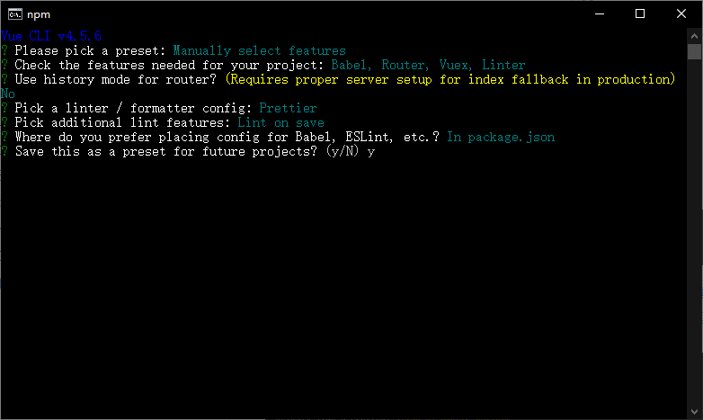


将其保存为demo，名称可以自己取，以后就可以直接使用模板配置了


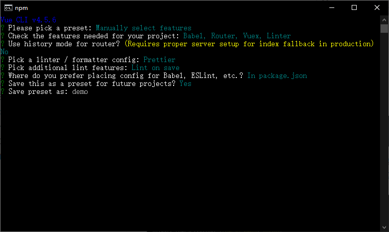


创建过程.................


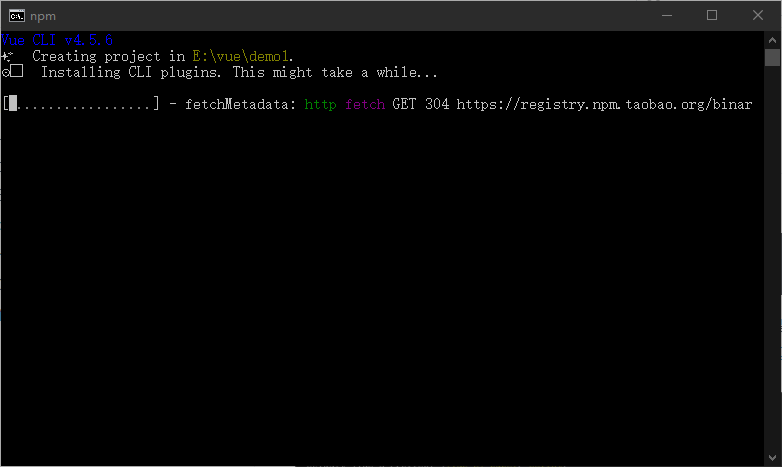

创建完毕返回，信息中提示使用cd demo1进入项目文件夹，之后运行npm run serve来运行项目

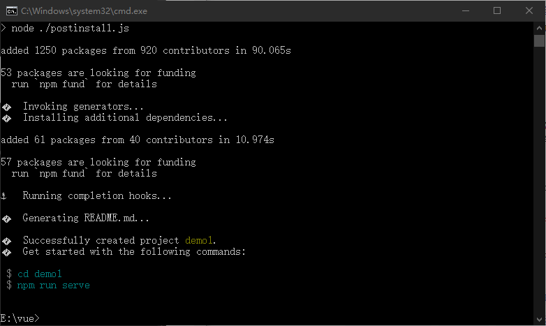

```sh
cd demo1
npm run serve
```

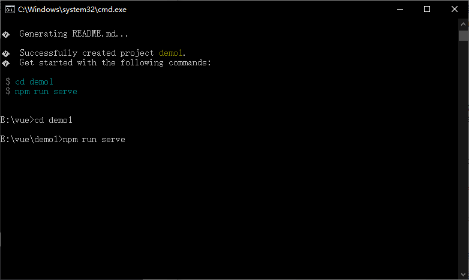

这样就把我们的项目运行起来了，在命令行中会给出链接地址，点击进入就是一个默认的vuecli项目，Ctrl+C可以退出


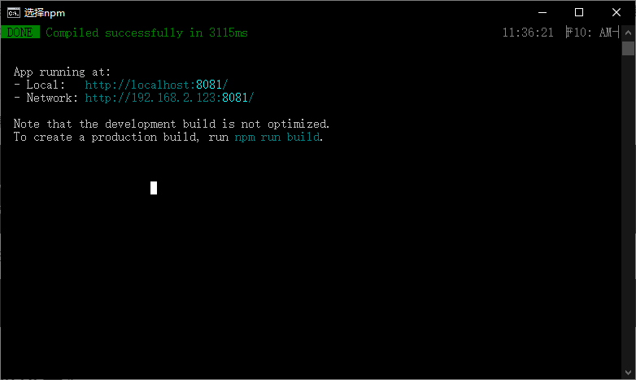

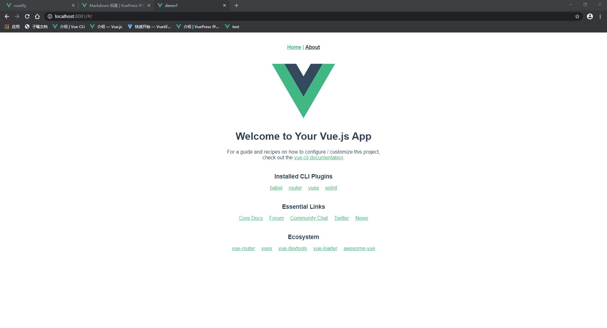

#### 第二步，在项目中添加vuetify

在创建项目之后进入项目文件夹

```sh
cd demo1
```
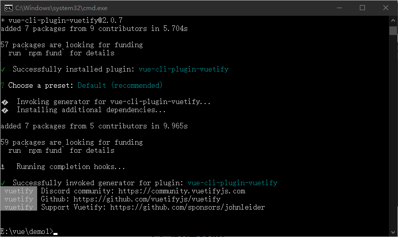
添加vuetify的方式有很多种，通过vue添加，用Vue UI安装，Nuxt安装，Webpack安装等等
我们使用Vue安装。如果在运行项目，用Ctrl+C结束，再进行后续步骤。

处在项目文件夹中时输入 vue add vuetify
```sh
vue add vuetify
```
(终止正转运行的项目)
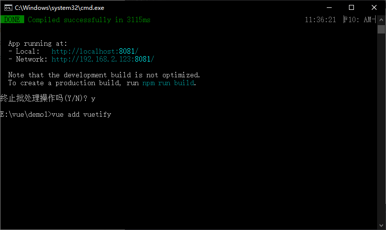

中间的配置选择default


显示安装成功

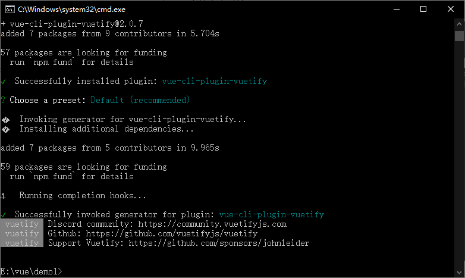

之后添加一个vuetify.js，路径为src/plugins/vuetify.js，代码内容：

```js
import Vue from 'vue'
import Vuetify from 'vuetify'
import 'vuetify/dist/vuetify.min.css'

Vue.use(Vuetify)

const opts = {}

export default new Vuetify(opts)
```

修改src文件夹下的main.js

```js
import Vue from "vue";
import App from "./App.vue";
import router from "./router";
import store from "./store";
import vuetify from "@/plugins/vuetify";

Vue.config.productionTip = false;

new Vue({
    vuetify,
    router,
    store,
    render: h => h(App)
}).$mount("#app");
```

修改vuetify使用的图标

我们使用的是Font Awesome的图标

在项目文件夹中执行如下命令安装

```sh
npm install @fortawesome/fontawesome -D
```

在vuetify.js中导入包中的all.css文件，并在实例化过程中添加iconfont
```js{1,8,9,10}
import '@fortawesome/fontawesome-free/css/all.css'//导入all.css文件
import Vue from 'vue'
import Vuetify from 'vuetify/lib'
import 'vuetify/dist/vuetify.min.css'

Vue.use(Vuetify)

export default new Vuetify({
    icons:{
        iconfont:'fa',      //添加的iconfont
    }
})

```

### vuetify组件介绍
#### 应用程序组件
vuetify中的v-app组件和，v-navigation-drawer，v-app-bar，v-footer等组件上的app属性会在应用程序启动时帮助v-main组件获得正确的大小。

支持app属性的组件有v-app-bar，v-bottom-navigation，v-footer，v-navigation-drawer，v-system-bar，每个特定组件中仅能同时存在一个，位置可以互换，布局会自动适应。

所有应用程序都需要v-app，它是许多Vuetify组件和功能的挂载点，并可以保证它将默认的应用程序变种传递给子组件(比如亮色或暗色)，还可以保证跨浏览器支持Safari等浏览器中某些点击事件。v-app在应用程序中仅使用一次。

默认应用程序标记：
```js
<v-app>
    <v-navigation-drawer app>               //导航抽屉
    </v-navigation-drawer>

    <v-app-bar app>                         //应用栏
    </v-app-bar>

    <v-main>
        <v-container fluid>
            <router-view></router-view>
        </v-container>
    </v-main>

    <v-footer>                             //页脚 
    </v-footer>
</v-app>
```

#### 应用栏
v-app-bar，通常是网站导航的主要来源。app-bar和navigation-drawer结合在一起为应用程序提供站点导航

<my-demo></my-demo>
<vuetify-test></vuetify-test>

:::danger 问题
能在vuepress中使用一般的组件，如上所示的按钮，但是vuetify的组件不可以，可能需要安装？
:::
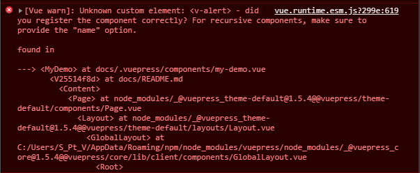

### npm与cnpm
#### npm

node package manager

npm是nodejs的包管理器，用于node插件管理（安装，卸载，管理依赖等）。常见使用场景：

允许用户从NPM服务器下载别人编写的第三方包到本地使用

允许用户从NPM服务器下载并安装别人编写的命令行程序到本地使用

允许用户将自己编写的包或命令行程序上传到NPM服务器供别人使用

#### cnpm

CNPM是中国NPM镜像的客户端

因为npm安装插件是从国外服务器下载，受网络影响大，可能出现异常。所以淘宝团队：“这是一个完整npmjs.org镜像，你可以用此代替官方版本，同步频率目前为10分钟一次以保证尽量与官方服务同步。”

cnpm用法与npm一致，只是在命令行中将npm改为cnpm

### npm安装插件

命令行执行 npm install [node插件名称] [-g] ][-save-dev]

```sh
npm install [node插件名称] [-g] ][-save-dev]
```
-g表示全局安装，将插件安装在C:\Users\Administrator\AppData\Roaming\npm，并写入系统变量；全局安装可以通过命令在任何地方调用它。

非全局安装会安装在当前定位目录，所以要进入项目文件夹执行。本地安装在定位目录的node_modules文件夹里，通过require()调用。

-save 将保存配置至nodejs项目的配置文件package.json中

-dev 将保存配置信息到package.json的devDependencies节点，不指定-dev将保存至dependencies节点。因为node插件包相对来说比较庞大，所以不加入版本管理，将配置信息写入package.json并将其加入版本管理，其他开发者对应下载即可（使用npm install时会根据package.json下载所有需要的包） 

卸载插件（使用命令，不要直接删除本地插件包）npm uninstall [-g] [-save-dev]

```sh
npm uninstall [-g] [-save-dev]
```

更新全部插件npm update [-g] [-save-dev]

```sh
npm update [-g] [-save-dev]
```

查看npm帮助npm help

```sh
npm help
```

查看当前目录已安装的插件npm list

```sh
npm list
```

### npm与cnpm混用导致的问题
没有找到为什么会出问题，只是问题和解决办法
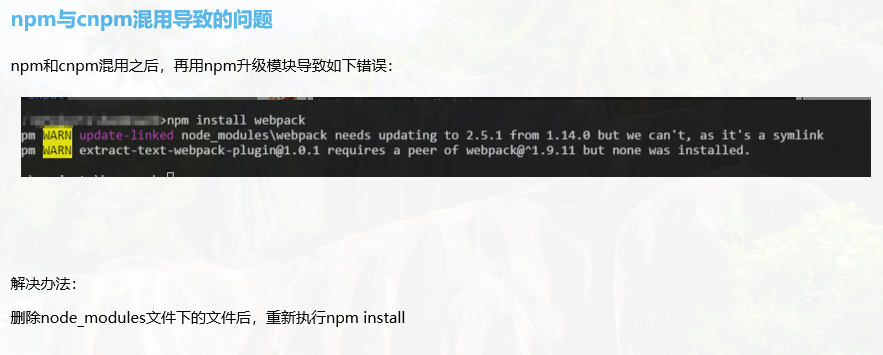