# Linux虚拟机硬盘扩容(LVM)

## 扩容前信息

df -Th

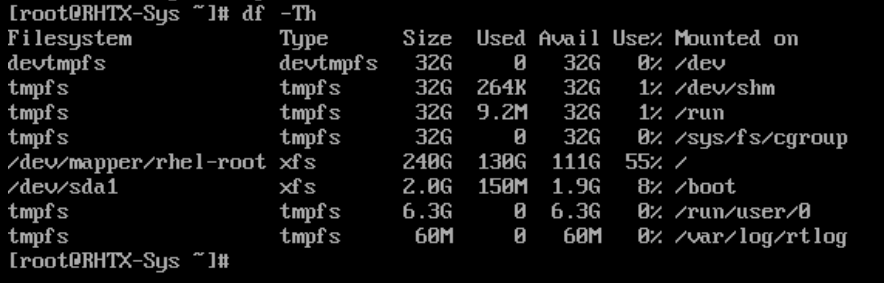

lsblk

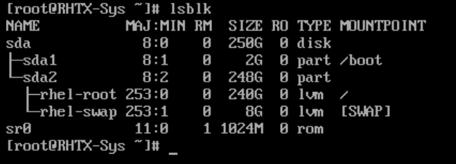

创建快照

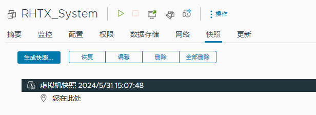

不行，不能创建快照，创建快照之后不能修改硬盘大小

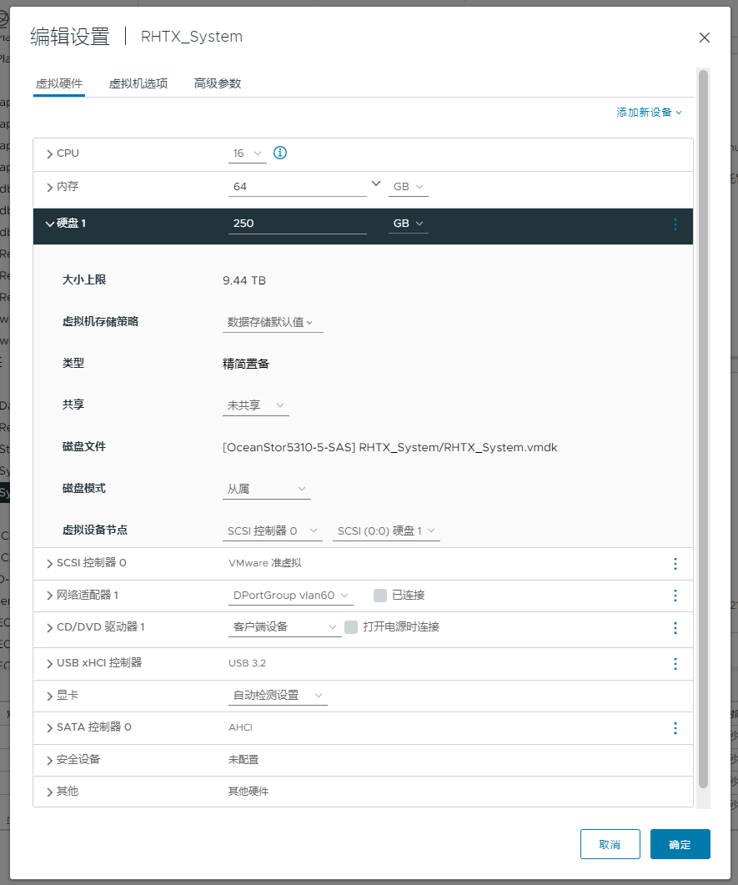

## 扩展物理磁盘

在vCenter中编辑虚拟机硬盘大小，加一个T，250+1024GB。

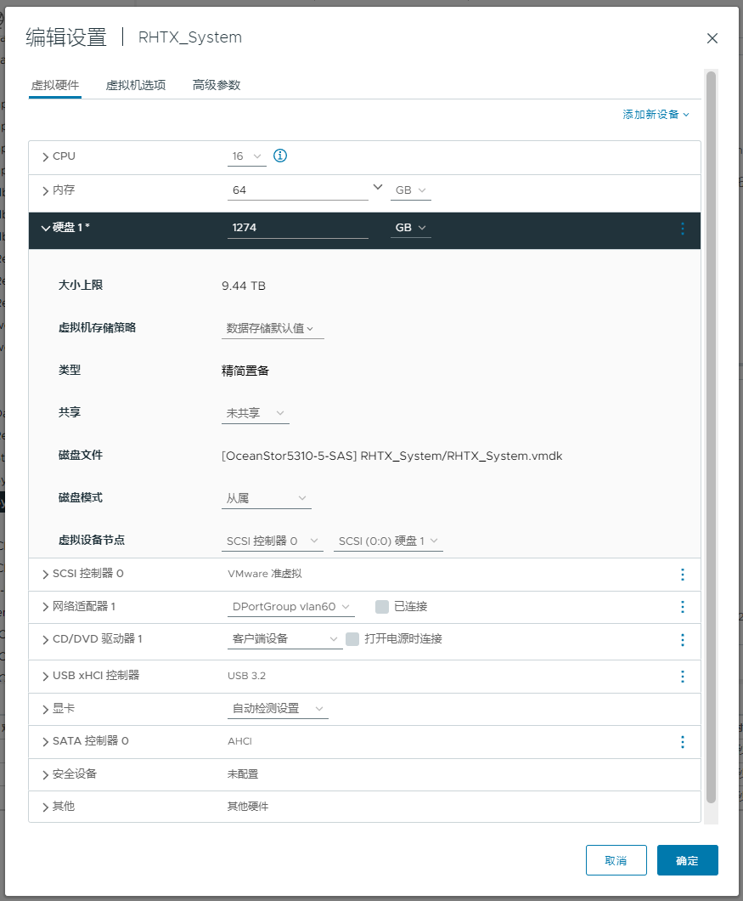

## 扩展系统磁盘

进入操作系统后查看磁盘状态。

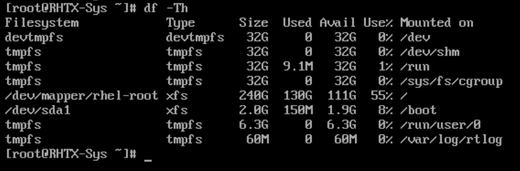

磁盘大小已经变成了1.3T。

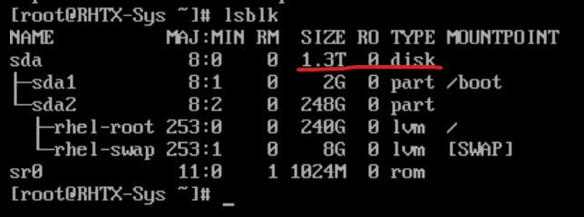

## 对指定磁盘初始化

使用fdisk工具

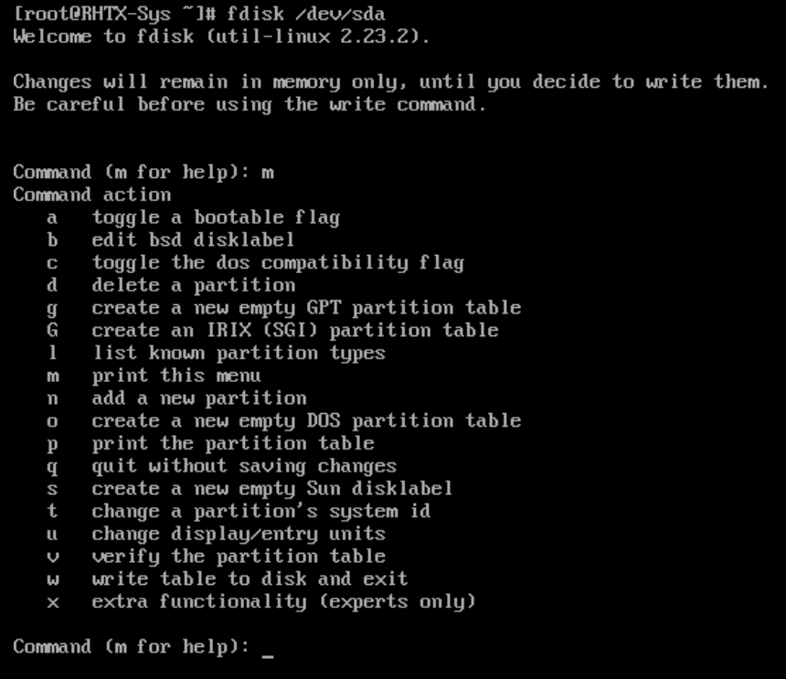

查看分区信息

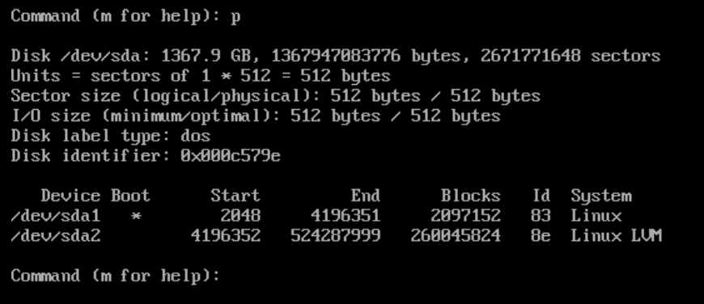

创建新分区，新的分区参数信息均为默认

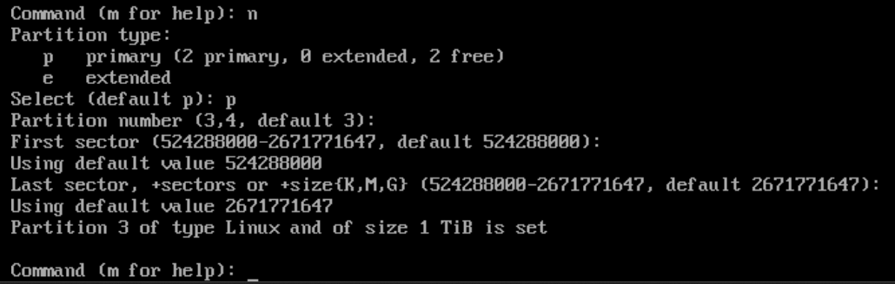

将新的分区设置为LVM格式

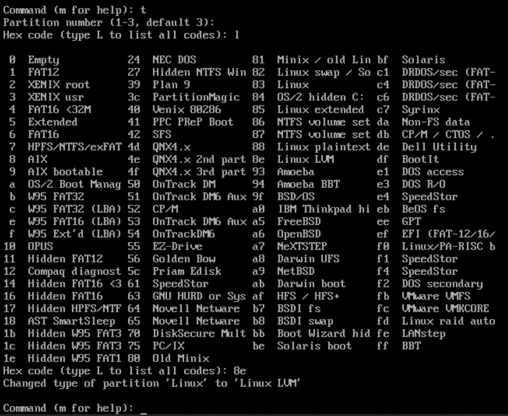

w保存，提示说要重启才能应用新的分区表，可以看到出现了1T的sda3

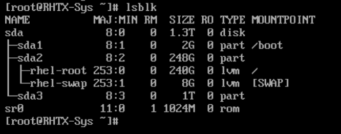

## 创建物理卷

创建物理卷前仅有1个Physical Volume

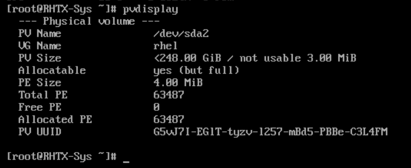

创建物理卷

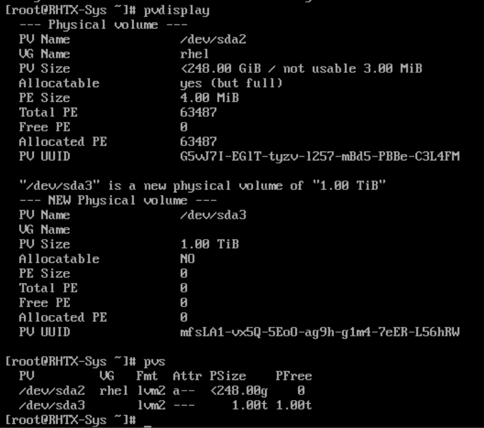

## 逻辑卷操作

查看卷组名称，名称为rhel

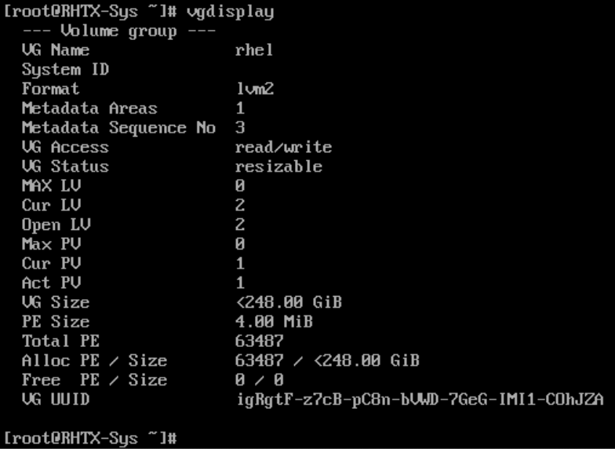

将物理卷扩展到卷组

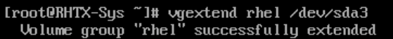

查看当前逻辑卷空间状态，卷组rhel的逻辑卷路径为/dev/rhel/root

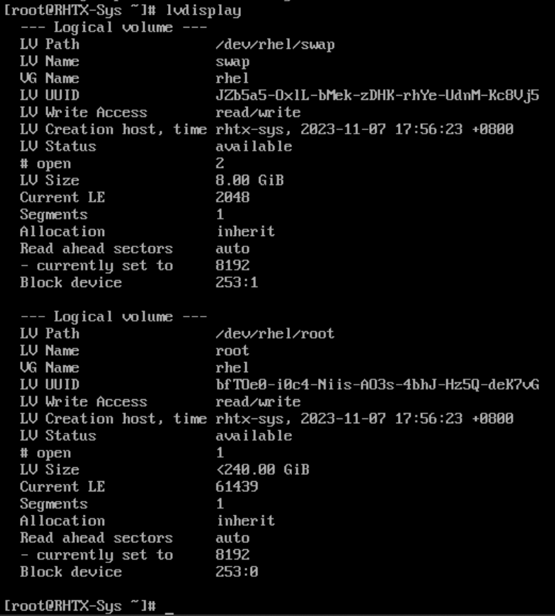

将卷组中的空闲空间按扩展到跟分区逻辑卷

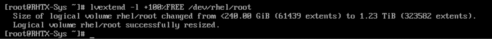

完成根目录扩展

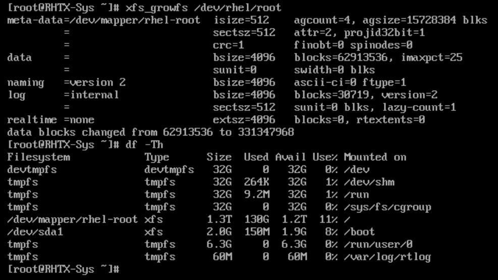
