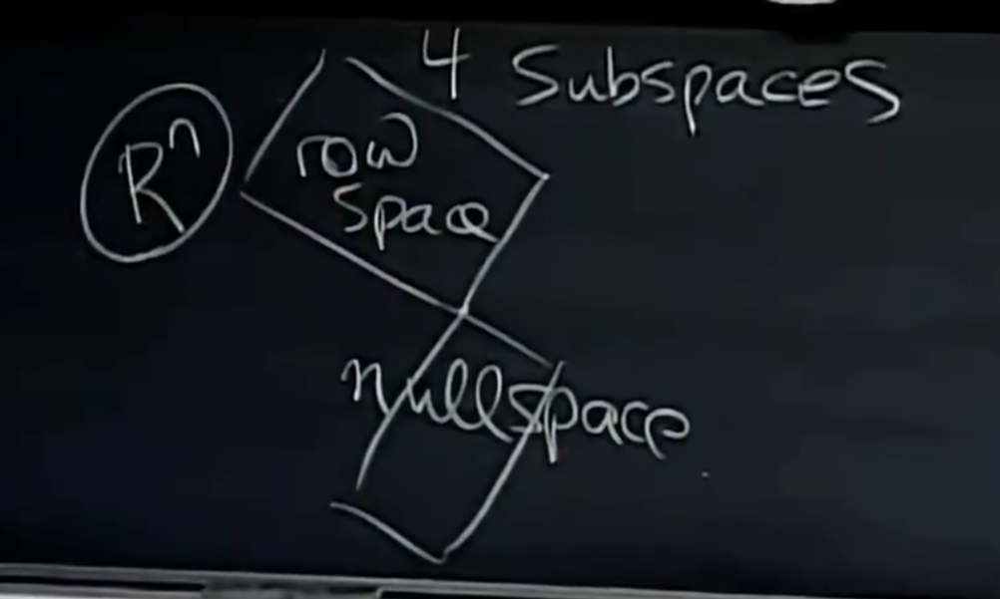
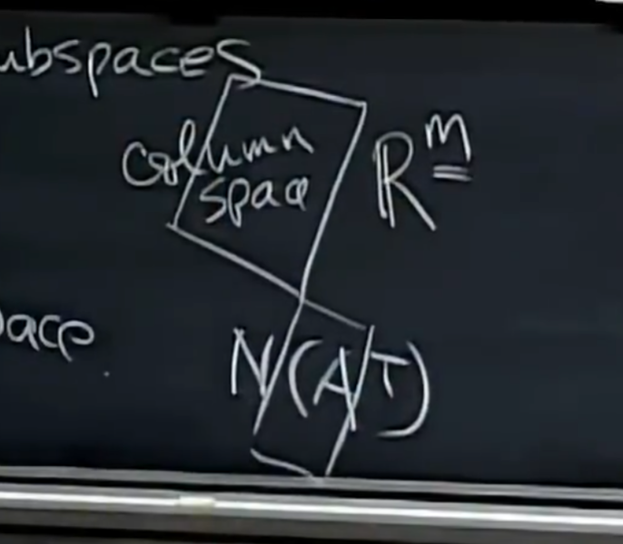
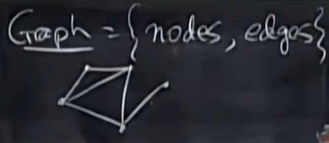
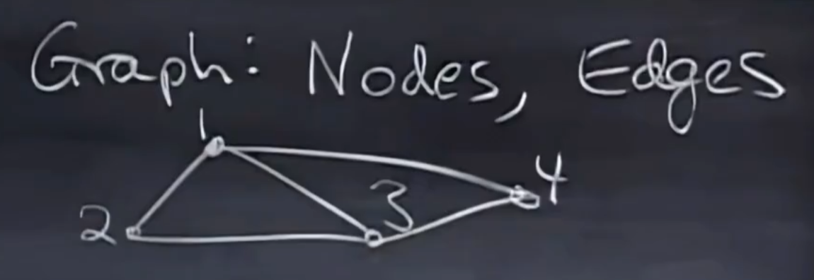
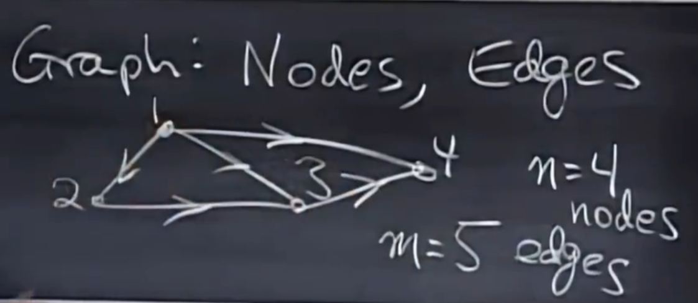
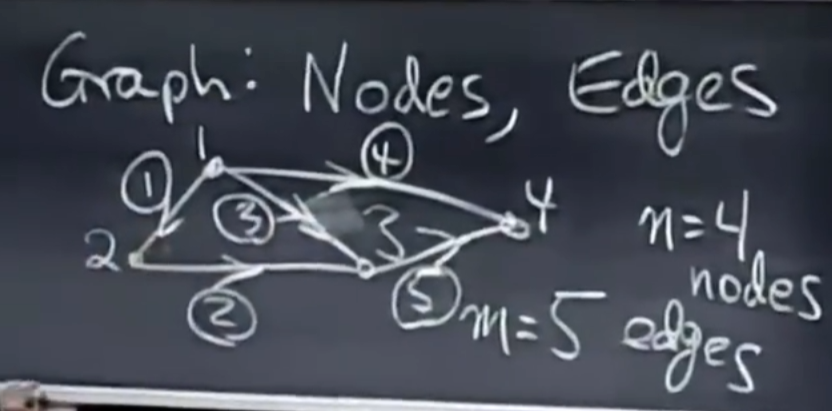
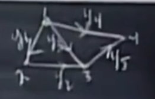
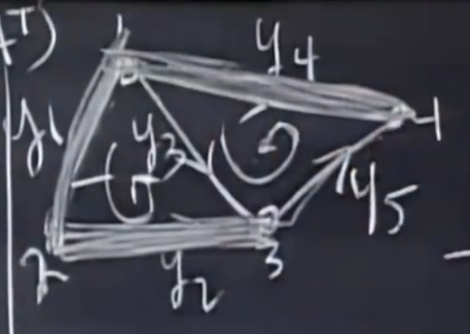

# 线性代数

吉尔伯特·斯特朗的线性代数课程

## 方程组

假设有两个未知数的方程组

$$
\begin{cases}
    2x-y=0 \\
    -x+2y=3
\end{cases}
$$

方程式的系数矩阵为：

$$
\begin{bmatrix}
   2 & -1 \\
   -1 & 2 
\end{bmatrix}
$$

方程式的矩阵形式为：

$$
\begin{bmatrix}
    2 & -1 \\
    -1 & 2 
\end{bmatrix}
\begin{bmatrix}
    x\\
    y
\end{bmatrix} = 
\begin{bmatrix}
    0 \\
    3
\end{bmatrix}
$$

可以写为 A·X=b

### 行图像

上述方程组的行图像为：一次取一行在xy平面上作出满足该方程的图像，图像上的所有点均为该方程的解。

两条直线的交点同时满足两个方程，是方程组的解。

### 列图像

看矩阵的列，将方程组写为：

$$
x \begin{bmatrix} 2 \\ -1 \end{bmatrix} + y \begin{bmatrix} -1 \\ 2 \end{bmatrix} = \begin{bmatrix} 0 \\ 3 \end{bmatrix}
$$

x、y后的参数为矩阵的各列，方程的右侧为参数b。

该方程组的意义是：**列向量的线性组合**。寻找将[2 -1]T和[-1 2]T线性组合起来能够得到[0 3]T的参数x和y；即寻找这两个向量的线性组合。

其几何图像为，xy坐标系下的两个向量，[2,-1]和[-1,2]，在图上将其线性组合得到[0,3]（可以理解为向量的平行四边形法则）。

这两个向量的所有线性组合是什么？

任意的x y可以使这两个向量得到所有可能的右侧向量b，包含整个平面上的点（前提是这两个向量线性无关？）

### 3x3例子

三个方程，三个维度xyz

$$
\begin{cases}
    2x-y=0  \\
    -x+2y-z=-1  \\
    -3y+4z=4
\end{cases}
$$

矩阵形式：

$$
A = \begin{bmatrix}\ 2 & -1 & 0 \\ -1 & 2 & -1 \\ 0 & -3 &4 \end{bmatrix}
$$

$$
X = \begin{bmatrix} x \\ y \\ z \end{bmatrix}
$$

$$
b = \begin{bmatrix} 0 \\ -1 \\ 4 \end{bmatrix}
$$

#### 行图像

从该方程组中一次取一个方程，可知该方程组的三个行图像分别为xyz三维空间中的三个平面。这三个平面相交得到的结果即为方程组的解。

有可能是，两个平面相交得到一条直线，直线与第三个平面相交得到一个点，也有可能其中两个平面平行，则该方程组无解。

#### 列图像

教授说他更倾向于列图像

$$
X \begin{bmatrix} 2 \\ -1 \\ 0 \end{bmatrix} +
Y \begin{bmatrix} -1 \\ 2 \\ -3 \end{bmatrix} +
Z \begin{bmatrix} 0 \\ -1 \\ 4 \end{bmatrix} =
\begin{bmatrix} 0 \\ -1 \\ 4 \end{bmatrix}
$$

此时可以将方程组看作求[2,-1,0]T [-1,2,-3]T 和 [0,-1,4]T 三个向量的线性组合使其得到 [0,-1,4]T

三个三维向量的线性组合，也可以通过画图看出来。（此时可以一眼看出来一个解为 (0 0 1)）因为右侧向量为左侧向量中的一个，所以只需要留下该列向量，其他的不需要。（0，0，1）就是三个平面的交点。

要系统地求解线性方程组，可以使用消元法，可以求所有情况下的xyz。

接下来保持左侧不变，考虑不同的右侧向量，例如只是简单的将第一列和第二列加在一起：

$$
X \begin{bmatrix} 2 \\ -1 \\ 0 \end{bmatrix} +
Y \begin{bmatrix} -1 \\ 2 \\ -3 \end{bmatrix} +
Z \begin{bmatrix} 0 \\ -1 \\ 4 \end{bmatrix} =
\begin{bmatrix} 1 \\ 1 \\ -3 \end{bmatrix}
$$

此时的解为（1，1，0）

考虑所有的b，是否所有的b都能使方程组有解？等价于代数问题："对于所有b，是否能求解Ax=b？"

如果换到线性代数的角度讲，这个问题也可以变成：列的线性组合是否覆盖整个三维空间？任意的b其实就是三维空间的意思。

对于上面这个例子的A，该问题的答案是可以的。因为该A是**非奇异矩阵**，是**可逆矩阵**。

但是对于另一些矩阵来说，答案是不可以。例如当三个向量处在同一个平面上时，它们的线性组合肯定也在该平面上，此时当b在该平面上时方程组有解，当b不在该平面上时无解，这种情况下称为**奇异矩阵**，矩阵不可逆。

### 九维情况

假设向量有9个分量，这种情况很难具象化。假设有9个方程和9个未知数，此时有9列，每一列都是九尾空间，此时考虑其线性组合。对于该问题，同样问：对于任意的b是否均有Ax=b？

问题的答案也一样，取决于系数矩阵A，A可逆则有，A不可逆则无。

如果选择一些**相互不独立的**列向量，例如第九列其实跟第八列一样，此时有一列毫无贡献（没有提供新的信息？）。此时就会有一些b无法求解，只有九维空间的八维平面上的b可以求解。

### 方程组的矩阵形式

矩阵A诚意某向量x等于右侧向量b

$$
    Ax = b
$$

**前提：A的列数等于b的行数，矩阵间的乘法也是，左乘矩阵的列数等于右乘矩阵的行数**

该方程式为一个矩阵乘以向量，举例：

$$
\begin{bmatrix}
    2 & 5 \\
    1 & 3
\end{bmatrix}
\begin{bmatrix}
    1 \\
    2
\end{bmatrix}
$$

#### 以列的形式计算

一次取一列，该例子可以看成：取一个第一列，加两个第二列

$$
1
\begin{bmatrix}
    2 \\
    1
\end{bmatrix}
+
2
\begin{bmatrix}
    5 \\
    3
\end{bmatrix}
=
\begin{bmatrix}
    12 \\
    7
\end{bmatrix}
$$

#### 以行的形式计算

用左侧矩阵的第一行，点乘该列向量，得到结果的第一行，第二行点乘该列向量得到结果的第二行。

$$
1
\begin{bmatrix}
    2 \\
    1
\end{bmatrix}
+
2
\begin{bmatrix}
    5 \\
    3
\end{bmatrix}
=
\begin{bmatrix}
    \begin{bmatrix}
        2 & 5
    \end{bmatrix}
    \begin{bmatrix}
        1 \\
        2
    \end{bmatrix} \\
    \begin{bmatrix}
        1 & 3
    \end{bmatrix}
    \begin{bmatrix}
        1 \\
        2
    \end{bmatrix}
\end{bmatrix}
=
\begin{bmatrix}
    2*1+5*2 \\
    1*1 + 3*2
\end{bmatrix}
=
\begin{bmatrix}
    12 \\
    7
\end{bmatrix}
$$

在数据较少，矩阵维度比较低，例如低于三维时，可以用列的方式计算，但是数据量大维度高时用第二种算法。

但是这样思考也是一种不错的思想： 
**Ax可以看作A各列的线性组合**

## 消元法

一种系统性求解方程组的方法，可以求解任意元的方程组，以及什么情况下该方程组无解。所有计算机程序都是使用的这种方法。

如果消元法奏效，则能够求出方程组的解。输入矩阵A是一个好矩阵（可逆），即可得到解。如果考虑消元法不奏效，可以知道矩阵何时是好矩阵，何时有问题。

为了求出解，还有一个回代过程。

消元的概念很自然，但是在线性代数中需要将其描述为**矩阵变换**。

考虑方程组：

$$
\begin{cases}
x+2y+z=2 \\
3x+8y+z=12 \\
4y+z=2
\end{cases}
$$

Ax=b的形式：

$$
\begin{bmatrix}
    1 & 2 & 1 \\
    3 & 8 & 1 \\
    0 & 4 & 1
\end{bmatrix}
\begin{bmatrix}
    x \\
    y \\
    z
\end{bmatrix}
=
\begin{bmatrix}
    2 \\
    12 \\
    2
\end{bmatrix}
$$

在进行消元法时，用矩阵描述。

### 消元

消元步骤：第一个方程成立，用该方程乘以某个数，然后从方程二中将其减去，目的是消去方程二中的x。

首先这个1是开始消元的关键，它称为**主元**，第一个主元，消元乘数为3，可以从方程二中消去x。

**主元不可为0**

假设方程1中没有x，则此时矩阵A的(1,1)位置为0，通过行交换可以使其不为0。**当主元为0时，可以通过行交换在下面的方程中找到合适的主元**

$$
\begin{bmatrix}
    [1] & 2 & 1 \\
    3 & 8 & 1 \\
    0 & 4 & 1
\end{bmatrix}
->
\begin{bmatrix}
    [1] & 2 & 1 \\
    3-1*3 & 8-2*3 & 1-1*3 \\
    0 & 4 & 1
\end{bmatrix}
->
\begin{bmatrix}
    [1] & 2 & 1 \\
    0 & 2 & -2 \\
    0 & 4 & 1
\end{bmatrix}
$$

第一步完成，计算中可以将b附在后面一同计算（matlab的计算过程是先算左侧，再回头算右侧）。该步骤中除去的是(2,1)位置，第二行的第一列。下一步需要将该列(第一列)下方的所有元素清零（该例中已经为0）。

接下来看第二个主元，在(2,2)，希望用其消去(3,2)位置，取消元乘数为2。

$$
\begin{bmatrix}
    1 & 2 & 1 \\
    0 & [2] & -2 \\
    0 & 4 & 1 
\end{bmatrix}
->
\begin{bmatrix}
    1 & 2 & 1 \\
    0 & [2] & -2 \\
    0-0*2 & 4-2*2 & 1-(-2)*2 
\end{bmatrix}
->
\begin{bmatrix}
    1 & 2 & 1 \\
    0 & [2] & -2 \\
    0 & 0 & 5 
\end{bmatrix}
$$

最终得到的矩阵如下，称其为U(上三角矩阵)，其三个主元已经标出

$$
U = 
\begin{bmatrix}
    [1] & 2 & 1 \\
    0 & [2] & -2 \\
    0 & 0 & [5] 
\end{bmatrix}
$$

**失效的情况**：无法得到三个主元，矩阵不可逆。

### 回代

代入右侧向量b，与参数矩阵A组成**增广矩阵**，做与消元同样的运算。

$$
\begin{bmatrix}
    1 & 2 & 1 & | & 2 \\
    3 & 8 & 1 & | & 12 \\
    0 & 4 & 1 & | & 2
\end{bmatrix}
->
\begin{bmatrix}
    1 & 2 & 1 & | & 2 \\
    0 & 2 & -2 & | & 6 \\
    0 & 4 & 1 & | & 2
\end{bmatrix}
->
\begin{bmatrix}
    1 & 2 & 1 & | & 2 \\
    0 & 2 & -2 & | & 6 \\
    0 & 0 & 5 & | & -10
\end{bmatrix}
$$

最终的方程为：

$$
\begin{cases}
    x+2y+z=2 \\
    2y-2z=6 \\
    5z=-10
\end{cases}
$$

回代时，先解z，向上回代逐步解出其余量。

$$
\begin{cases}
    x=2 \\
    y=1 \\
    z=-2
\end{cases}
$$

### 消元矩阵

原始矩阵A:

$$
A = 
\begin{bmatrix}
    1 & 2 & 1 \\
    3 & 8 & 1 \\
    0 & 4 & 1
\end{bmatrix}
$$

之前讲过，矩阵乘以向量是取其列的线性组合。

$$
\begin{bmatrix}
    col1[1] & col2[1] & col3[1] \\
    col1[2] & col2[2] & col3[2] \\
    col1[3] & col2[3] & col3[3]
\end{bmatrix}
\begin{bmatrix}
    3 \\
    4 \\
    5
\end{bmatrix}
=
3*col1 + 4*col2 + 5*col3
=
\begin{bmatrix}
    3*col1[1] + 4*col2[1] + 5*col3[1] \\
    3*col1[2] + 4*col2[2] + 5*col3[2] \\
    3*col1[3] + 4*col2[3] + 5*col3[3]
\end{bmatrix}
$$

考虑行的形式

$$
\begin{bmatrix}
    1 & 2 & 7
\end{bmatrix}
\begin{bmatrix}
    row1[1] & row1[2] & row1[3] \\
    row2[1] & row2[2] & row2[3] \\
    row3[1] & row3[2] & row3[3]
\end{bmatrix}
=
1*row1 + 2*row2 + 7*row3
$$
$$
=
\begin{bmatrix}
    1*row1[1] + 2*row2[1] + 7*row3[1] & 1*row1[2] + 2*row2[2] + 7*row3[2] & 1*row1[3] + 2*row2[3] + 7*row3[3]
\end{bmatrix}
$$

线性代数的核心概念：分别用行和列进行矩阵操作，矩阵乘以一个列结果为一列，是对列进行组合，一行乘以一个矩阵结果为一行，是对行进行组合。

回到消元，在之前的消元步骤中，消元是通过行变换进行的。所以若要用矩阵变换表示消元过程，该操作应该为：以一个行向量左乘该矩阵。具体如下：

$$
\begin{bmatrix}
    1 & 0 & 0 \\
    -3 & 1 & 0 \\
    0 & 0 & 1
\end{bmatrix}
\begin{bmatrix}
    1 & 2 & 1 \\
    3 & 8 & 1 \\
    0 & 4 & 1
\end{bmatrix}
=
\begin{bmatrix}
    1 & 2 & 1 \\
    0 & 2 & -2 \\
    0 & 4 & 1
\end{bmatrix}
$$

可以将上述左乘的矩阵称为**初等矩阵**，记作E1：

$$
E21 = 
\begin{bmatrix}
    1 & 0 & 0 \\
    -3 & 1 & 0 \\
    0 & 0 & 1
\end{bmatrix}
$$

:::tip 单位阵

综上，可以发现，下面这个矩阵(单位阵)可以使原来的矩阵不发生任何变化

$$
\begin{bmatrix}
    1 & 0 & 0 \\
    0 & 1 & 0 \\
    0 & 0 & 1
\end{bmatrix}
$$

:::

接下来，第二步消元操作为：

$$
\begin{bmatrix}
    1 & 0 & 0 \\
    0 & 1 & 0 \\
    0 & -2 & 1
\end{bmatrix}
\begin{bmatrix}
    1 & 2 & 1 \\
    0 & 2 & -2 \\
    0 & 4 & 1
\end{bmatrix}
=
\begin{bmatrix}
    1 & 2 & 1 \\
    0 & 2 & -2 \\
    0 & 0 & 5
\end{bmatrix}
$$

将该步骤中的左乘矩阵记作E2：
$$
E32 = 
\begin{bmatrix}
    1 & 0 & 0 \\
    0 & 1 & 0 \\
    0 & -2 & 1
\end{bmatrix}
$$

所以，上述两部分别做左乘了两个矩阵。根据矩阵乘法的结合律，可以将这两个矩阵合成为同一个矩阵:

:::warning
矩阵没有交换律！不能改变乘法中矩阵的位置，AB≠BA
:::

$$
    E32 (E21 A) = U
$$

$$
    (E32 E21) A = U
$$

$$
    E = E32 E21 = 
    \begin{bmatrix}
        1 & 0 & 0 \\
        -3 & 1 & 0 \\
        0 & 0 & 1
    \end{bmatrix}
    \begin{bmatrix}
        1 & 0 & 0 \\
        0 & 1 & 0 \\
        0 & -2 & 1
    \end{bmatrix}
    =
    \begin{bmatrix}
        1 & 0 & 0 \\
        -3 & 1 & 0 \\
        0 & -2 & 1
    \end{bmatrix}
$$

:::tip 置换矩阵

交换两行的矩阵，本质上来讲，就是单位阵行变换的所有组合。将单位阵对应行交换，得到的就是将这两行交换的置换矩阵。

$$
\begin{bmatrix}
    0 & 1 & 0 \\
    1 & 0 & 0 \\
    0 & 0 & 1
\end{bmatrix}
\begin{bmatrix}
    0 & 0 & 1 \\
    0 & 1 & 0 \\
    1 & 0 & 0
\end{bmatrix}
\begin{bmatrix}
    1 & 0 & 0 \\
    0 & 0 & 1 \\
    0 & 1 & 0
\end{bmatrix}
$$

若要交换列，矩阵的形式一样，但是需要右乘。将单位阵的两列交换得到的矩阵就是将这两列交换的置换矩阵。
:::

但是还有更好的办法，不是关心A怎么变成U，而是U怎么变回A。接下来进行逆变换。

:::tip 矩阵的逆
矩阵A，矩阵A的逆为A^{-1}

A^{-1}A = I

:::

$$
    EA=U
$$
$$
    E^{-1}EA=E^{-1}U
$$
$$
    A=E^{-1}U
$$

## 矩阵乘法

假设有矩阵A，B，C，AB=C。回顾单个元素的算法，C中第i行第j列处的元素$C~ij~$，为A的第i行与B的第j列的点积。

:::warning
矩阵相乘的前提：左乘矩阵的行数等于右乘矩阵的列数。
$A~mn~$，$B~np~$
:::

假设有k个元素。

$$
C_{ij} = \sum_{k=1}^n A_{ik}B_{kj}
$$

常规方法：用列乘以行，得到一个数字。

列方法：看整列的情况，A乘以B的第一列得到aoC的第一列，B可以考虑成p个单独的列。C中的各列是A中各列的线性组合。

行方法：看整行的情况，A的某一行乘以B中的每一行，得到C中的一行。C中的各行是B中各行的的线性组合。

列乘以行：A的一列乘以B的一行，得到的是一个完整的矩阵。A的一列为mx1，B的一行为1xp，结果为mxp。例如：

$$
\begin{bmatrix}
 2 \\ 3 \\ 4
\end{bmatrix}
\begin{bmatrix}
    1 & 6
\end{bmatrix}
=
\begin{bmatrix}
    2 & 12 \\
    3 & 18 \\
    4 & 24
\end{bmatrix}
$$

结果的各列都是$\begin{bmatrix} 2 \\ 3 \\ 4 \end{bmatrix}$的倍数，各行都是$\begin{bmatrix} 1 & 6 \end{bmatrix}$的倍数。结果的所有行都依赖于$\begin{bmatrix} 1 & 6 \end{bmatrix}$，所有列都依赖于$\begin{bmatrix} 2 \\ 3 \\ 4 \end{bmatrix}$。所有的行向量都在同一个方向，所有的列向量也在同一个方向。**该矩阵的行空间是一条直线，列空间也是一条直线**

AB是A的各列乘以B的各行所得矩阵之和。

还可以将矩阵切成许多块，对块进行乘法。例如可以将A分为4块，B也分为4块，只要各块相匹配即可

$$
A=
\begin{bmatrix}
    A_1 & A_2 \\
    A_3 & A_4
\end{bmatrix}
$$

$$
B=
\begin{bmatrix}
    B_1 & B_2 \\
    B_3 & B_4
\end{bmatrix}
$$

$$
AB=
\begin{bmatrix}
    A_1 & A_2 \\
    A_3 & A_4
\end{bmatrix}
\begin{bmatrix}
    B_1 & B_2 \\
    B_3 & B_4
\end{bmatrix}
=
\begin{bmatrix}
    A_1B_1+A_2B_3 & A_1B_2+A_2B_4 \\
    A_3B_1+A_4B_2 & A_3B_2+A_4B_4
\end{bmatrix}
$$

## 矩阵的逆

Inverse

先考虑方阵A，A可能有也可能没有逆。如果A可逆或者非奇异，那么就存在某个矩阵，称为A的逆$A^{-1}$

$$
    A^{-1}A = I
$$

$$
    AA^{-1} = I
$$

对于方阵，其左逆矩阵等于右逆矩阵，这一点不好证明，但是是正确的。非方阵的左逆和右逆不一样。

对于奇异阵，没有逆。举一个2x2的例子：

$$
A=
\begin{bmatrix}
    1 & 3 \\
    2 & 6
\end{bmatrix}
$$

该矩阵为什么没有逆矩阵？接下来有若干解释：

1. 如果取行列式，该矩阵的行列式为0。

2. 假设A乘以某个矩阵得到单位阵，考虑其列，结果中的各列都来自A中的列，这样不可能得到单位阵，A中的两列共线，不可能得到$\begin{bmatrix} 1 \\ 0 \end{bmatrix}$。

3. 如果存在非零向量X使得AX=0，这样的矩阵没有逆。这里的X是$\begin{bmatrix} 3 \\ -1 \end{bmatrix}$。如果此时A存在逆矩阵的话，就不会有AX=0存在：

$$
    AX = 0
$$

$$
    A^{-1}AX = A^{-1}0
$$

$$
    IX=0
$$

$$
    X=0
$$

如果其中一列对线性组合毫无贡献，矩阵不可能有逆。

结论是：不可逆矩阵、奇异矩阵其列能通过线性组合得到0

什么样的矩阵有逆？例如：
$$
\begin{bmatrix}
    1 & 3 \\
    2 & ?
\end{bmatrix}
$$

？处可以为：7，8，等等但是就是不能为6。偏爱行列式的人会算出该矩阵的行列式不为0，偏爱列的人会发现这两列不共线，等等。

如何求出矩阵的逆？

$$
\begin{bmatrix}
    1 & 3 \\
    2 & 7
\end{bmatrix}
\begin{bmatrix}
    ? & ? \\
    ? & ?
\end{bmatrix}
=
\begin{bmatrix}
    1 & 0 \\
    0 & 1
\end{bmatrix}
$$

取第一列，令其为a，b，此时满足方程A乘以该列可以得到$\begin{bmatrix} 1 & 0 
\end{bmatrix}$ 
取第二列，令其为c，d，此时满足方程A乘以该列可以得到$\begin{bmatrix} 0 & 1 
\end{bmatrix}$

$$
\begin{bmatrix}
    1 & 3 \\
    2 & 7
\end{bmatrix}
\begin{bmatrix}
    a & c \\
    b & d
\end{bmatrix}
=
\begin{bmatrix}
    1 & 0 \\
    0 & 1
\end{bmatrix}
$$

$$
\begin{cases}
    \begin{bmatrix}
        1 & 3 \\
        2 & 7
    \end{bmatrix}
    \begin{bmatrix}
        a \\
        b
    \end{bmatrix}
    =
    \begin{bmatrix}
        1 \\
        0
    \end{bmatrix} \\
    \begin{bmatrix}
        1 & 3 \\
        2 & 7
    \end{bmatrix}
    \begin{bmatrix}
        c \\
        d
    \end{bmatrix}
    =
    \begin{bmatrix}
        0 \\
        1
    \end{bmatrix}
\end{cases}
$$

这就是高斯Gauss的方法。求逆其实与求方程组是一样的，但是在矩阵维度较高时，这种方法计算量就非常大了。

此时引入高斯-若尔当 Gauss-Jordan思想，可以同时处理两个方程组。

在该矩阵右侧加上一个单位阵$\begin{bmatrix} 1 & 0 \\ 0 & 1 \end{bmatrix}$，称为一个增广矩阵。再在此基础上进行消元，将左侧变为单位阵，右侧即为逆矩阵。

$$
\begin{bmatrix}
    1 & 3 & | & 1 & 0 \\
    2 & 7 & | & 0 & 1
\end{bmatrix}
$$

$$
\begin{bmatrix}
    1 & 3 & | & 1 & 0 \\
    0 & 1 & | & -2 & 1
\end{bmatrix}
$$

$$
\begin{bmatrix}
    1 & 0 & | & 7 & -3 \\
    0 & 1 & | & -2 & 1
\end{bmatrix}
$$

为什么这里能够得到A的逆？只进行了行变换，相当于左乘之前得出的行变换矩阵E。

$$
    E[AI] = [IE]
$$
$$
    EA = I
$$
$$
    E = A_{-1}
$$

## LU分解

本节最后要得出的公式是
$$
A = LU
$$

假设$A$可逆，$B$也可逆，什么矩阵能给出$AB$的逆，或者说$AB$的逆是什么？是用$B^{-1}A^{-1}$

假设$A$可逆，该矩阵的转置的逆是什么？
$$
AA^{-1} = I
$$
两边同时转置
$$
(AA^{-1})^T = I^T
$$
$$
(A^{-1})^TA^T = I
$$
所以转置的逆是**逆的转置**

以上是本节要用到的基础公式。消元的目的是为了正确认识矩阵的概念，$A=LU$是最基础的矩阵分解。

假设有可逆矩阵$A$，不需要进行行互换，可以进行消元，主元的位置也很好，可以从$A$得到$U$，其中的关联是什么，$A$和$U$是什么关系。

考虑2x2的情形。

$$
A = 
\begin{bmatrix}
    2 & 1 \\
    8 & 7
\end{bmatrix}
$$
用初等矩阵进行行变换
$$
    E_{21}A = U
$$
$$
    \begin{bmatrix}
        1 & 0 \\
        -4 & 1
    \end{bmatrix}
    \begin{bmatrix}
        2 & 1 \\
        8 & 7
    \end{bmatrix}
    =
    \begin{bmatrix}
        2 & 1 \\
        0 & 3
    \end{bmatrix}
$$

本节要得出的公式是$A=LU$，A在一侧，其余矩阵在另一侧

$$
    E_{21}^{-1}E_{21}A = E_{21}^{-1}U
$$

$$
    A = E_{21}^{-1}U
$$
$L$其实就是$E$的逆
$$
    A = LU
$$

**消元矩阵的逆很好求，只要改变一个符号就行**

$$
    \begin{bmatrix}
        1 & 0 \\
        4 & 1
    \end{bmatrix}
    \begin{bmatrix}
        1 & 0 \\
        -4 & 1
    \end{bmatrix}
    \begin{bmatrix}
        2 & 1 \\
        8 & 7
    \end{bmatrix}
    =
    \begin{bmatrix}
        1 & 0 \\
        4 & 1
    \end{bmatrix}
    \begin{bmatrix}
        2 & 1 \\
        0 & 3
    \end{bmatrix}
$$

$$
    \begin{bmatrix}
        2 & 1 \\
        8 & 7
    \end{bmatrix}
    =
    \begin{bmatrix}
        1 & 0 \\
        4 & 1
    \end{bmatrix}
    \begin{bmatrix}
        2 & 1 \\
        0 & 3
    \end{bmatrix}
$$

此时已经初具雏形了，$L$表示什么？$U$表示上三角upper，$L$表示下三角lower。式子可以进一步写为：

$$
    \begin{bmatrix}
        2 & 1 \\
        8 & 7
    \end{bmatrix}
    =
    \begin{bmatrix}
        1 & 0 \\
        4 & 1
    \end{bmatrix}
    \begin{bmatrix}
        2 & 0 \\
        0 & 3
    \end{bmatrix}
    \begin{bmatrix}
        1 & \frac{1}{2} \\
        0 & 1
    \end{bmatrix}
$$

该形式称为

$$
A = LDU
$$

$L$：下三角矩阵 $D$：对角阵 $U$：上三角矩阵

但是对于3x3矩阵，情况就很不同

假设$A$为一3x3矩阵，第一步使用$E_{21}$在21位置得到0(假设没有进行行变换)，以此类推...

$$
    E_{32}E_{31}E_{21}A = U
$$

此时的$L$也不一样

$$
    A = E_{21}^{-1}E_{31}^{-1}E_{32}^{-1}U
$$

$$
    L = (E_{32}E_{31}E_{21})^{-1}
$$

假设：

$$
    E_{21} =
    \begin{bmatrix}
        1 & 0 & 0 \\
        -2 & 1 & 0 \\
        0 & 0 & 1
    \end{bmatrix}
$$

$$
    E_{31} =
    \begin{bmatrix}
        1 & 0 & 0 \\
        0 & 1 & 0 \\
        0 & 0 & 1
    \end{bmatrix}
$$

$$
    E_{32} = 
    \begin{bmatrix}
        1 & 0 & 0 \\
        0 & 1 & 0 \\
        0 & -5 & 1
    \end{bmatrix}
$$

这个例子比较典型，相当于没有$E_{31}$

$$
    E = E_{32}E_{21}
$$

$$
    E = 
    \begin{bmatrix}
        1 & 0 & 0 \\
        0 & 1 & 0 \\
        0 & -5 & 1
    \end{bmatrix}
    \begin{bmatrix}
        1 & 0 & 0 \\
        -2 & 1 & 0 \\
        0 & 0 & 1
    \end{bmatrix}
    =
    \begin{bmatrix}
        1 & 0 & 0 \\
        -2 & 1 & 0 \\
        10 & -5  & 1
    \end{bmatrix}
$$

**这个10是怎么来的？** 
因为第二行减去了两倍的第一行得到-2，第三行减去五倍的第二行得到10，相当于第三行加上了10倍的第一行

从反方向开始计算逆：

$$
    L = E^{-1}
$$

$$
    L = E_{21}^{-1}E_{32}^{-1}
$$

$$
    L =
    \begin{bmatrix}
        1 & 0 & 0 \\
        2 & 1 & 0 \\
        0 & 0 & 1
    \end{bmatrix}
    \begin{bmatrix}
        1 & 0 & 0 \\
        0 & 1 & 0 \\
        0 & 5 & 1
    \end{bmatrix}
    =
    \begin{bmatrix}
        1 & 0 & 0 \\
        2 & 1 & 0 \\
        0 & 5 & 1
    \end{bmatrix}
$$

所以

$$
    L =
    \begin{bmatrix}
        1 & 0 & 0 \\
        2 & 1 & 0 \\
        0 & 5 & 1
    \end{bmatrix}
$$
$$
    E =
    \begin{bmatrix}
        1 & 0 & 0 \\
        -2 & 1 & 0 \\
        10 & -5  & 1
    \end{bmatrix}
$$

$$
    A = LU
$$

如果不存在行互换，消元乘数即消元步骤中要乘以并减去的那个倍数可以直接写入L中。

比如进行消元步骤，只要步骤正确，可以在得到LU的过程中把A抛开。这样考虑消元步骤：当完成A第二行中的消元，得到U的第二行，同时得到了消元乘数，此时可以不管A了，因为A的信息都包含在LU中。

一个nxn矩阵A，消元需要进行多少次操作？(如果一次加法和一次乘法算一次) 
$$
    n^2 + (n-1)^2 + ... + 1^2
$$
$$
    \frac{1}{3}n^3
$$

接下来允许行互换操作。当主元位置存在0时，需要进行行互换操作。这就进入了转置与置换。置换矩阵用于进行行互换操作。

由单位矩阵各行交换就能得到行变换矩阵，行变换矩阵两两相乘结果仍在他们中间，各自的逆是其转置。

## 转置 置换 向量空间

### 置换 Permutation

置换矩阵，记作P，是用来完成行互换的矩阵。

在之前的矩阵分解中，$A=LU$，$L$主元位置均为1，消元乘数在下三角位置，上三角位置均为0，$U$下三角位置均为0。

这样的例子中没有进行行互换，因为之前的矩阵都是主元位置没有0的，但是通常情况不一定是这样。而且在matlab中，matlab不会像人一样，matlab不仅不允许主元位置出现零，而且不允许主元位置上出现非常小的数值，因为这样会对数值计算的准确性有影响。matlab就会对一些在人看来没有必要的行进行互换操作。

而在有了行变换后，$A=LU$就变成了$PA=LU$。其中P为行互换矩阵，它将各行互换为正确的顺序，互换后主元位置不会出现0，并且L和U仍保持上面的形式。

对于任何可逆矩阵都有$PA=LU$这种形式。对于大部分矩阵，不需要P，但有一些需要。

置换矩阵是行重新排列了的单位矩阵。

n阶矩阵有n！种置换矩阵

### 转置 Transpose

转置是将矩阵的行列互换，记作T，matlab用'表示。

$$$
    (A^T)_{ij} = A_{ji}
$$

$$
    A =
    \begin{bmatrix}
        1 & 3 \\
        2 & 3 \\
        4 & 1
    \end{bmatrix}
$$

$$
    A^T =
    \begin{bmatrix}
        1 & 2 & 4 \\
        3 & 3 & 1
    \end{bmatrix}
$$

### 对称矩阵

对称矩阵转置之后不变

$$
    A^T = A
$$

所有的矩阵$R$乘以$R^T$都是对称矩阵。

## 向量空间

空间表示有很多向量，但并不是任意向量的组合都能称为空间。空间必须满足一些条件，必须能进行**线性组合**。

例如R^2就是一个向量空间，R^2表示二维实向量，例如(3, 2) (0, 0) (Π, e)等等。首先进行代数运算，例如两两相加，各个分量相加，还能做出图像。它们的图象是，由原点出发，指向坐标处的箭头，(0, 0)自己在原点，且没有箭头指向。此时整个二位平面就是R^2，可以将R^2称为一个平面，但是此时考虑成其为所有向量组成的向量空间。如果将(0, 0)去掉，相当于在xy平面戳破一个洞。对于向量空间，一个向量乘以任何数都必须属于向量空间，加上任何向量都必须属于向量空间。而如果没有原点(0, 0)，则一个向量乘以0，得到的结果不在空间内，一个向量加上与其相反的向量，得到的结果也不在空间内，此时没有(0, 0)的xy平面就不是向量空间了。

**所有向量空间必须包含0向量**

与R^2相同的向量空间还有R^3，R^3是所有三维实向量组成的向量空间。R^n包含所有的n维实向量。

### 向量空间的性质

首先以R^2为例，必须有两两相加仍在R^2中，数乘也仍在R^2中，线性组合也在R^2中。对于R^n也一样。对于这些运算，加减和数乘需要遵循一些法则。这些运算法则并不是什么问题，但是能否在**运算完成后仍处于空间内**？

例如一个非向量空间，只取xy平面的第一象限，其为R^2的$\frac{1}{2}$，所有分量均为正值。其对于加法，两个向量相加后仍然在第一象限内，但是减法就不一定了。所以第一象限不是向量空间，其对于实数的数乘和减法不是封闭的。

**向量空间必须对数乘和加法两种运算封闭，对线性组合封闭**

R^n是一个很重要的向量空间，但是我们更关注R^n内的向量空间。这些向量空间满足既定规则，但无需包含所有向量。

从R^2开始讨论，有哪些空间虽然只是R^2的一部分，但不管是加法还是数乘，结果依然在此空间内？这就是所谓的**子空间**。 
1. 首先考虑R^2本身，它是它自己的子空间
2. 穿过原点两端无限延申的的所有直线。与R^1不同，R^1虽然也是一条直线，但是R^1只有一个分量，R^2有两个分量。
3. 原点

而对于R^3，有：
1. R^3本身
2. 过原点的平面
3. 过原点的直线
4. 原点

实际情况中，矩阵如何构造子空间

取
$$
    A = 
    \begin{bmatrix}
        1 & 3 \\
        2 & 3 \\
        4 & 1
    \end{bmatrix}
$$

第一种方法：通过列向量构造

A中的各列均属于R^3，用这些列来构造R^3的子空间。子空间中现在已经有了这两个列向量，这两个向量的和需要在子空间中，$\begin{bmatrix}1 \\ 2 \\ 4\end{bmatrix}$在子空间内，$\begin{bmatrix}3 \\ 3 \\ 1\end{bmatrix}$在子空间中，它们的和$\begin{bmatrix}4 \\ 5 \\ 5\end{bmatrix}$也在子空间中，它们乘以任何数也应该在子空间中，零向量$\begin{bmatrix}0\\0\\0\end{bmatrix}$也在子空间中，所有的线性组合构成一个子空间。这个就是矩阵A的**列空间**，记作C(A)。

通过某些向量可以构成一个向量组成的空间，如果这些向量属于R^3，它们构成的空间也在R^3内。关键是对其进行线性组合后仍然在子空间内。

几何上，这个子空间是(1, 2, 4) (3, 3, 1) (0, 0, 0)三个点组成的平面。R^3还可以作图，但是R^10呢，可能需要求R^10中5个向量的线性组合。结果可能是某种子空间。5个向量，每个向量有10各分量，取其线性组合，不会得到R^5，因为有10个分量，可能是10维空间中的5维平面，若这5个向量共线，也可能是一条自直线。

第二种方法：通过行向量构造。此例中得到的回事一个平面。

## 零空间 列空间

向量空间：一些向量，对一些运算封闭，空间内任两向量相加(加法)，结果任在空间内，或者用空间内任一向量乘以某常数（数乘），结果仍在空间内。**任意线性组合仍在空间内**

子空间：向量空间中的一些空间，属于母空间，但其本身也构成向量空间。

### 列空间

矩阵A的列空间，例如A

$$
    A =
    \begin{bmatrix}
        1 & 1 & 2 \\
        2 & 1 & 3 \\
        3 & 1 & 4 \\
        4 & 1 & 5
    \end{bmatrix}
$$

A的列空间是R^4的子空间，记作C(A)。C(A)中除了含有A中各列外，还有A各列的线性组合。

这个空间具体是什么样的？是整个四维空间，还是其一子空间。取这三个列向量的线性组合，填充不了整个四维空间，所以他是一个较小的四维空间。将其与线性方程组联系起来。

假设Ax=b，对任意b其是否都有解，什么样的b使方程有解：

Ax=b不会对任意b有解，因为Ax=b中有四个方程，但是只有三个未知数。

$$
    Ax = 
    \begin{bmatrix}
        1 & 1 & 2 \\
        2 & 1 & 3 \\
        3 & 1 & 4 \\
        4 & 1 & 5
    \end{bmatrix}
    \begin{bmatrix}
        x_1 \\
        x_2 \\
        x_3
    \end{bmatrix}
    =
    \begin{bmatrix}
        b_1 \\
        b_2 \\
        b_3 \\
        b_4
    \end{bmatrix}
$$

方程不总有解，3个列向量的线性组合无法充满整个四维空间，有很多b可能不是这三个列向量的线性组合。

有时是有界的，当b为这三个列向量的线性组合时方程是有解的。b属于A的列空间。全零，$\begin{bmatrix}1 \\ 2 \\ 3 \\ 4\end{bmatrix}$等等。可以先找出一个x，再得到b。

**Ax=b有解，当且仅当右侧向量b属于A的列空间。**

这三列线性无关吗？如果将这三列进行线性组合，是否每一列都对组合有所贡献。取这三列进行线性组合，最终得到的是三维子空间吗。其中某个向量毫无贡献，只需要两个列向量就能得到一样的空间。去掉第三列后，前两列的线性组合不变，因为第三列是前两列的线性组合，将这两列称为**主列**。也可以去掉第一列，选择后两列为主列。但是可以优先考虑靠前的线性无关向量。第一列可以看作是一个方向上的直线，第二列可以看作是另一个方向上的直线，而第三列在前两列组成的平面上，没有任何贡献，**线性相关**。所以，该矩阵A的列空间可以描述为，R^4中的二维子空间。

### 零空间

仍然是

$$
    A =
    \begin{bmatrix}
        1 & 1 & 2 \\
        2 & 1 & 3 \\
        3 & 1 & 4 \\
        4 & 1 & 5
    \end{bmatrix}
$$

A的零空间，记作N(A)，不包含右侧向量b，而是包含**Ax=0**中的解x，b=0。向量x包含三个分量，因此零空间是R^3的子空间，而列空间是R^4子空间。**对于m*n的矩阵，列空间是R^m的子空间，零空间是R^n的子空间**。列的个数等于未知数的个数，有多少个x乘以这些列。

求零空间和列空间的方法为消元法。

$$
    A =
    \begin{bmatrix}
        1 & 1 & 2 \\
        2 & 1 & 3 \\
        3 & 1 & 4 \\
        4 & 1 & 5
    \end{bmatrix}
$$

$$
    Ax = 0
$$

$$
    \begin{bmatrix}
        1 & 1 & 2 \\
        2 & 1 & 3 \\
        3 & 1 & 4 \\
        4 & 1 & 5
    \end{bmatrix}
    \begin{bmatrix}
        x_1 \\
        x_2 \\
        x_3
    \end{bmatrix}
    =
    \begin{bmatrix}
        0 \\
        0 \\
        0 \\
        0
    \end{bmatrix}
$$

首先零空间必包含零向量，所以$\begin{bmatrix}0\\0\\0\\0\end{bmatrix}$是Ax=0的一个解。

该零空间包含所有形如$\begin{bmatrix}c\\c\\-c\end{bmatrix}$，$\begin{bmatrix}1\\1\\-1\end{bmatrix}$的任意倍数的向量。该零空间为三维空间R^3的中的一条过原点的直线。

零空间为什么是子空间，为什么可以被称作 “空间” ？

检验Ax=0的解构成一个子空间。需要证明一个解v，和另一个解w，Ax=0，Aw=0，则A(v+w)=0。也就是说v，w，(v+w)都在子空间中。

根据矩阵乘法规则，括号可以乘开：

$$
    A(v+w) = Av + Aw = 0
$$

同样也可以证明对于数乘也成立。

理解什么是向量空间的关键，将右侧向量换成$\begin{bmatrix}1\\2\\3\\4\end{bmatrix}$

$$
\begin{bmatrix}
    1 & 1 & 2 \\
    2 & 1 & 3 \\
    3 & 1 & 4 \\
    4 & 1 & 5
\end{bmatrix}
\begin{bmatrix}
    x_1 \\
    x_2 \\
    x_3
\end{bmatrix}
=
\begin{bmatrix}
    1 \\
    2 \\
    3 \\
    4
\end{bmatrix}
$$

四个方程只有三个未知数，如果随便选取右侧向量b，方程很可能无解，但是这个b很特殊，并且已经知道一个解是$\begin{bmatrix}1\\0\\0\end{bmatrix}$，方程是否还有其它解，这些解是否构成向量空间。 
现在需要考虑R^3中所有满足Ax=b的解，此时b不再是0，这些解不再构成向量空间。因为**解中不包含零向量**，无法满足最基本的要求。 
该方程有很多解，但是不够成向量空间，这些解其实是一个不穿过原点的平面，或者一条不穿过原点的直线。 

两种子空间的构造方法： 
对于列空间，通过其中的几列取线性组合，通过线性组合构筑向量空间。 
对于零空间，一开始不知道其中有那些向量，我们需要自己寻找满足方程组的向量。 

## 主变量 特解

如何描述例如列空间、零空间中的向量。从定义转向算法，求解Ax=0，本章主要讨论长方阵。

设
$$
A =
\begin{bmatrix}
    1 & 2 & 2 & 2 \\
    2 & 4 & 6 & 8 \\
    3 & 6 & 8 & 10
\end{bbmatrix}
$$

可以看出，第二列是第一列的两倍，这两列线性相关。可以在消元中发现这一点。对于行来说，第一行加第二行等于第三行，所以第三行与第一行第二行处在同一个平面上，第三行也与前两行线性相关。这一点也能在消元中发现。

本章的算法就是消元，但是消元对象变成了长方阵。哪怕主元位置为0，仍然得继续。

**在消元的过程中，零空间是不会改变的**，这一点非常重要。

**随着消元不会改变的是方程组的解**

$$
\begin{bmatrix}
    1 & 2 & 2 & 2 \\
    2 & 4 & 6 & 8 \\
    3 & 6 & 8 & 10
\end{bbmatrix}
$$

首先将第一列第一个元素下方消为0。

$$
\begin{bmatrix}
    1 & 2 & 2 & 2 \\
    0 & 0 & 2 & 4 \\
    0 & 0 & 2 & 4
\end{bbmatrix}
$$

再查看第二列。第二列的主元位置为0，查看主元下方，希望能够找到部位零的行进行行交换，但是下方全为0。说明第二列是前面列的线性组合，第二列相关与前面各列。此时去找下一个主元，是第二行第三列的元素，继续进行消元，消去该主元下方的元素，得到阶梯形式的矩阵U(echelon form)。

$$
U = 
\begin{bmatrix}
    1 & 2 & 2 & 2 \\
    0 & 0 & 2 & 4 \\
    0 & 0 & 0 & 0
\end{bbmatrix}
$$

本例中只有两个主元。矩阵中最重要的数字就是主元数量，本例中为2，是矩阵的**秩(rank)**。

**秩在算法中的意义就是，表示主元的个数**

下一步是找出主变量和主列。主元所在的两列就是主列，本例中为第一列和第二列。其余列称为自由列。这些自由列表示，可以自由或任意分配数值给这些未知数。例如本例中自由列为第二列和第四列，可以给x_2和x_4任意分配数值，接下来只需解出x_1和x_3。

此时Ux=0表示以下方程组：

$$
\begin{cases}
    x_1 + 2x_2 + 2x_3 + 2x_4 = 0 \\
    2x_3 + 4 x_4 = 0
\end{cases}
$$

x_2和x_4可以任意选择。选择后回代求出x_1和x_3，即可得到方程组的一个解。

完整的算法步骤如下： 
1. 消元找到矩阵的主列和自由列，得到主变量和自由变量。
2. 对自由变量分配数值，回代求出一个特解。

以上求出的是矩阵的特解，特定之处在于给自由变量分配的特定值。通过特解能够构造出任意解。

可以取x_2=1, x_4=0，得到的解为$\begin{bmatrix}-2\\1\\0\\0\end{bmatrix}$，取x_2=0, x_4=1，得到的解为$\begin{bmatrix}2\\0\\-2\\1\end{bmatrix}$。得到了这两个解，就得到了这两个解的倍数，也可以得到这两个特解的线性组合。

$$
x = 
c
\begin{bmatrix}
    -2 \\
    1 \\
    0 \\
    0
\end{bmatrix}
+ d
\begin{bmatrix}
    2 \\
    0 \\
    -2 \\
    1
\end{bmatrix}
$$

**零空间所包含的就是特解的线性组合**。每个自由变量对应一个特解

矩阵的秩代表矩阵主变量的个数，也就是主元的个数，对于mxn维秩为r的矩阵，自由变量个数为n-r个。有r个主变量，就表示只有r个方程起作用，剩下的n-r个变量都可以自由选取，令其为0、1这样的值就可以得到其特解。

目前这个矩阵U是阶梯形式，可将其进一步简化为简化行阶梯矩阵(reduced row echelon form)。

矩阵U中0行的出现，是因为第三行为第一行跟第二行的线性组合，消元发现了这一点，所以这行全为0。

可以继续向上消元，让主元上方和下方均为0。

$$
U = 
\begin{bmatrix}
    1 & 2 & 2 & 2 \\
    0 & 0 & 2 & 4 \\
    0 & 0 & 0 & 0
\end{bbmatrix}
$$

$$
\begin{bmatrix}
    1 & 2 & 0 & -2 \\
    0 & 0 & 2 & 4 \\
    0 & 0 & 0 & 0
\end{bbmatrix}
$$

可以用方程除以主元，这样解的空间不会改变，可以使主元位置均为1。

$$
R = 
\begin{bmatrix}
    1 & 2 & 0 & -2 \\
    0 & 0 & 1 & 2 \\
    0 & 0 & 0 & 0
\end{bbmatrix}
$$

Matlab可以用rref(**R**educed **R**ow **E**chelon **F**orm)函数直接实现上述操作。

简化行阶梯矩阵以最简形式包含了所有信息，可以看出主行，主列，主元，零行，自由列等等，这样就可以很快得到特解。还可以看到里面包含一个单位阵位于主列主行交汇处

此时Rx=0为

$$
\begin{cases}
    x_1 + 2x_2 - 2x_4 = 0 \\
    x_3 + 2x_4 = 0
\end{cases}
$$

假设主列在前，R为：

$$
R = 
\begin{bmatrix}
    1 & 0 & 2 & -2 \\
    0 & 1 & 0 & 2 \\
    0 & 0 & 0 & 0
\end{bbmatrix}
$$

这就是典型的rref矩阵，有r个主列在前，n-r个主列在后，

$$
R =
\begin{bmatrix}
    I & F \\
    0 & 0
\end{bmatrix}
$$

此时，可以构造一个“零空间矩阵” N，各列由特解组成，RN=0

如果将单位阵放在自由变量部分，-F放在主变量位置就可以得到N。

$$
N = 
\begin{bmatrix}
    -F \\
    I
\end{bmatrix}
$$

Matlab可以通过命令null求出这个零空间矩阵。

举例：

$$
A = 
\begin{bmatrix}
    1 & 2 & 3 \\
    2 & 4 & 6 \\
    2 & 6 & 8 \\
    2 & 8 & 10
\end{bmatrix}
$$

其实它是前一个例子的A^T。

$$
\begin{bmatrix}
    1 & 2 & 3 \\
    0 & 0 & 0 \\
    0 & 2 & 2 \\
    0 & 4 & 4
\end{bmatrix}
$$

行变换

$$
\begin{bmatrix}
    1 & 2 & 3 \\
    0 & 2 & 2 \\
    0 & 0 & 0 \\
    0 & 4 & 4
\end{bmatrix}
$$

$$
\begin{bmatrix}
    1 & 2 & 3 \\
    0 & 2 & 2 \\
    0 & 0 & 0 \\
    0 & 0 & 0
\end{bmatrix}
$$

$$
R= 
\begin{bmatrix}
    1 & 0 & 1 \\
    0 & 2 & 2 \\
    0 & 0 & 0 \\
    0 & 0 & 0
\end{bmatrix}
$$

秩依然为2。矩阵的特解只有1个

令x_3=1，矩阵的零空间为三维空间中的一条直线：

$$
x = c
\begin{bmatrix}
    -1 \\
    -1 \\
    1
\end{bmatrix}
$$

零基为：

$$
\begin{bmatrix}
    -1 \\
    -1 \\
    1
\end{bmatrix}
$$

矩阵R还可以进一步简化，向上消元，并将主元除为1

$$
\begin{bmatrix}
    1 & 0 & 1 \\
    0 & 1 & 1 \\
    0 & 0 & 0 \\
    0 & 0 & 0
\end{bmatrix}
$$

此时R为：
$$
R= 
\begin{bmatrix}
    I & F \\
    0 & 0
\end{bmatrix}
$$

零空间矩阵为：

$$
N = 
\begin{bmatrix}
    -F \\
    I
\end{bmatrix}
$$

零空间矩阵就是将所有特解作为列的矩阵。

## 可解性和解的结构

本节将完整解出线性方程Ax=b。

例：

$$
A = 
\begin{bmatrix}
    1 & 2 & 2 & 2 \\
    2 & 4 & 6 & 8 \\
    3 & 6 & 8 & 10
\end{bmatrix}
$$

$$
\begin{cases}
    x_1 + 2x_2 + 2x_3 + 2x_4 = b_1 \\
    2x_1 + 4x_2 + 6x_3 + 8x_4 = b_2 \\
    3x_1 + 6x_2 + 8x_3 + 10x_4 = b_3
\end{cases}
$$

可以看出第三行为第一、二行之和。根据消元可以得到右侧常数之间的关联，如果方程组有解，需要满足b_3=b_1+b_2。

可以将右侧向量加在矩阵A后方，得到**增广矩阵**。

$$
\begin{bmatrix}
    A & | & b
\end{bmatrix}
=
\begin{bmatrix}
    1 & 2 & 2 & 2 & | & b_1
    2 & 4 & 6 & 8 & | & b_2
    3 & 6 & 8 & 10 & | & b_3
\end{bmatrix}
$$

消元结果：

$$
\begin{bmatrix}
    1 & 2 & 2 & 2 & | & b_1 \\
    0 & 0 & 2 & 4 & | & b_2-2b_1 \\
    0 & 0 & 0 & 0 & | & b_3-b_2-b_1
\end{bmatrix}
$$

从中可以看出方程组有解的条件为：

$$
    0 = b_3 - b_1 - b_2
$$

**当且仅当b属于A的列空间时方程组有解**

**如果A各行的线性组合得到零行，b端分量的同样的线性组合必然为零**

上述两种表述时等价的。

方程组有解，求解的算法即为消元法。

首先找出Ax=b的一个解，假设$B = \begin{bmatrix}1 \\ 5 \\ 6\end{bmatrix}$，则最终的消元结果为：

$$
\begin{bmatrix}
    1 & 2 & 2 & 2 & | & 1 \\
    0 & 0 & 2 & 4 & | & 5 \\
    0 & 0 & 0 & 0 & | & 0
\end{bmatrix}
$$

此时有4个未知数和两个方程，理论上能找出一堆解。

**第一步只求一个特解**：令所有自由变量为0，解出主变量。

$$
\begin{cases}
    x_1 + 2x_2 + 2x_3 + 2x_4 = 1 \\
    2x_3 + 4x_4 = 3
\end{cases}
$$

设所有自由变量为0，解出主变量

$$
\begin{cases}
    x_1 + 2x_3 = 1 \\
    2x_3= 3
\end{cases}
$$

得特解：
$$
x_p =
\begin{bmatrix}
    x_1 = -2 \\
    x_3 = \frac{3}{2}
\end{bmatrix}
$$

剩下所有解的结构为：**特解加上任意零空间中的任意向量x_n**

零空间的基：每取一个自由变量为1，其余自由变量为0，回代求主变量得到。

$$
    A x_p = b
$$

$$
    A x_n = b
$$

$$
    A (x_p + x_n) = b
$$

本例中：

$$
    x_complete = 
    \begin{bmatrix}
        -2 \\
        0 \\
        /frac{3}{2} \\
        0
    \end{bmatrix}
    +
    c_1
    \begin{bmatrix}
        -2 \\
        1 \\
        0 \\
        0
    \end{bmatrix}
    +
    c_2
    \begin{bmatrix}
        2 \\
        0 \\
        -2 \\
        1
    \end{bmatrix}
$$

:::tip
注意：特解前不用乘以常数，因为特解满足的是Ax=b，而零空间中的x_n满足的是Ax=0，所以可以乘以任意常数，右侧仍然为零
:::

x有四个分量，是在四维空间中，表示为四个互相垂直的轴。

Ax=b的解不是向量空间。解的一部分是A的零空间，这个零空间是四维空间中的二维子空间，因为这部分只有c_1和c_2两个参数。子空间的维数取决于可以任意选取的自由无关数字的个数。

这个解的空间也是四维空间中的二维平面，但是不穿过原点，过的是特解$(-2, 0, /frac{3}{2}, 0)$。

:::warn
注意：这个解的空间不是子空间，因为其不经过原点，而是子空间平移到特解位置的平面。
:::

接下来考虑求解过程：

1. 秩为r的mxn矩阵A 
目前秩的定义是主元的个数，必然有r≤m且r≤n。

2. 考虑满秩情况 
r等于m和n中最小的那个，r=m或者r=n。

**列满秩r=n**。每一列都有主元，此时没有自由变量，此时零空间N(A)中只有一个零向量。对于Ax=b，解存在的话解唯一，只有一个特解。此时只有一个或者零个解，不用求零空间，只用求特解。 
例：
$$
A = 
\begin{bmatrix}
    1 & 3 \\
    2 & 1 \\
    6 & 1 \\
    5 & 1
\end{bmatrix}
$$
行最简形：
$$
R = 
\begin{bmatrix}
    1 & 0 \\
    0 & 1 \\
    0 & 0 \\
    0 & 0
\end{bmatrix}
$$
该矩阵只有前两列线性无关，不在同一直线上，其他行为前两行的线性组合。两列给出两个主元，零空间内只有零向量，列空间的线性组合除了(0, 0)外无法给出零向量。Ax=b不可能总有解，只有b是这两列的线性组合时才有解。

**行满秩r=m**。每行都有主元。此时进行消元会得到m个主元，n-r = n-m 个自由变量。此时对于任意b，Ax=b都有解。 
例：
$$
A = 
\begin{bmatrix}
    1 & 2 & 6 & 5 \\
    3 & 1 & 1 & 1
\end{bmatrix}
$$
行最简形：
$$
R =
\begin{bmatrix}
    1 & 2 & 6 & 5 \\
    0 & 1 & \frac{17}{5} & \frac{14}{5}
\end{bmatrix}
$$
前两列为主列，后面为自由列。

**r=m=n**。此时为满秩的方阵，是一个**可逆矩阵**。 
例：
$$
A = 
\begin{bmatrix}
    1 & 2 \\
    3 & 1
\end{bmatrix}
$$
行最简形就是单位阵I。 
真正好的矩阵最终都会得到这样二点矩阵，该矩阵的零空间只有零向量，Ax=b一定有解。**解的条件综合前两种情况**。

总结三种情况：

**r=m=n**
  $R = I$，有一个解

**r=n<m**
  $R = \begin{bmatrix}I\\0\end{bmatrix}$，0或1个解

**r=m<n**
  $R = \begin{bmatrix}I & F\end{bmatrix}$，此时主列不一定都在前面，I和F的各列可能是混搭的。没有零行，则解的存在性是确定的，有无数个解。

**r<m<n**
  $R = \begin{bmatrix}I & F \\ 0 & 0 \end{bmatrix}$，I和F的各列混搭，下面有零行。此时要么无解，或者有无穷多解。

矩阵的秩决定了方程组解的数目。

## 线性相关性 基 维数

假设有一个Ax=0，其未知数x的个数大于方程的个数。可以推断出，在A的零空间中，除了零向量之外，还包含一些别的向量，Ax=0含有非零解。

### 线性相关性

问题：在什么条件下，向量x_1, x_2, ... x_n是线性无关的？

将这些向量线性组合，存在结果为0的组合吗？除了系数全为0，如果存在一种组合使得结果为零向量，那么它们是线性相关的。如果不存在结果为零向量的组合，向量线性无关。

假设在二维空间中，有一个向量v，和它的两倍2v，它们就是线性相关的。存在一组非零系数，可以使其线性组合为零向量。

假设m维空间中有v_1, v_2, ... v_n, 能够直接判断向量组的线性相关性。将这些向量放进一个矩阵中，如果它们是无关的，矩阵A的零空间是什么样的？

如果矩阵中有一些列向量，观察它们的组合，此时是矩阵A乘以系数c构成的向量，这些列向量是无关的，则矩阵A的零空间中只有零向量。这些列向量相关，则表示零空间中存在其它一些向量。如果A乘以一个非零向量c，结果为零向量，即零空间中存在一些非零的向量c，使得A的列向量的组合为0。

当列向量无关时，所有的列都是主列，秩为n。自由列的实质是：它们是主列的一种组合。秩小于n时，有自由变量。

线性相关性时对向量组来说的，而不是矩阵，也没有规定向量必须在n维空间里。但是大多数情况下都可以将它们当作列放到矩阵中，然后将向量组的线性相关性和矩阵的零空间联系起来，

### 基

向量组“生成”一个空间是什么意思？

之前已经出现过，已知矩阵中有一些列向量，这些列向量的所有线性组合将生成一个列空间。

设向量组v_1, v_2, ... v_l 生成了一个向量空间。生成一个空间的意思是：这个空间包含这些向量的所有线性组合。

矩阵的列向量可以生成矩阵的列空间。对于一个向量组，他们具备这样的性质：它们能够生成一个空间。令S为向量组生成的空间，表示S包含向量组所有的线性组合，S是包含这些向量的空间中最小的一个。因为任何包含这些向量的空间，必须包含向量组的所有线性组合，如果仅仅包含这些组合，我们就得到最小的一个空间，这就是向量组的生成空间。

生成：将向量组的所有线性组合的结果放到一个空间里面

如果考虑一个矩阵的列空间，从矩阵的列开始，找到列的所有线性组合，等于找到矩阵的列空间，它们生成了列空间。问题在于这些列是无关的吗？可能是也可能不是，这取决于各列的情况。我们最关心这样的向量组：既能生成空间，本身又是无关的。意味着向量的个数必须适当。如果个数不足，则无法生成需要的空间，如果个数过多，则有可能是线性无关的。由此带出“基”的概念，它包含向量的个数不多不少。

向量空间的一组基是指：一系列的向量v_1, v_2...直到v_d，这些向量具有两个特性
1. 它们是线性无关的
2. 它们生成整个空间

从三维空间开始，给出三维空间的一组基，$\begin{bmatrix}1 \\ 0 \\ 0\end{bmatrix}$，$\begin{bmatrix}0 \\ 1 \\ 0\end{bmatrix}$，$\begin{bmatrix}0 \\ 0 \\ 1\end{bmatrix}$。这不是唯一的基，但是是一组。它们线性无。将它们作为矩阵的列，可以得到一个单位阵，单位阵的零空间中只有0向量。

另外找一组三维空间的基，$\begin{bmatrix}1 \\ 1 \\ 2\end{bmatrix}$，$\begin{bmatrix}2 \\ 2 \\ 5\end{bmatrix}$，在这里它们是线性无关的，但是并不能生成R^3，R^3中存在不能被他俩表出的向量。因此还要加入一个向量进来。只要第三个向量不与这两个向量共面即可。

如何验证它们能否构成基？将它们当作矩阵的列向量，进行消元和行变换，看是否会得到自由变量。此时是三维空间，矩阵是3x3的方阵，这个矩阵需要是可逆的。

R^n中的n个向量要构成基，以这n个向量为列的nxn矩阵必须是可逆的。只有此时才是R^n。

有没有一个空间，使得$\begin{bmatrix}1 \\ 1 \\ 2\end{bmatrix}$和$\begin{bmatrix}2 \\ 2 \\ 5\end{bmatrix}$两个向量正好是一组基？首先它们线性无关，那他们是什么空间的基呢？其生成的空间为R^3中的一个二维平面。如果选择的第三个向量还在该平面上，它们三个向量还是生成同一个平面，但他们就不是基了，因为此时它们有为0的线性组合，线性相关。

:::warn
课程中老师讲，可以用$\begin{bmatrix}1 \\ 1 \\ 2\end{bmatrix}$，$\begin{bmatrix}2 \\ 2 \\ 5\end{bmatrix}$和$\begin{bmatrix}3 \\ 3 \\ 8\end{bmatrix}$组成一组基，因为$\begin{bmatrix}3 \\ 3 \\ 8\end{bmatrix}$不在$\begin{bmatrix}1 \\ 1 \\ 2\end{bmatrix}$，$\begin{bmatrix}2 \\ 2 \\ 5\end{bmatrix}$组成的平面上。

但是$\begin{bmatrix}3 \\ 3 \\ 8\end{bmatrix}$和前两个向量不是线性无关的。因为矩阵\beging{bmatrix}1 & 2 & 3 \\ 1 & 2 & 3 \\ 2 & 5 & 8 \end{bmatrix}是不可逆的，第三列不可能和前两列线性无关。因为矩阵前两行一样，它的行是线性相关的，而列必定线性相关。
:::

此时的情形还是：无关的所有列向量，正好生成矩阵的列空间，它们线性无关，所以是列空间的基。

任取某可逆的3x3矩阵，其列都是R^3的基。但是所有基都有共同点。其中向量的个数都是一定的。如果是空间R^3，基向量的个数是3个。如果是空间R^n，基向量的个数就是n个。讨论其他的空间，比如某矩阵的列空间，零空间，或者任意奇形怪状的空间，这个性质都是相同的：虽然基有很多组，但所有基的向量个数是一样的。

空间中任意基都满足此性质：**基向量的个数相等**。

如果一组基有6个向量，那么所有基都是6个向量。此时数字6表示此空间的大小，就是生成此空间需要的基向量个数。7个太多，5个太少，6个才是正确的数字，这个数字就是空间的**维数**

### 维数

空间内任意基内向量个数都相等。基向量可以不同，但是数量一定相同。这个数量就是空间的维数。

线性无关：着眼于线性组合不为0

生成：着眼于所有的线性组合

基：是一组无关的向量，并生成空间

维数：基向量的个数

例子：假设空间是C(A)，为了说清楚问题，取第三列为前两列之和，并且加一列。
$$
\begin{bmatrix}
    1 & 2 & 3 & 1 \\
    1 & 1 & 2 & 1 \\
    1 & 2 & 3 & 1
\end{bmatrix}
$$
此时有四个列向量。它们能生成矩阵的列空间，因为这本身就是列空间的定义。但它们不是列空间的基，因为它们线性相关。给出列空间的一组基：最直接的答案是第一列和第二列，$\begin{bmatrix}1 \\ 1 \\ 1\end{bmatrix}$和$\begin{bmatrix}2 \\1 \\ 2\end{bmatrix}$。首先看第一列，它还可以，可以被选到基中，再看第二列也可以被选到基中。但是第三列不行，因为它是第一列和第二列的线性组合，第四列也一样。矩阵的秩是2。

矩阵A的秩r是主列的数目，也是矩阵列空间的维数

$$
rank(A) = #pivot = dimension of C(A)
$$

:::warn
注意，说的是矩阵A的列空间的维数，而不是矩阵的维数
:::

列空间的基是第一二列，也可以选第一列和第三列，第二列和第四列，或者第三列和第四列。也可以是不再这些列中的向量组成的，如$\begin{bmatrix}2 \\ 2 \\ 2\end{bmatrix}$和$\begin{bmatrix}7 \\ 5 \\ 7 \end{bmatrix}$，等等。如果知道了正在处理的列空间的维数dimC(A)，并且有一些线性无关的向量，它们就会是一组基。

列空间的维数是秩，

那么，零空间的维数是多少？首先，零空间中包含特解，特解由在自由变量中依次选取一个为1其余为0回代得到。特解告诉我们，矩阵中的列按照这些方式线性组合能够得到零向量，告诉我们怎样这些列才会线性相关。解出特解就能知道零空间是什么样的了。零空间的维数就是自由变量的个数。

$$
dimN(A) = # free variables = n-r
$$

## 四个基本子空间

**列空间 C(A)**

**零空间 N(A)**

**行空间 R(A)**

A的行的所有线性组合。行向量生成的空间。当它们线性无关时，它们是行空间的基，否则就不是。

教授不喜欢处理矩阵的行，一般比较喜欢处理矩阵的列。所以，将A转置，A的行空间就是A^T的列空间。

**A^T的零空间 N(A^T)**

通常叫它**左零空间**。

当A为mxn矩阵时，它们在哪？

A的零空间里是n维向量，且是Ax=0的解。

A的列空间是m维的，列空间在R^m中。

A^的列空间，即A的行空间，在R^n中。

A^T的零空间在R^m中。

这个n维空间中存在两个维数，一个r维子空间(行空间，需要证明)，另一个是n-r维子空间(零空间)。两个维数加起来为n。

左零空间维数为m-r，列空间为r维。

**理解这些空间：知道其一组基，怎样才能为其构造一组基？它们的维数是多少？**

列空间的维数为矩阵的秩r，可以使用初等行变换确定主列，A中有r个主列，列空间的一组基就是主列。

行空间的维数也是r，行空间和列空间有相同的维数。

零空间的一组基就是特解，每个自由变量可以得到一个特解，所以零空间的维数为n-r

例：
矩阵A:
$$
A  =
\begin{bmatrix}
    1 & 2 & 3 & 1 \\
    1 & 1 & 2 & 1 \\
    1 & 2 & 3 & 1
\end{bmatrix}
$$
行最简形R:
$$
R =
\begin{bmatrix}
    1 & 0 & 1 & 1 \\
    0 & 1 & 1 & 0 \\
    0 & 0 & 0 & 0
\end{bmatrix}
$$

由A到R的过程中，列空间发生了变化。C(R)≠C(A)。$\begin{bmatrix}1 \\ 1 \\ 1\end{bmatrix}$在A的列空间中，而不在R的列空间中。该过程对A进行了行变换，行变换不会对行空间产生影响，但列空间发生了变化。

A和R的行空间完全一样，包含一样的向量，这些向量都有4个分量，它们是A中行向量线性组合的结果。R的行空间的基也是原始矩阵A的行空间的基。R的行空间的基就是R的前两行。无论对于A还是R来说，基都是行最简形R的前r行。行空间在行最简形R中以最佳形式表现出来。

接下来介绍A的转置的零空间。该空间中包含一些向量，此处称它们为y。满足：

$$
A^Ty = 0
$$

表示矩阵乘以列向量得到一个零向量。若想将y放到矩阵的左边，用A代替A^T，只需对方程两边进行转置

$$
(A^Ty)^T = (0)^T
$$

$$
y^TA = 0^T
$$

此处为一行向量乘以一个矩阵，得到一行零向量。这就是为什么将它称为左零空间。教授一般选择保留$A^Ty=0$的形式。

例：

矩阵A：
$$
A = 
\begin{bmatrix}
    1 & 2 & 3 & 1 \\
    1 & 1 & 2 & 1 \\
    1 & 2 & 3 & 1
\end{bmatrix}
$$

使用高斯-约旦消元法。之前使用该方法可以找出一个方阵的逆，但是此时矩阵不是方阵，可能是长方形的。但是同样在其后加一个单位阵，并对前一部分进行消元最终得到R，而单位阵变成E。

$$
\begin{bmatrix}
    A_{mxn} & | & I_{mxm}
\end{bmatrix}
=>
\begin{bmatrix}
    R_{mxn} & | & E_{mxm}
\end{bmatrix}
$$

不管对A执行了那些变化，E都将这些变化记录了下来。所有的行消元变换合并成左边的一个矩阵，该矩阵由一些初等方阵合并而成。所有这些行初等变化，等价于左乘一个矩阵E。

$$
E\begin{bmatrix}
    A_{mxn} & | & I_{mxm}
\end{bmatrix} = 
\begin{bmatrix}
    R_{mxn} & | & E_{mxm}
\end{bmatrix}
$$

$$
EA = R
$$

在之前对可逆方阵变换时，得到的R为一个单位阵，E为A^{-1}。此时A为一个长方形矩阵，不可能求出A的逆矩阵。

$$
\begin{bmatrix}
    1 & 2 & 3 & 1 & | & 1 & 0 & 0 \\
    1 & 1 & 2 & 1 & | & 0 & 1 & 0 \\
    1 & 2 & 3 & 1 & | & 0 & 0 & 1
\end{bmatrix}
 => 
\begin{bmatrix}
    1 & 0 & 1 & 1 & | & -1 & 2 & 0 \\
    0 & 1 & 1 & 0 & | & 1 & -1 & 0 \\
    0 & 0 & 0 & 0 & | & -1 & 0 & 1
\end{bmatrix}
$$

$$
E = 
\begin{bmatrix}
    -1 & 2 & 0 \\
    1 & -1 & 0 \\
    -1 & 0 & 1
\end{bmatrix}
$$

此时不但得到左零空间的维数，还能求出整个左零空间。左零空间的维数是m-2，是一维的。存在一个线性组合，使这三行的线性组合结果为0，左零空间的基只有一个向量。就是E的最后一行。

求矩阵A的左零空间，就是寻找一个产生零行向量的行组合。求矩阵的零空间就是寻找一个产生零列向量的组合。

行空间和零空间位于R^n，它们的维数加起来等于n。列空间和左零空间位于Rm，它们的维数加起来等于m。

之前所有遇到的空间都属于三维或者n维实数空间。而接下来介绍的空间：所有的3x3矩阵。将矩阵看作"向量"，这些矩阵实际上是矩阵，但是又是向量，因为它服从向量空间的运算律，相加，数乘，线性组合，并且存在某个线性组合的结果为零矩阵。称这个矩阵空间为M，它的子空间可以是“所有上三角矩阵”，“所有对称矩阵”，两个子空间的交集也是子空间，“所有对角阵”。

所有对角阵组成的矩阵空间D，的维数是3，基是：

$$
\begin{bmatrix}
    1 & 0 & 0 \\
    0 & 0 & 0 \\
    0 & 0 & 0
\end{bmatrix}
, 
\begin{bmatrix}
    0 & 0 & 0 \\
    0 & 1 & 0 \\
    0 & 0 & 0
\end{bmatrix}
, 
\begin{bmatrix}
    0 & 0 & 0 \\
    0 & 0 & 0 \\
    0 & 0 & 1
\end{bmatrix}
$$

就像是将R^n的概念延申到了R^{n*n}。

## 矩阵空间 秩1矩阵 小世界图

### 矩阵空间

矩阵空间可以看作是新的向量空间，以3x3矩阵构成的空间为例，空间内矩阵可以相加，也可以数乘。其子空间有，对称阵，上三角阵空间。两个对称阵相加，数乘仍然是对称阵，上三角阵也一样。

所有3x3矩阵M最明显的一组基为：

$$
\begin{bmatrix}
    1 & 0 & 0 \\
    0 & 0 & 0 \\
    0 & 0 & 0
\end{bmatrix},
\begin{bmatrix}
    0 & 1 & 0 \\
    0 & 0 & 0 \\
    0 & 0 & 0
\end{bmatrix},
\begin{bmatrix}
    0 & 0 & 1 \\
    0 & 0 & 0 \\
    0 & 0 & 0
\end{bmatrix},
$$
$$
\begin{bmatrix}
    0 & 0 & 0 \\
    1 & 0 & 0 \\
    0 & 0 & 0
\end{bmatrix},
\begin{bmatrix}
    0 & 0 & 0 \\
    0 & 1 & 0 \\
    0 & 0 & 0
\end{bmatrix},
\begin{bmatrix}
    0 & 0 & 0 \\
    0 & 0 & 1 \\
    0 & 0 & 0
\end{bmatrix},
$$
$$
\begin{bmatrix}
    0 & 0 & 0 \\
    0 & 0 & 0 \\
    1 & 0 & 0
\end{bmatrix},
\begin{bmatrix}
    0 & 0 & 0 \\
    0 & 0 & 0 \\
    0 & 1 & 0
\end{bmatrix},
\begin{bmatrix}
    0 & 0 & 0 \\
    0 & 0 & 0 \\
    0 & 0 & 1
\end{bmatrix}
$$

这个空间与9维空间相似，只是9个数字是写为一个方阵而不是一列。但是有些不同，这是有他们自身的性质决定的。

对称阵S子空间的维度是多少？原来的基有多少个属于这个子空间？只有3个。

$$
\begin{bmatrix}
    1 & 0 & 0 \\
    0 & 0 & 0 \\
    0 & 0 & 0
\end{bmatrix},
\begin{bmatrix}
    0 & 0 & 0 \\
    0 & 1 & 0 \\
    0 & 0 & 0
\end{bmatrix},
\begin{bmatrix}
    0 & 0 & 0 \\
    0 & 0 & 0 \\
    0 & 0 & 1
\end{bmatrix}
$$

9个原矩阵中有3个是对称的。

M的维度是9，S的维度是6，需要选择对角线上的三个，和对角线以上的3个。所有3x3上三角阵U的空间维度也是6。

先取对称阵S和上三角阵U的交。这个空间是3x3对角矩阵D，维度是3。

取对称矩阵和上三角阵的并集，这个不是子空间。S和U都是9维空间中的6维子空间，但是它们在不同的方向上。取S+U。

有几个子空间，我们可以得到它们的交集，不要它们的并集，而是取和。不仅是分开来取S和U，而是取任意对称矩阵加U中的任一元素。这个空间就是所有的3x3矩阵。S+U的维度就是9。

原对称空间有6维，原上三角空间有6维，S+U的维数是9维。

$$
dim(S)+dim(U)=dim(S∩U)+dim(S+U)
$$
$$
6+6=3+9
$$

**如果我有两个子空间，一个的维度加上另一个的维度，等于它们的交的维度加上它们的和的维度**

再取一个没有向量的“向量空间”的例子，这个例子来自微分方程。假设有一个微分方程

$$
frac{d^2y}{dx^2}+y=0
$$

$y=cos(x)$是方程的一个解，$y=sin(x)$也是一个解。

现在正在找微分方程的一个零空间，或者说解空间。方程的所有解是上述解的组合

$$
y=c_1cos(x)+c_2sin(x)
$$

这个空间的一组基是sin(x), cos(x)。这两个是Ax=0的特解。解空间的维度是2（方程是二阶方程）。它们不是这个空间唯一的基。$e^{ix}$和$e^{-ix}$也是一组基。线性微分方程的一个重要内容就是寻找解空间的一组基。

这个例子的要点是，这些东西不是向量，是函数，但是我们可以称其为向量，因为它们可以加减，数乘。线性代数、基、维数等，不仅仅适用于一直讨论的mxn矩阵。

回到矩阵的秩。

### 秩维1的矩阵

秩为1的矩阵比较简单看，例如：

$$
A = 
\begin{bmatrix}
    1 & 4 & 5 \\
    2 & 8 & 10
\end{bmatrix}
$$

第二行是第一行的倍数，它们相关。行空间的一组基就是第一行。列空间的一组基是第一列。

我们可以把这个矩阵写成主列乘以主行：

$$
A = 
\begin{bmatrix}
    1 \\
    2
\end{bmatrix}
\begin{bmatrix}
    1 & 4 & 5
\end{bmatrix}
$$

**所有秩为1的矩阵都可以表示为一列乘以一行的形式**

秩1矩阵就像大叫其它矩阵的积木一样。如果我们有一个5x17秩为4的矩阵，我们可以将其分解为若干个秩1矩阵的组合，需要四个秩1矩阵。

所有的秩4矩阵能构成一个空间吗？从所有5x17的矩阵M中挑出一个秩4矩阵组成的子集，这个子集是一个子空间吗。

必须把零矩阵包括进去才可能构成子空间。尽管如此，零矩阵包括进去它也不是一个子空间。两个秩4矩阵相加，他们的和是秩4矩阵吗？通常不是。他们的和的秩可能为5。**一般来说两个矩阵之和的秩不大于两个矩阵的秩之和**。

将秩4换为秩1，从所有5x17的矩阵M中取秩为1的子集，这个子集是一个子空间吗？不是。两个秩1矩阵之和秩很可能为2。

假设在R^4中，四维空间的向量都有四个分量。
$$
v= 
\begin{nmatrix}
    v_1 \\
    v_2 \\
    v_3 \\
    v_4
\end{bmatrix}
$$
假设各分量之和为零的所有向量构成的集合S，满足
$$
v_1 + v_2 + v_3 +v _4 = 0
$$

S是一个子空间。任取某四个分量为0的组合，数乘之后分量之和仍然为0，新向量仍在S中。满足上述向量的v和w，v+w也满足各分量之和为0。

:::tip
描述一个空间的方法：首先找到空间的一组基，然后确定它的维数。
:::

S的维数是多少？需要一些向量来确定。维数是3。

这个零空间属于这样一个矩阵：

$$
A = 
\begin{bmatrix}
    1 \\
    1 \\
    1 \\
    1
\end{bmatrix}
$$
$$
    Av = 0
$$

子空间S等价于A的零空间。问题就变为求A的零空间。A的秩为1，零空间的维数为自由变量个数。所以S的维数为3。S的一组基就是特解。

$$
\begin{bmatrix}
    -1 \\
    1 \\
    0 \\
    0
\end{bmatrix},
\begin{bmatrix}
    -1 \\
    0 \\
    1 \\
    0
\end{bmatrix},
\begin{bmatrix}
    -1 \\
    0 \\
    0 \\
    1
\end{bmatrix}
$$

### 小世界图

图论和线性代数的联系。

#### 图 Graph

图是结点nodes和边edges的集合，边连通各个结点。

下面是一个5个结点和六条边的图，一个5x6的矩阵就可以表示这个图的全部信息。

假设这个图不止5个结点，假设教室里每个人都对应一个结点，两个结点间存在一条边表示两个人是朋友。这副图有上百个结点，很多边。类似的图也可以推广到全国范围。

问题是：从任意一个结点到任意其他结点需要走多少步？图中两人最远相距多少步。 
最大的距离是6，"六度分离猜想"。

## 图和网络

一个图包含结点和边。

这张图中包含4个结点，n=4，5条边，m=5，要写下研究的矩阵，给每条边指定方向，用于区分正负。

可以将其考虑为电流，跟着箭头方向为正，与箭头方向相反为负。可以认为这是一个电流网络，但是只是其中的一种可能，其也可能hi液压系统，建筑系统等等。

这里还是以电流网络为例，通过构造一个矩阵来解析这个图的含义，这个矩阵称为关联矩阵。

矩阵的一行相当于图的一条边，共有5行，四个结点为4列。 
第一条边从结点1到结点2，(1,1)位置为-1，(1,2)位置为1。第一行表示第一条边，第一条边由结点1指向节点2，与节点3 4无关。 

$$
A = 
\begin{bmatrix}
    -1 & 1 & 0 & 0 \\
    0 & -1 & 1 & 0 \\
    -1 & 0 & 1 & 0 \\
    -1 & 0 & 0 & 1 \\
    0 & 0 & -1 & 1
\end{bmatrix}
$$

前三条边123条边的子图可以被称为一个回路。如果只看前三行组成的矩阵，这三行相互独立吗。第一行加第二行就得到了第三行，这三行线性相关。**所以回路意味着线性相关**。

假设一个矩阵描述了某个实际问题，如果图很大，矩阵也很大，并且包含很多0，矩阵会很稀疏。非零元素的个数一般来说是2xm，每行都只含有两个非零元素。关联矩阵源于问题，因此描述了问题的拓扑结构。

矩阵的零空间是什么？ 
矩阵中的各列是否线性相关，如果线性无关，零空间中包含哪些向量。如果各列线性无关则零空间中只包含零向量。

$$
Ax = 
\begin{bmatrix}
    -1 & 1 & 0 & 0 \\
    0 & -1 & 1 & 0 \\
    -1 & 0 & 1 & 0 \\
    -1 & 0 & 0 & 1 \\
    0 & 0 & -1 & 1
\end{bmatrix}
\begin{bmatrix}
    x_1 \\
    x_2 \\
    x_3 \\
    x_4
\end{bmatrix}
=
\begin{bmatrix}
    x_2 - x_1 \\
    x_3 - x_2 \\
    x_3 - x_1  \\
    x_4 - x_3
\end{bmatrix}
=
0
$$

将向量x作为各个节点的节点电势。如果把它和A相乘，得到的就是节点之间的电势差。零空间就表示，什么时候电势差为零。

矩阵A的各列是线性相关的，零空间不是唯一的，有很多解。x可以是

$$
\begin{bmatrix}
    1 \\
    1 \\
    1  \\
    1
\end{bmatrix}
$$

这就是零空间的一组基，零空间是1维的。是四维空间中的一位直线。这个零空间的物理意义是，节点电势都是由一个常数决定，电势差是产生电流的原因。如果节点电势都相同将不会产生电流。这和个常数决定了个点电势的升高和降低。

任何领域都有一个这样的常数，以补丁积分为例，通常需要在原函数后加上常数c，若要确定一个初始值。对于这个例子需要先确定其中一点的电势，例如最后一个结点，将第四个结点接地，电势为零。

矩阵的秩为3，矩阵共有四列，零空间是一维的，有一个自由变量，剩下的即为线性无关列。前三列线性无关，但是第四列不是。

看看A转置的零空间

$$
    A^Ty=0
$$

$$ 
    \begin{bmatrix}
        -1 & 0 & -1 & -1 & 0 \\
        1 & -1 & 0 & 0 & 0 \\
        0 & 1 & 1 & 0 & -1 \\
        0 & 0 & 0 & 1 & 1
    \end{bmatrix}
    \begin{bmatrix}
        y_1 \\
        y_2 \\
        y_3 \\
        y_4 \\
        y-5
    \end{bmatrix}
$$

$A^Ty=0$有一个特殊的名字，叫**基尔霍夫电流定律**，流入和流出结点的电流之和为0。解出的y为满足基尔霍夫电流定律的一组电流。

每个方程都是一个结点的电流。

$$
\begin{cases}
    -y_1 - y_3 - y_4 = 0 \\
    y_1 - y_2 = 0 \\
    y_2 + y_3 - y_5 = 0 \\
    y_4 + y_5 = 0
\end{cases}
$$

结点上流入和流出的电流相等，电荷不在结点上积累。

考虑A的行空间，即A^T的列空间。矩阵的秩为3，A或A^T都有3行或列线性无关。A^T的第一、二、四列为主列，因为前三列线性相关，它们来自同一回路。第一、二、四列对应图中的三条边。

由此得到了一个小一些的图，这个图中有同样的四个结点，和三条边。这三条边和主列对应，并且没有回路。线性无关等价于没有回路，相关性均源自于回路。

**没有回路的图称为树**

看看维度公式的意义。A转置的零空间的维度等于m-r。A转置的零空间是相互无关的回路数量，m是边的数量，r是n-1。n是结点数量，秩是n-1。前面讲的常数c中，或者说零空间中只有(1,1,1,1)，零空间只有一维。

$$
dim N(A^T) = m - r
$$

$$
#loops = #edges - (#nodes - 1)
$$

最终得到：

$$
#nodes - #edges + #loops = 1
$$

结点可以想象成零维，考虑成图上的点。边可以想象成一维，连接着点。回路可以想象成二维，得到一个区域。这个公式对任何图都成立，他就是**欧拉公式**。

## 复习

Ax=b，长方形矩阵的零空间、转置矩阵的零空间、秩。向量空间、子空间、四个基本子空间等。

### 第一题

令u、v、w是R^7空间内的非零向量，它们生成了一个向量空间，空间的维数可能是多少？

1、2或者3。不可能更多，因为只有三个向量，也不可能是0维，因为题设中向量是非零的。如果允许向量为零的话，0也可以。

### 第二题

有一个5x3的矩阵U，r=3。

$$
U =
\begin{bmatrix}
\end{matrix}
$$

1. 求零空间。

矩阵有3列，5行，同时有3个主元。矩阵有3个主元，所以矩阵的列向量是线性无关的，没有线性组合能得到零向量。零空间中只有零向量。

2. 矩阵$U = \begin{bmatrix}U \\ 2U\end{bmatrix}$，这个矩阵的秩是多少，阶梯形矩阵是怎样的。进一步求出$C = \begin{bmatrix} U & U \\ U & 0 \end{bmatrix}$的行最简形。

假设U是行最简形矩阵，但这里矩阵的高度增加了一倍，在做行初等变换后，矩阵会变成$R = \begin{bmatrix} U \\ 0 \end{bmatrix}$。秩为3。

C的行最简形为$\begin{bmatrix} U & 0 \\ 0 & U \end{bmatrix}$。这个结果中，U可能还有一些零行，需要将这些零行放到底部。秩为6。

3. 矩阵C的转置的零空间维数是多少。

矩阵C转置后为6x10，秩为6，共有4个自由变量，所以是四维。

### 第三题

给出一个等式

$$
Ax = 
\begin{bmatrix}
    2 \\
    4 \\
    2
\end{bmatrix}
$$

$$
    x = 
    \begin{bmatrix}
        2 \\
        0 \\
        0
    \end{bmatrix}
    +
    c
    \begin{bmatrix}
        1 \\
        1 \\
        0
    \end{bmatrix}
    +
    d
    \begin{bmatrix}
        0 \\
        0 \\
        1
    \end{bmatrix}
$$

1. 求向量的生成空间的维数。

首先可以看出，矩阵A是3x3的。首先A的行数应与b相同，是3行。其次与A相乘的x含有3个元素，矩阵的列数也为3。 
矩阵的秩可以通过零空间看出，零空间的维数为2，因为零空间中有两个线性无关的向量，有两个自由变量，所以矩阵的秩为列数减去自由变量数，为2。 
由以上条件就可以知道四个基本子空间的维数。

2. 求矩阵A

$$
Ax = 
\begin{bmatrix}
    2 \\
    4 \\
    2
\end{bmatrix}
$$

由题目中的上述Ax=b，可知矩阵的第一列一定是$\begin{bmatrix} 1 \\ 2 \\ 1 \end{bmatrix}$。因为在A乘以x时，实际参与乘法的只有x的第一列。

零空间是已知的，其中有$\begin{bmatrix} 0 \\ 0 \\ 1 \end{bmatrix}$，所以A最后一列为0。

同时$\begin{bmatrix} 1 \\ 1 \\ 0 \end{bmatrix}$也在零空间中，第二列为$\begin{bmatrix} -1 \\ -2 \\ -1 \end{bmatrix}$。

本题需要从通解中寻找解题的信息

3. 向量b为何值时，Ax=b有解。

当b在A的列空间中时，有解。
$$
b = 
c
$\begin{bmatrix} 1 \\ 2 \\ 1 \end{bmatrix}$
$$

:::tip
别忘记满秩的情况
:::

### 第四题

1. 有一个方阵，如果零空间中只包含零向量，那它的转置矩阵的零空间呢？ 
也只包含零向量。

2. 由5x5矩阵组成了一个"向量空间"，考虑其中的可逆矩阵，它们是否构成子空间？ 
不构成子空间。两个可逆矩阵相加，不能保证结果可逆。而且其中不包含零矩阵，不对零封闭。

3. 如果B的平方等于0，那么B等于0 
错，存在平方为零矩阵的矩阵。
$$
\begin{bmatrix}
    0 & 1 \\
    0 & 0
\end{bmatrix}
$$

4. 有n个未知量n个方程的方程组有解，当列向量线性无关时对任意右侧向量成立 
~~错，得看系数矩阵的秩。各方程间需要线性无关。~~(题没看完) 
对。

### 第五题

给出一些矩阵乘积

$$
B = 
\begin{matirx}
    1 & 1 & 0 \\
    0 & 1 & 0 \\
    1 & 0 & 1
\end{bmatrix}
\begin{matirx}
    1 & 0 & -1 & 2 \\
    0 & 1 & 1 & -1 \\
    0 & 0 & 0 & 0
\end{bmatrix}
$$

1. 在没有做乘法得到B之前：

它的零空间的基是什么？ 
需要解Bx=0，x的基。B的零空间是几维的？B是3x4的，需要找的是R^4空间中的向量，B的零空间必是R^4的子空间。找到它的基，就能知道它的维数。首先看B的秩，左边的方阵可逆。一个可逆方阵乘以一个长方形矩阵，例如：
$$
    CD=0
$$
C为一可逆方阵，左乘C的逆不会改变零空间。
$$
    N(CD) = N(D)
$$
现在能写出零空间的基了吗？零空间的基由右侧矩阵得到。可以看出其中有一个单位阵，基可以由第三列和第四列得到，基为：
$$
\begin{matirx}
    1 \\
    -1 \\
    1 \\
    0
\end{bmatrix},
\begin{matirx}
    -2 \\
    1 \\
    0 \\
    1
\end{bmatrix}
$$
与之前推出来的-F结论一样。

2. 解
$$
Bx = 
\begin{matirx}
    1 \\
    0 \\
    1
\end{bmatrix}
$$

如果想得到$\begin{matirx} 1 \\ 0 \\ 1 \end{bmatrix}$，只要知道特解和零空间就可以得到所有解。

B乘以特解得到的是它的第一列，由题中信息可以看出，B的第一列就是给出方程等号右侧的列向量。所以特解是$\begin{matirx} 1 \\ 0 \\ 0 \\ 0 \end{bmatrix}$

不只有一个特解，解其中的任何一个都可以。

:::warning
有点听不懂啊
:::

### 第六题

1. 如果m=n，那么行空间等于列空间 
错

2. A和-A是否拥有相同的四个子空间 
对

3. 如果A和B的四个子空间相同，那么A必是B的倍数 
错。假设A是6x6可逆矩阵，它的行空间和列空间就是R^6空间，零空间及其转置的零空间都只含有零向量。所有6x6可逆矩阵都一样。 
但是四个子空间都相同的矩阵，由共同的性质：
:::tips
开放性问题

相同的秩等等

但是继续想，最终会得到答案

:::

4. 如果交换A的两行，A的哪些子空间是不变的 
零空间和行空间。

5. 为什么向量(1, 2, 3)不能既是某一行，又在零空间里。 
$$
V = 
\begin{bmatrix}
    1 \\
    2 \\
    3
\end{bmatrix}
$$

零空间和行空间的交集，他俩都在n维空间里，它们基本不会由交集。它们只共享零向量。进一步讲，它俩**正交**。

$$
\begin{bmatrix}
    1 & 2 & 3 \\
    - & - & - \\
    - & - & -
\end{bmatrix}
\begin{bmatrix}
    1 \\
    2 \\
    3
\end{bmatrix}
=
\begin{bmatrix}
    0 \\
    0 \\
    0
\end{bmatrix}
$$

很显然不可能得到0。