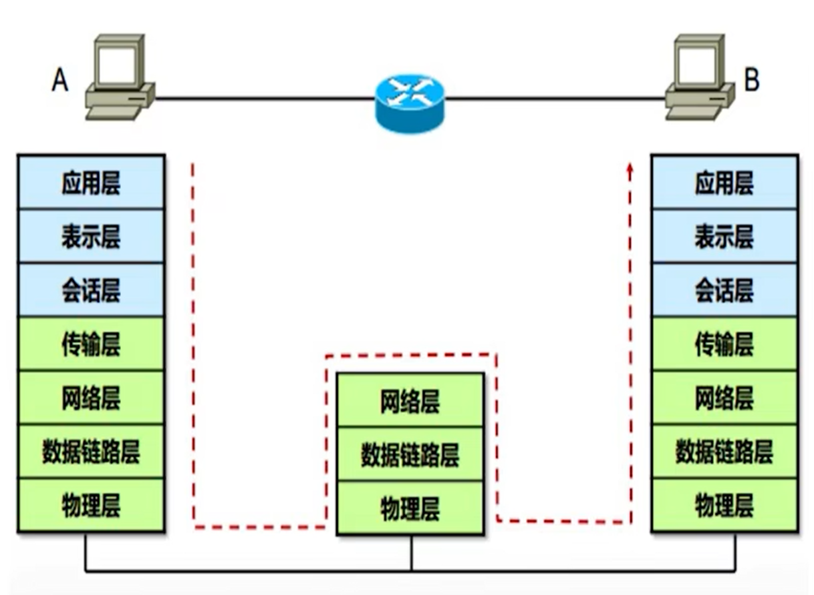

# 计算机网络基础知识

## 互联网

网络的网络

### 网络
电话网，蜘蛛网，人与人之间的社交关系等等。是包括结点和边之间的关系，与其大小形状等无关的拓扑。

### 计算机网络
由联网的计算机构成的系统，包括**主机节点**(数据的源和目标)，**数据交换节点**(交换机路由器等，是数据的中转节点)，**链路**将节点连接在一起。

电脑通过网线连接到最近的一个交换机，叫接入网，**接入链路**。 
交换节点之间叫**骨干链路**。

协议：支撑互联网工作的一些标准。不同厂商设备互操作。对等层实体在通信过程中应该遵守的规则的集合，包括语法语义和时序。

### 互联网
以TCP/IP协议簇支撑工作的网络。 

基础设施为应用层提供服务，从服务的角度看，互联网是分布式应用进程以及为分布式应用进程提供通讯服务的基础设施。

## OSI模型
Open System Interconnection Reference Model

OSI分七层，TCP/IP模型分四层，自下而上从一开始。

### 物理层

物理层的主要作用是产生并检测电压发送和接收带有数据的电气信号。物理层不提供数据纠错服务，但是能对传输速度进行控制，监测出错的情况。传输的数据是数字信号，**比特流**。

集线器：单纯的连接。

转换器：调制解调器(猫)就是转换器之一，将电话线上的信号转换为数字信号。

中继器：信号放大。

除了网线外，还有光纤，无线电波等介质。

### 数据链路层

数据链路层决定数据通讯的机制，差错检测。提供对网络层的服务。合成传输的**数据帧**。链路层对应的是tcp/ip中的接口部分。

MAC，meda access control，又叫以太网地址，代表网卡的唯一性(全球)。

交换机：二层设备，靠MAC地址管理和连接硬件设备。

MAC地址由48位二进制数组成，通常表示为12个16进制数。前24位由IEEE制定，用于标识制造商，后24位厂家自己制定，供应啥对网卡的唯一编号。还有一种格式是每四位十六进制数之间以点分隔。

### 网络层

为网络设备提供逻辑地址，负责数据从源端发送到目的端，负责数据传输的寻径和转发。

在一个小范围内，可以依靠MAC地址转发数据。但是在全球范围内不适用，只靠MAC地址寻址是很困难的。为了能大范围精准找到设备，增加了IP。

涉及的设备主要有路由器，依靠IP地址逻辑选路。交换机组件局域网，依靠MAC地址转发，使用路由器作为网络节点，一条一条转发寻找最快路径，交换机不识别IP地址，是二层设备，所以不能上网。

### 传输层

为端系统的应用程序转发数据，通过端口号区分上层协议，主要有TCP、UDP。 

TCP有丢包重传，可靠。

### 会话层
允许用户使用简单易记的名称建立连接。

### 表示层
协商数据交换格式。

### 应用层

应用程序，用户的应用程序和网络之间的接口。会话、表示层也可以算某种应用程序，本身并没有什么区别。应用层需要发送数据时会启用传输层。

### 数据传输过程

PC端的应用程序产生应用层数据(**payload**)，传输层对应用层数据封装，加上(TCP/UDP)协议头部，包含应用层提供的端口号。

传输层将数据(**segment**)下发给网络层，网络层封装数据，加上IP协议头部，IP协议报头中的协议号表示上层(传输层)协议类型。

数据链路层再对网络层数据(**packet**)进一步封装，加上数据链路层协议头部，包含源目MAC和上层协议类型。

该数据(**frame***)发出后被交换机、路由器转发。交换机只识别二层头部，按照源目MAC在局域网内短距离传送，到达路由器。路由器识别二层和三层的报头，路由器解开二层封装，按照源目IP封装新的二层头部后转发出去，知道最后到达目的终端。

对端收到数据包后按照每层解封装，将数据传送到应用层，回复的数据也每层封装后返回。

## IP地址

IP地址由32位二进制数组成，一般由点分十进制表示，四个字节。

第一个字节用于划分IP地址分类，可以叫做主网号、主类。

127的地址段给主机作为**环回地址**，loopback。可以理解为虚拟IP，数据发出去还能发回来。假设主机有一个物理网卡和一个IP地址，但是操作系统有一个虚拟IP地址，存在于内存中。环回接口就相当于内存的接口，可以用于测试网卡是否能工作。

主机ping自己的环回地址，能通说明网卡是正常的

严格意义上讲127还算A类地址。

ABC类地址是可以正常使用的，D类是多播、组播地址，E类地址科研保留。常见的只有ABC类。

每个不同分类的地址系统默认的子网掩码不一样。子网掩码将IP地址分为网络位和主机位。**子网掩码必须是连续的1和连续的0**。假设C类地址192.168.1.1/24，24位子网掩码，前24位为网络位，后8位为主机位。网络位表示同一个局域网的IP地址，此例中为192.168.1，是不可变的。主机位表示在该网络下的不同主机。

主机位全为0(网段的第一个地址)的地址表示该网段所有主机，该地址是不能被分配的。该地址用于路由寻址。 
主机位权威1(网段的最后一个地址)的地址为广播地址。该网段的所有地址，都能跟该地址通信。发往该地址的信息，能够被所有其他主机收到。 
除去上述两个地址，剩余的地址为主机地址，可以分配。

255.255.255.255为全广播，0.0.0.0代表任何网络。

### VLSM
可变长子网掩码，缓解IP地址紧缺而产生。

上述例子中，最大合理地使用IP地址就是应用VLSM。通过增加子网掩码位数，将网络缩小，分成多个子网。 
掩码增加一位，分成两个子网：192.168.1.0/25和192.168.128.0/25，每个网段有126个可用地址。 
掩码增加两位，分成4个子网：192.168.1.0/26，192.168.1.64/26，192.168.1.128/26，192.168.1.192/26 
子网掩码最多变到30位，可用地址只有两个。31位的网段没有地址(除去全0和全1)。

## 交换机
### 工作机制
&ensp;&ensp;&ensp;&ensp;交换机在数据通信中完成两个基本操作： 
&ensp;&ensp;&ensp;&ensp;&ensp;&ensp;&ensp;&ensp;①构造和维护MAc地址表 
&ensp;&ensp;&ensp;&ensp;&ensp;&ensp;&ensp;&ensp;②交换数据帧打开源端口与目标端口之间的数据通道，把数据帧转发到目标端口上。 

&ensp;&ensp;&ensp;&ensp;交换机中有一个交换地址表，记录着主机MAC地址和该主机所连接的交换机端口之间的对应关系，并由交换机采用动态自学习源MAC地址的方法构造和维护。 
&ensp;&ensp;&ensp;&ensp;在交换地址表为空时，表中无地址记录。当某一主机发送数据帧时，交换机会把该主机MAC地址与端口地址记录到表中，并向所有其他主机发送该数据帧（泛洪）。只有主机发送数据帧时，MAC地址才会跟端口一起记录到表中。 
&ensp;&ensp;&ensp;&ensp;下一次发送数据帧时，交换机会提取数据帧的目的MAC地址，在表中查找到该MAC地址对应的端口，交换机就打开源端口与目的端口的通道，转发。 
&ensp;&ensp;&ensp;&ensp;交换地址表的记录有一个时间标记，每次使用该条记录时，时间标记会被更新。一段时间内没有更新的话，该条记录就会被移除。 

### 交换方式

#### 直通 Cut-through
&ensp;&ensp;&ensp;&ensp;采用直通方式的交换机可以理解为各端口之间的纵横交叉的线路矩阵交换机。收到数据帧时，会检测帧头，获取目的地址，然后查表转换为相应端口，在输入与输出交叉处相连完成转发。 
&ensp;&ensp;&ensp;&ensp;由于只检查帧头的14字节，不需要存储，所以延迟小，交换速度快。 
&ensp;&ensp;&ensp;&ensp;缺点： 
&ensp;&ensp;&ensp;&ensp;&ensp;&ensp;&ensp;&ensp;①由于数据帧没有被交换机存储，所以无法检测数据帧是否有误。 
&ensp;&ensp;&ensp;&ensp;&ensp;&ensp;&ensp;&ensp;②输入/输出端口间有速度上的差异，连接到高速网络时，没有缓存直接接通输入/输出容易丢帧。 
&ensp;&ensp;&ensp;&ensp;&ensp;&ensp;&ensp;&ensp;③交换机端口增加时，交换矩阵变得越来越复杂，硬件实现困难。 

#### 存储转发 Store-and-Forward
&ensp;&ensp;&ensp;&ensp;是使用最为广泛的方式。把输入端口的数据帧先缓存，然后进行CRC校验。处理错误帧之后才取出目的MAC地址，通过查表得到输出端口之后送出帧。 
&ensp;&ensp;&ensp;&ensp;优点： 
&ensp;&ensp;&ensp;&ensp;&ensp;&ensp;&ensp;&ensp;①有错误检测，提高了传输可靠性。 
&ensp;&ensp;&ensp;&ensp;&ensp;&ensp;&ensp;&ensp;②支持不同速度间的转换。 
&ensp;&ensp;&ensp;&ensp;缺点： 
&ensp;&ensp;&ensp;&ensp;&ensp;&ensp;&ensp;&ensp;数据缓存、校验影响交换速度。但在不稳定的网络环境下，该方式仍然能提高网络性能。 

#### 碎片隔离 Fragment Free
&ensp;&ensp;&ensp;&ensp;这是介于直通式和存储转发式之间的一种解决方案。首先检查数据帧长度是否有64字节。小于64字节说明是假帧(残帧)，丢弃。大于64则发送。该方式不提供数据校验，速度大于存储转发式，小于直通式。广泛用于低端交换机中。 
&ensp;&ensp;&ensp;&ensp;这类交换机使用了一种特殊的缓存。是一种先进先出的缓存(FIFO)。如果帧以小于512bit的长度结束，那么FIFO中的内容都被丢弃。 

## 路由器

### 工作原理
&ensp;&ensp;&ensp;&ensp;IP地址是与硬件无关的逻辑地址，分为网络号和主机号。用子网掩码来确定网络号和主机号。子网掩码中的数字1对应的IP地址部分为网络号，0对应的是主机号。同一网络中的计算机网络号是一样的，这种网络成为IP子网。 
&ensp;&ensp;&ensp;&ensp;路由器用于连接多个逻辑上分开的网络。所谓逻辑网络，代表一个单独的网络或子网。路由器上的多个端口，用于连接多个不同的IP子网。每个端口对应一个IP地址。并与所连的IP子网同属一个网络。各子网中的主机通过自己的网络把数据送到所连接的路由器上，再由路由器根据路由表选择到达目标子网所对应的端口，并将数据转发到所对应的子网上。 

## 存储

### 概述

&ensp;&ensp;&ensp;&ensp;企业级存储通常被称为“磁盘阵列”。计算机存储的发展路程：纸袋->磁带->硬盘。 
&ensp;&ensp;&ensp;&ensp;硬盘：分为SATA,SAS和SSD。SATA，SAS是传统机械硬盘，用磁性碟片存储数据，SSD使用芯片存储数据，又名固态硬盘。SSD性能是机械硬盘的几十倍，但是价格高，寿命短。 
&ensp;&ensp;&ensp;&ensp;DAS-盘柜，直连式存储(Direct-Attached-Storage)。使用独立的磁盘柜来放置本来放置在服务器中的磁盘，并单独配置供电模块，服务器直接管理磁盘，扩展了服务器存储空间。对于要求大空间的业务，受限于单磁盘容量并出于数据安全的考虑，需要使用大量的磁盘组成RAID来提供更高效更安全的服务(Redundant Arrays of Independ Disks，磁盘阵列)。使用DAS的系统中，RAID计算由服务器完成。 
&ensp;&ensp;&ensp;&ensp;磁盘阵列，使用专门的控制器来完成RAID计算以及其它存储功能，提升I/O性能，而且减轻了服务器的压力，提供强大的数据管理功能。单控制器->双控制器->多控制器。

&ensp;&ensp;&ensp;&ensp;对于计算机数据来说，数据只有三种状态：计算、传输、存储。 
&ensp;&ensp;&ensp;&ensp;分别对应三大基础设施：服务器、网络、磁盘阵列。

&ensp;&ensp;&ensp;&ensp;计算：数据的形式转化，，服务器、PC手机都属于计算设备。 
&ensp;&ensp;&ensp;&ensp;网络：网络承载数据的跨空间传播。网络设备包括：交换机、路由器、无线设备。 
&ensp;&ensp;&ensp;&ensp;存储：存储承载数据的跨时间传播，将数据保存下来。

&ensp;&ensp;&ensp;&ensp;IT基础设施层面的发展： 
&ensp;&ensp;&ensp;&ensp;&ensp;&ensp;&ensp;&ensp;1980~1990，以大型计算机为核心，纸袋穿孔记录数据。 
&ensp;&ensp;&ensp;&ensp;&ensp;&ensp;&ensp;&ensp;1990~2000，以PC为核心 
&ensp;&ensp;&ensp;&ensp;&ensp;&ensp;&ensp;&ensp;2000~2010，以网络为核心。 
&ensp;&ensp;&ensp;&ensp;&ensp;&ensp;&ensp;&ensp;2004~，以数据为核心。 
&ensp;&ensp;&ensp;&ensp;&ensp;&ensp;&ensp;&ensp;(这几个时间都是大致的) 

&ensp;&ensp;&ensp;&ensp;磁盘阵列架构发展： 
&ensp;&ensp;&ensp;&ensp;&ensp;&ensp;&ensp;&ensp;软件RAID。通过操作系统中的软件实现RAID功能，但是要耗费大量计算资源。 
&ensp;&ensp;&ensp;&ensp;&ensp;&ensp;&ensp;&ensp;硬件RAID卡。由RAID卡提供RAID计算所需要的资源，不会占用系统资源，但是由于空间限制一台计算机无法连接多个硬盘，而且这样做不利于多服务器共享资源来实现集群或HA功能。 
&ensp;&ensp;&ensp;&ensp;&ensp;&ensp;&ensp;&ensp;单控制器磁盘阵列。把RAID保护的功能转移到主机外，实现了存储与计算的分离。通过SCSI、SAS、FC、IP等接口把更多台主机同时连接到外部存储器上，以实现对集群功能的支持。同时可连接更多的硬盘。 
&ensp;&ensp;&ensp;&ensp;&ensp;&ensp;&ensp;&ensp;双控制器磁盘阵列。提高存储的冗余性，来避免单点故障。 
&ensp;&ensp;&ensp;&ensp;&ensp;&ensp;&ensp;&ensp;多控制器磁盘阵列。更多控制器，更强性能。控制器之间耦合比较强，结构复杂，一般只有高端存储采用。 

### RAID
Redundant Arrays of Independ Disks

#### RAID0

&ensp;&ensp;&ensp;&ensp;RAID0将N块硬盘上选择合理的带区来创建带区集，将数据分割成不同条带分散写入到所有的硬盘中同时进行读写。多块硬盘的并行操作使同意时间内磁盘读写速度提升N倍。但是整个系统非常不可靠，如果出现故障，无法进行任何补救。 
&ensp;&ensp;&ensp;&ensp;创建带区集的时候，需要合理地选择带区的大小。如果带区过大，可能一块硬盘上的带区空间就可以满足大部分I/O操作，使数据读写仍然只局限在少数的一两块银盘上，不能充分发挥并行优势。此外，如果控制器少的话，频繁读写很容易使控制器或总线负荷超载。最好一个磁盘一个控制器。

#### RAID1
&ensp;&ensp;&ensp;&ensp;RAID1成为磁盘镜像，原理是把一个磁盘的数据镜像到另一个磁盘上。在写入一块磁盘使，会在另一块闲置的磁盘上生成镜像文件，在不影响性能的情况下最大限度地保障系统地可靠性和可修复性。只要系统中任何一对镜像盘中至少由一块磁盘可以使用，甚至可以在一半数量的硬盘出现问题时系统都可以正常运行，当一块硬盘失效时，系统会忽略该硬盘，转而使用剩余的镜像盘读写数据。坏掉的硬盘需要及时更换，不然镜像盘也坏了，系统会崩溃。 
&ensp;&ensp;&ensp;&ensp;RAID1通过二次读写实现磁盘镜像，所以控制器负载也比较大。

#### RAID0+1
&ensp;&ensp;&ensp;&ensp;是RAID0和RAID1的结合。至少要4块盘。在磁盘镜像中建立带区集。数据除分布在多个盘上外，每个盘都有物理镜像盘。

#### RAID2
&ensp;&ensp;&ensp;&ensp;RAID2带海明码校验。将数据条块话分布于不同的硬盘上，条块单位为位或字节，使用一定的编码技术来提供错误检查及恢复。需要多个磁盘存放检查及恢复信息，技术实施复杂，商业环境很少用。

#### RAID3
&ensp;&ensp;&ensp;&ensp;RAID3带奇偶校验码的并行传送。与RAID2类似，数据存放在多块盘上，用户要有3个以上驱动器。但与RAID2不同，只能查错不能纠错。

#### RAID4
&ensp;&ensp;&ensp;&ensp;RAID4和RAID3很像，但它对数据的访问是按数据块进行，每次是一个盘。失败恢复的难度、控制器设计难度比RAID3大得多，访问数据效率不怎么好。

#### RAID5
&ensp;&ensp;&ensp;&ensp;RAID5，分布式奇偶校验的独立磁盘结构。奇偶校验码存放在所有磁盘上。读出效率高，写入效率一般。奇偶校验码在不同盘上，提高了可靠性。但是对数据传输的并行性解决不好，控制器的设计也相当困难

#### RAID6
&ensp;&ensp;&ensp;&ensp;RAID6，带两种分布存储的奇偶校验码独立磁盘结构，是对RAID5的扩展，主要用于要求数据绝对不能出错的场合，需要N+2个盘，控制器设计十分复杂，写入速度不好，计算奇偶校验值和验证数据正确性花费的时间比较多。

#### RAID7
&ensp;&ensp;&ensp;&ensp;优化的高速数据传送磁盘结构。RAID7所有I/O传送是同步进行的，可以分别控制，这样提高了系统的并行性，提高系统访问数据的速度。

#### RAID10
&ensp;&ensp;&ensp;&ensp;一个带区结构加一个镜像结构。

#### RAID53
&ensp;&ensp;&ensp;&ensp;RAID3和带区结构的统一，价格十分高，不易于实现

#### RAID5E
&ensp;&ensp;&ensp;&ensp;在RAID5上的改进，数据校验信息均匀分布在各个盘上，但是每个硬盘都有一个未使用的空间没有进行条带化，最多允许两块物理盘故障。看起来RAID5E和RAID5加一块热备盘差不多，但RAID5E>RAID5+热备盘。一块硬盘故障时，所有故障盘上的数据会被压缩到其他硬盘上未被使用的空间，逻辑盘保持RAID5级别。

#### RAID5EEE
&ensp;&ensp;&ensp;&ensp;每个硬盘的一部分空间作为热备盘，是阵列的一部分，当阵列中一个物理盘出现故障时，数据重建的速度会更快。

:::tip
一般在数据库场景都用RAID10
:::
