# CCNA

## 计算机网络基础

### 企业网络结构
企业网络基本的四层结构
* 底层：用户设备，如电脑、手机、打印机等
* 用户设备之上：接入层网络，用户设备通过接入层网络接入互联网中，也存在专门的设备，包括光传输网络。涉及交换机(二层设备)、路由器(三层设备)等设备。 电信号。接入方式：无线AP 2.4G/5G无线电波，有线网络(双绞线RJ45)
* 接入层网络之上：汇聚层网络，汇聚接入网锁接入的数据
* 汇聚层之上：核心层，对数据进行传递和交换
<div align=center></div>

### OSI七层参考模型

* **应用层** 数据(**PDU**)一般由应用层下发
* **表示层** 对数据加密、解密和封装
* **会话层** 建立、维护、管理会话连接，管理和终止表示层实体之间建立的通信会话。
* **传输层** 建立、维护、管理端到端的连接。传输层提供本端设备和对端设备的连接，面向连接**TCP**，不面向连接**UDP**
* **网络层** 进行IP寻址和路由选择
* **数据链路层** 控制网络层和物理层之间的通信，通过地址寻址**MAC**。MAC地址与ip地址是对应的，网卡的ip地址可以随时更换(逻辑层面)，但是网卡的mac地址不能更换(物理层面)。通过**ARP**协议进行MAC地址和ip地址的转换。**网络中真正要寻找的是MAC地址**
* **物理层** 进行**比特流**传输
<div align=center>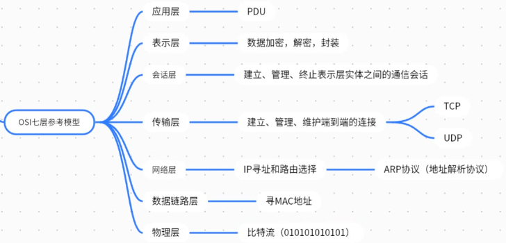</div>

|层|数据名称|
|-|-|
|应用层|PDU|
|表示层|PDU|
|会话层|PDU|
|传输层|数据段Segment|
|网络层|数据包Packet|
|数据链路层|数据帧Frame|
|物理层|比特流Bit Stream|

#### 数据包封装
PDU到达传输层后，完整数据分为若干段，每一段加上一个**头部**，有两种头部，与协议相关：TCP和UDP
**TCP头部**
<div align=center>
<table>
    <tr>
        <td colspan="1">0</td><td colspan="1">1</td><td colspan="1">2</td><td colspan="1">3</td>
        <td colspan="1">4</td><td colspan="1">5</td><td colspan="1">6</td><td colspan="1">7</td>
        <td colspan="1">8</td><td colspan="1">9</td><td colspan="1">10</td><td colspan="1">11</td>
        <td colspan="1">12</td><td colspan="1">13</td><td colspan="1">14</td><td colspan="1">15</td>
        <td colspan="1">16</td><td colspan="1">17</td><td colspan="1">18</td><td colspan="1">19</td>
        <td colspan="1">20</td><td colspan="1">21</td><td colspan="1">22</td><td colspan="1">23</td>
        <td colspan="1">24</td><td colspan="1">25</td><td colspan="1">26</td><td colspan="1">27</td>
        <td colspan="1">28</td><td colspan="1">29</td><td colspan="1">30</td><td colspan="1">31</td>
    </tr>
    <tr>
        <td colspan="16" align="center">源端口</td>
        <td colspan="16" align="center">目的端口</td>
    </tr>
    <tr>
        <td colspan="32" align="center">序列号，数据段在PDU中的分段序号</td>
    </tr>
    <tr>
        <td colspan="32" align="center">确认号，接收端回传收到包的序列号+1的确认号ACK</td>
    </tr>
    <tr>
        <td colspan="4" align="center">头部长度</td>
        <td colspan="6" align="center">控制字段</td>
        <td colspan="4" align="center">数据偏移</td>
        <td colspan="16" align="center">窗口</td>
    </tr>
    <tr>
        <td colspan="24" align="center">选项(长度可变)</td>
        <td colspan="8" align="center">填充</td>
    </tr>
</table>
</div>

**UDP头部**
<div align=center>
<table>
    <tr>
        <td colspan="16" align="center">0~15</td>
        <td colspan="16" align="center">16~31</td>
    </tr>
    <tr>
        <td colspan="16" align="center">源端口</td>
        <td colspan="16" align="center">目的端口</td>
    </tr>
    <tr>
        <td colspan="16" align="center">总长度</td>
        <td colspan="16" align="center">校验和</td>
    </tr>
    <tr>
        <td colspan="32" align="center">数据</td>
    </tr>
</table>
</div>

数据到达网络层后，数据段会被划分成数据包，并加上对应协议的头部。每一个包都会包含段的头部跟ip包的头部。

数据包加头部和尾部之后成为数据帧。尾部FCS，帧校验序列，检查帧传递过程中有没有丢失或者替换。数据链路层头部一般有两种格式，以太网二型和IEEE802.3。
* 以太网二型(EthernetⅡ)数据帧格式为 D1MAC，S1MAC，type, data和帧尾FCS。
* IEEE802.3帧格式为 目的MAC，源MAC，长度length(表示data部分字节数)，LLC(逻辑链路控制)，SNAP(由机构定义，机构定义和代码决定)，data，FCS。

所要传送数据帧大小超过1536字节时使用以太网二型，小于1500时采用IEEE802.3格式。

PDU(应用层表示层会话层)->数据段(传输层)->数据包(网络层)->数据帧(数据链路层)。

物理层将数据帧转变成比特流在介质中传输。传输介质包含同轴电缆，双绞线，光纤，无线电波等。

双绞线线序：
* 橙白，橙，绿白，蓝，蓝白，绿，棕白，棕
* 绿白，绿，橙白，蓝，蓝白，橙，棕白，棕

一些老设备不同种设备之间使用交叉线，一端是第一种线序，另一端是第二种线序<br />
同种设备使用直连线，两端线序一样。<br />
现在的设备有自适应功能，连线不需要考虑是交叉线还是直连线。

光纤标准
* 10base-f 传输距离2km
* 100base-fx 传输距离2km
* 1000base-lx 传输距离316m
* 1000base-se 
每一个标准下又分单模和多模，取决于光纤纤芯粗细，多模比较粗，单模比较细。单模光纤，只能传输单一的光，传输距离远。

#### 数据包解封装

路由器接收到比特流后会转换成数据帧，查看帧中的MAC地址是不是自己的MAC地址；不是则继续解析到网络层，查看目的IP地址是不是自己的IP地址；不是则查路由表中对应的ip地址该从哪个接口发出。在发送数据前重新封装数据，发送给下一个地址。

当目的机器接收到数据包后，会将比特流转换为数据帧，判断数据帧的目的mac地址是否为自身mac地址。如果目的是自己，则一层层继续解封装，最后获取数据。

封装和解封装过程只涉及三层设备，例如防火墙，路由器，和三层交换机。二层设备，例如二层交换机，只解析到数据链路层。
* 三层设备根据路由表转发。
* 二层设备根据MAC地址表转发。

### 各层协议
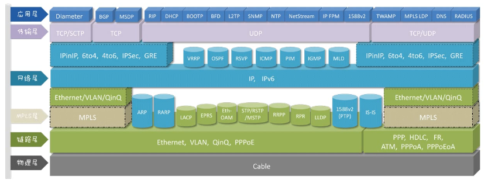

## 思科基础命令集

<!--
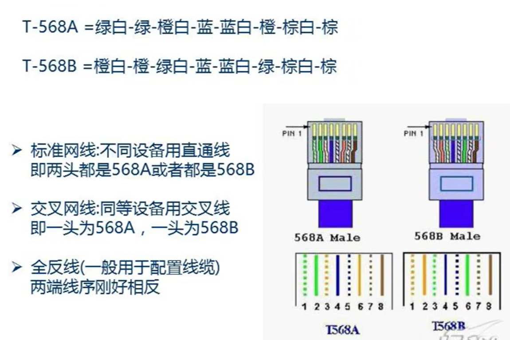

直通线：两头都是A或B，交叉线：一头A一头B。接口带自适应，一般都做两头B

Cisco Packet Tracer中要求相同设备用交叉线，不同设备用直通线。
-->

### Cisco IOS 模式

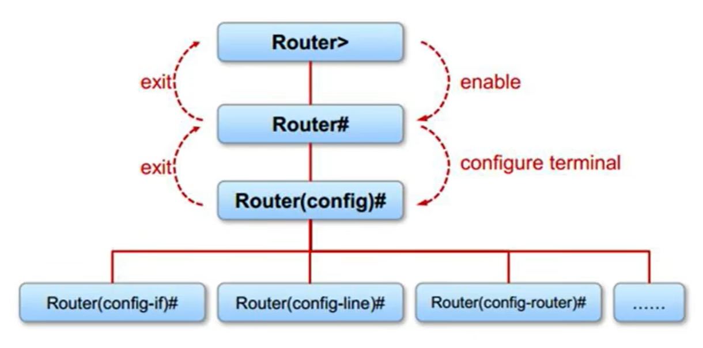

#### 用户模式\>

**用户模式**(相当于登录前)对于Cisco IOS来说什么都做不了，只能查看用户等级，退出或者进入。

**使用命令enable进入特权模式**

Tab可以补全命令

不完整的命令打？，系统可以提示有哪些相关命令

```shell
Router> enable
```

#### 特权模式\#

特权模式用于查询和测试。

**运行config terminal进入全局配置模式**

```shell
Router> enable
Router# configure terminal
Router(config)# 
```

很多配置都是基于全局配置模式。若要配置IP，只能在接口上配置，所以需要基于全局配置模式进入接口。

每个接口都有接口号，在全局模式下输入 interface [接口编号] 就能进入接口

接口类型+0/0，第一个数字是设备的插槽号，第二个数字是接口编号。

#### 接口模式

```shell
Router> enable
Router# config terminal
Router(config)# interface f0/0
Router(config-if)# 
```

ip地址配置ip address + ip地址 + 子网掩码<br />
设备接口在默认情况下都是关闭的，用no shurdown启用接口

```shell
Router(config-if)# ip address 192.168.1.1 255.255.255.0
Router(config-if)# no shutdown
```

命令只要正常合法就不会有提示，出错会有报错
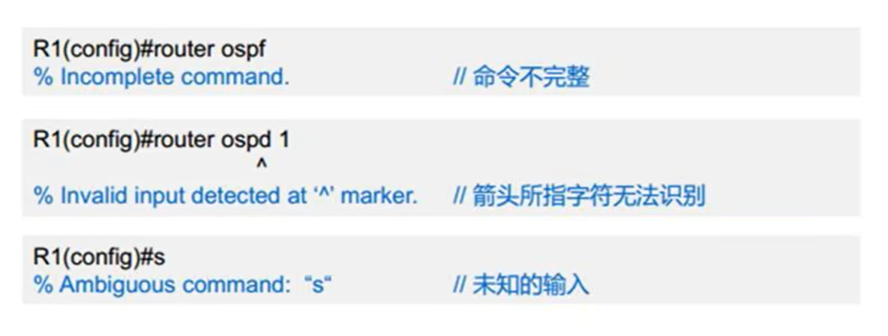

### 常用命令

#### 退出

##### exit
返回上一级
```shell
Router(config-if)# exit
Router(config)# exit
Router# exit
Router>
```

##### end
直接回到**特权模式**

#### 查询

在**特权模式**下查询

running-config 正在运行的配置，保存在RAM中。
```shell
# 查看正在运行的配置
Router# show run
Router# show running-config
# 命令回显配置情况
```

查看ip接口的配置情况
```shell
Router# show ip interface brief # 查看接口有没有配置ip地址，有没有开启
```

#### 修改主机名

```shell
Router# hostname ?
    WORD This system's network name
Router# hostname rl
rl#
```

#### 设置密码

进入特权模式需要输入的密码
```shell
Router(config)# enable password 123
```

enable password的密码能够被show run看到，进入全局模式删除enable password进行删除。

在某个模式下以某种方式运行的命令，在其之前加上一个no可以进行删除。若命令中有用户决定的输入，则在删除时将其去掉
```shell
Router(config)# enable password 123
Router(config)# no enable password
```

enable secret设置的密码不会被show run看到
```shell
Router(config)# enable secret 123
```

#### 快捷键
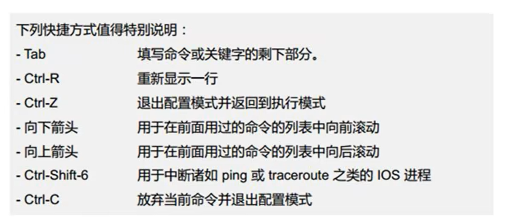

#### 工程三招(但是好像并没有用)

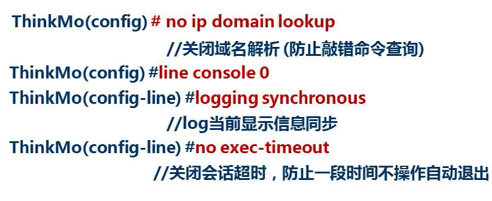

##### 关闭域名解析
关闭域名解析，防止在**特权模式**下敲错，防止在测试时敲错。全局模式敲错会报错，特权模式敲错的会将错误的命令当作域名。<br />
ip domain lookup 再次开启
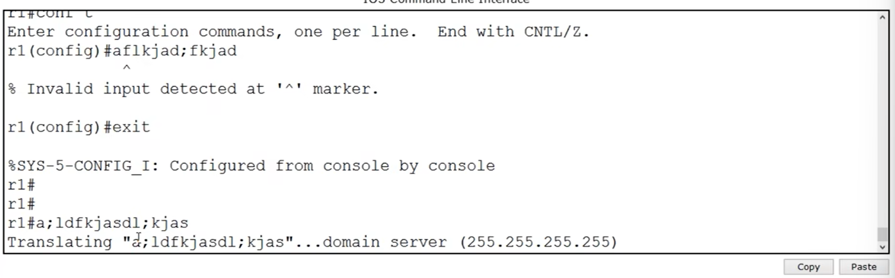

##### 显示信息同步
line，线路，包括console，telnet vty，aux

line console 0 进入控制台

logging synchronous 显示信息同步。有时候可能正在输入的信息会被输出信息打断，设置同步后，弹出信息之后会把之前的信息缓过来，显示的是连续的
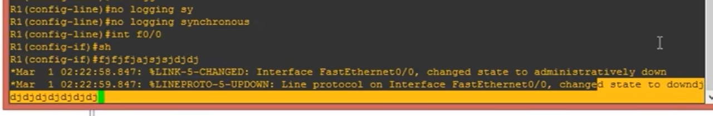

##### 关闭会话超时

no exec-timeout

在console 0中关闭会话超时。

## IP子网划分

主机对IP地址通信的要求
1. 网络中IP地址必须唯一
2. 在一个交换网络中主机必须有相同的网络号才能通信
3. 在不同的交换网络中(路由器分开的网络)，主机不能有相同的网络号

### IP寻址

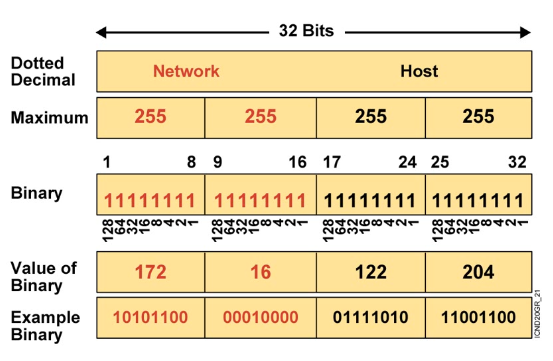

IP地址长度为32bits，分为四段，8bits为一段。每段之间用 . 分隔。

网络位和主机位由掩码区分，表示方式与IP一样，也是点分十进制，但是掩码是连续的1和连续的0

主机位全为0的地址是网络地址，即网段；主机位全为1的地址是广播地址。

### IP地址分类

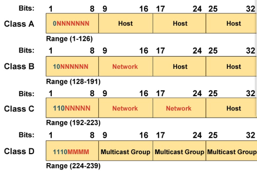

A类地址第一个8位段第一位为0，最大为127，最小为0，IP范围为0.0.0.0~127.255.255.255。由于127是环回地址，所以A类地址实际用的只有1~126

B类地址第一个8位段前两位为10。范围为128.0.0.0~191.255.255.255

C类地址前三位为110，网络号24位，ip地址范围为 192.0.0.0~223.255.255.255

D类地址前4位为1110，网络号8位。

E类地址 240.0.0.0~255.255.255.255

通常情况下只会用到前3类地址，D类地址为组播地址，E类地址为保留地址。

#### 私有地址

10.0.0.0-10.255.255.255

172.16.0.0-172.32.255.255

192.168.0.0-192.168.255.255

#### 特殊地址

环回地址：127.0.0.0·127.255.255.255

0.0.0.0 默认地址，可以代表任何网段

255.255.255.255 表示所有的设备

### 子网划分

例如172.16.0.0/16段的地址，在没有经过子网划分时可以划分2^16-2个地址。但是如果组织规模小，只用了几百个地址，会造成地址的浪费。或者一个公司有多个部门，不用每个部门都专门申请一个网段。

为了解决这些情况，可以调整掩码位数为24位，每个网段中的ip地址数变少了，但是可以分出很多子网。

扩增的部分是子网号。

### CIDR

无类域间路由，互联网连接路由器，路由器下连四个局域网。路由器分别把四个网段的数据转发到互联网，会导致网络中路由表规模很大，路由条目过多，查表效率低。


无类域间路由：将相邻网段的路由做聚合。例如下图四个网段的前22位是相同的，通过减少网络位位数，将这四个网段汇聚成1条路由，用一条路由表示其他四条路由。该条路由的网络位能够代表其他四条路由的网络位，该条路由网络位需要与其他四条路由网络位相同，掩码为16+6为22位，ip地址表示为10.24.0.0/22。此时路由器向外通告路由时就能只通告这一条路由。而且这四个网段能由10.24.0.0/22划分出来，增加两位子网号就能划分四个子网。

:::warn
上述四个网段是**互相相邻**的，是一个等差数列，表示网段都只占用了两位。使用无类域间路由时最好是相邻的网段且占用位数相同。

有可能造成路由黑洞，包含了这个掩码范围内有，但是实际上不在网络中的网段。
:::

路由黑洞

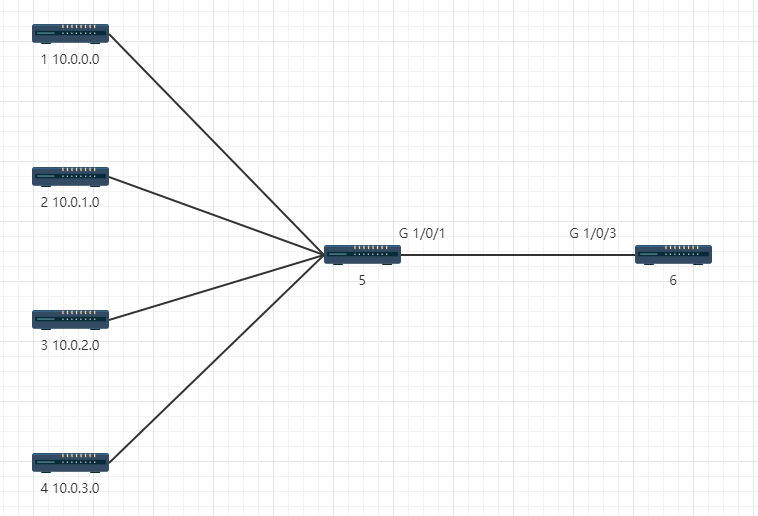

1 2 3 4号路由器会把自己的路由传递给5号路由器

路由器5向路由器6传递路由时，是1 2 3 4的聚合路由10.0.0.0/22
```shell
# 路由器6添加路由
ip route-static 10.0.0.0 255.255.252.0 G1/0/3

# 路由器5配置路由
ip route-static 0.0.0.0 0 G1/0/1
```
单独来看，这两条命令没有问题。但是如果
* 6号路由器下接的设备要访问1~4号路由器，报文由6号路由器G1/0/3发出，到达路由器5时匹配路由，又由G1/0/1发出到达6号路由器，数据在56中不断循环。
* 1号路由器访问4号路由器，报文到达5号设备时发送给6号设备，6号设备又发给5号，来回转发。

## ARP协议

**Address Resolution Protocol**，已知IP地址，解析MAC地址。通过ARP协议可以将网络地址映射为mac地址。

### MAC地址

**Media Access Control**，媒体访问控制地址，是网络上以太网或网络适配器的唯一标识。MAC地址能区分不同的网络接口，并用于多种网络技术，尤其是大多数IEEE 802网络。主要用于**识别数据链路中互联的节点**。

MAC地址长48位，3~24位为厂商识别码，25~48位为厂商内部使用的识别码。
<div align=center>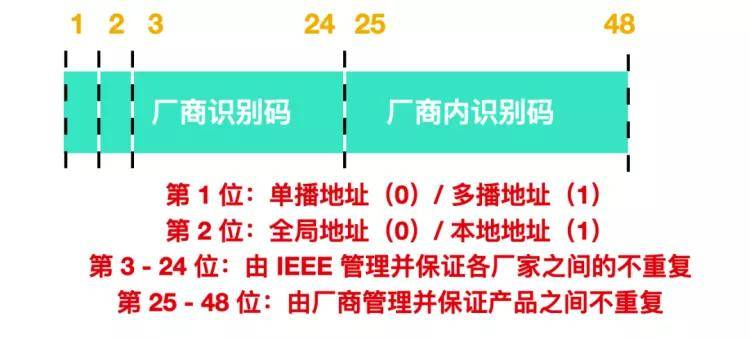</div>

在ping的过程中，在ICMP包外添加IP头部，包含源目IP，再封装以太网头部，包含源目MAC。源MAC是知道的，但不一定知道目的MAC地址。一般根据arp表查找目的ip对应的MAC地址，但是在初次ping时arp表中不一定有对应的表项。

在ping arp表中没有的地址时，会先发送一个arp广播请求，是一个二层包。包含以太网头部，跟数据部分。头部的源mac为自己的mac地址，目的MAc地址为广播的MAC，全为1。数据部分包含，硬件类型等。

32位的ip地址位于网络层封装在ip头部中，48位mac地址位于数据链路层。

主机通过arp协议解析目的mac地址，在自己的arp缓存表中记录目的ip地址和目的mac地址之间的对应关系。

通过arp -a 查询本机记录的arp表
```shell
arp -a
```

在数据转发之前一定要有arp缓存表，才能知道对端mac地址。

### 数据转发

PC1要访问PC3，在应用层产生数据，到达传输层加上源目端口号，到达网络层加上IP头部包含源目IP地址。目的IP地址为1.1.1.3，接下来继续封装到达数据链路层，加上数据链路层头部，有目的MAC和源MAC。

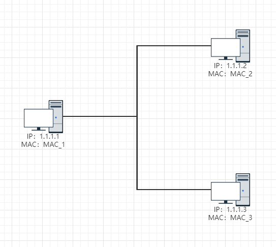

在第一次访问时，PC1不知道PC3的源MAC，会暂缓发送数据包，发送一个广播arp请求，源IP和源MAC地址为PC1的IP和MAC，目的IP为PC3IP地址，目的MAC地址为全1。
* 发送arp request包，目的MAC地址为全0，源MAC为PC_1的MAC地址。
* 封装arp包之后，在数据链路层封装帧头部，帧头部也会有目的和源mac。此时为广播形式，目的mac为全F，源mac为自己的mac地址。
* 数据链路层为广播地址，PC2和PC3都接收数据帧。PC3在收到数据包后会学习PC1的IP地址和MAC地址，同时单播向PC1回复arp relpy，包含自己的MAC地址。
* PC1接收到回复后学习到PC3的mac地址。

广播请求，单播响应。
<div align=center>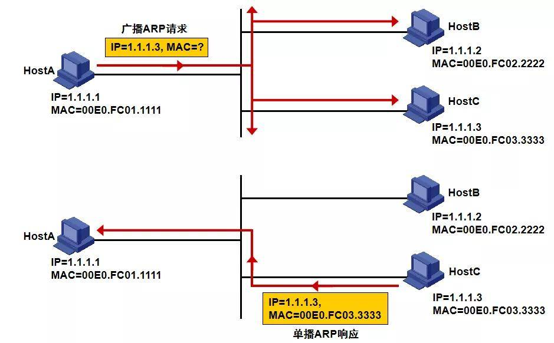</div>>

过程中最重要的是**缓存表**，所有转发的本质是arp缓存表中有没有ip地址和mac地址的对应关系，有对应关系时就可以不用发送arp请求。

arp缓存表中有一个老化时间，为1200s。mac地址表的老化时间为300s。数据在到达老化时间之前需要重新发送请求报文，进行更新。arp请求报文发送的时间间隔默认为5s。

在R1的f0/0抓包，之后用R1ping其他地址。
<div align=center>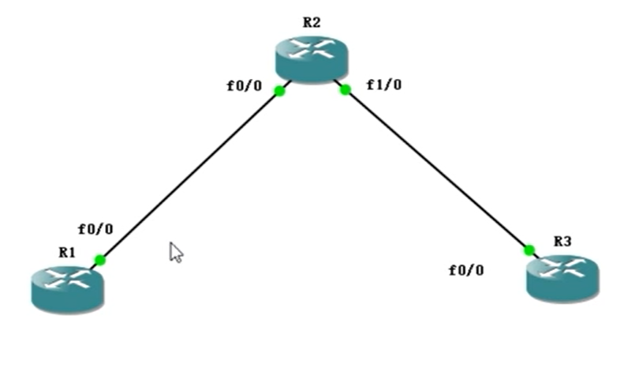</div>
ping的第一次不通，后续通了。
<div align=center>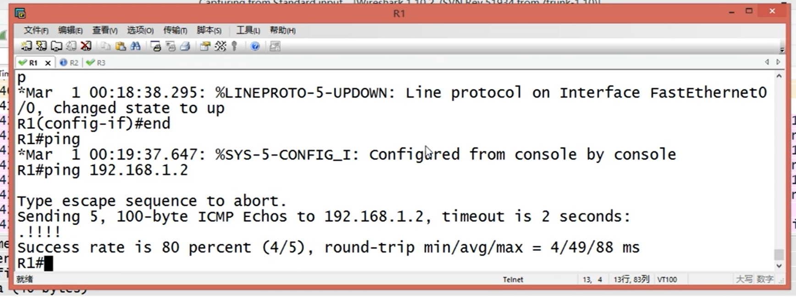</div>
第一次ping不通，抓到arp包
<div align=center>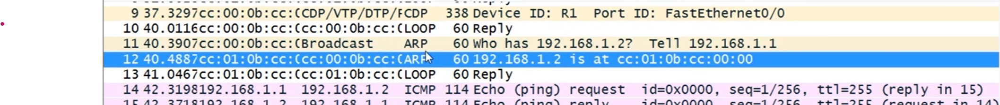</div>
arp广播请求，目的MAC地址全为F
<div align=center>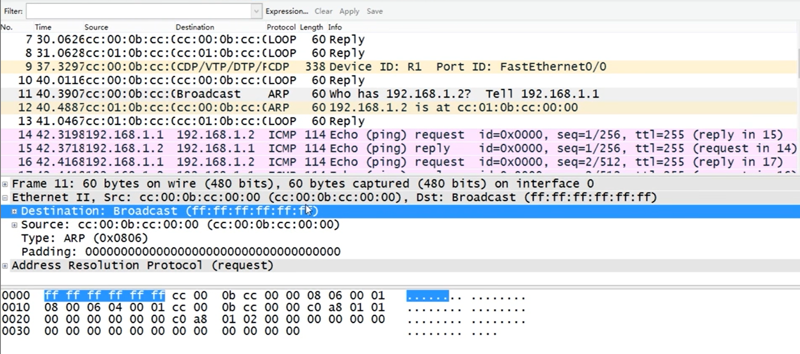</div>
arp回复单播给请求者，目的mac为请求者的mac
<div align=center>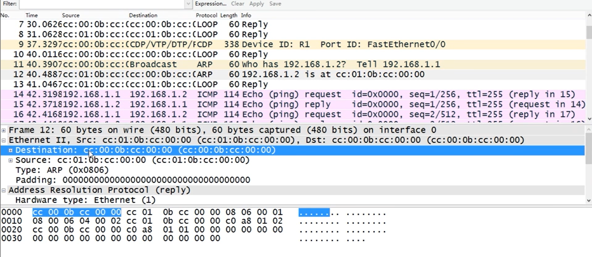</div>
在获取mac之后，在arp表中就有记录了。

若目的地址不在同一广播域，arp请求不到其他网段的mac。事实上，PC或路由器要请求目的MAC时，有针对性的请求。路由器在访问时，数据首先交给下一跳。当路由表里有下一跳地址时，并不请求目的IP的mac，而是请求下一跳地址的mac。

每过一个设备，以太网头部的源mac都会变成刚才经过设备出接口的mac地址。但是ip地址不一定会变(NAT)。

### arp代理
在路由器的路由条目中没有下一跳时，会触发代理arp。

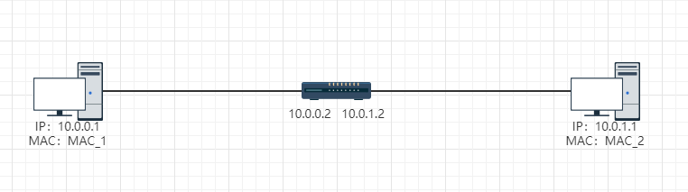

交换机的作用：隔离冲突域

路由器的作用：隔离广播域，路由器本身不转发广播报文

PC1和PC2处于不同的网段，PC1第一次与PC2通讯，请求PC2的MAC地址，无法请求。因为PC1请求MAC地址时采用的是广播方式，而路由器隔离广播域，所以PC1的广播报文在到达路由器的端口时会被丢弃，PC2无法收到PC1的报文。

解决方案：在路由器上开启arp代理功能。

开启arp代理后，PC1仍然请求PC2的MAC地址.PC1发送的arp请求目的IP为PC2的地址，目的MAC未知。当该arp请求到达路由器时，路由器先不处理该数据帧，收到包后会查找路由表。如果路由器中存在PC2的路由表项，则路由器会使用自己与PC2相连的接口发送arp request，同时用另一接口回复PC1的arp reply，路由器的该接口会假装自己是PC2。PC1收到请求后得知10.0.1.1对应的mac为路由器与pc直连的端口的请求，PC2会认为10.0.0.1的mac地址为10.0.1.2的mac地址。

在这种情况下可能会收到多台路由器的arp回复，arp遵循**后到优先**，后到的回复会替换之前到达的回复。
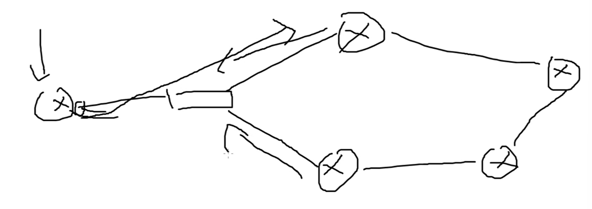

### arp攻击
由于arp是广播请求，所以同一网段内所有人都能听到，所以有可能被假冒，冒充网关等。

但是在ipv6中取消了这种机制，**后到优先**。

### 免费ARP
是arp协议的一个应用
* 网络中新加入一台设备，当网络中主机被分配了ip地址或者ip地址发生变更后，必须检测网络中ip地址是不是唯一的，避免地址冲突。当主机加入网络中后，主机会发送arp request，进行地址冲突检测。该arp request报文的格式为：以太网二型帧头部，包含源MAC地址为新加入主机的MAC地址，目的MAC地址为广播地址(全F)，让网络中所有设备都能接收到该报文。**arp报文中的源目ip地址均为新PC自己的IP地址**，目的MAC地址为空(全0)，源MAC为自己的MAC地址。如果有设备与自己的ip地址一样，就会有设备回复。若没有接收到回复报文，则该网络环境中没有与自己ip相同的设备。
* 涉及DHCP协议时，当网络环境中所有设备均采用dhcp协议获取地址时，这些地址有24h有效期。有效期到期时会重新分配地址。在重新分配地址时，设备首先会检测会不会协议新分配的地址已经被占用了。

### RARP
与arp协议相反，根据mac地址解析ip地址。使用相对较少。上世纪90年代的无盘网络中的无盘工作站，操作系统文件放在一台指定的服务器中，无盘工作站获取操作系统后引导。工作站的ip地址在操作系统中配置，而无盘工作站启动前没有地址和系统，服务器通讯获取系统又需要ip地址。

无盘工作站有MAC_A，没有IP地址，首先发送广播rarp请求，内容：源MAC为MAC_A，询问自己的ip地址。请求到达PC1和rarp服务器，只有rarp服务器会处理数据，当rarp服务器接收到请求后，为无盘工作站分配一个地址，响应包含MAC_A，和分配给它的地址。
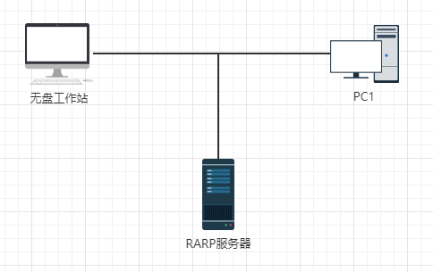

### GARP
通用属性注册协议，为处于同一个交换网中的交换机之间提供某种分发、传播和注册某种信息的功能。

三台交换机两两互联
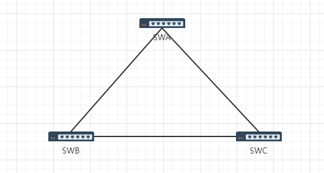

三台交换机之间发送GARP报文，注册、注销、传播交换机属性，提高交换机管理效率。例如vlan信息，组播地址信息。

garp在传递信息的时候会包含vlan信息，和组播地址

#### 报文结构
采用IEEE802.3格式封装

目的MAC地址，源MAC地址，长度等，最重要的是PDU部分。

目的MAC地址为固定的多播MAC地址01-80-C2-00-00-21。

GARP会使用PDU包含的信息定义属性，根据属性类型的字段，和属性列表的识别消息分类。
* 第一个属性数值为0，代表事件Leave All，1代表Join Empty，2代表Join in事件，3代表Leave Empty，4代表Leave in，5代表Empty

Join消息包含Join Empty和Join in，表示注册属性。例如运行了GARP的交换机希望其他交换机注册自己的属性，就会发送Join消息。SWA创建vlan10，向其他设备发送Join消息，SWB、SWC收到后，也会注册vlan10，同时向下行设备继续发送Join消息。
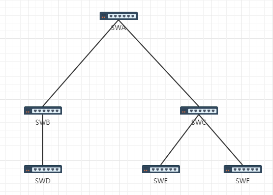

Leave消息表示注销。例如SWA要注销vlan20，向下行设备发送Leave消息，其他设备收到消息后会注销对应的属性，并继续向下行设备发送消息。Leave All表示注销所有属性，Leave in表示注销某一个属性。

Empty表示部分，注销或者注册部分属性。

## 静态路由协议

路由器按照路由表选路。

路由器是连接不同局域网以形成一个大的广域网的设备。交换机连接设备，形成一个局域网，通过路由器连接其他局域网。路由器在保证各个局域网独立时，还提供连通性。

路由器的接口隔离广播域，隔离地址段。路由器的每个接口地址都属于不同的地址段。

路由器转发数据时，根据数据包中IP头部的目的ip查询路由表，查看有无到达目的ip的路由。需要在路由器上填写静态路由，指定目的地址走的下一跳。

跳数：网络中经过路由器的个数；下一跳地址：下一个路由器的地址，自己能到达的并且有能力帮忙转发数据的路由器。

指定下一跳的方式会进行递归查询，根据提供的下一跳地址，再查询是否有到达下一跳地址的路由。

指定出接口可能会导致一些问题，例如路由不是最优，或者arp的问题(arp代理)。

```shell
ip route add [目的地址] [子网掩码] [下一跳地址]
ip route add [目的地址] [子网掩码] [出接口]
ip route add [目的地址] [子网掩码] [出接口] [下一跳地址]
```

默认路由，去往所有地址的路由。适用于末梢网络环境，边缘网络。
```shell
ip route 0.0.0.0 0.0.0.0 [出接口] [下一跳]
```

若同一目的地址段写多条不同下一跳的路由，同一条路由会出现并列的下一跳，叫做负载均衡。在匹配到这个路由时，会在每个接口/下一跳各发一个包，这样会不稳定。

掩码最长匹配规则，路由表中同一地址，但是不同掩码长度，会匹配最长掩码的路由条目。在没有匹配到别的路由时，会匹配默认路由。

## RIP

Routing Information Protocol，路由信息协议。

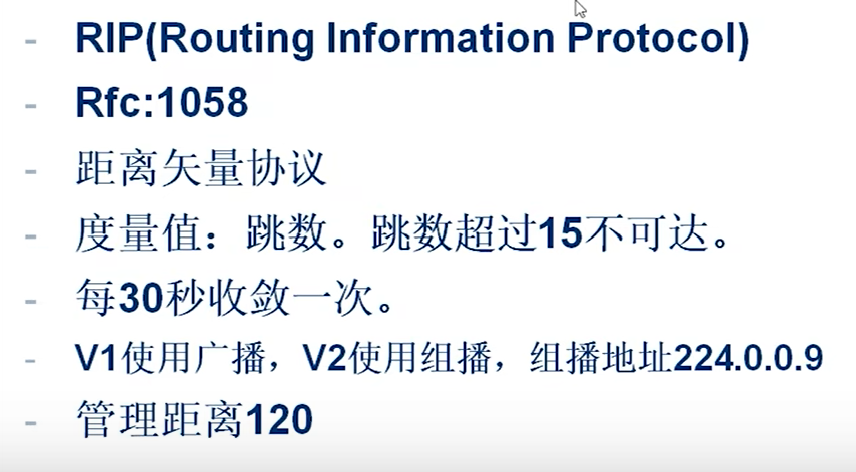

### 距离矢量
假设有三台路由器，以最左侧设备为参考。要将1.0段的路由通过RIP传到最右侧的路由器上。

现在1.0的路由处于最左侧的路由器中。最左侧路由器将路由传递给中间路由器。中间路由器从左侧接口收到1.0的路由，所以将左侧接口设置为1.0段的出接口（**方向**）。<br />
开销（**距离**）。中间的路由器和左侧路由器到1.0网段的距离是不一样的。中间的路由器相对于左边路由器到1.0差一个路由器，距离多1，方向为左侧的接口。右侧路由器由中间路由器收到1.0网段路由，到1.0网段距离为两个路由器，为2，方向为左侧接口。

:::TIPS
RIP传递的内容是路由表里的信息，路由。
:::

### 度量值
单位为跳数，网络中路由器节点的个数。是不同路由协议中计算开销用的。

超过15跳不可达，不继续传播，所以RIP不适用于很大的网络。

每30s收敛一次，每30s把整张路由表传递一次。

### 版本
主要针对ipv4地址，有两个版本。V1使用广播更新路由表。V2使用组播组播地址为224.0.0.9。D类地址都属于组播。

### 管理距离
对于路由协议来说，管理距离越小越优先。协议优先级。若多种路由协议获得同一条路由，路由表只显示最优先的。

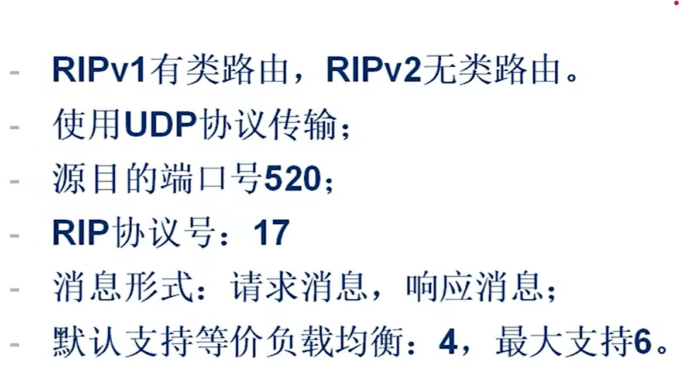
### 有类路由
有类路由是指所有的主机和路由器接口都有相同的子网掩码，有类路由不在路由更新中发送子网掩码。这意味着有类路由协议在具有真实子网掩码的信息充足的情况下，会假定有类IP边界，从而导致无法在每个有类IP网络中拥有多于一个子网掩码，或者即使掩码长度相同的情况下也通过不同的有类网络来分离子网。

在传递路由时不传递子网掩码，传到对端后，按照主类定义掩码。有可能不能精确地查找网段在哪。

### 无类路由
传递子网掩码，可以精确匹配。

由此看RIPv2在各方面都比RIPv1好。

RIP其实是一个应用层协议，端口号UDP520，协议号17。17在IP报头中，其实是表示UDP。

启用RIP后会向所有直连设备发送请求。

RIP支持4条负载均衡，可以认为改成6条。

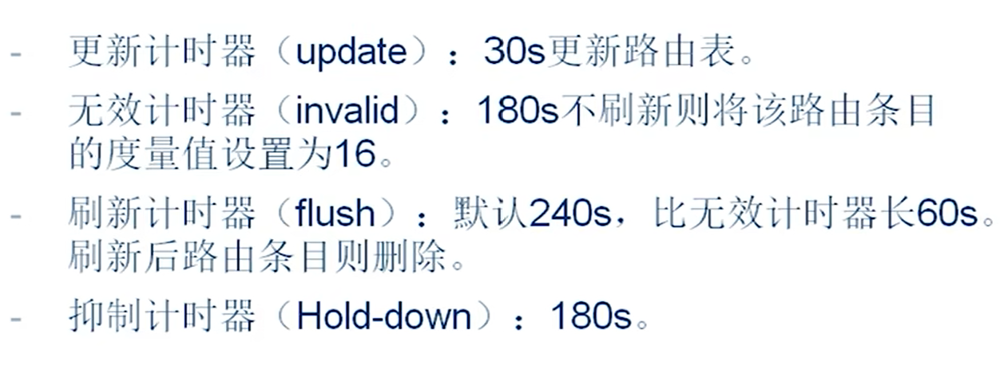
### 更新计时器
30s一更新

### 无效计时器
若30s没有更新，则会再等待150s。180s没有刷新则将度量值设置为16。

### 抑制计时器
开始抑制路由为16跳，网路不可达

### 刷新计时器
到240s还没有收到更新，删除所有路由。

### 环路
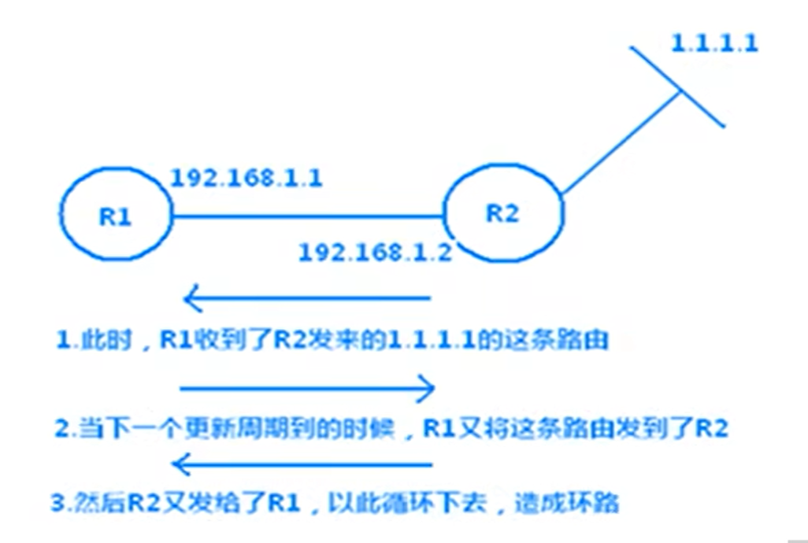
路由器将自己的整张路由表发送给直连设备，触发直连设备的路由更新，直连设备再让自己的直连设备更新。<br />
例如，12.1.1.0/24在R1的度量值是1，R1给R2更新完路由表后，R2中12.1.1.0/24的度量值为2。R2在更新后会让自己的直连设备更新，其中就包括R1。有可能会导致R1中12.1.1.0/24的度量值变为3，形成环路。因为每更新一次，度量值都会加一。
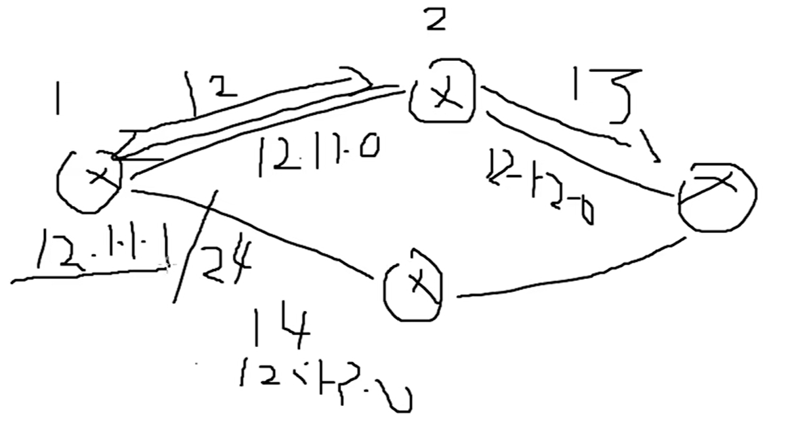

### RIP防环机制
#### 水平分割
从一个接口收到的路由条目不会再从这个接口发出。

#### 路由毒化和毒性逆转的水平分割
从一个接口收到的路由条目会从这个接口发送出去，但是将这个路由条目标记为16跳不可达。

#### 触发更新
当路由表发生变化时，会立刻发送更新信息。

### 启用RIP
```shell
# 全局模式下启用RIP
router rip
# 配置RIP版本，如果不配置的话版本介于V1 V2之间
# 如果没配置，使用广播发出路由信息，也能听到组播信息
version 2
# 关闭自动汇总。自动汇总会将无类路由汇总为有类路由
no auto-summary
# 宣告设备上路由表直连接口网络，相当于将这些网络的接口宣告出去了
# 1.将网段宣告进组播
# 2.把网段通告出去，给其他路由器
network 【[网段]
```

## OSPF
开放式最短路径优先
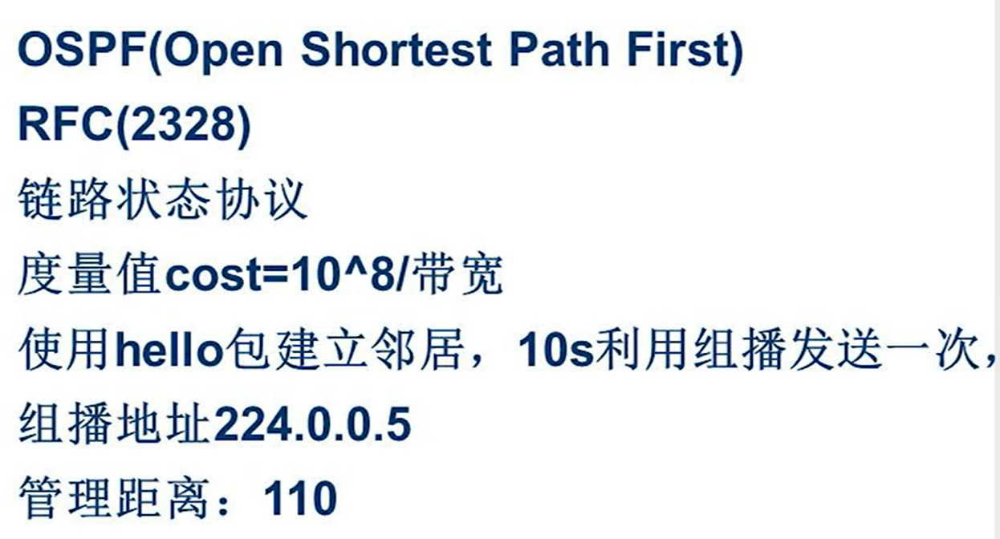

距离矢量协议RIP传递的是路由条目，链路状态协议传递的是数据库。路由所在接口的链路信息，形成数据库表。通过数据库描述的内容，每台设备以自己为根，计算出到达各个网段的路由信息。

RIP不知道完整拓扑，OSPF知道完整拓扑。

### 度量值
度量值为cost=10^8/接口带宽，参考带宽。

经过路由器时，沿途累加入接口的开销，都是回程的出接口。

### 邻居
所有的信息靠邻居关系维持。hello包是OSPF的报文，每10s组播发送一次(224.0.0.5)。

10s收不到路由

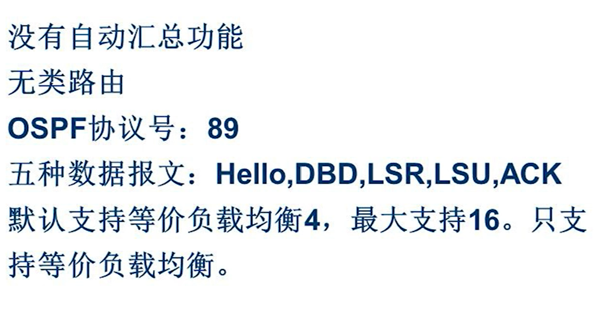

OSPF算出每条路由的路由信息，根据信息寻找选路，是无法汇总的。

### 工作报文
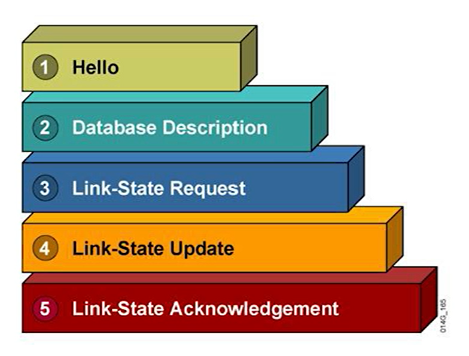

#### Hello
先利用hello包寻找邻居，建立邻居关系，只给邻居发数据库相关路由。RIP中无邻居概念。
#### Database Description
建立邻居关系后，在数据库中描述宣告的内容。
#### Link-State Request
链路状态请求。OSPF只请求需要的信息，不像RIP发送整个路由表。
#### Link-State Update
链路状态更新。根据对方请求，发送更新信息。
#### Link-State Acknowledgement
链路状态确认。确认更新的内容。

通过hello寻找邻居，建立邻居关系，只向邻居发送宣告的路由。

### 工作状态
邻居状态。OSPF报文根据邻居关系发送。不同的邻居状态发送相应的数据包。
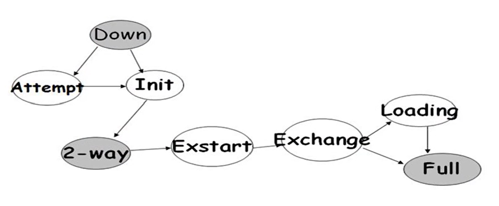
#### Down
未开启，断开连接，是初始状态。
#### Init
Down状态发送Hello包，进入Init状态。<br />

**收到Hello包的路由器认证完信息后，将发送Hello包的路由器置为Init。**

路由器(R1)宣告了网段之后，从该接口**组播**发送Hello包，寻找邻居。
对方路由器(R2)启用OSPF后从接口听到Hello，将接收到的包内容做审核。<br />
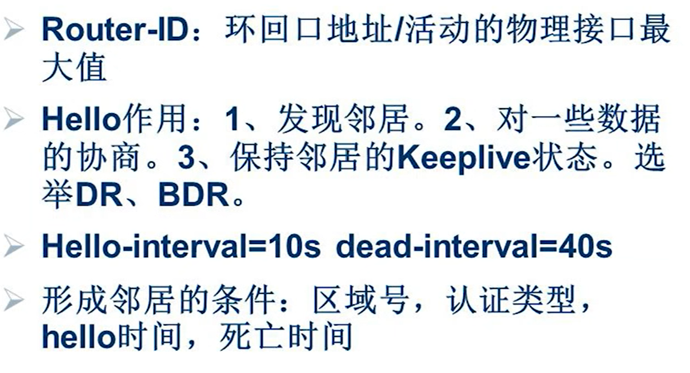

1. Router-ID
真正的含义是路由器的唯一标识。可以通过配置手动分配。如果没有手动分配，会看路由器有无环回接口，如果有会选择唤回接口中最大的IP地址。若没有环回接口，会选择开启端口中的最大IP地址。**Router-ID在系统中必须唯一**。
2. 时间
Hello时间10s，死亡时间40s，死亡时间固定是Hello时间的4倍。Hello时间调整，死亡时间自动调整，死亡时间调整，Hello时间不自动调整。**建立邻居关系的路由器时间必须匹配**。
3. 区域号
OSPF涉及到区域。网络越大，路由越多，设备的开销越大。OSPF在路由器内存中存在两个表项，一个是数据库表，另一个是由数据库计算出的路由表。<br />
划分区域后，相同区域同步一样的数据库，不同区域同步不同的数据库。<br />
通过配置接口，将接口配置在区域中。同一个路由器可能跨几个不同的区域。<br />
区域号范围为0~255，区域0为骨干区域，其余区域为常规区域。骨干区必须和常规区域相连。
4. 认证
在能建立邻居的基础上增加了一个密码。

路由器的Router-ID不能相同，区域号Hello时间死亡时间要相同。审核通过后将R1写入邻居表中，此时R1相对于R2的状态从Down置为Init。<br />
Init可以理解为半连接状态。<br />

#### Attempt
是非广播网络中才出现的状态，与常用的广播网络不同。

#### 2-way
R1发送Hello包，R2接收到并审核信息，R2将R1的Router-ID放入自己的邻居表中，将R1状态置为Init。<br />
R2也要播发送Hello包。R1接收到R2的Hello包后审核数据，并将R2的Router-ID放入自己的邻居表中，并将R2设置为Init。<br />
R2发送的Hello与R1发送的Hello不一样。因为R2发送Hello包之前收到了R1发送的Hello包，并将R1放入了自己的邻居表中。R2有邻居表时会将邻居表中携带到Hello包中。而R1发送的Hello包中没有邻居表。<br />
R1再收到Hello包时，会发现包中含有自己的Router-ID。此时直接给R2**单播**回复一个单播Hello<br />
此时R1 R2的状态均变为2-way。

#### Exstart
在Extart状态下邻居两两之间单播发送DBD数据包。当路由器较多时，DBD数据包量会比较大。为了避免单播量过大，在2-way时会选举DR(Design Router)和BDR(Backup Design Router)，指定路由器和备份指定路由器。<br />
在过渡到Exstart状态时，每个路由器均与DR和BRD交换数据库。未被选举的路由器称为others，others之间只维持邻居关系。会大量减少DBD的泛洪量。<br />
DR和BDR有所有路由器的数据库信息，可以组播更新所有人数据库。<br />
others只了解DR和BDR的数据库信息，只需要更新给DR和BDR。在只有DR和BDR在的组播中更新，224.0.0.6。<br />
<div align=center>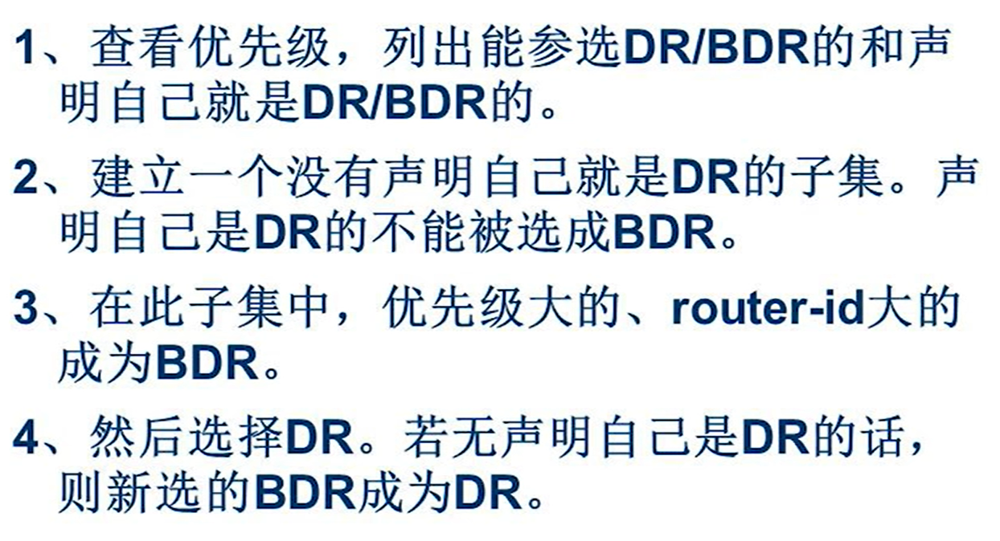</div>
优先级范围：0~255，0不具备参选资格，默认优先级为1，最大为255，越大越优先。若优先级相同，对比Router-ID。大家都发送Hello包，包中包含优先级和Router-ID。最优的会成为BDR，等待40s。第一个Hello包发送完后大家都知道了别人的优先级和Router-ID，在第一个Hello包的超时时间40s内，选举出BDR。等待一个40s等待有没有路由器通告自己是DR。在这40s内每10s发送一个Hello包。在第一个包时间超时后，没有其他路由器回复，则该路由器会认为自己成为DR，再选一个BDR。若等待期间有其他路由器声名自己是DR，则不选了。<br />
DR和BDR一经选举，就不会被抢占。之后发送DBD数据包。

#### Exchange
在Exstart状态同步完DBD后，进入到Exchange状态，交换LSR和LSU，进行请求和更新，都是单播。

#### Loading
Loading持续进行组播更新。两两交换DBD，两两更新请求都是一对一。但是不只是一个广播域还有不通的网段，跟不同网段的路由器更新需要发送组播，一个网段一个网段渗透给所有路由器，更新数据库。<br />
除了同步数据库，还要计算路由表。

#### Full
在同步完数据库并计算路由表后完成完全邻接。DR和BDR是Full状态，others都停留在2-way状态。

## EIGRP

结合距离矢量和链路状态。距离矢量传递路由信息不知道拓扑，链路状态协议同步数据库知道拓扑。
<div align=center>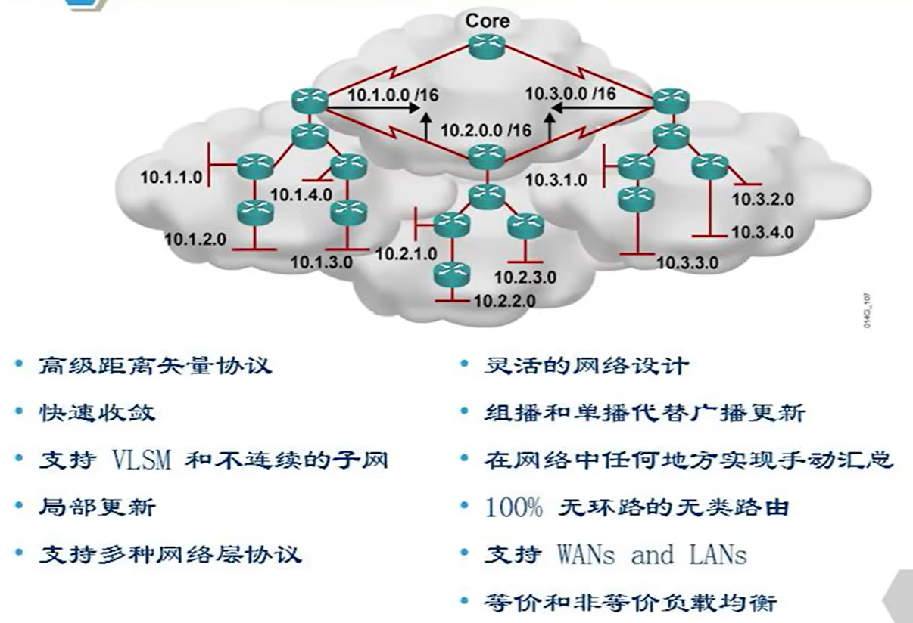</div>

### EIGRP关键技术
#### 邻居发现
使用Hello包发现邻居。RIP的计时器针对路由，没有邻居概念。OSPF的计时器针对邻居，邻居在就有路由。

#### 可靠传输协议RTP
保证RIGRP数据包到达所有邻居。不是传输层的协议。OSPF只有Update包有Ack确认。EIGRP的Hello包也有Ack。

#### DUAL弥散更新算法


#### 协议独立模块
EIGRP同时支持IP，AppleTalk和Novel NetWare，每一种网络协议支持RIGRP都有自己独立的模块。

#### 管理距离
内部管理距离90，EIGRP协议通用；

外部管理距离170，**重分发**；

汇总管理距离5，将多个网段汇总为一个大段地路由。

#### 组播地址和协议号
组播地址为224.0.0.10，协议号为88

### 表项
OSPF是邻居表，路由表，数据库表，没有明显固定的顺序。EIGRP的三张表有明确的顺序。
<div align=center>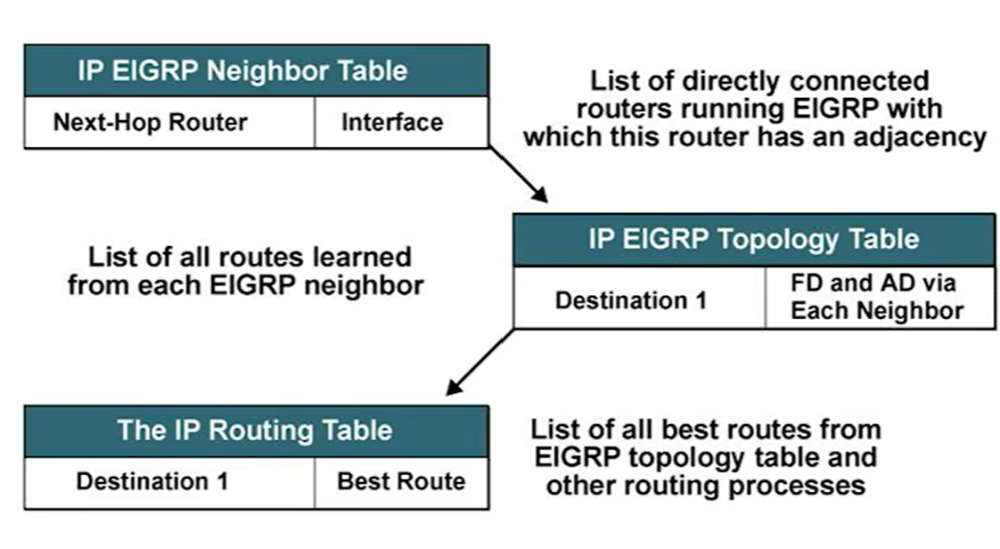</div>

EIGRP最先拥有邻居表，建立邻居的方式与OSPF相同。

根据邻居表产生拓扑表，类似于OSPF的数据库，但二者不同。根据所有的邻居传来的所有路由，都记录在路由表中。不论是不是最优，所有路径都保存在表中。

拓扑表中最优的路径会进入路由表。

### DUAL算法
DUAL算法的作用
<div align=center></div>
<div align=center>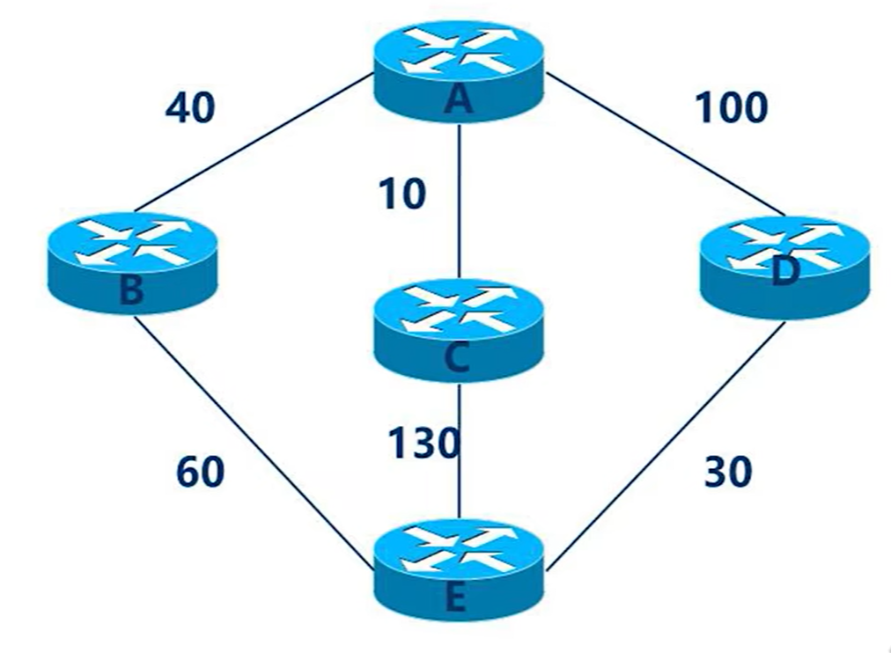</div>

每条链路上的数值为开销。例如从A到E有3条路劲，但ABE最优。

计算开销得度量值：
1. 带宽
2. 可靠性
3. 延迟
4. 负载
5. 最大传输单元
<div align=center></div>

建立邻居关系后，本地建立邻居表，之后从邻居获取路由建立拓扑表。
<div align=center>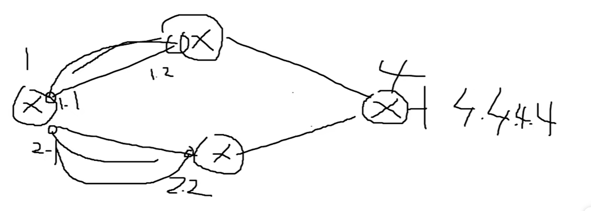</div>

4.4.4.4的路由有1.2和2.2两个下一跳，但是不做负载均衡。假设1.2传输的总开销是100，2.2传输的总开销是150。累加入接口开销，在路由表中叫开销，在拓扑表中叫做**可行距离**。

最优可行距离的下一跳是**后继路由器**。对应路由4.4.4.4最优的可行距离的下一跳路由器就是它的后继路由器，1.2的路由条目会被记录到路由表中。
<div align=center>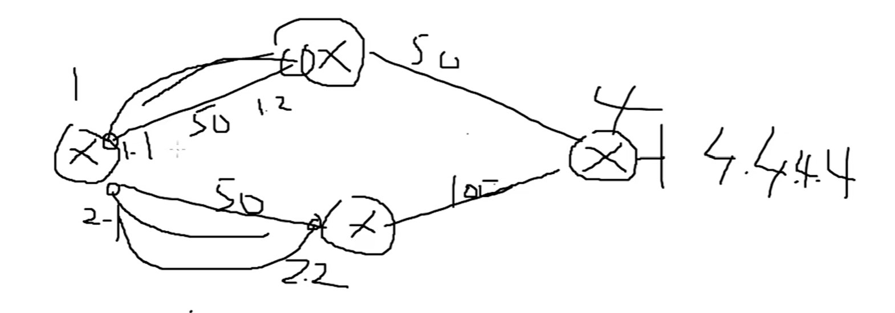</div>

下一跳路由器为我单独通告出它到我的目的有多大开销，是**通告距离**。通告距离会写在可行距离后面。**下一跳到目的的总距离**。当前路由器不但知道总开销，还知道后面的距离。

**可行后继路由器**：后继路由器的链路失效后，OSPF该路径消失，需要重新计算。EIGRP的可行后继路由器的路由内容会成为执行的内容(备份内容)。

**可行条件**：能够成为可行后继路由器的条件。其他路径的通告距离必须小于最优后继路由器的可行距离。
<div align=center>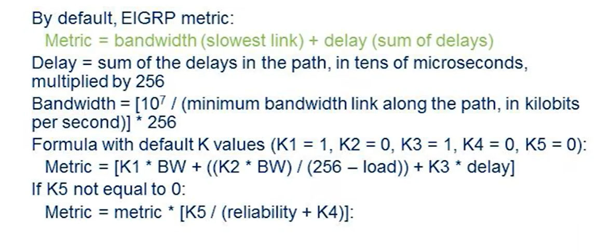</div>
<div align=center>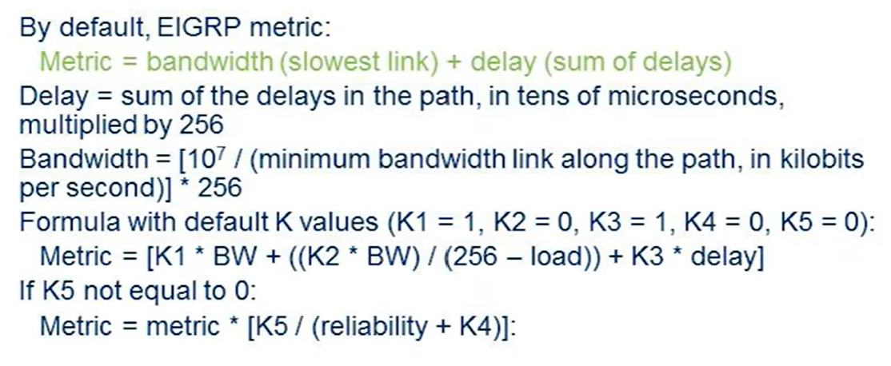</div>

EIGRP建立邻居时只考虑：
1. AS号相同
2. K值必须匹配，参考的K只要一样
3. 认证相同

## 交换机基础原理

在网络层没有与路由器功能类似的设备，但是在二层**集线器**跟交换机功能、外形类似。

<div align=center></div>

不同点如下：
1. 交换机有MAC地址，集线器没有MAC地址。交换机按照MAC地址**转发**；集线器向其他所有端口**泛洪**，占用其他端口带宽，速度比交换机慢。
2. 交换机可以学习MAC地址，才能转发二层数据帧。缓存整个数据包后再转发出去。
3. 交换机隔离**广播域**和**冲突域**。交换机连接的设备都属于一个网段，同一个广播域。通过vlan隔离广播域。冲突域指接口。
4. 交换机可以防环路，hub不能防环。

<div align=center>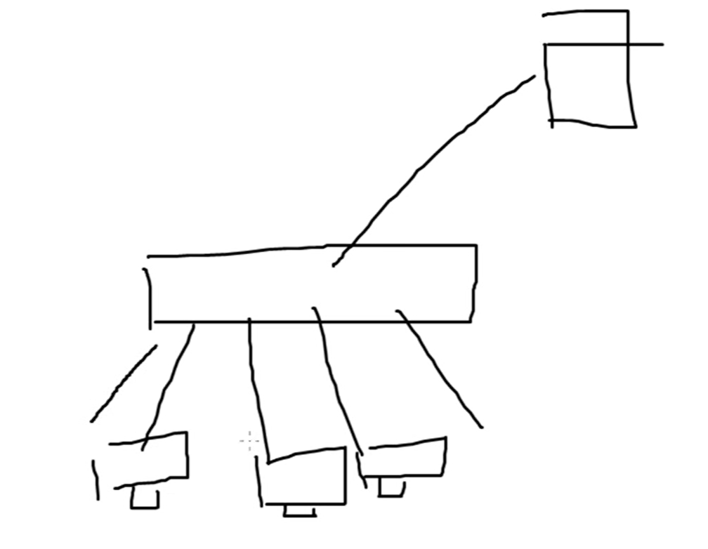</div>
例如一个hub连接一个外部设备，下连四台设备。若这4台设备同时访问该外部设备。由于hub没有MAC地址，没有缓存，无法转发。该外联接口上4条线同时走，这就是冲突域。在该冲突域上通过CSMA/CD协商。

路由的环路是指路由信息互相更新，而交换的环路是设备拉成环。交换成环路后，如果已经学习了MAC地址，单播可以正常转发。但是如果有任意一个包属于广播，交换机互相泛洪，会出现一个数据包传回原来的地方。数据包在交换机见发不出去了，数据包多了之后就会产生**广播风暴**。

1. 交换机基于数据源MAC地址学习。

2. 基于数据目的MAC地址根据MAC地址表转发。

3. 对于数据的目的MAC地址没有学习过，没有MAC地址表项会执行泛洪。 

4. 交换机接口可以学习多个MAC地址。

5. 一个MAC地址只能被一个交换机接口学习，后到优先。

6. 对于广播、组播、未知单播数据，交换机一律泛洪。

## VLAN

虚拟局域网，同一个交换机的不同vlan不能相互通信，不同交换机的相同vlan可以相互通信。

交换机是二层设备，计算机互相通讯是通过IP地址进行，而IP地址在二层是透传的。交换机连接的设备属于一个大的局域网，通过划分vlan可以在二层将其划分为不同的局域网。

<div align=center>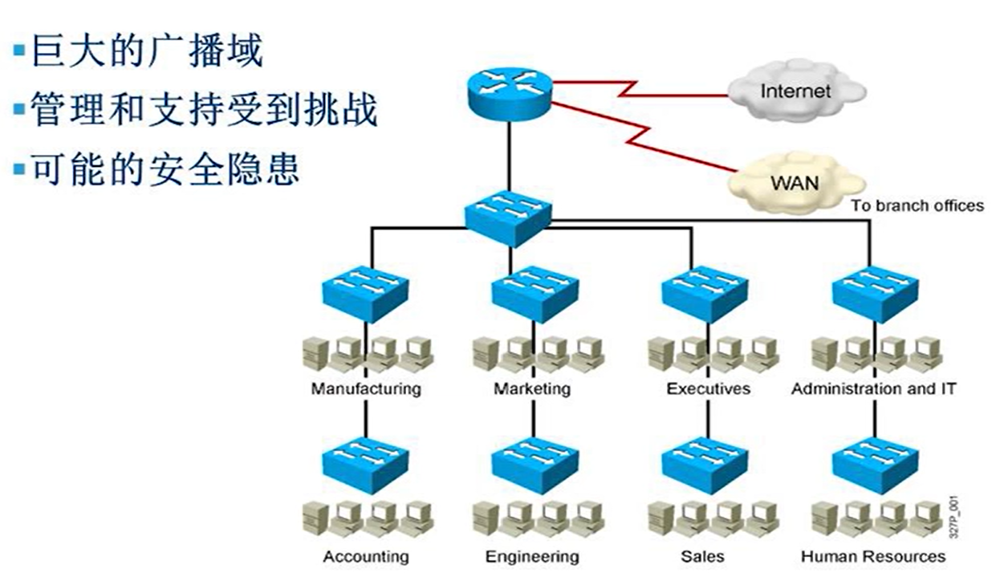</div>>

巨大的广播域中广播量很大。未知单播、组播、广播全都是泛洪转发。

### access

<div align=center>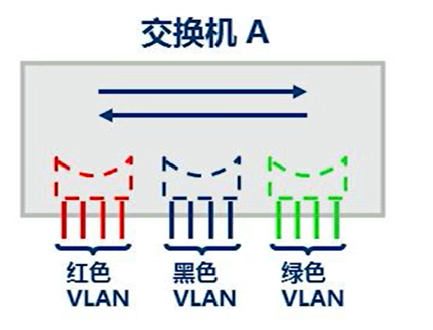</div>>

交换机上分三个vlan（颜色）。每个逻辑vlan就像一个独立的物理桥，交换机上的每一个端口都可以分给不同的vlan。默认情况下每个端口都属于vlan1(公有)。

access一般接终端或者主机。

### trunk

VLAN干道：对于多个vlan交换机来说，vlan干道就是两个交换机之间的连接，它在两个或两个以上的VLAN之间传输通信。每个交换机必须确定它收到的帧属于哪个VLAN。

一个交换机的任何端口都必须属于且只能属于一个VLAN，但当端口配置成trunk干道后，该端口就失去了它自身的VLAN表示，可以为该交换机内的所有VLAN传输数据。

<div align=center>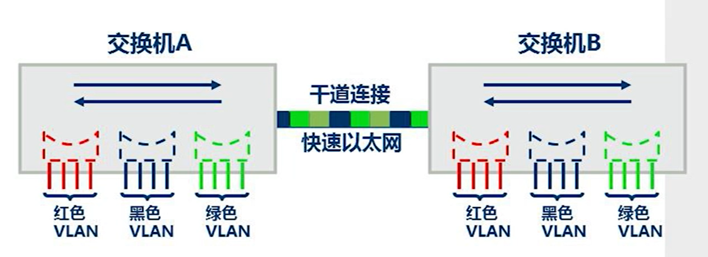</div>>

vlan可以跨越多台交换机，trunk可以承载多个vlan的数据，trunk使用特殊的封装区分不同的vlan。交换机之间的连接配置trunk。

数据在进入vlan2后进入trunk接口。trunk口在数据中打上vlan号标记，打在以太网层协议头再发出去。对端交换机trunk口接收到数据后查看vlan标记，摘除标记后发从vlan2口发出。

打标记->识别标记->摘除标记

交换机的vlan标记有两种协议，ISL和802.1Q。ISL思科私有，802.1Q公有。

ISL在原有数据之前加封装，802.1Q只在以太网头部加一个vlan标记。
 
802.1q中有本征vlan。本征vlan的数据经过trunk口不会打标记。对端trunk口接收到没有打标记的数据，会把收到的数据包放进自己的本征vlan中。中间链路本征vlan不匹配的话，两边通讯的vlan会不匹配。

### vlan号

交换机默认所有接口都属于vlan1。

交换机支持创建4096个vlan，0~4095，0和4095不能用，真正的编号是1~4094。

vlan1,vlan1002,vlan1003,vlan1004,vlan1005交换机初始就有，不能被删除， vlan1能使用，其余四个保留。

1~1001是标准vlan。1006~4094是扩展vlan。cisco 3560以上的型号才支持，vtp协议的transparent模式可用。

### cisco命令

```sh
# 查看vlan表
show vlan brief
# 特权模式下进入vlan database
vlan database
# 创建vlan10
vlan 10
# 退出使用exit，使配置生效并保存
exit
vlan 10 name [该vlan的名字]
# 进入全局配置
config terminal
# 创vlan20
vlan20
name [该vlan的名字]
# 进入接口将接口划分到vlan
int f0/1
switch port mode access
port default vlan10
```

## VTP

思科私有，各个厂商也有自己的类似协议。VTP可以让多台交换机同步同一台交换机的vlan配置。

<div align=center>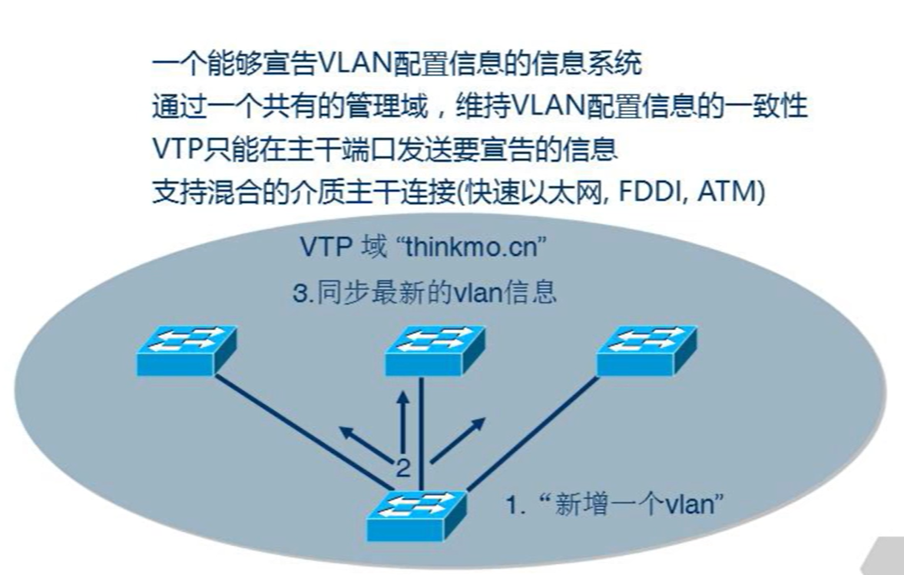</div>

VTP只能通过主干(trunk)传递，发送配置信息。只同步vlan信息，但是具体哪些端口还需要自己分配。

### VTP域

VTP的传播基于他们在同一个域内，所有设备配置同一个域名。

### VTP通告

基于相应VTP模式进行通告。

### VTP模式

#### VTP服务器

服务器能够创建、删除、重命名、修改VLAN，并产生通告。每台交换机默认情况下都是服务器。

#### VTP客户端

客户端只能发送通告，只在工作时保存VLAN信息。必须经过手动配置才能成为客户端模式。不能创建、修改、删除VLAN，只能同步其他交换机的vlan。其他交换机给发送通告，本机保存后再发送出去，只在工作时保存。

#### VTP透明

透明模式可以创建修改删除VLAN但是不产生通告，只会透传别人的通告。

假设原有网络的VTP服务器被换成一台新的VTP服务器，新的服务器上没有之前配置的VLAN信息。新服务器的VLAN配置只能从老的客户端获取。

### 配置命令
```sh
# 查看VTP状态，其中VTP模式是VTP Operation Mode
show vtp status

# 修改VTP模式为客户端
vtp mode client

# 修改vtp模式为透明
vtp mode transparent

# 需要配置各台交换机VTP Domain Name，让各台交换机在同一个域内，才能传播VTP信息
vtp domain [域名]
```

由于Server client都能发通告，而只有server才能修改vlan。server和server，server和client都可以互相通告。一个网络中可能会有多台server，server之间可互相通告的优先级通过**Configuration Reversion**决定，越高越优先。交换机每做一个配置，该序号加一。

在配置了域名后，配置修订版本号会清空，并且立即通过trunk口发送通告。所有其他没有配置域名的设备也会同步该域名。

vtp信息同步后，平均5min发送一次更新。如果此时再连接一台设备进入网络，默认为server，vtp并没有获得同步，需要5min后才能同步。但是如果原有server再添加vlan设置，则会立即同步。但是一个域内有多个vtp server的话不稳定。

vtp还可以做密码认证
```sh
show vtp password
```
server和client的密码要相同

:::tip VTP能够传递的条件
1. trunk启动

2. 模式相对应正确

3. VTP域、相同的域、相同的密码
:::

## STP

生成树协议

### 二层链路问题

二层链路中没有IP和路由，转发信息时若没有表项，则直接**泛洪**。

正常交换机可以动态学习MAC地址，建立MAC地址表进行单播，不像路由器有协议跟邻居等概念。若中间链路出现**单点故障**无法发包，数据可以通过其他交换机的冗余路线发送。但是
:::warning

1. 交换机靠MAC地址表单播转发或者泛洪，单点失效链路其中一方的MAC地址表项没有改变，任然由该接口发送数据。等300sMAC地址表项失效后才能断开原有链路。

2. 有冗余路线可能出现环路，产生广播风暴

:::

### STP协议

Spaning tree，解决两个问题**冗余**和**防环**。

<div align=center>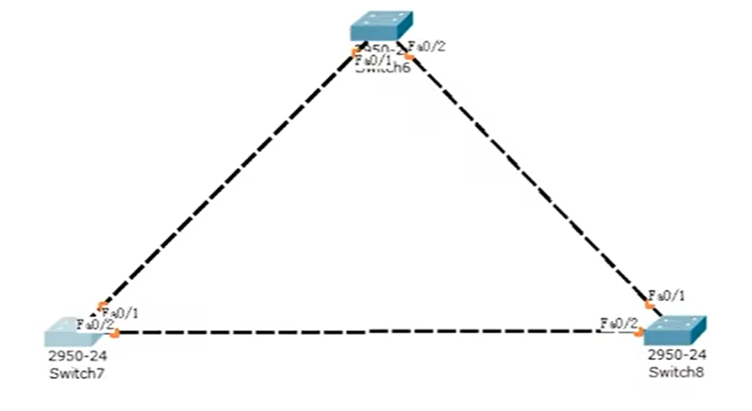</div>>

由交换机连接一个环路，cisco交换机默认开启stp。大概30s后就能生成结果。

<div align=center>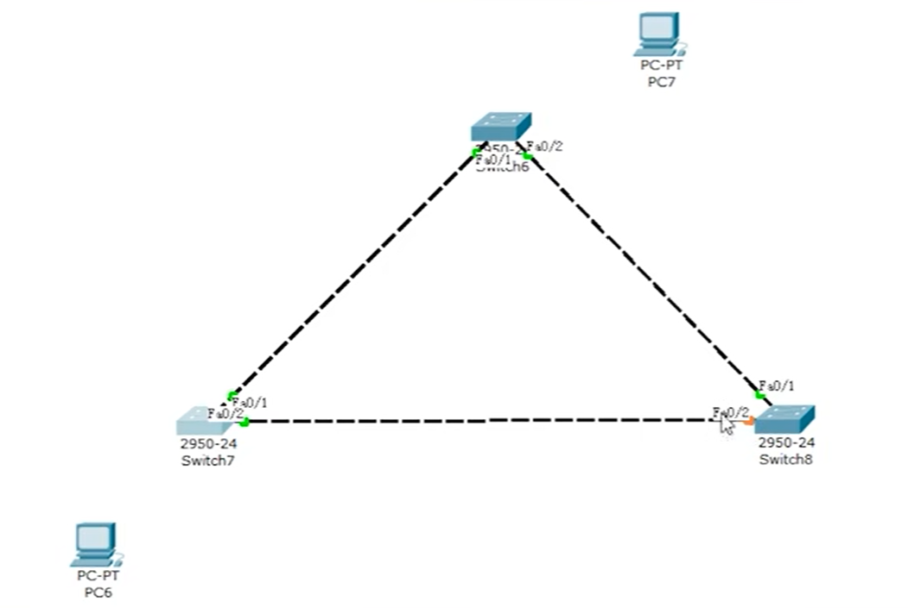</div>>

stp通过阻塞一些端口来防止环路。当其他接口down或者故障后，接口重新开启，并转发数据。

::: tip STP操作
1. 每个广播域选择一个根桥
2. 每个非根桥上选择一个根端口
3. 每个段选择一个指定端口
4. 阻塞非指定端口
:::

### 选举规则

所有的交换机启用生成树后，交换机开始向其他交换机广播类似于Hello包的东西，**BPDU(Bridge Protocol Data Unit)**。

#### 根桥选举 BPDU

BPDU中包含：**Bridge I**D。Bridge ID包括**优先级**和**MAC地址**。

该MAC地址指交换机设备的主板MAC地址，可以叫主板/背板/管理MAC等。接口的MAC地址为主板MAC末尾加上接口号得到。

先对比优先级，默认32768，0-65535，**越小越优先**。优先级相同，对比背板MAC地址，也是**越小越优先**。选出最优先的设备，成为**root**，确立根桥。

确立根桥后所有非根桥都不再发送BPDU，只有根桥每2s发送一次BPDU，20s超时。根桥发送BPDU时，其中除了包含自己的Bridge ID以外，还包含**root ID**，根ID。根ID代表交换机在**自己的广播域内认可的根桥**的优先级和MAC地址。

实际上发送BPDU时发送的就是自己的Bridge ID和认可的根桥root ID。而最开始大家都处于默认状态，所以会认为自己的优先级最高，认为自己是根桥，所以发送的都是自己的优先级。

选举时对比的是收到的root ID。在最开始与对比所有人的Bridge ID一样。

选举对比出根桥后，其他设备就不再发送BPDU。

根桥的BPDU发送到下层设备后，下层设备继续转发，保持根ID不变，转发的桥ID是自己的。

#### 根端口选举

选举出根桥后，每一个非根桥要选举出**当前设备最优的端口**作为去往根桥的端口，称为根端口。

评判标准：具有最低根路径的接口

::: tip 选举规则
1. 到根桥的最低路径成本
2. 最低的发送者网桥ID
3. 最低的发送者短裤ID
:::

最先看接口带宽，带宽平等再看后续条件

带宽开销值固定计算，沿途累加固定值。
<div align=center>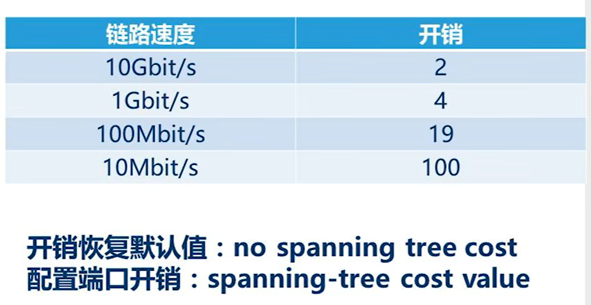</div>

泛洪BPDU中包含根桥ID和Bridge ID。下层设备转发时将BridgeID替换成自己的BridgeID。

<div align=center>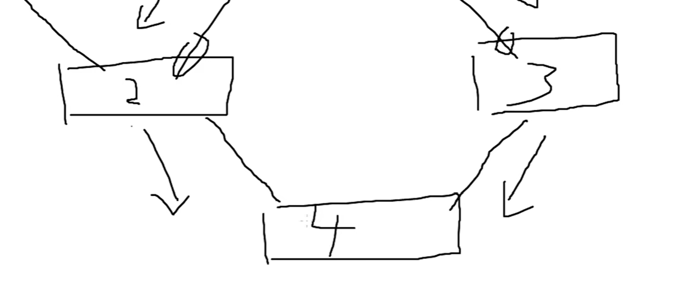</div>

例如sw2和sw3向sw4转发BPDU时，sw4的不同端口会收到sw2和sw3的数据，若带宽相同，查看sw2和sw3的BridgeID，最小的最优先，最优先的成为根端口。

若再选不出来（例如同一台设备接两根线），对比最低发送者**端口ID**。端口ID也在BPDU中，分为优先级和接口号。优先级默认128，结合端口号，例如f0/1，port ID就为128.1。

#### 选举指定端口

每个段选举一个指定端口。段：两台设备之前的链路。每条线选择一个指定端口。
<div align=center>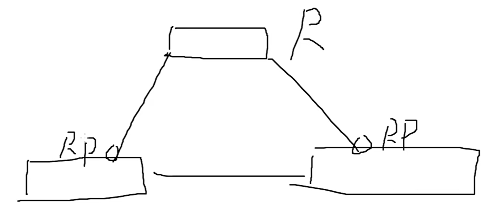</div>

根端口的对端一定是指定端口。没有选举根端口的链路需要选举指定端口两个接口对比彼此发送的BridgeID，优先的接口成为指定接口。

#### 阻塞非指定端口

没有身份的端口都被阻塞，**AP**。

### 端口角色

指定端口发送BPDU，根端口收BPDU但不发送。根桥发送的BPDU不会回来。只有指定接口有资格发送BPDU。

非指定端口只能收BPDU，但是不能发送BPDU，并且不能转发流量。

### 端口状态

STP中除了端口角色外，还有端口状态。

#### block

接口连线后接口的第一个状态。以及非指定端口的状态。

#### listen

block过渡到listen。监听BPDU，不能学习MAC地址，不能转发数据，维持15s。在该状态**确认端口角色**。

最后非指定端口状态会回到block。根端口和指定端口进入learn状态。

#### learn

决定端口角色后，根端口和指定端口进入该状态。监听BPDU，学习MAC地址，但是**不能转发数据**。维持大概15s。

#### forward

学习完MAC地址后，根端口和指定端口进入forward状态。**可以转发数据**。根端口和指定端口最后停留状态

#### disable

禁用。交换机开启生成树后，默认所有接口都进行生成树决策，无论接的是交换机还是终端。禁用之后就不参与决策。

### 链路冗余

在发生异常情况时，阻塞端口起到冗余作用。

<div align=center>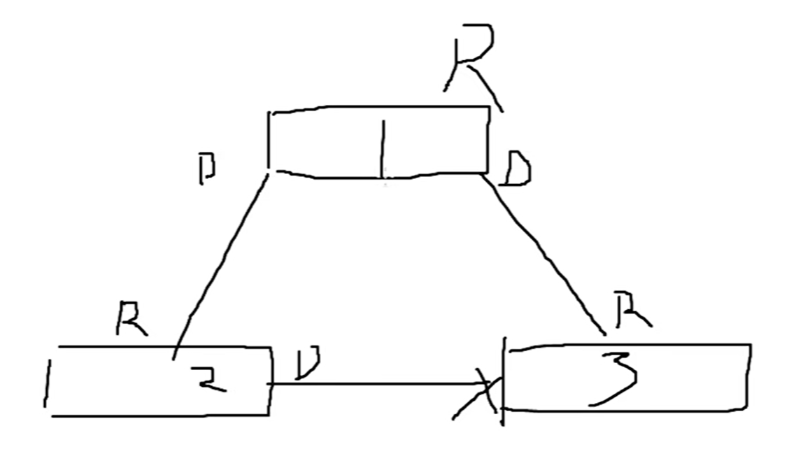</div>

正常情况2s发送BPDU。若其中一条链路断开

因为sw3有阻塞端口，所以sw3时刻监视链路状态，随时开启阻塞端口，提供冗余。

若sw3直连链路端断开，sw3立刻感知到。sw3立刻开启阻塞端口，状态由block变为**listen**，到larn再到forward，历经30s左右。

非直连链路断开，根据BPDU判断。阻塞端口在超时时间内没有收到BPDU，确认该链路故障，再将阻塞端口开启，等待收敛，大概需要50s。

但是载开启了之后，其他设备额MAC地址表中没有该接口的MAC地址记录，不会向该接口发送数据。

之前的BPDU叫配置BPDU。还有一个特殊BPDU叫**TCN(topology change notification)**，拓扑变更通告。

在稍微复杂一些的拓扑中，能够最直接检测到链路故障的交换机会从它的根端口向上转发TCN BPDU。

接收到TCN BPDU的交换机先回复一个标准BPDU表示已收到，再继续向上转发TCN BPDU。

根桥收到TCN后，会转发一个新的配置BPDU。该BPDU中含有TC位，表示拓扑变更。其余交换机收到后将自己的MAC地址老化时间变为15s，15s后所有交换机的MAC地址表清空。

这样等阻塞端口开启后，能够重新通过广播饭泛洪学习新的路径。

### 其余生成树体系

#### pvst

思科的生成树体系，**per vlan span tree**，每一vlan运行一个生成树。标准生成树针对交换机的流量，但是交换机的流量根vlan的流量是区分的。标准的生成树是所有vlan生成一颗。阻塞所有vlan的数据。

pvst把每一个vlan当作一个网桥。每一个vlan有一个根，阻塞的端口也只阻塞单vlan的流量。

但是每个vlan要发一个BPDU。**开销过大**。

每一个vlan的BPDU的优先级中加入了系统号。

::: warning
根不能是接入交换机，数据可能发上去在发下来再回去。一般手动指定根桥。
或者手动指定优先级，必须是4096的倍数。
:::

```sh
# primary和secondary 主根和备根
spamning-tree vlan 1 root primary/secondary
```

::: warning
配置stp前先将端口配置为access，表示接入的设备为终端/主机，只接受接口上的数据包，不接受BPDU等。防止主机模拟交换机参与选举成为根桥，窃取数据流量。
:::

## ACL

Access Control List，访问控制列表。

<div align=center>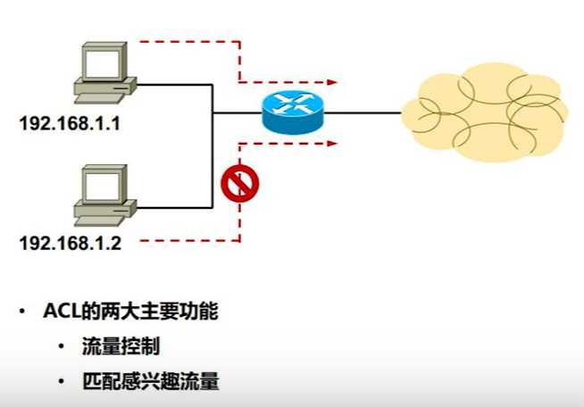</div>

访问控制列表是路由器和交换机接口的指令列表，用来控制端口进出的数据包。表中包含了匹配关系、条件和查询语句，表只是一个框架结构，其目的是为了对某种访问进行控制。

### 分类

根据使用列表的表号分类

<div align=center>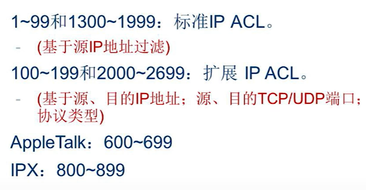</div>


