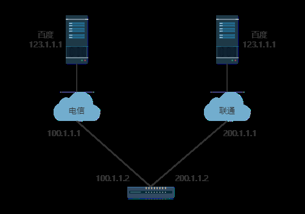

# CCNP

https://www.bilibili.com/video/BV1CT4y1a7qu?p=15&vd_source=4af81da1c18e62546b4fb1df885f4804

P15~P41

## 静态路由

### 浮动路由
<div align=center></div>

网关同时连接电信和联通两条运营商线路，都可以访问百度。其中一根线断开，可以走另外一根。通常情况下可以写两条静态路由分别指向联通和电信。

```sh
ip route 0.0.0.0 0.0.0.0 100.1.1.1
ip route 0.0.0.0 0.0.0.0 200.1.1.1
```

但是如果写两条默认路由，会做**负载均衡**，两边都走。一般两边都走的话，使用策略路由。

**浮动路由的应用主要是一主一备**。

如果确定左侧为主线路(300M)，右侧为备份线路(100M)。可能左侧走上网的流量，右侧专门搭建企业内部的点对点的VPN。

若左侧线路断开，所有带宽切换到右侧应急。

```sh
# 写一条默认路由，思科默认路由管理距离(优先级)为1，这条是走电信的线路
ip route 0.0.0.0 0.0.0.0 100.1.1.1
# 联通线路，写一个更大的管理距离
ip route 0.0.0.0 0.0.0.0 200.1.1.1 10
# 此时默认显示的路由表如下，默认走的是电信
C   100.1.1.0 is directly connected, FasterEthernet1/0
C   200.1.1.0/24 is directly connected, FastEthernet0/0
S*  0.0.0.0/0 [1/0] via 100.1.1.1
```

::: warning
管理距离越小越优先。
:::

把左侧线路断开(关闭接口)，再查看路由表发现路由切换到200.1.1.1
```sh
interface f1/0
shutdown
# 此时查看路由表，切换到200.1.1.1
C   200.1.1.0/24 is directly connected, FastEthernet0/0
S*  0.0.0.0/0 [10/0] via 200.1.1.1
```

**浮动路由就是在原有的情况下修改两条默认路由的管理距离，实现主备。**

之前的操作是在网关路由器上关闭与电信线路连接的接口，可以切换。但是如果**关闭电信线路的接口就无法切换**。因为运营商与网关的线路不是直连的，中间有很多中转设备，此时网关路由器无法感知对端断开。此时需要做**ICMP检测**，例如ping 100.1.1.1。

### SLA

**Service Level Argeement**,链路故障检测，服务等级保障（**思科私有**）。其余厂商用的是公有协议，例如bfd

```sh
# 开启监控
ip sla monitor 123 # 123是编号
type echo protocol ipicmpecho 100.1.1.1 # 设置检测方式，一般用echo，ping过去的包叫echo，回来的叫echo-reply。还有其他方式，例如HTTP探测
frequency 5 # 检测频率，秒级检测，但是新款设备支持毫秒级检测，实现无缝切换
```

检测需要检测电信链路下的接口而不是百度的接口。因为如果检测的是百度，当电信链路断开时百度会断开，此时会切换到联通，切换到联通后百度通了，又切回电信，切回后百度又不通于是再切回联通，出现**链路抖动**。

```sh
# 现在开始生效持续到永远
ip sla monitor 123 schedule start-time now life forever
```

sla虽然生效了，但是与静态路由没有关系，它是独立的。

```sh
track 321 
```
