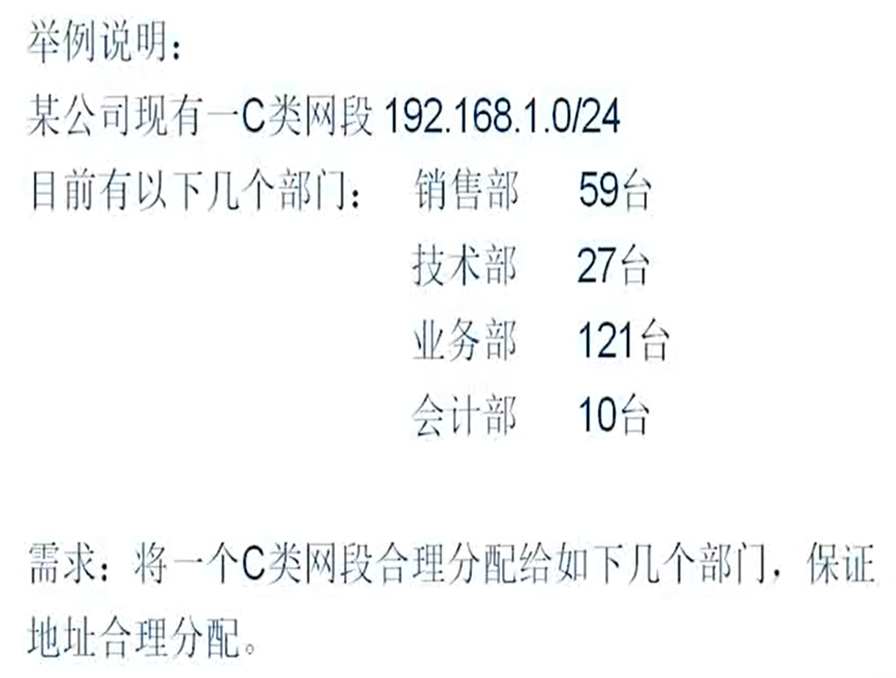

# IP地址

IP地址由32位二进制数组成，一般由点分十进制表示，四个字节。

第一个字节用于划分IP地址分类，可以叫做主网号、主类。

127的地址段给主机作为**环回地址**，loopback。可以理解为虚拟IP，数据发出去还能发回来。假设主机有一个物理网卡和一个IP地址，但是操作系统有一个虚拟IP地址，存在于内存中。环回接口就相当于内存的接口，可以用于测试网卡是否能工作。

主机ping自己的环回地址，能通说明网卡是正常的

严格意义上讲127还算A类地址。

ABC类地址是可以正常使用的，D类是多播、组播地址，E类地址科研保留。常见的只有ABC类。

每个不同分类的地址系统默认的子网掩码不一样。子网掩码将IP地址分为网络位和主机位。**子网掩码必须是连续的1和连续的0**。假设C类地址192.168.1.1/24，24位子网掩码，前24位为网络位，后8位为主机位。网络位表示同一个局域网的IP地址，此例中为192.168.1，是不可变的。主机位表示在该网络下的不同主机。

主机位全为0(网段的第一个地址)的地址表示该网段所有主机，该地址是不能被分配的。该地址用于路由寻址。 
主机位权威1(网段的最后一个地址)的地址为广播地址。该网段的所有地址，都能跟该地址通信。发往该地址的信息，能够被所有其他主机收到。 
除去上述两个地址，剩余的地址为主机地址，可以分配。

255.255.255.255为全广播，0.0.0.0代表任何网络。

## VLSM
可变长子网掩码，缓解IP地址紧缺而产生。

上述例子中，最大合理地使用IP地址就是应用VLSM。通过增加子网掩码位数，将网络缩小，分成多个子网。 
掩码增加一位，分成两个子网：192.168.1.0/25和192.168.128.0/25，每个网段有126个可用地址。 
掩码增加两位，分成4个子网：192.168.1.0/26，192.168.1.64/26，192.168.1.128/26，192.168.1.192/26 
子网掩码最多变到30位，可用地址只有两个。31位的网段没有地址(除去全0和全1)。