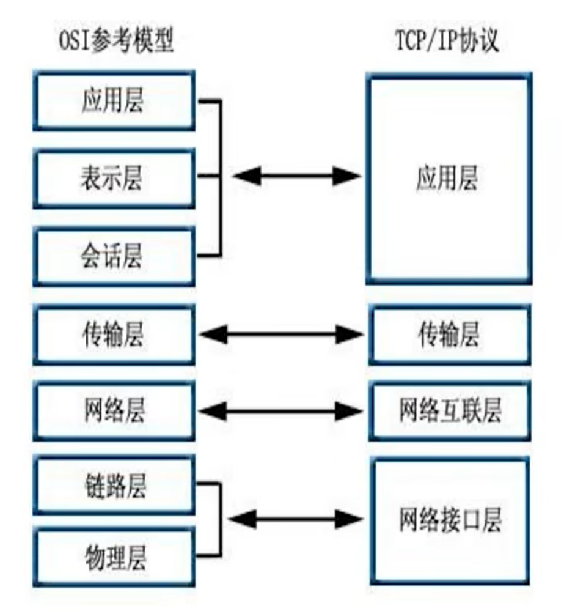
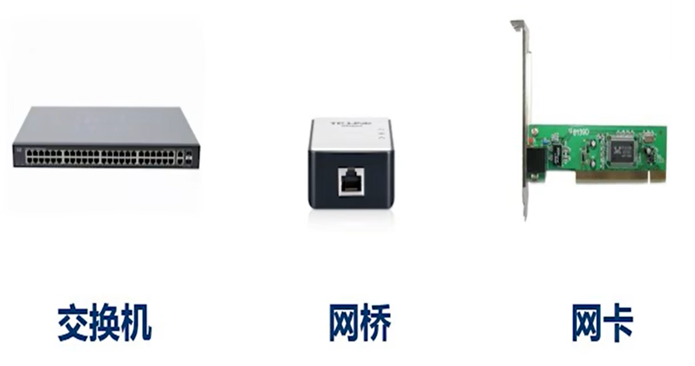
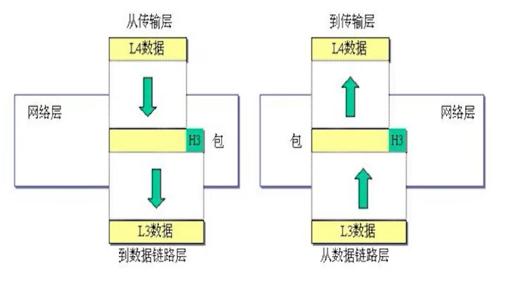
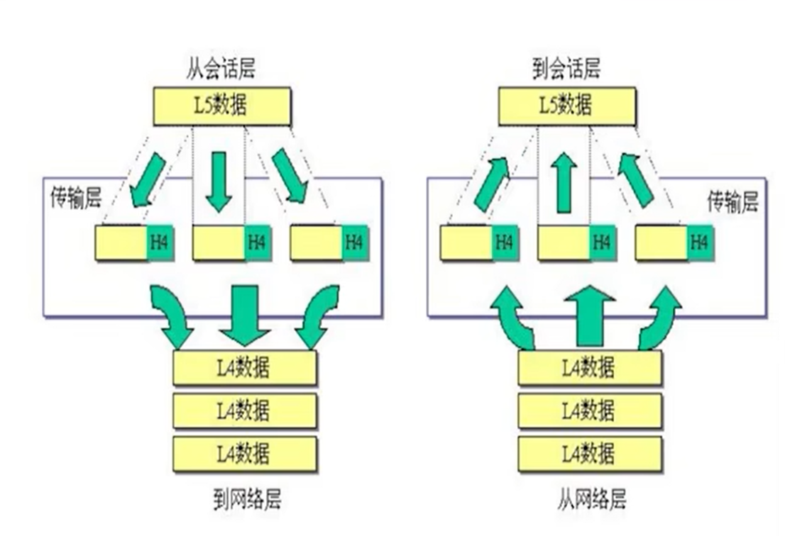

# OSI
Open System Interconnection Reference Model

OSI分七层，TCP/IP模型分四层，自下而上从一开始。

## 物理层

物理层的主要作用是产生并检测电压发送和接收带有数据的电气信号。物理层不提供数据纠错服务，但是能对传输速度进行控制，监测出错的情况。传输的数据是数字信号，**比特流**。

集线器：单纯的连接。

转换器：调制解调器(猫)就是转换器之一，将电话线上的信号转换为数字信号。

中继器：信号放大。

除了网线外，还有光纤，无线电波等介质。

## 数据链路层

数据链路层决定数据通讯的机制，差错检测。提供对网络层的服务。合成传输的**数据帧**。链路层对应的是tcp/ip中的接口部分。

MAC，meda access control，又叫以太网地址，代表网卡的唯一性(全球)。

交换机：二层设备，靠MAC地址管理和连接硬件设备。

MAC地址由48位二进制数组成，通常表示为12个16进制数。前24位由IEEE制定，用于标识制造商，后24位厂家自己制定，供应啥对网卡的唯一编号。还有一种格式是每四位十六进制数之间以点分隔。

## 网络层

为网络设备提供逻辑地址，负责数据从源端发送到目的端，负责数据传输的寻径和转发。

在一个小范围内，可以依靠MAC地址转发数据。但是在全球范围内不适用，只靠MAC地址寻址是很困难的。为了能大范围精准找到设备，增加了IP。

涉及的设备主要有路由器，依靠IP地址逻辑选路。交换机组件局域网，依靠MAC地址转发，使用路由器作为网络节点，一条一条转发寻找最快路径，交换机不识别IP地址，是二层设备，所以不能上网。

## 传输层

为端系统的应用程序转发数据，通过端口号区分上层协议，主要有TCP、UDP。 

TCP有丢包重传，可靠。

## 会话层
允许用户使用简单易记的名称建立连接。

## 表示层
协商数据交换格式。

## 应用层

应用程序，用户的应用程序和网络之间的接口。会话、表示层也可以算某种应用程序，本身并没有什么区别。应用层需要发送数据时会启用传输层。

## 数据传输过程

PC端的应用程序产生应用层数据(**payload**)，传输层对应用层数据封装，加上(TCP/UDP)协议头部，包含应用层提供的端口号。

传输层将数据(**segment**)下发给网络层，网络层封装数据，加上IP协议头部，IP协议报头中的协议号表示上层(传输层)协议类型。

数据链路层再对网络层数据(**packet**)进一步封装，加上数据链路层协议头部，包含源目MAC和上层协议类型。

该数据(**frame***)发出后被交换机、路由器转发。交换机只识别二层头部，按照源目MAC在局域网内短距离传送，到达路由器。路由器识别二层和三层的报头，路由器解开二层封装，按照源目IP封装新的二层头部后转发出去，知道最后到达目的终端。

对端收到数据包后按照每层解封装，将数据传送到应用层，回复的数据也每层封装后返回。
