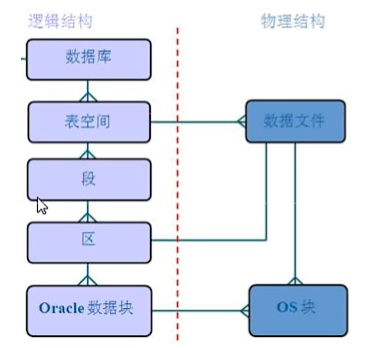
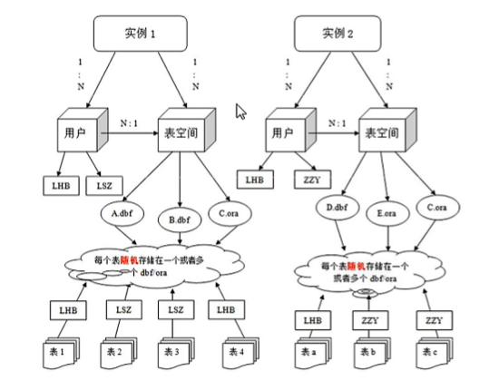
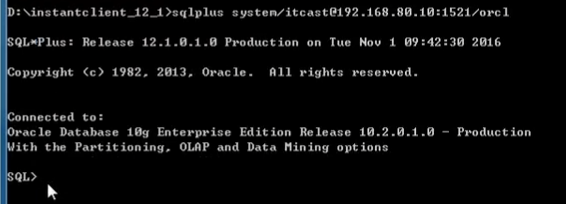

# ORACLE

ORACLE数据库是ORACLE公司提供的以**分布式**数据库为核心的一组软件产品，是目前最流行的CS或BS体系结构的数据库之一。

支持多用户、大事务量的事务处理<br />
数据安全性和完整性控制<br />
支持分布式数据处理<br />
可移植性（跨平台，不同版本操作系统使用，数据通用）<br />

## 体系结构

### 数据库

Oracle数据库是数据的物理存储。Oracle只有一个全局数据库，不会像Mysql那些一样为不同应用程序建立不同的数据库。

### 实例

一个ORACLE实例(ORACLE Instance)由一系列后台进程(Background Processes)和内存结构(Memory Structure)组成，一个数据库可以有多个实例。

有时希望用一台服务器安装多套数据库，希望这些数据库之间不会冲突，此时装一个ORACLE，创建多个实例就行，类似与装了许多套oracle。一般装一个实例就行。

连接时连接的是实例。

### 数据文件(dbf)

扩展名为dbf。是数据库的物理存储单位。数据库的数据是存储在表空间中的，其实是存在一个或多个数据文件中，一个表空间可由一个或多个数据文件组成，一个数据文件只能属于一个表空间。数据文件加入到表空间后不能被删除，需要删除其所属的表空间才能删除该文件。

### 表空间

表空间是Oracle对数据库上相关数据文件ORA或DBF文件的逻辑映射。一个数据库在逻辑上被划分成若干个表空间，每个表空间包含了在逻辑上相关联的一组结构，每个数据库至少有一个表空间（system表空间）。

每个表空间由同一个磁盘上的一个或多个文件组成，这些文件叫做数据文件，一个数据文件只能属于一个表空间。

操作表空间，向表空间中建立表，实际上是存入数据文件。

数据库分表空间，表空间下分段，段分区，区分数据块。
<div align=center></div>

一个数据文件由很多磁盘块组成(上图三个小斜线)

### 用户

Mysql用户登陆后能看到所有数据库。Oracle是一个数据库下有很多用户，由用户建表。
<div align=center></div>

实例1下有多个用户和多个表空间，一个表空间下可能有多个用户，表空间下有多个数据文件，如A.dbf和B.dbf。每个用户建的表存在用户所归属的表空间中，表空间关联数据文件，所以用户建的表会存进用户所属表空间下关联的数据文件。

表空间是oracle特有的技术，有利于对数据的管理，表空间是逻辑单位，其关联许多物理单位，可能分布在不同的服务器中。

## 连接

在命令行中用sqlplus连接数据库

```sh
sqlplus [用户名]/[用户密码]@[服务器地址]:[1521]/[实例名]
```
数据端口默认1521
<div align=center></div>

需要在本地安装客户端工具


