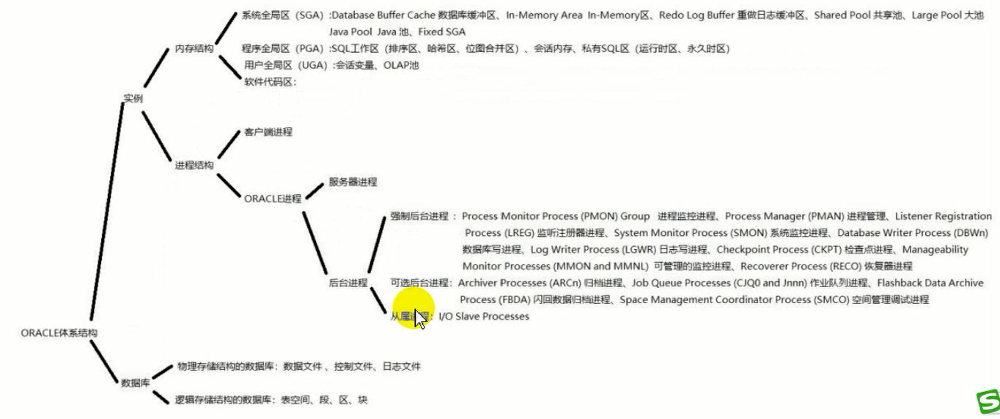
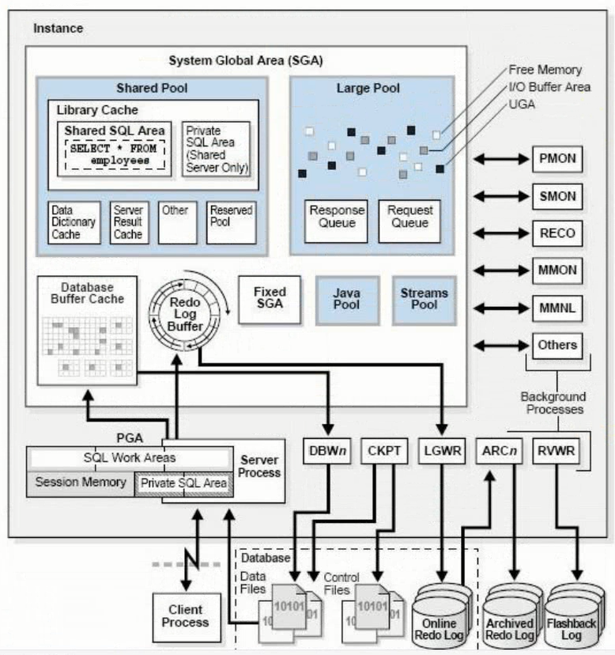
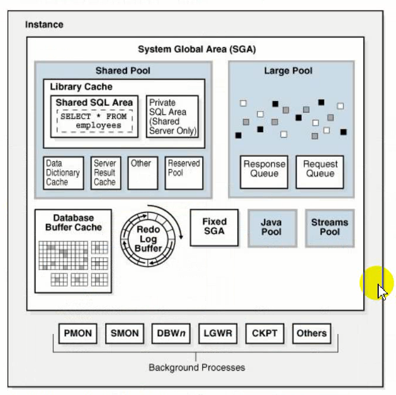
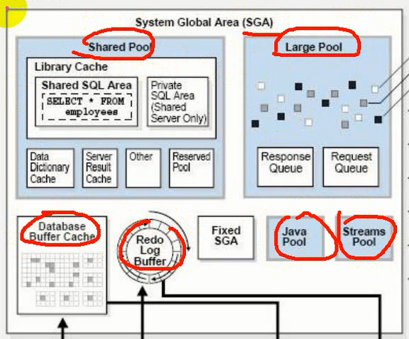
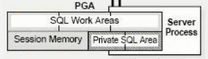
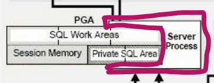
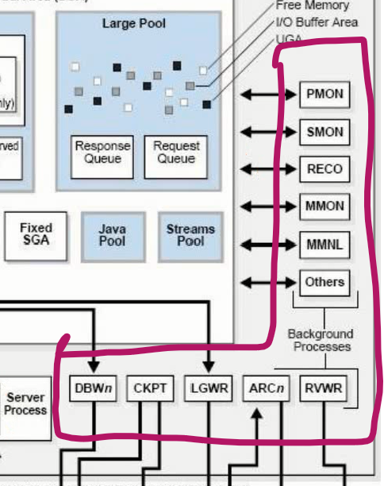
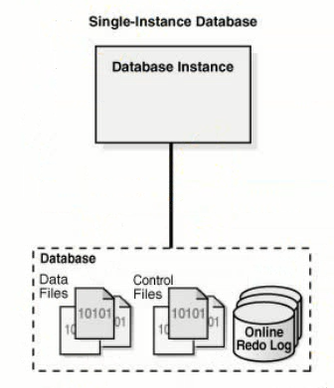

# 体系结构

oracle的体系结构由**实例**和**数据库**组成。

实例由**内存结构**和**进程结构**组成。数据库由**物理存储结构的数据库**和**逻辑存储结构的数据库**。一般讲的数据库指物理存储结构的数据库。

::: warning
客户端进程不属于实例的一部分。
:::

总体体系结构如下图所示，包括jinstance实例，和Database Data Files

## 实例

实例由两个部分组成：内存结构和进程。

### 内存结构

内存结构由SGA和PGA组成。

#### SGA

SGA中有许多缓冲池。

#### PGA

### 进程

进程由服务器进程和后台进程组成。**客户端进程不属于实例的一部分**。客户端进程不能直接操作、访问和管理数据库实例。

客户端连接到数据库后，会分配服务器进程，通过服务器进程访问内存数据。

#### 服务器进程

#### 后台进程

## 数据库

**
实例是内存和进程，数据库主要指三个文件。实例和数据库的关系是：**通过实例管理数据库**。

no mount，实例启动，分配内存，启动进程。mount，通过控制文件装载数据库，实例和数据库建立关联。open，打开数据库的数据文件、日志文件，此时可以通过实例管理数据库。

### 物理存储数据库组成

数据文件 data file，控制文件 control files，联机在线重做日志文件 online redo log file。

### 逻辑存储结构数据库

表空间，段，区，块。

