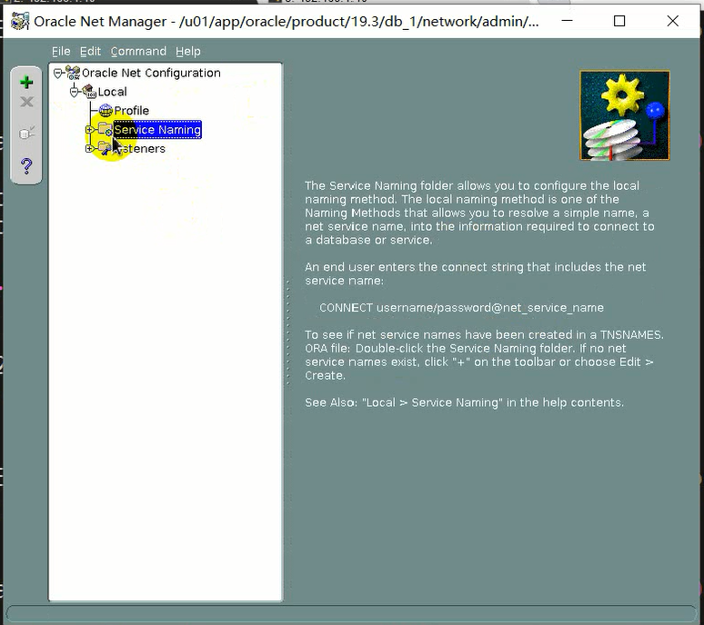
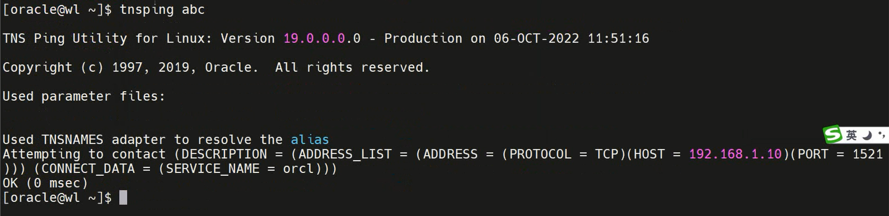
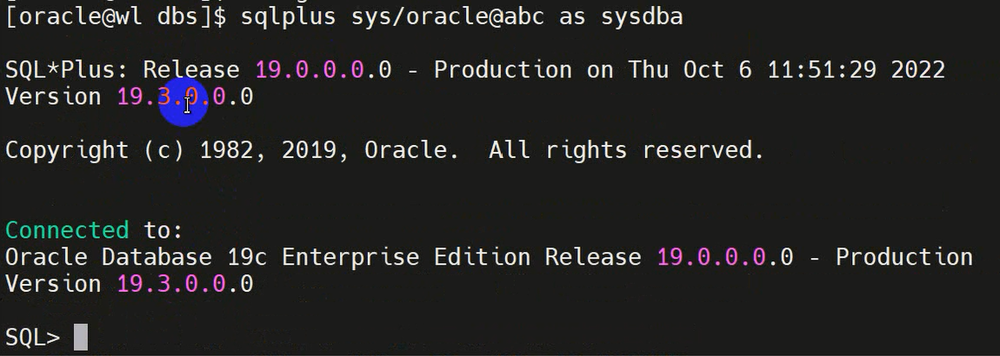
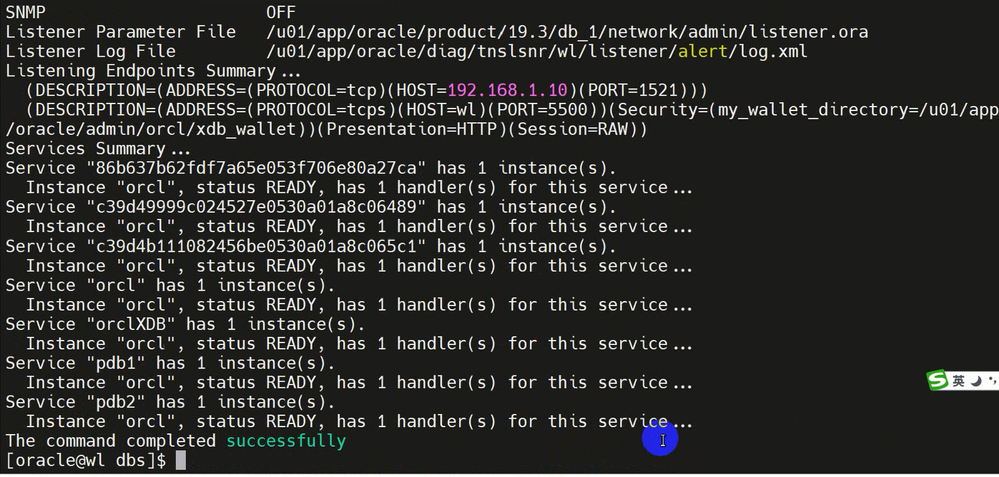
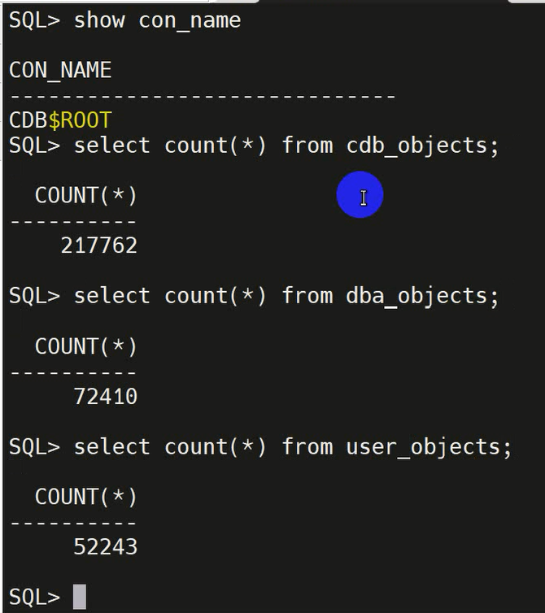

# CDB

## 查看数据库是否为CDB

```sh
SQL> select name, decode(cdb, 'YES', 'Multitenant Option enabled', 'Regular 12c Database:')"Multitenant Option", open_mode, con_id from v$database;
```

## 连接到CDB

### 简易方式连接

sqlplus命令，/分割用户名和口令，as sysdba

使用操作系统验证省略用户名密码。当前连接到系统的oracle用户，说明有权限连接到数据库。此时不进行口令验证，随便怎么填进去都是sys用户。

```sh
# 操作系统验证方式
sqlplus / as sysdba
show con_name
```

当使用网络连接时，必须指定用户名跟口令。此时使用的是数据库口令文件验证。口令文件为 $ORACLE_HOME/dbs/orapw[sid]

```sh
# 简易方式
sqlplus sys/oracle@192.168.1.10:1521/orcl as sysdba
```

### 使用net service方式连接

需要使用netmgr配置网络服务名。



在Service Naming中新建。新建的名称自己定义，TCP/IP本机1521，**Service Name不能随便写，需要查询**。

```sh
show parameter service_name
```

配置完成后可以用tnsping验证。



此时可以用以下方式连接

```sh
sqlplus sys/oracle@abc as sysdba
```



通过命令lsnrcl可以看到配置的服务名

```sh
lsnrcl status
```



## CDB数据字典

多租户容器数据库（CDB）中，数据字典表和视图定义的元素数据仅存储在根目录中。每个可插拔数据库（PDB）都有自己的一组数据字典表和视图，用于包含在PDB中的数据库对象。

在根容器下查询



cdb_objects存放所有容器的对象，dba_objects只存放根容器下sys用户的对象，user_objects只存放当前用户的对象。

|View|Description|
|---|---|
|{cdb/dba}_pdbs|CDB或PDB的信息|
|cdb_properties|数据库参数|
|{cdb/dba}_pdb_history|每个pdb的历史信息|
|{cdb/dba}_container_data|显示用户级别和一些属性信息|
|{cdb/dba}_pdb_saved_status|保存的状态|
|{cdb/dba}_cdb_app_errors|错误消息|
|{cdb/dba}_cdb_rsrc_plans|pdb资源计划指令|
|{user/all/dba/cdb}_objects|查看所有对象|
|{all/dba/cdb}_services|网络服务名|