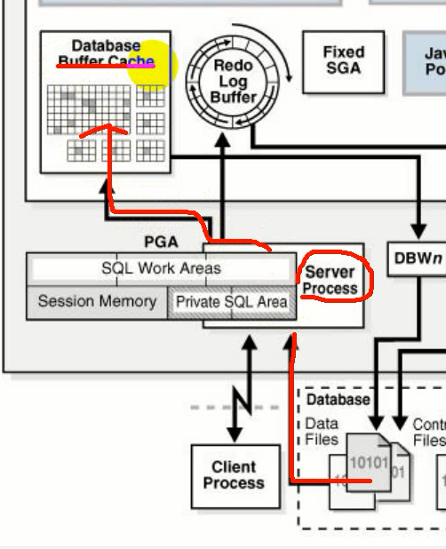
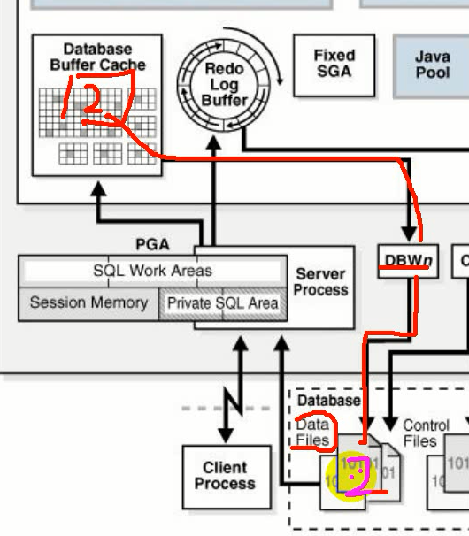
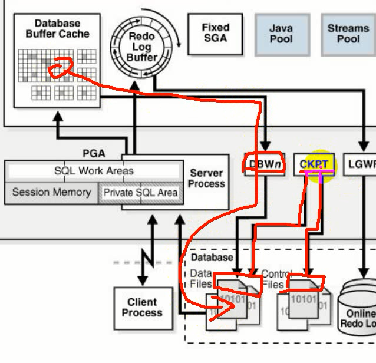

# 检查点

检查点是一致性关闭数据库，实例恢复，和Oracle数据库操作中的一种**关键机制**。

Oracle数据库使用检查点来实现以下目的：
* 减少实例或介质故障是恢复所需的时间
* 确保数据库定期将缓冲区高速缓存中的脏缓冲区写入磁盘
* 确保数据库在一致关闭期间将所有提交的数据写入磁盘（shutdown immediate）

脏缓冲区：<br />
数据文件数据通过服务器进程缓存到Database Buffer Cache中，磁盘->内存。在内存中就可以进行查询、修改等操作。



若内存中的数据与磁盘中存储的数据一致，则称其为干净的缓冲区。<br />
若内存中的数据经过更新，还没写回数据文件，与磁盘中数据不一致，则称为脏缓冲区。<br />
内存中的数据通过**DBWn**后台进程写到磁盘的数据文件中。此时内存数据跟数据文件是一致的。



定期执行检查点，执行检查点时将内存脏缓冲区数据写回磁盘，保持数据一致。

手动执行检查点命令：

```shell
alter system checkpoint;
```

**CKPT**后台进程即为检查点的后台进程，CKPT和DBWn为协作的关系。例如在执行检查点的语句时，实际上是执行CKPT，它会更新**数据文件头部的信息**，同时更新**控制文件头部的信息**，之后CKPT通知DBWn将脏缓冲区数据写回文件。



数据库一致性关闭的时候也会执行检查点
```sh
shutdown immediate
```

::: warning
但是shutdown abort时不会执行检查点
:::

## 线程检查点
数据库将在特定目标之前在特定线程中由重做修改的所有缓冲区写入磁盘。数据库中所有实例上的线程检查点集是**数据库检查点**。线程检查点在以下情况发生
* 一致性的数据库关闭(shutdown immediate)
* ALTER SYSTEM CHECKPOINT
* 在线重做日志切换
* 热备份 ALTER DATABASE BEGIN BACKUP

## 表空间检查点
数据库将在特定目标之前通过重做修改的所有缓冲区写入磁盘。表空间检查点是一组数据文件检查点，表空间中的每个数据文件一个。这些检查点在各种情况下都会发生，包括使表空间为只读或者使表空间正常脱机，缩小数据文件活执行ALTER DATABASE BEGIN BACKUP。

## 增量检查点
增量检查点是线程检查点的一种，其部分目的是避免在联机重做日志开关中写入大量块。DBWn至少每3秒钟检查一次，以确定是否由工作要做。当DBW写入脏缓冲区时，它将前进检查点位置，从而使CKPT将检查点位置写入控制文件，而不写入数据文件头。
