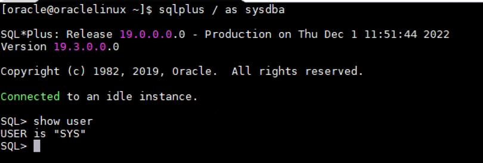
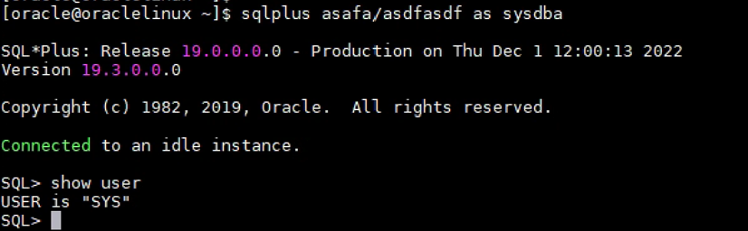
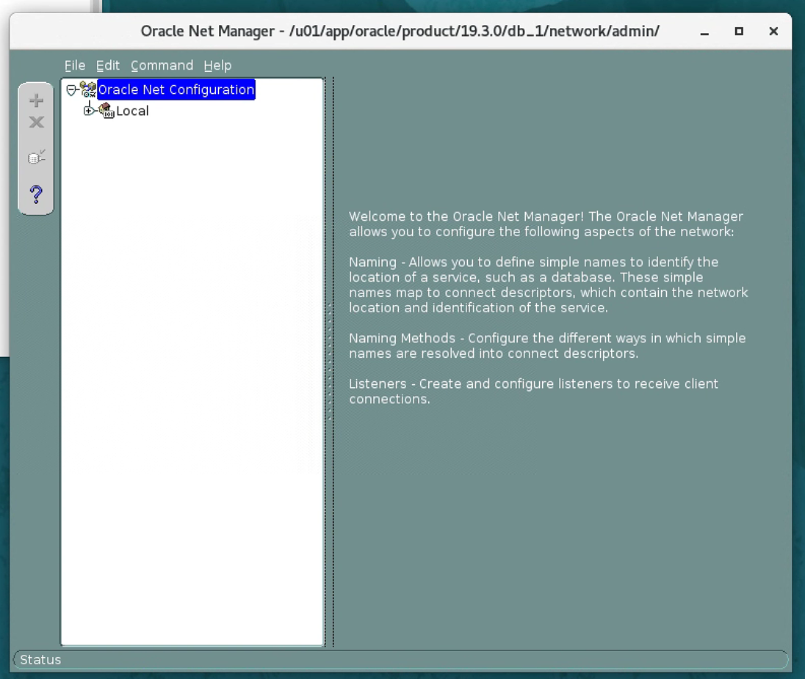
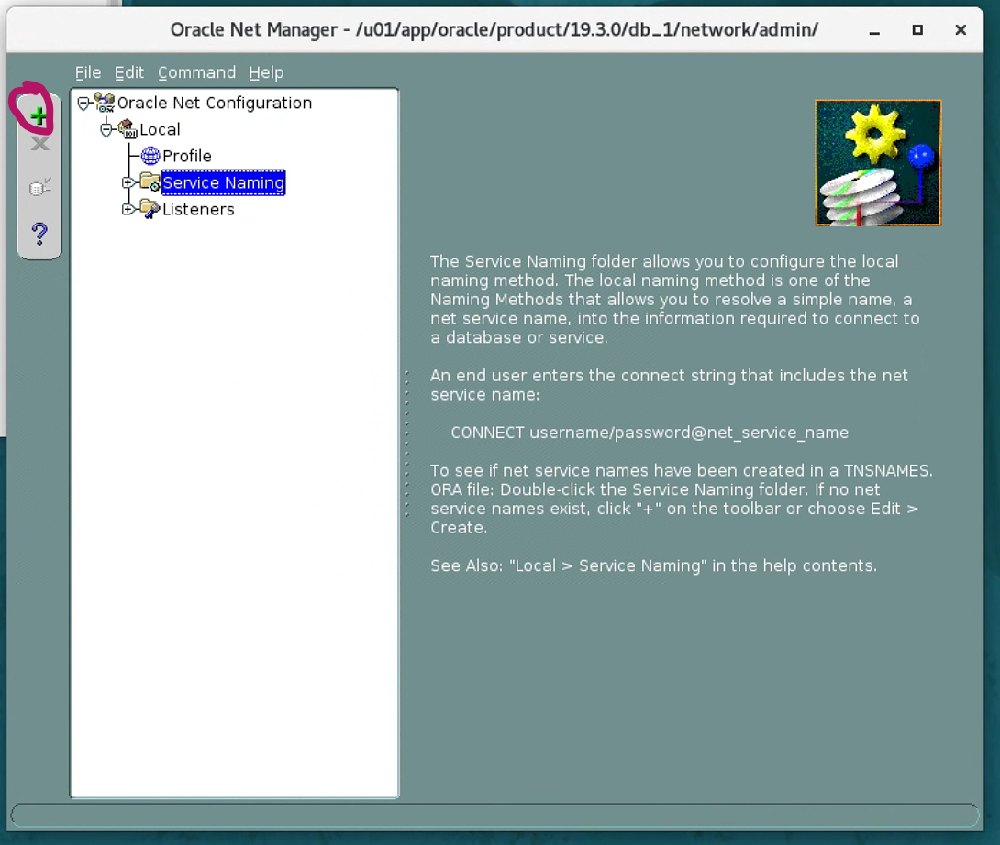
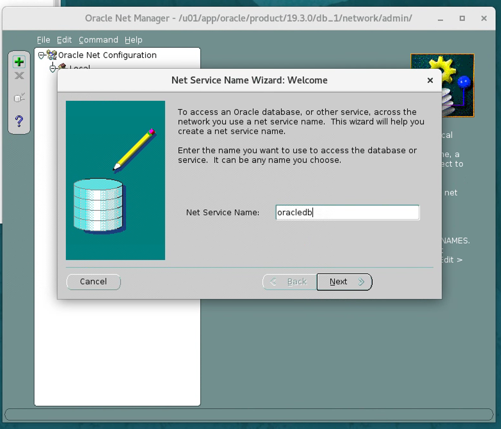
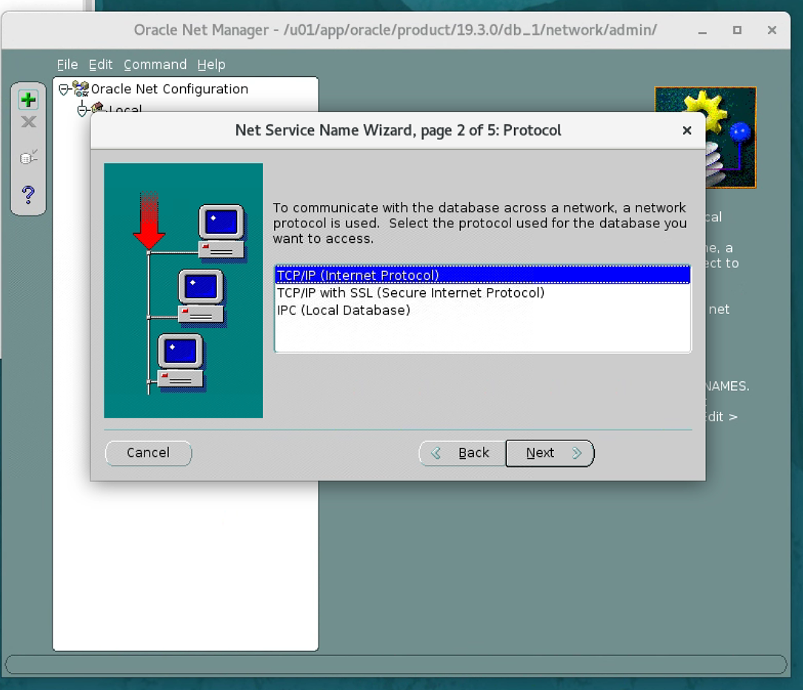
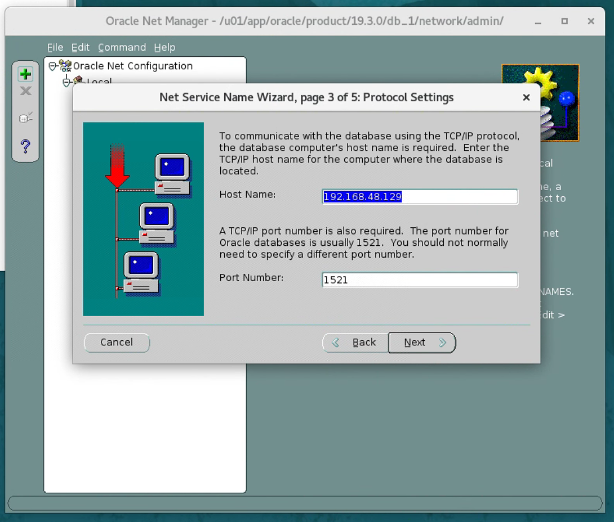
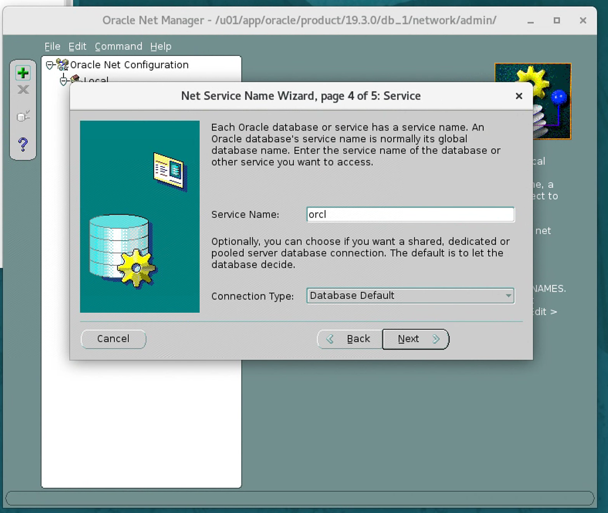
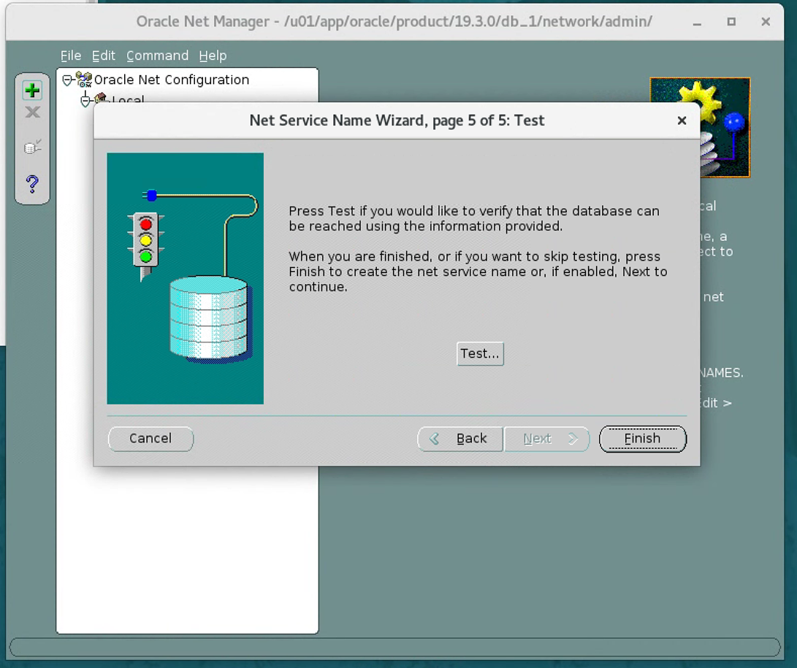

# 数据库连接

## 操作系统认证方式

本地运行
```shell
sqlplus / as sysdba
```

在连接时没有指定用户，但此时连接进来的用户为SYS


```shell
# / 左侧应该是用户名，右侧为以口令，上面的命令省略了用户名和口令
sqlplus sys/oracle as sysdba
```
因为是使用操作系统验证方式，所以不需要用户名和口令也可以登录。

能够连接到操作系统的oracle用户，说明就有权限。此时随便输入用户名和口令，登入的也是sys用户。因为不会对用户名和口令验证。


## easy connect
通过网络方式连接，需要配置网络服务名，如果没有配置网络服务名，可以通过建议方式连接。
```shell
sqlplus [用户名]/[密码]@[ip地址]:[端口]/[数据库] as sysdba
```

此时需要对用户名和口令验证，用户名和口令都要正确。

利用口令文件验证，$ORACLE_HOME/dbs/orapw[SID]。

如果有配置网络服务名:
```shell
netmgr
```








之后就可以通过网络服务名的方式来连接了
```shell
sqlplus [用户名]/[密码]@[网络服务名] as sysdba
```

## TNS
