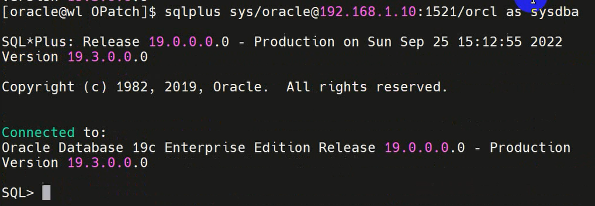

# 数据库连接

## 操作系统认证方式

使用本地的sqlplus工具，以sysdba的身份连接到数据库。这样连接进来的用户是SYS。

```shell
sqlplus / as sysdba
```


```shell
# / 左侧应该是用户名，右侧为以口令，上面的命令省略了用户名和口令
sqlplus sys/oracle as sysdba
```

因为是使用操作系统验证方式，所以不需要用户名和口令也可以登录。

能够连接到操作系统的oracle用户，说明就有权限。此时随便输入用户名和口令登入的也是sys用户，因为不会对用户名和口令验证。


## easy connect

通过网络方式连接，需要配置网络服务名。使用netmgr进行配置。

如果没有配置网络服务名，可以通过简易的方式连接。要加地址端口和数据库。称为easy connect。通过网络连接时要对口令验证。

```shell
sqlplus [用户名]/[密码]@[ip地址]:[端口]/[数据库] as sysdba
sqlplus sys/oracle@192.168.11.1:1521/orcl as sysdba
```



利用口令文件验证，口令文件位于**$ORACLE_HOME/dbs/orapw[SID]**。

如果有配置网络服务名:
```shell
netmgr
```

网络服务名称随便定义


之后就可以通过网络服务名的方式来连接了
```shell
sqlplus [用户名]/[密码]@[网络服务名] as sysdba
```

## TNS
