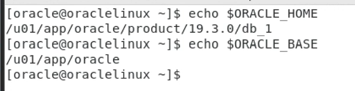
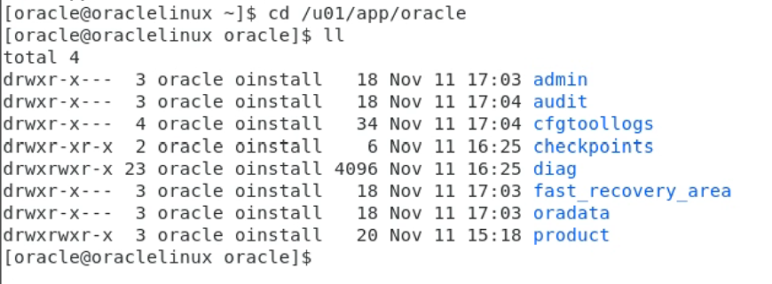
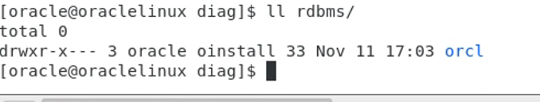

# Oracle目录结构

## /u01

安装软件的根为 /u01，其下只有app文件夹。

app文件夹下有oracle文件夹和oraInventory。

### /u01/app

oraInventory存放安装过程中的信息，由oracle创建。

oracle为oracle的base目录，设置在环境变量中

环境变量ORACLE_HOME。

## /u01/app/oracle

### /u01/app/oracle/product
oracle家目录：/u01/app/oracle/product/19.3.0/db_1，也配置在环境变量中

### /u01/app/oracle/oradata
存放oracle数据的目录，内部有根据SID命名的文件夹，每个文件夹内存放对应SID的数据库的日志文件，控制文件和数据文件。

.dbf为数据文件，.log日志文件，.ctl控制文件。

pdbseed文件夹存放种子容器的数据文件

其余文件夹为容器数据库的数据文件，例如此处的odb

### /u01/app/oracle/fase_recovery_area

闪回恢复区

其下仍为以SID命名的文件夹，存放着对应数据库的归档文件，控制文件副本，以及rman的备份，还可以存放闪回日志文件

### /u01/app/oracle/diag

diag文件夹存放oracle数据库额所有跟踪文件和警告文件，例如asm，rdbs和监听等等。

数据库的警告文件位于rdbms下，也是以SID命名的文件夹，存放对应数据库的警告文件。

rdbms下的orcl中还有一个orcl

trace中alert_orcl.log为orcl的警告文件，可以通过vim查看

### /u01/app/oracle/checkpoint
存放保存点，当前未创建保存点，是空的。

### /u01/app/oracle/cfgtoollogs
配置工具的日志目录，例如dbca等

### /u01/app/oracle/audit
里面没什么东西

### /u01/app/oracle/admin

adump 存放审计文件 pfile 存放参数文件备份

## 家目录

一下为几个常用文件夹

admin：保存数据库的管理信息和日志信息 
oradata：数据库数据文件、控制摁键、索引文件等，是真正的数据存放位置 
Oracle_Home 主目录包含Oracle软件运行有关的子目录和网络文件以及选定的组件等 
BIN 包含用于数据库管理的各种命令等
dbs 存放数据库服务器端的参数文件Spfile
css与Oracle Cluster Synchronization服务有关的文件
demo 存放数据库实例模式的脚本等
install 用于存储ORACLE安装后的端口号
network 监听器listener.ora和sqlnet.ora以及tnsnames.ora等

### rdbms

rdbms的admin下存放.sql结尾的脚本文件

### network
进行网络配置

监听器listener.ora在network的admin下

### deinstall
卸载

### sqlplus
sqlplus工具相关信息

### dbs
存放口令文件和参数文件

### bin
存放一些命令，例如dbca等

### OPatch
补丁升级
