# 文件

## 参数文件

### 参数文件的作用

参数文件用于存放实例所需要的初始化参数，因为多数初始化参数都具有默认值，所以参数文件实际存放了非默认的初始化参数。

### 参数文件额位置

spfile存放了参数文件的位置。

```sh
show parameter spfile
```

### 参数文件类型

1. **服务端参数文件**

又称为spfile，是二进制文件，命名规则为：SPFILE+SID.ORA。

::: warn
使用vim打开spfile之后不能使用wq退出，要用q!
:::

2. **静态参数文件**

又称为pfile，是文本文件，命名规则为：INIT+SID.ORA。

### 参数文件使用顺序

优先使用spfile，当spfile不存在或出错，使用pfile，当pfile不存在或出错，数据库不能正常启动。

### 判断数据库使用哪个文件

查看如下参数。若参数有显示值，使用的就是spfile，显示为空则使用pfile。

```sh
show parameter spfile
```

### 创建pfile

```sh
create pfile from spfile;
create pfile='/home/oracle/init.ora' from spfile;

SQL> create pfile='/home/oracle/init.ora' from memory;
```

### 创建spfile

利用pfile创建的spfile参数很少，由内存创建的spfile参数很多。

```sh
create spfile from pfile;
create spfile='/home/oracle/spfile.ora' from pfile;

SQL> create spfile='/home/oracle/spfile.ora' from memory;
```

### 参数查看

```sh
show parameter [参数名]
```

### 参数修改

1. slter session

当前会话生效，新开的会话或重启呼叫库参数值不生效。

```sh
# alter session
show parameter sql_trace
alter session set sql_trace=true;
show parameter sql_trace
```

2. alter system

当前会话生效，新开的会话或重启数据库会参数值都生效。

```sh
show parameter sql_trace
alter system set sql_trace=true;
show parameter sql_trace
```

3. alter system + differed

当前会话不生效，新开的会话或重启数据库会参数值生效。

```sh
show parameter sort_area_size
alter system set sort_area_size=75536 deffered;
show parameter sort_area_size
```

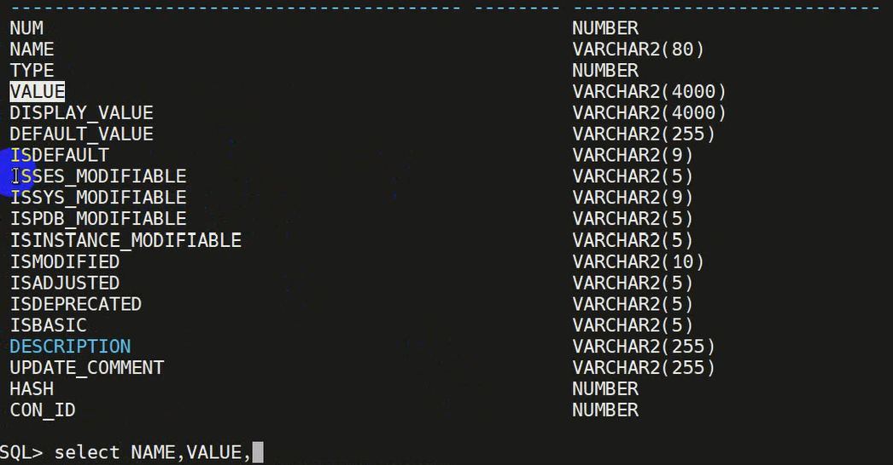

通过查询数据字典中的ISSES_MODIFIABLE,ISSYS_MODIFIABLE,ISPDB_MODIFIABLE。

ISSES_MODIFIABLE为true则能够使用alter session命令修改。ISSYS_MODIFIABLE为true则能使用alter system修改。ISPDB_MODIFIABLE表示参数是否能在PDB中修改。ISMODIFYIED表示该字段有没有更改过。

4. 重置参数

```sh
alter system reset optimizer_mode;
show parameter oprimizer_mode;
```
5. 加选项scope

当是使用spfile启动数据库时，可以通过在命令结尾加scope参数指定为spfile修改文件中的参数，指定为memory修改内存中的参数。

对静态参数的修改需要指定scope=spfile；

不加选项默认指定both

```sh
alter system set optimizer_mode=all_rows scope=spfile;
alter system set optimizer_mode=all_rows scope=smemory;
alter system set optimizer_mode=all_rows scope=both;
```

CBD参数文件使用12C以前的SPFILE，PDB参数文件不出现在SPFILE中，而是从CDB中继承，如果PDB中私有本地参数，则会保存在CDB的PDB_SPFILE$字典表中，并以con_id(容器id号)区别。当PDB UN-Plug时，PBD参数写如PDB的xml文件中，当drop pluggable database后，pdb和PDB_SPFILE$信息记录会被清除。

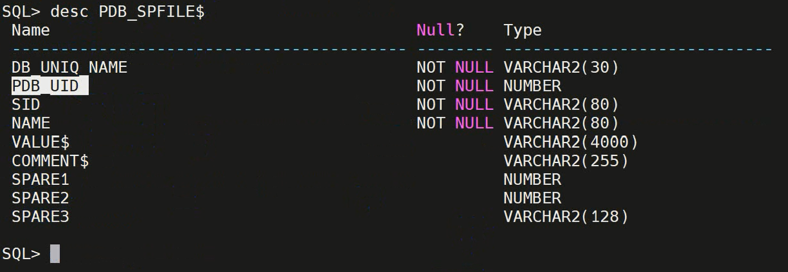

CDB参数文件使用以前的SPFILE，pdb的参数不会出现在SPFILE中，而是从CDB中继承。PDB中看到的参数跟在根容器中看到的参数值是一样的。若CDB中更改了某个参数，PDB中的参数也会更改。在PDB中修改参数不会影响其他PDB和CDB。PDB中修改了参数值后，可以在PDB_SPFILE$中看到各个PDB的不同参数，以con_id区别。

当把容器拔出后，容器的参数会记录在XML中，PDB_SPFILE$中的参数会被清除。PDB重新创建后，PDB_SPFILE$中会出现xml中的参数。但是由于一些PDB特殊的原因，在插入时有些参数会被遗弃。

CDB与PDB不同值的相同参数

多租户环境下，如果在设定参数时，cdb中设置CONTAINER=ALL，那么PDB的参数也会继承这个值，但可以通过ALTER SYSTEM在PDB container 中修改PDB local parameter，覆盖（优先）从CDB继承的参数。

在ROOT中修改参数，默认情况和指定container=all/current均是所有open的pdb都生效。ORACLE的参数文件只是记录的cdb的sid的参数，并未记录各个pdb的参数，那如何实现cdb中各个pdb参数不一致？

在独立修改pdb参数时，其本质是在pdb_spfile$基表中插入或者修改相关记录（第一次是插入，后续修改是更新）

## 控制文件

### 控制文件存储的数据信息

1. 数据库名称和数据库唯一标识符（DBID），通过select name, dbid from v$database；查询DBID和数据库名称。
2. 创建数据库的时间戳。
3. 有关数据文件、联机重做日志文件、归档重做日志文件的信息，位置、文件名称等物理结构信息。
4. 表空间信息。
5. 检查点信息。
6. 日志序列号信息。

控制文件包含数据文件、联机重做日志文件等信息。

控制文件也会跟踪数据库的结构变化。当数据库打开时，对数据文件增加表空间，或者对表空间增加数据文件，表空间脱机联机，这类数据库结构变化发生时会更新数据文件，会在控制文件中记录。

控制文件包含未打开数据库时必须可访问的元数据。

至少有一个控制文件、建议有多个控制文件。多个控制文件相互镜像，需要能够同时使用。防止控制文件丢失，避免单点故障。

在mount、open时，数据库发生结构变化时控制文件会被使用。

### 控制文件位置

查看控制文件位置。

```sh
select name from v$controlfile;
```

control_files参数记录了控制文件位置，该参数记录在参数文件中。在nomount状态打开参数文件后，在参数文件中找到该参数打开控制文件，数据库进入mount状态。

```sh
show parameter control_files
```
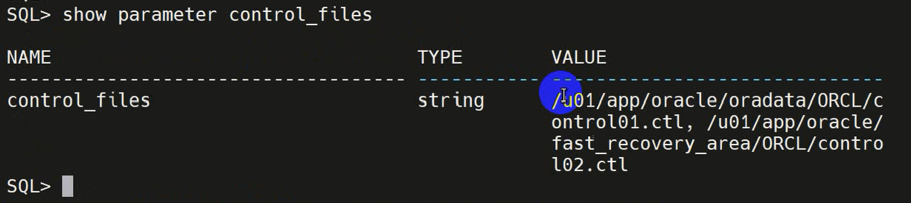


### 控制文件操作

**增加**：

先查看参数control_files，再使用命令在该参数中原有的位置基础上新增新路径。路径新增完成后，关闭数据库生成新文件，复制即可。复制后再打开。

```sh
alter system set control_files='[原有路径]','[原有路径]','[新的位置]' scop=spfile;
```

上述方法适用于数据库使用spfile的情况下，使用pfile时需要用vim修改pfile。同样是修改control_files。

::: TIPS
pfile中参数修改直接修改pfile文件，spfile中的参数需要使用命令修改。
:::

**删除、重定位、重命名**的操作方法与新增相同。

### 控制文件备份

备份二进制文件：

```sh
alter database backup controlfile to "d:\control-back.tcl";
```

备份文本文件：

```sh
alter database backup controlfile to trace as 'd:\control_back_text.ctl';
```

在对数据库的物理结构改变后，需要重新对控制文件备份，包括：
1. 增加、删除、重命名数据文件
2. 增加、删除表空间
3. 增加、删除日志组成日志文件。

### 创建控制文件

在归档模式下打开数据库

```sh
archive log list;
shutdown immediate;
# 开归档
alter database archivelog;
alter database open;
archive log list;
```

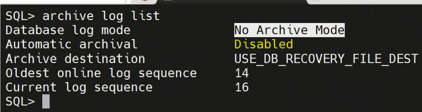
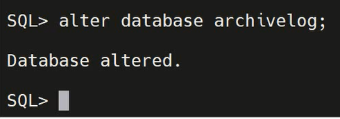
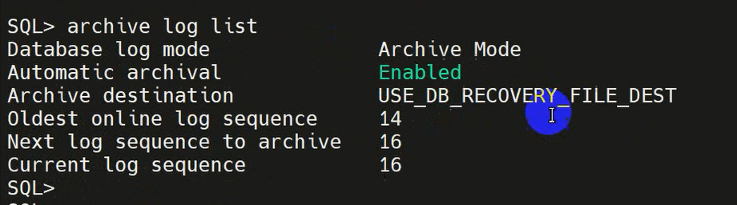

备份控制文件

```sh
alter database backup controlfile to trace as '/home/oracle/con_text.ctl';
```

找到当前所有的控制文件并删除。

```sh
select name from v$controlfile;
select 'host rm -rf' || name from v$controlfile;
```
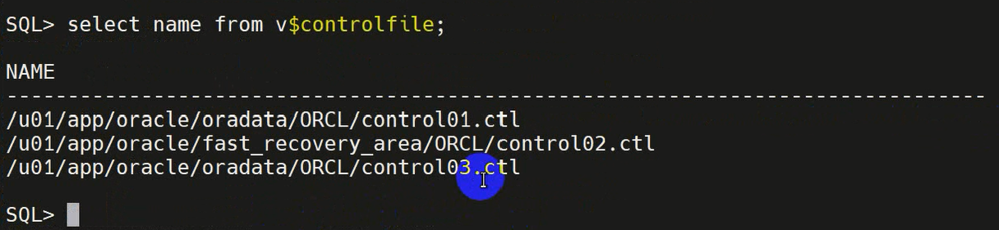
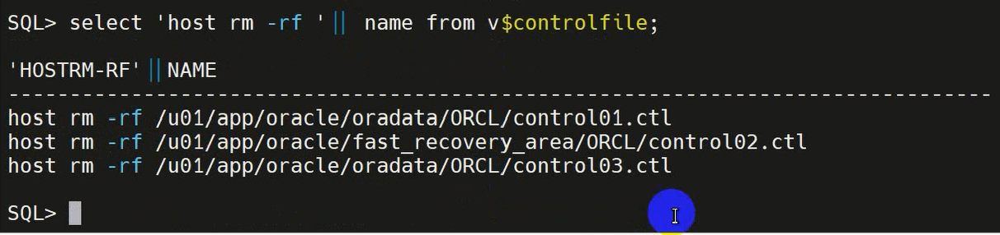

重启数据库，此时重新创建控制文件即可。此时会报00205控制文件的错误信息。

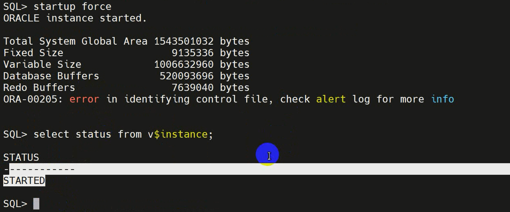

重建控制文件使用cont_text.ctl中的命令。选择带有NORESETLOGS的命令。

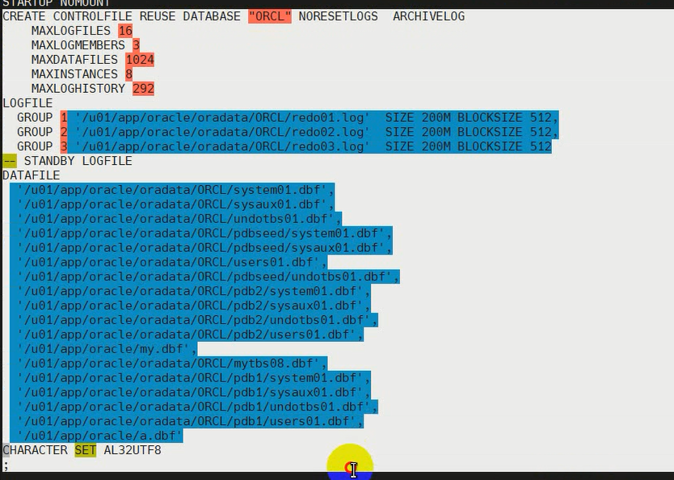

创建完成后，恢复数据库并open

```sh
recover database
alter database open;
alter pluggable databse all open;
```

## 联机在线重做日志

### 数据信息

信息来源于log buffer中的重做记录。

重做记录记录了与更改相关的所有元数据，包括如下：
1. 更改的SCN和时间戳
2. 变更事务的事务ID
3. 事务提交时的SCN和时间戳（如果它已提交）
4. 所作更改的操作类型
5. 被修改的数据段的名称和类型

### 多个重做日志文件

数据库至少要有两个日志组，每个日志组至少有一个重做日志文件，实现日志切换。

```sh
select * from v$log;
```
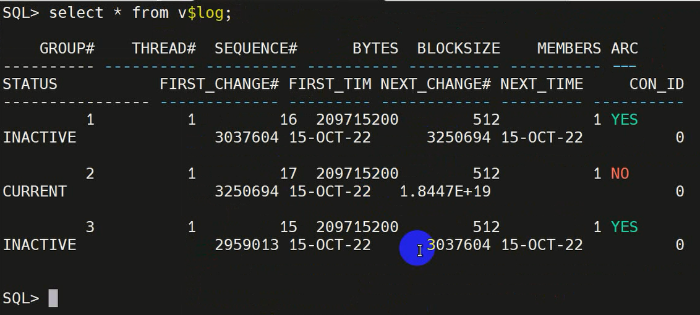 

维护联机重做日志组的多个成员，**多路复用**，可以防止重做日志的丢失。理想情况下，各个重做日志成员的位置应该在单独的磁盘上，这样单个磁盘故障不会导致整个联机重做日志的丢失。

当前组对应的文件，若当前正在使用的组丢失了（当前组只有一个成员），意味着数据丢失。**丢失当前正在使用的日志文件很严重**。

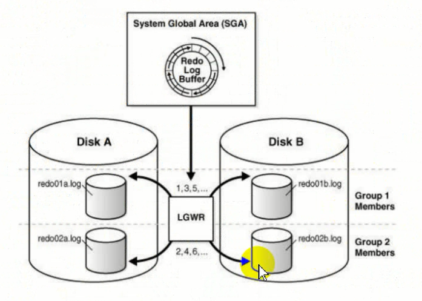

一个组的两个成员护卫镜像，存在不同的磁盘上。

### 使用

**数据库启动**时会被用到。若在open时丢失日志文件，无法开始。数据库启动后日志文件也需要时刻能够使用。

在**数据库恢复**时需要用到，包括实例恢复和介质恢复。

联机重做日志切换，Oracle数据库一次只使用一个联机重做日志文件来存储从重做日志缓冲区写入的记录。正在由LGWR进程写入的联机重做日志文件称为当前联机重做日志文件，状态为CURRENT。

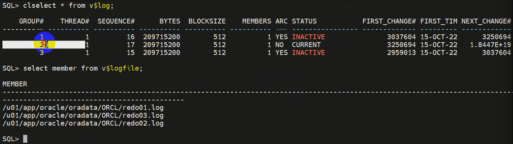

当数据库停止向一个联机重做日志文件写入，并开始向另一个写入时，发生日志切换。通常，切换发生在当前联机重做日志文件已满，且必须继续写入时。也可以手动强制日志切换。

```sh
alter system switch logfile;
```

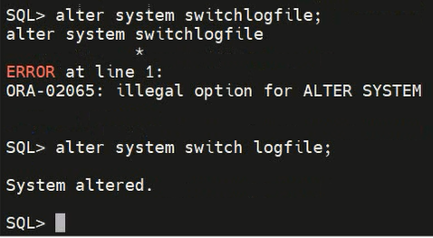

LGWR以循环方式写入联机重做日志文件。当LGWR写满最后一个可用的联机重做日志文件时，该进程又向第一个日志文件写入，如此周而复始。切换之后ARCH会产生刚刚写满的日志文件的副本，这个就是归档文件。***归档文件是联机日志文件的副本**。

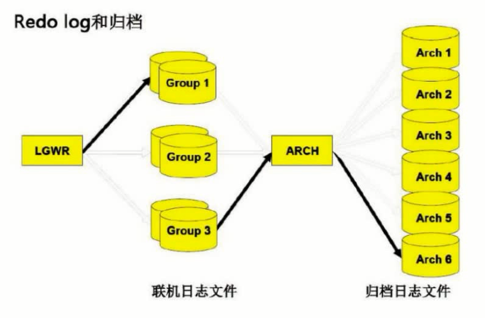

日志切换会不断覆盖原来文件内容，归档文件不会覆盖，会把所有日志文件保存起来。

### 作用

Oracle数据库将每个事务同步地写入重做日志缓冲区，然后将其写入到联机重做日志。

数据库维护联机重做日志文件，以**防止数据丢失**。具体来说，在一个实例失败后，联机重做日志文件使Oracle数据库可以恢复已提交但尚未写入数据文件的数据。

Oracle数据库使用联机重做日志除了可以进行恢复。还可以使用Oracle LogMiner查询联机重做日志文件内容，**日志挖掘**。重做日志摁键使一种有关数据库活动的有用的历史信息来源。

### 日志管理策略

要确定一个数据库例程的联机重做日志文件的合适数量，必须测试不同的配置。在规划重做日志的配置使，需考虑如下几点：
1. 重做日志组的个数。对于数据库来说两个就够了，有一些性能问题时会增加组个数。例如LGWR很快将日志写满，此时发生切换和归档，若切换一轮之后先前的归档还未完成，此时需要等待归档完成才能继续写入，事务会等待。
2. 重做日志文件的**复用**。若一个组内只有一个成员，当这个成员丢失则会丢失数据。
3. 重做日志文件的位置。LGWR是在频繁写日志文件，日志文件建议存放在**读写速度快的磁盘**上。日志组的文件（日志文件和归档文件）要**分散存放**在不同磁盘上，均衡IO。组内有多个成员时要分散存放在不同磁盘上。
4. 日志文件的大小。若文件设置很小，文件很快写满会频繁做日志切换操作，促使DBWN工作写数据文件，造成磁盘IO过高，对数据库性能不利。若日志文件过大，写了很久就没有写满就切换到第二个，第二个也在没有写满时切换回第一个。此时第一个文件归档还未完成，也会造成性能问题。**一般20~30min自动切换一次日志比较合适，根据数据库DML操作是否频繁决定**。
5. 日志文件块的大小。建议和默认为512。

### 重做日志文件响应失败

当LGWR无法写入组的某个成员时，数据库会将该成员标记为无效，并将错误消息写入LGWR跟踪文件和数据库报警日志，以提示不可访问文件的问题。当重做日志成员不可用时，lgwr的具体反应取决于缺少可用性的原因

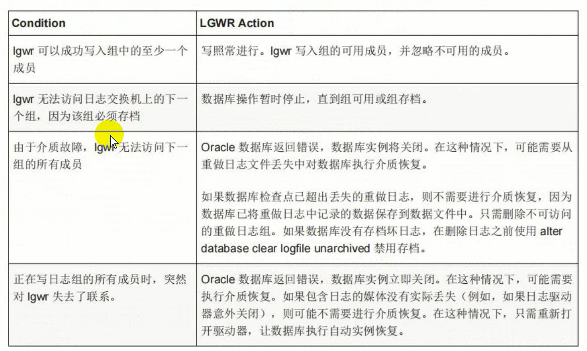

### 一些操作

#### 查看位置

```sh
select group#,member from v$logfile; 
```

#### 日志组信息

```sh
select group#,members,status from v$log;
```

#### 日志组的状态

INACTIVE：非活动

ACTIVE：活动

CURRENT：正在使用的

UNUSED：新创建的或未使用的

#### 创建日志组

```sh
# 创建日志组有一个成员
alter database add logfile 'D:\ORCL\ORADATA\ORCL\REDO004.LOG' size 50M;
# 创建日志组有两个成员
alter database add logfile('D:\ORCL\ORADATA\ORCL\REDO0051.LOG','D:\ORCL\ORADATA\ORCL\REDO0052.LOG') size 50M

select group#,members,status from v$log;
```

#### 删除日志组

如果日志组的状态库ACTIVE或CURRENT时，不能删除日志组，当数据库仅有两个日志组时，不能再删除。

```sh
alter database drop logfile group 5;
```

删除组后，成员的物理文件并没有被删除，需要手动删除。

#### 创建日志成员

```sh
select group#,members,status from v$log;
alter database add logfile member 'D:\ORCL\ORADATA\ORCL\REDO08.LOG' to group 2;
select group#,members,status from v$log;
```

#### 删除日志成员

当一个日志组仅有一个日志成员时，不能删除，当日志组下有两个成员，其中一个成员的状态为INVALID时，此时仅能删除INVALID日志成员。

```sh
alter database drop logfile member 'D:\ORCL\ORADATA\ORCL\REDO08.LOG';
```

### 日志切换

#### 自动切换

不需要用户干预，由ORACLE自动完成

#### 手动切换

```sh
alter system switch logfile;
```
### 修改日志文件位置

1. 关闭数据库
2. 利用操作系统命令复制日志文件
3. mount
4. 重命名重定位
5. open

## 归档文件

### 数据信息

归档重做日志文件是**联机重做日志组的已填充成员的副本**，此文件不是该数据库的一部分，而是由该数据库生成、并被写到用户指定位置的联机重做日志文件脱机副本。联机重做日志组文件的一个副本，包含redo记录以及一个唯一的log sequence number。

丢失损坏只会影响数据库的恢复。

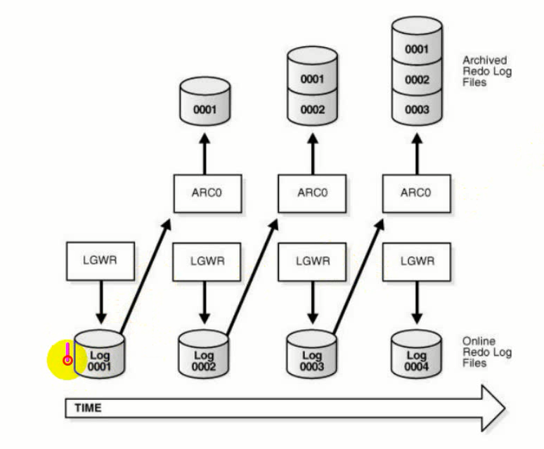

日志序列号用于日志切换时，第一个日志序列号为1，日志切换时日志序列号会自动加一。

### 归档日志文件的作用

归档重做日志文件是备份和恢复策略的关键部分。可以使用归档重做日志文件：
1. 恢复数据库备份
2. DG环境下更新备用数据库
3. 使用logminer使用程序获取有关数据库的历史信息

归档即是生成一个归档重做日志文件操作。归档可以是自动(写满切换)或者手动(命令)的，只有在数据库处于归档模式下时才会归档。一个归档重做日志文件包括重做条目和联机重做日志组的相同成员的日志序列号。

```sh
archive log list
```

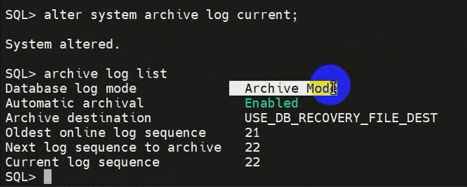

### 日志模式

#### 非归档模式

不适用于生产数据，创建数据库时缺省的日志管理模式为非归档模式

**当日志切换，检查点产生后，联机重做日志文件即可被重新使用**，联机日志被覆盖后，介质恢复仅仅支持到最近的完整备份。

联机在线重做日志文件覆盖，不完全恢复

联机在线重做日志文件没有覆盖，日志数据没有丢失，完全恢复。

#### 归档模式

能够对联机日志文件进行归档，生产数据库强烈建议归档，在日志切换胡，**下一个即将被写入日志组必须归档完成之后，日志组才可以使用**，归档日志的Log sequence number信息会记录到控制文件之中，必须有足够的磁盘空间用于存放归档日志。

归档会产生后台进程，会占用系统资源，写文件时占用磁盘IO。

### 归档文件策略

1. 建议开启归档
2. 归档的副本。默认情况下只会产生一份副本，可以考虑生成更多份。
3. 归档的进程。可以考虑开多个进程。
4. 空闲空间。

### 闪回恢复区

保存闪回日志、归档文件、RMAN

归档文件位置默认放在闪回恢复区。

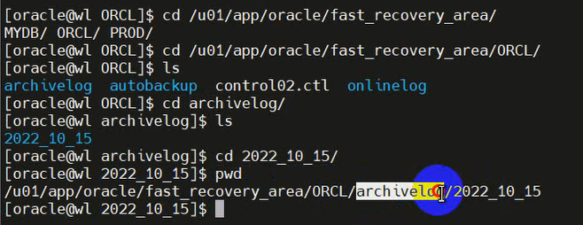

使用alter system设置

```sh
# 查看参数
show parameter db_recovery_file_dest
# 关闭
alter system reset db_recovery_file_dest
# 先设置大小再设置位置
alter system set db_recovery_file_dest_size=14970M
alter system set db_recovery_file_dest=[位置]
```

### 开启归档

在mount下开启归档。

1. 查看数据库归档情况
```sh
archive log list
```
2. 关闭数据库
```sh
shutdown immediate
```
3. 启动数据库到mount
```sh
startup mount
```

4. 打开归档
```sh
# 关闭
alter database noarchivelog;
# 开启
alter database archivelog;
```

5. 打开数据库
```sh
alter database open;
archive log list
```

### 归档日志文件位置

默认在闪回恢复区。

```sh
archive log list
```

可以使用如下方法修改位置

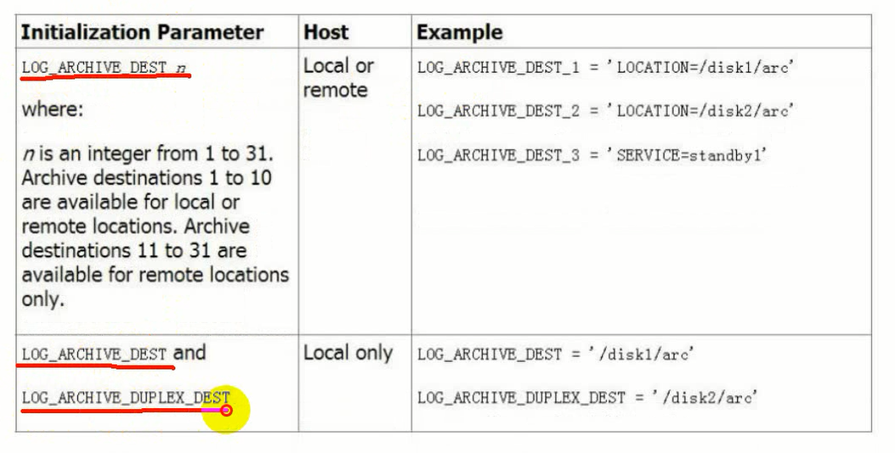

1. 方法1
log_archive_dest_state_n可以控制这31个位置启用或者停用。前10个参数可以设置为本地或远端，后面的参数只能设置到远端。每个位置都有一个state参数控制该位置的启用和停用。
```sh
# 停用
alter system set log_archive_state_2=defer;
# 启用
alter system set log_archive_state_2=enable;
```
修改存放位置：
```sh
alter system set log_archive_dest_1='location=/home/oracle';
```
可以在对应目录看到.dbf的归档文件。
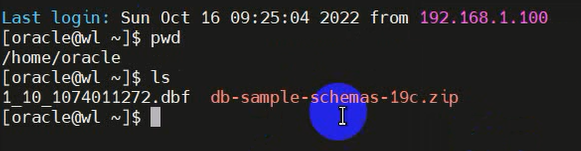
文件后缀由log_archive_format参数决定
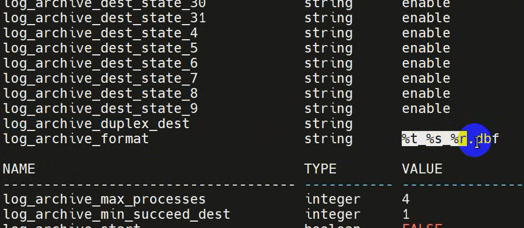
可以修改为其他后缀，这是一个静态参数需要加scope选项，并重启生效。
```sh
alter system set log_archive_format='%t_%s_%r.arc' scope=spfile;
```
系统归档一次之后可以在目录中看到新的文件
```sh
alter system archive log current;
```
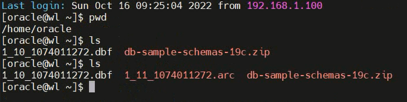
此时也可以看到归档位置已修改。可以同时归档到多个位置。
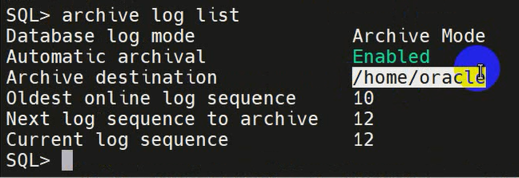

2. 方法2
方法2和方法1是互斥的，只能使用其中一种。
```sh
alter system set log_archive_dest='/tmp'
```
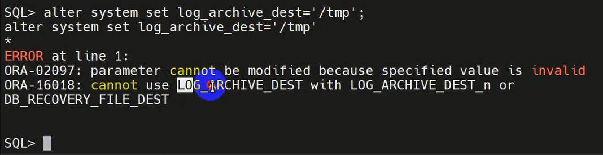
需要将方法1中修改过的参数和闪回恢复区reset，重启生效。
```sh
alter system reset LOG_ARCHIVE_DEST_n;
alter system reset BD_RECOVERY_FILE_DEST;
```
此时如果要设置多个归档位置需要设置log_archive_duplex_dest
```sh
alter system set log_archive_suplex_dest='/home/oracle';
```

一般都使用第一种方法，因为使用第二种方法时闪回恢复区就不能用了。

### 归档成功的最小个数

前提是已经设置多个归档位置

使用初始化参数LOG_ARCHIVE_DEST_n配置归档位置时，可以使用初始化参数log_archive_min_succeed_dest控制本地归档的最小成功个数。

假设设置了三个归档位置，限制最小成功个数为2的话，则只会归档两个位置。

```sh
alter system set log_archive_min_suceed_dest=2;
```


### 显示归档日志位置

查看归档位置
```sh
select destination from v$archive_dest;
```
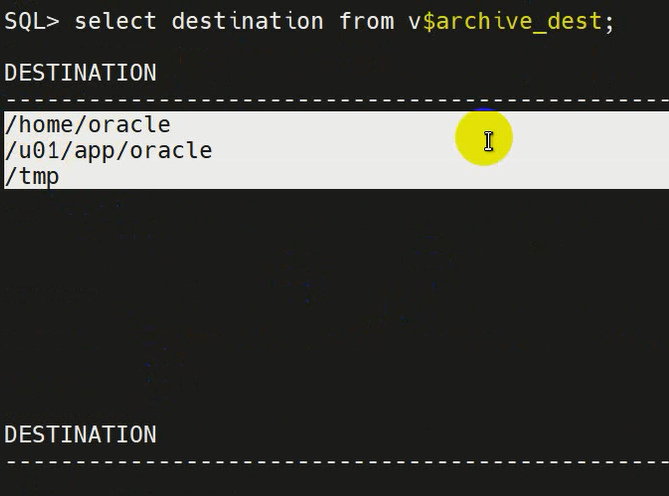

查看产生的归档日志
```sh
select name,SEQUENCE#,FIRST_CHANGE#,NEXT_CAHNGE# from v$archived_log;
```
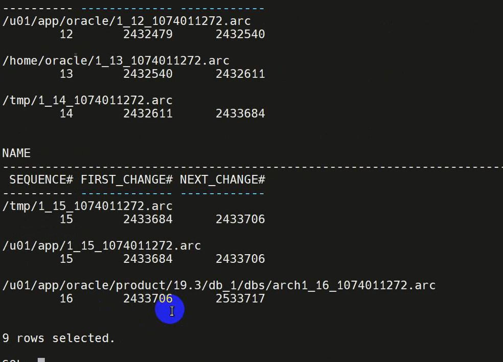
