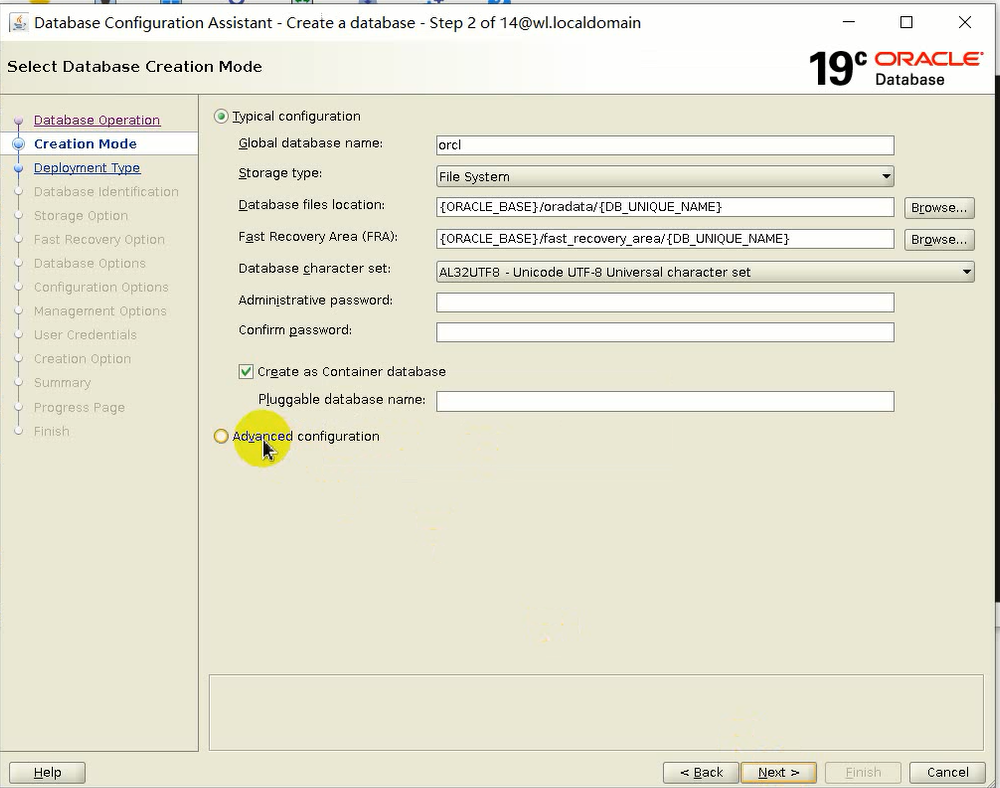
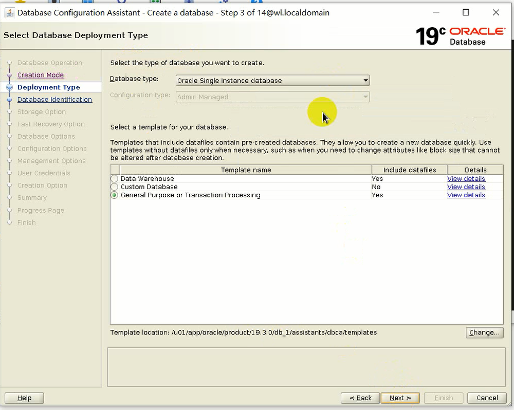
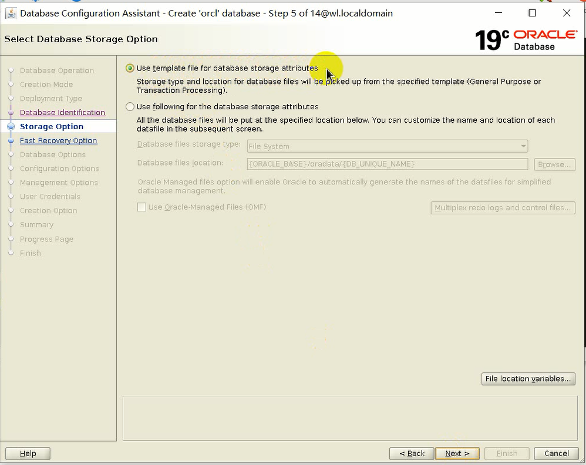
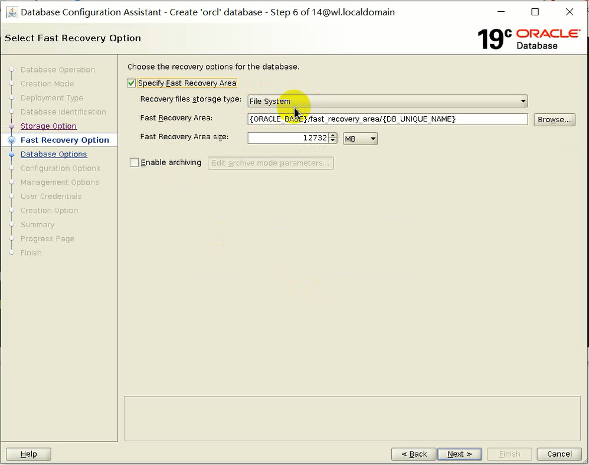
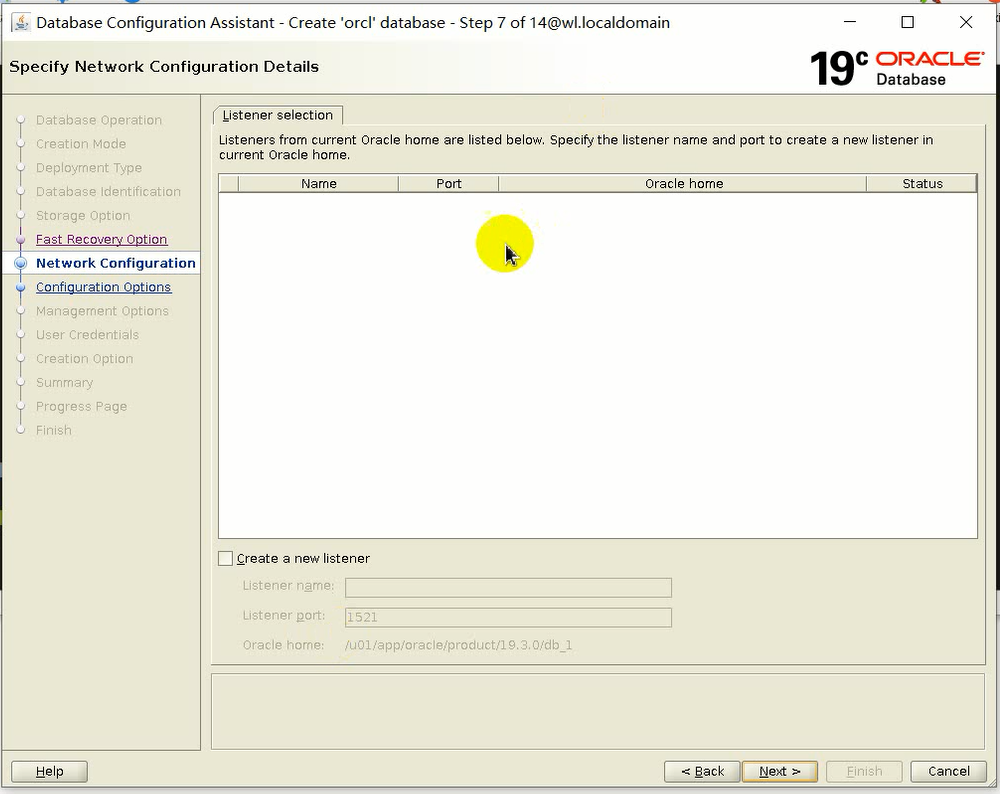
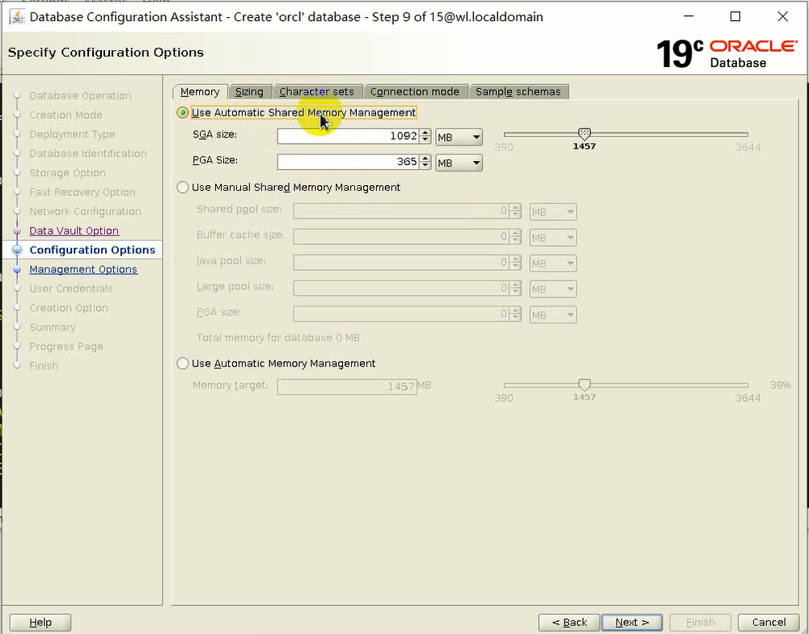
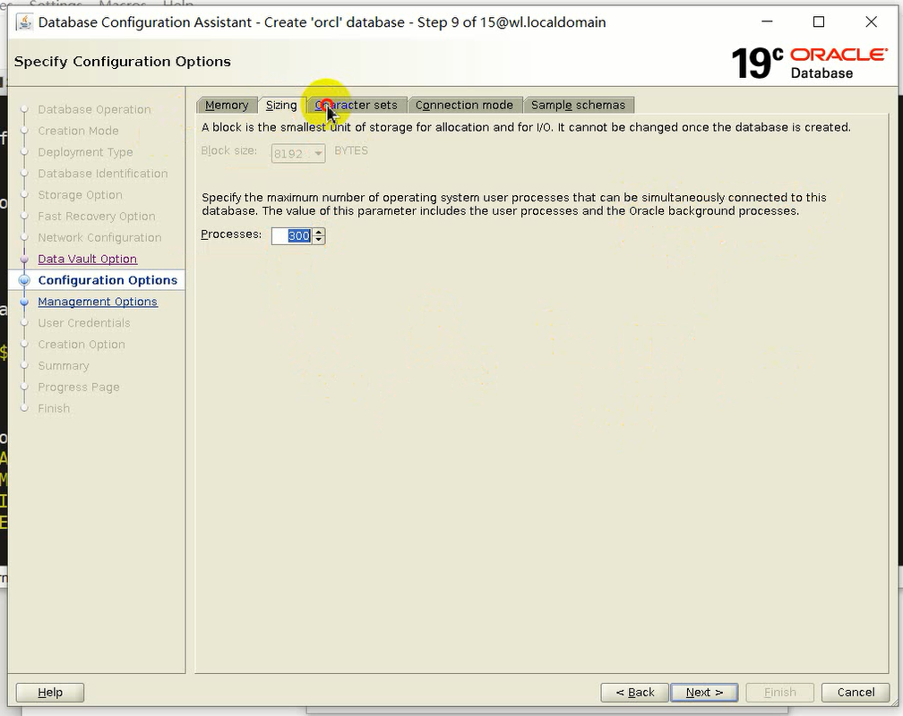
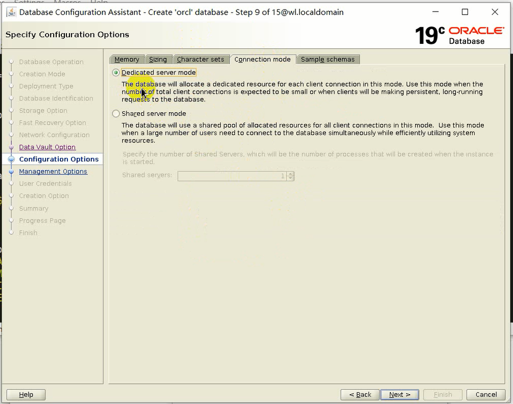
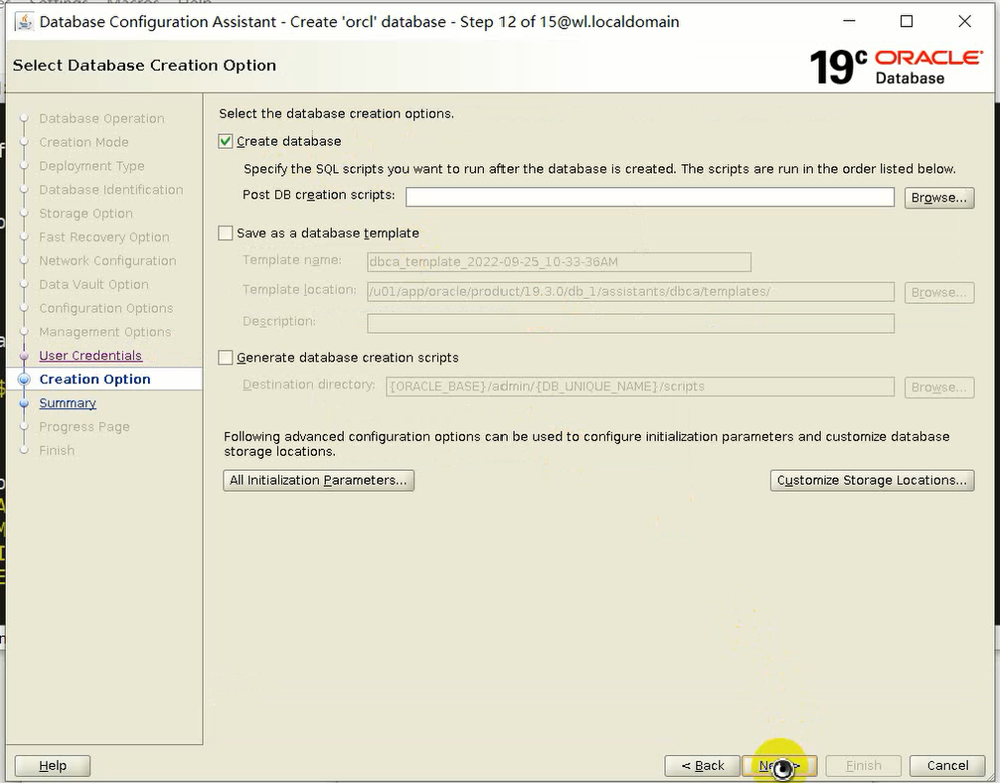
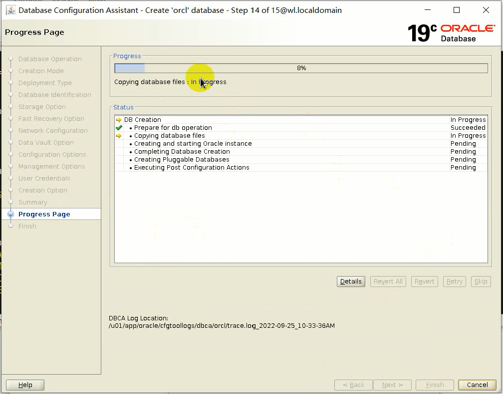

# 安装

## 安装前环境配置

### 关闭防火墙和selinux

关闭防火墙，在root用户下关闭。
```sh
# 关闭防火墙
systemctl stop firewalld
# 关闭防火墙开机启动
systemctl disable firewalld
```

关闭selinux
```sh
# 将配置文件中的SELINUX修改为disabled即可。
vim /etc/selinux/config
```

reboot生效。

### 搭建yum

搭建yum源，安装依赖包使用。

将安装系统时使用的镜像文件挂载到虚拟机。


```sh
# ISO镜像挂载时的路径为 /run/media/root/OL 

# 在/etc/yum.repos.d新建yum源配置文件
vim server.repo

[server]
name=linux
baseurl=file://[挂载路径] # 用%20替代空格
enabled=1
gpgcheck=0

# 创建完成后查看yum源
yum repolist
```

### 预安装包

预安装包的作用：
1. 创建用户
2. 创建组
3. 配置修改内核参数
4. 配置软硬资源限制
5. 安装依赖包

```sh
rpm -ivh [预安装包文件]
```

预安装包可能也有一些依赖包需要安装。

### 创建目录
```sh
mkdir -p /u01/app/oracle/product/19.3.0/db_1
chown -R oracle:oinstall /u01
chmod -R 775 /u01
```

### 修改host

```sh
vi /etc/host

# 在后面加入一行
[本机ip]        [短主机名]      [长主机名]
192.168.1.10    wl              wl.localhost
```

### 设置oracle用户口令

``` sh
pwdo racle
```

### 设置环境变量

登录到oracle用户，在其家目录配置.bash_profile。其中SID可以改掉

```sh
vim .bash_profile

# 在文件末尾添加
export ORACLE_SID=[SID]
export ORACLE_BASE=/u01/app/oracle
export ORACLE_HOME=$ORACLE_BASE/product/19.3.0.db_1
export PATH=$PATH:$ORACLE_HOME/BIN
export LD_LIBRARY_PATH=$LDLIBRARY_PATH:$ORACLE_HOME/lib
export CLASSPATH=$ORACLE_HOME/JRE:ORACLE_HOME/jlib:$ORACLE_HOME/rdbms/jlib
```

文件生效
```sh
source .bash_profile
# 检查是否有相应的环境变量
echo $[环境变量名]
```

<!-- ### 上传软件包并安装

使用远程工具上传到服务器**ORACLE_HOME**目录。

:::warning
注意上传后检查文件的所有者和所属组，需要修改为**所有者oracle，所属组
oinstall**。
```sh
chown oracle:oinstall [文件名]
```
:::

解压并安装
```sh
# 解压文件
uzip [文件名]
# 在当前文件夹运行runinstaller，运行图形安装界面
./runinstaller
``` -->

## 图形方式安装

做完安装准备后，上传软件包，解压并直接运行runinstaller即启动图形界面。

### 上传软件包并解压

使用远程工具上传到服务器**ORACLE_HOME**目录。

:::warning
注意上传后检查文件的所有者和所属组，需要修改为**所有者oracle，所属组
oinstall**。
```sh
chown oracle:oinstall [文件名]
```
:::

运行图形界面
```sh
# 解压文件
uzip [文件名]
# 在当前文件夹运行runinstaller，运行图形安装界面
./runinstaller
```

远程输出图形界面。
```sh
export DISPLAY=[与linux相互通讯的网卡地址]:0.0
```

### 图形界面操作

#### 第一步有两个选项：
1. 安装软件并创建和配置一个单实例数据库
2. 仅安装软件

选择仅安装软件，因为数据库创建在别的部分讲。


#### 数据库安装类型
1. 单实例数据库
2. 集群环境数据库

选择单实例数据库。OCP只做单实例数据库，OCM讲集群。


#### 数据库版本选择
1. 企业版
2. 标准版

默认选择企业版

#### 安装目录
BASE目录要与环境变量设置的**ORACLE_BASE**目录一致。软件安装的位置即为**ORACLE_HOME**目录。


#### 创建清单
清单目录，安装过程中创建的目录。


#### 系统组
之前创建的各个用户组


#### 运行配置脚本
是否自动运行配置脚本。若要自动运行，填写相关信息即可。


#### 先决条件
检查先决条件，需要100%通过。


检查内容有，物理内存、交换空间、/tmp空间、用户、用户组、运行级别、架构、内核参数、依赖包等。基本都在预安装包的时候解决了。

一般出错：**软件包依赖、内核参数、交换空间**。


#### 开始安装
直接点击开始安装。


安装过程中需要用root用户执行两个脚本。在命令行用root执行即可。


#### 数据库连接
安装完成后，可以连接到数据库

```sh
sqlplus / as sysdba
```


## rpm包方式安装

## 静默方式安装

# 创建数据库

## DBCA

### 运行dbca
数据库安装完毕后，在命令行运行DBCA启动图形界面创建数据库。

```sh
dbca
```
### 图形界面操作

#### 操作选择
1. 创建数据库
2. 配置已经存在的数据库
3. 删除数据库
4. 管理模板
5. 管理容器数据库
6. RAC集群实例管理


#### 创建模式
选择高级配置。


#### 部署类型
数据库类型选择单实例数据库。

数据库模板有三个：
1. 数据仓库。OLAP，存储历史数据，做分析、报表。很少做DML操作，insert、update、delete。
2. 定制数据库。
3. 一般事物数据库。事物型数据库，OLTP，用的比较多。经常对其中的数据做DML操作。



#### 数据库名称
全局数据库名称和SID，要与环境变量中的**ORACLE_SID**相对应。

全局数据库名称可以与SID不一致，但是SID要一致。

可选创建为容器数据库，使用本地undo管理。每个容器下有自己的undo表空间。

可选创建容器数据库中的容器个数。最多4096个。每个容器相当于一个11G数据库。

若没有选择创建容器数据库，创建的就是类似于11G的非容器数据库，只是版本不一样。


#### 存储选项
默认使用文件系统。

也可以制定用**文件系统**或者**ASM**中存储。



#### 闪回恢复区

存放位置和存储类型，区域大小，是否开启归档。默认选项即可，可以安装完之后开归档。



#### 监听选项
默认。


#### 数据仓库选项
默认。


#### 设置选项

##### 内存

内存的SGA和PGA管理方式。
1. 自动共享内存管理，ASMM。固定分配SGA和PGA大小，SGA和PGA中各种组件动态分配。
2. 手动内存管理，MMM。固定分配SGA各个组件和PGA的大小。
3. 自动内存管理，AMM。指定内存总大小，数据库自动分配SGA和PGA。

自动管理有可能出现当SGA需要更多的空间时，不能及时将PGA内存分配的情况，导致SGA不足产生性能问题。

可以先选择自动管理，系统运行一段时间后改成自动共享内存管理。如果能精准的知道内存要用多少，可以选择手动配置。

一般用的最多的是自动共享内存管理。



##### 大小

块的大小和进程。

进程包括前台进程和后台进程。



##### 字符集

默认。


##### 连接模式

选择专有服务器模式和共享服务器模式。默认使用专有服务器模式。



##### 示例数据库

可选。


#### 是否安装EM

不安装了，装也行。课程中没用。


#### 口令

指定口令。


#### 创建选项

直接创建数据库。



#### 摘要、进度、安装完成



### 连接

```sh
sqlplus / as sysdba
select status from v$instance;
```


## config

## 静默方式

## 命令行方式