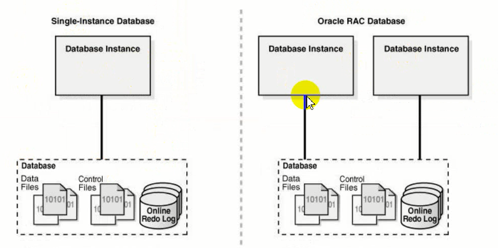
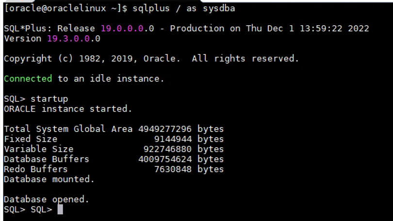
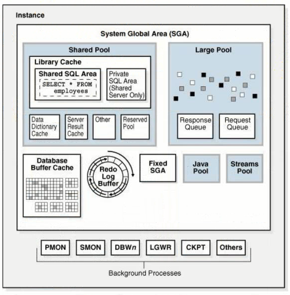
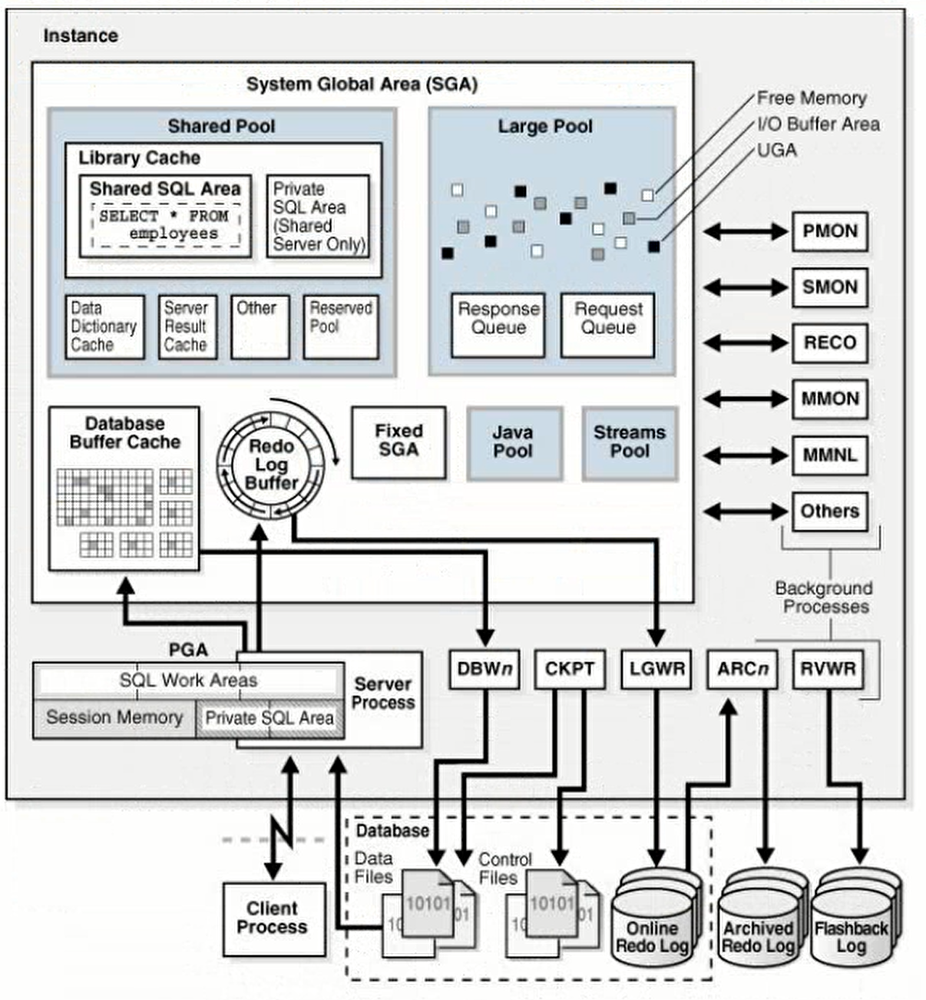

# Oracle实例

数据库实例是管理数据库文件的内存结构，由内存和进程组成。数据库是在磁盘上创建的一组物理文件，例如.dbf .log .ctl文件，这三类文件统称为数据库。

实例是内存和进程，管理着数据文件，日志文件，和控制文件，并为用户提供服务。

每一个oracle数据库都至少有一个实例，或者有多个实例，单实例和集群环境。

单实例：一个数据库对应一个实例。

集群环境RAC：一个数据库对应多个实例。

单实例的一个实例down了，用户就无法访问数据库；集群环境中一个实例down了其他实例可以继续提供服务。

实例存在于内存中，数据库存在于磁盘上。一个实例可以在没有数据库时运行，数据库也可以在没有实例时存在。

在数据库启动时:
1. 先启动实例，分配内存(**SGA System Global Area**)，启动后台进程。启动实例后并没有跟数据库建立关联，无法对外提供服务。
2. 之后装载数据库，在数据库打开之后才能对外提供服务。

实例启动并与数据库建立关联后才能对外提供服务。

内存通常称为**SGA System Global Area**用于
1. 维护许多进程和线程同时访问的内部数据结构
2. 缓存从磁盘(数据文件)读取的数据块
3. 在将重做数据写入联机重做日志文件(redo log buffer)之前对其进行缓冲
4. 存储SQL执行计划

数据库实例包含两个部分，内存SGA，和后台进程。服务器进程以及在这些进程中分配的进程内存也存在与实例中。服务器进程终止时，实例继续运行。

实例instance包含内存Systam Global Area和后台进程Background Processes。 
SGA下有许多组件，例如Shared Pool共享池，Database Buffer Cache, Redo Log Buffer, Java Pool, Streams Pool, Large Pool。 
后台进程包括PMON，SMON，DBWn，LGWR，CKPT，等。 
实际上内存结构还包含PGA、UGA、软件代码区等，此处内存结构特指SGA。

实例与数据库建立关联后才能提供服务，与数据库建立关联分过程是**装载数据库**。

一个数据库实例一次仅与一个数据库关联，可以启动一个数据库实例并将一个数据库装入（与该实例关联），但不能同时装入同一个实例的两个数据库。

多个实例可以在同一台计算机上同时运行，每个实例访问自己的数据库。

如果一台服务器上有多个数据库，每个数据库有自己的实例。

Oracle的整个体系架构，主要由两部分构成，实例和数据库：

