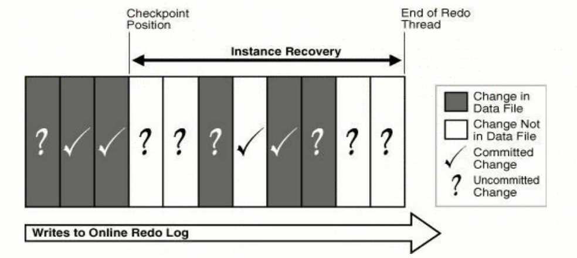
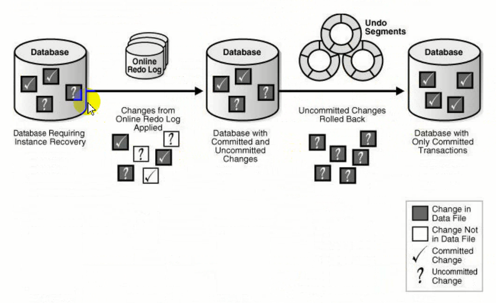

# 实例恢复
实例恢复时将联机重做日志中的记录用于数据文件以重建最近检查点之后所做的更改的过程。当管理员尝试打开以前不一致关闭的数据库时，实例恢复将自动发生。

断电、后台进程意外中断、shutdown abort、主机强制关机等情况会产生实例故障。

实例恢复使用检查点来确定必须将哪些更改应用与数据文件。检查点位置可确保将SCN低于检查点SCN的所有已提交更改都保存到数据文件中。

实例恢复不需要人为干预，有后台进程**SMON**自动完成。数据库开启后会自动检测文件是否一致(数据文件，控制文件，日志文件)。

首先向前读取redo log中的重做日志数据，读取最后一次检查点到故障发生这段时间的日志数据(前滚)。之后将这段数据在数据库中重新执行一遍，对于提交了的数据，直接写回数据文件，没有提交的数据读取undo数据实现回滚(后滚)。

