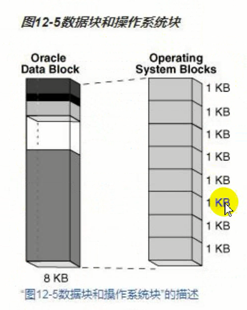
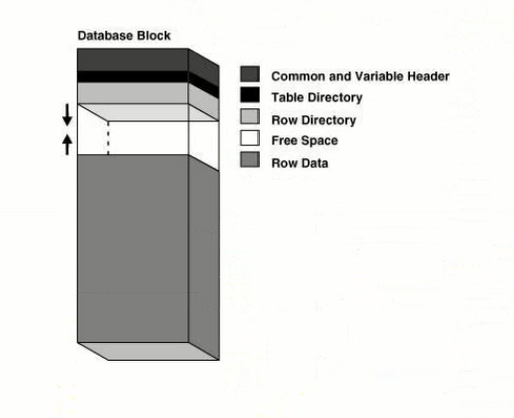

# 逻辑存储结构

Oracle数据库为数据库中的所有数据分配逻辑空间，数据库空间分配的逻辑单元时数据块、扩展区、段和表空间。在物理级，数据被存储在磁盘上的数据文件中，数据文件中的数据存储在操作系统块中。以下是物理和逻辑存储的实体关系图。

Oracle数据库以逻辑的形式使用存储空间。数据库空间分配的逻辑单元是块、区、段和表空间。在物理级别，数据存储在磁盘上的数据文件中。数据文件中的数据存储在操作系统块中。


表空间由多个段构成，一个段由多个区构成，一个区由多个块构成。一个表空间由一个或多个数据文件构成。**数据库一般都以表空间的形式使用存储空间**。一个数据文件由多个区和多个操作系统块构成。OS block是物理的操作系统块，Oracle data block是逻辑的。一个oracle数据块由8个操作系统块构成。

在创建表的时候可以指定表空间，将表放进这个表空间中。在插入数据时，就是将数据存放在表空间中。数据最终要存放在磁盘上，最终就存储在表空间对应的数据文件中。


表空间中有多个段，一个段可以理解为一个段，所以又称为表段。一个段由很多区构成，区由很多数据块构成。表中行数据以行片段的形式保存在数据块中。**数据块是最小的存储单位**。

## 表空间类型

### 本地管理的表空间(默认使用)

数据库使用表空间本身中的位图来管理扩展区。因此，本地管理的表空间将表空间的一部分留给位图使用。在表空间内，数据库可以使用自动段空间管理(ASSM)或手动段空间管理(MSSM)管理段。

```sh
# 这种方式创建的表空间就是本地管理的自动段管理表空间
create tablespace mm datafile '/home/oracle/mm.dbf' size 20M;
desc dba_tablespaces
select TABLESPACE_NAME, EXTENT_MANAGEMENT from dba_tablespace where TALESPACE_NAME="[表名]";
```


位图：在数据文件头部留出一部分10101010，表示某部分空间有没有被使用。


使用本地管理表空间可以：
1. 避免使用数据字典来管理扩展区。消耗或释放一个扩展区会导致在数据字典表或撤消段中消耗或释放空间，则在字典管理的表空间中会发生递归操作。
2. 自动跟踪相邻的可用空间：通过这种方式，数据库消除了合并空闲扩展区的需要。
3. 自动确定本地管理扩展区的大小，或者，在本地管理表空间中所有的扩展区可以具有相同的大小，并覆盖对象存储选项。

Oracle强烈建议使用自动段空间管理的本地管理表空间。

#### 段空间管理

在一个本地管理表空间中，数据库可以自动地或手动地管理段。例如users表空间中的段使用自动管理，而tools表空间中的段使用手动管理。

##### 自动段空间管理

自动段空间管理使用位图管理空间。ASSM更有效，并且是永久性本地管理表空间的默认值。位图提供了以下优点：
1. 简化管理<br />
ASSM可以避免手动确定许多存储参数的正确设置的需要。只有一个很关键的控制空间分配的SQL参数：PCTFREE。此参数指定要为块中保留用于将来的更新的空间百分比。这部分空间不能插入数据，用来更新，例如在数据块中将小的值改为更大的值。
2. 增强并发性<br />
多个事务可以搜索多个相互独立的空闲数据块列表，从而减少争用和等待。

##### 手动段空间管理

MSSM方法使用称为空闲列表的链表来管理段中的可用空间。除了PCTFREE，MSSM需要使用额外的几个SQL参数，如PCTUSED、FREELISTS和FREE LIST GROUPS来控制空间分配。PCTUSED设置在当前使用块中必须存在的可用空间百分比，当使用率低于该百分比使，数据库会将器访日空闲列表中。例如，如果create table语句中设置PCTUSED为40，则只有当块空间使用少于40%的情况下，才能往段中的块插入新行。


手动段空间管理很复杂，必须调整PCTUSDE和PCTFREE，以减少行迁移和避免空间浪费。例如，如果段中的每个使用的块是半满，并且PCTUSED是40，则数据库不允许向这些块插入新行。

由于微调空间分配参数很困难，Oracle强烈建议使用ASSM。在ASSM中，由PCTFREE确定是否可以将新行插入一个块中，但它不适用空闲列表，并忽略PCTUSED。


PCTFREE=20，预留20%空间用于将来更新，PCTUSED=40，数据块使用率低于40%时才能将数据块放入空闲列表中用于插入数据。

空闲空间大于PCTFREE，使用率小于PCTUSED，数据块才能放入空闲列表。

### 字典管理的表空间(不再使用)

数据库使用数据字典来管理扩展区。


::: TIPS
建议使用自动段空间管理
:::

## 数据块

数据块是数据存储和I/O的最小单位。

Oracle数据库以数据块为单位，来管理数据库文件中的逻辑存储空间。数据块是数据库I/O的最小单位。

物理上讲，一个逻辑块为8K，由8个操作系统数据块构成。



每个数据库都有一个数据块大小。DB_BLOCK_SIZE参数指定了逻辑数据块的大小。逻辑数据块的大小范围为2KB至32KB，默认大小为8KB。

数据库可以创建非标准数据块，大小不为8K的数据块。假设一个文件的数据块大小为16K，在将该文件缓存到内存中前，需要划分一片区域专门存放16K数据块的区域。

```sh
# 查看参数
show parameter 16k
# 创建区域
alter system set db_16k_cache_size=40M;
# 创建表空间
create tablespace my datafile '/u01/app/oracle/my.dbf' size 10M blocksize 16K
```

查看表空间对应块的大小

```sh
select TABLESPACE_NAME,BLOCK_SIZE from dba_tablespaces where TABLESPACE_NAME='my';
```

### 数据块结构

#### 块头

块头存放元数据信息，例如表、行目录等。



除块头之外的空间都可以存放数据。在不断向块中存放数据时，块头也会不断增大。


例如数据库中存放的是一些行记录数据，在修改数据时，需要先获得事务槽，将事务的相关信息记录在事务槽中。如果另一个会话要修改数据时，该事务槽的资源还未被释放，另一个会话就无法修改数据。可以用事务槽解决锁的问题。

### 行片段

数据都是以行片段的方式存放在数据块中。

行片段有行头和列数据。行头包括列的数量，id，row id，列长度等。列数据

Oracle数据库使用一个rowid唯一地标识一行。在内部，rowid是一个结构，用于保存数据库访问行所需要的信息。一个rowid并不物理得存储在数据库中而是从存储数据得文件和块推导而来的。

rowid可以快速地定位到行记录。它包含四个部分，对象号，相对文件号，块号，行号。


需要定位数据时，行数据存放在数据块，定位到数据块再根据行号就可以定位到数据行。

```sh
select rowid, id from t;
```

表中相同数据在数据块中数据是一样的，但是rowid不同，可以使用rowid快速唯一确定重复行，结合max或min函数实现删除重复行。

给表建立索引，可以利用索引中记录地rowid信息定位信息，可以快速查找数据。

### 行链接和行迁移

Oacle数据库必须得管理很大的行且该行不能放入一个单一块的情况，可能是：

1. 该行太大，在它第一次插入时，无法放入一个数据块时会产生行链接。在行链接中，Oracle数据库将数据存储在为段保留的一个或多个被链接的数据块中。行链接最经常出现在大行中，行链接是不可避免地。正常访问一个行数据时，只需要在一个块，一次I/O就可以找到数据。有行链接时，需要用多次I/O访问所有数据块才能读取数据。**行链接会增加I/O**。当有大量行链接行迁移时，数据库性能会下降。

2. 本来可以放入一个数据块的行，在更新后整体行增加了，但没有足够地可用空间来容纳更新的行会产生行迁移。小的值修改为大值后，无法发在原来位置存放数据，会占用**PCTFREE**的空间。如果PCTFREE中空闲的空间无法存放更新后的值，需要把更新后的值迁移到一个新的块中，原来的块中不存放数据，但是会存放**地址指针**指向新的数据块。查找数据时查找原来的数据块，找到地址后找到新的数据块，会使用两次I/O。<br />
在行迁移中，假设行可以容纳在一个新块中，Oracle数据库将整个行移动到一个新的数据块。已迁移的原始行片段，包含一个指针或转发地址到包含已迁移的心块。

3. 超过255个列的行。Oracle数据库在一个行片段中只能存储255的列。因此，如果你在具有1000个列的表中插入行，则数据库将创建4个行片段，通常会链接多个块。

向数据块中插入大行时，行对于左边的块来说太大，所以数据库通过将第一个行片段放入在左边的块，将第二个行片段放入右边的块，形成链接。


行迁移时，左边的块包含的行被更新，致使该行现在太大而不能放入块中。数据库将整个行移动到右边的块中，并在左边的块中保留一个指向被迁移行的指针。


::: TIPS
在创建表时，表的列数不宜过大。可以创建更大的非标准数据块来解决行链接问题。留更大的PCTFREE参数，以避免行迁移，(需要考虑数据库是否经常更新且将小值变大值，否则会产生空间浪费)。
:::

### 扩展区

扩展区时数据库存储空间分配的逻辑单位，由多个连续数据块组成。多个extent构成一个片段segment，在一个扩展区中的数据块在逻辑上是连续的。

块是存储的最小单位。在存储空间分配时，以区为单位分配。区由连续多个数据块组成。多个区构成一个段，多个段构成表空间。

默认情况下，在数据段被创建时，数据库会为数据段分配一个初始扩展区。插入数据用完初始区后，会继续分配新的区。区是可以跨数据文件的。但是初始区是存放在一个数据文件中的。

一个数据文件中某个段中的初始扩展区，它之前还没有包含任何数据。如果初始扩展区满了并且需要更多空间时，则数据库自动为该段分配一个增量扩展区。一个增量扩展区是为该段创建的后续扩展区。


### 段

段是一个表空间内包含某个逻辑存储结构的所有数据的扩展区集合。例如，Oracle数据库分配一个或多个扩展区，形成一个表的数据段。数据库还分配了一个或多个扩展区，形成一个表的索引段。

#### 用户段

在USERS、SYSTEM等表空间会分配用户段，存放用户的永久数据。

当创建以下内容时，会分配用户段。
1. 表、表分区或表簇
2. LOB或LOB分区
3. 索引或索引分区

创建表时，分配表段，表段与表的名称是相同的。


创建表时指定了主键和列，此时会分配表段和索引段。创建主键时会默认创建主键约束，和唯一索引。创建索引会分配索引段。使用了CLOB类型，会创建CLOB段，还会自动创建CLOB索引。所以该语句会创建4个段。


#### 临时段

当处理查询时，Oracle数据库通常在SQL语句执行的中间阶段需要临时工作区。可能需要临时段的典型操作包括排序、哈希和合并位图。当创建索引时，Oracle数据库将索引段置于临时段，然后当索引创建完成时间其转换成永久段。如果一个操作可以在内存中执行，则Oracle数据库不会创建一个临时段。不过，如果不能使用内存，则数据库自动在磁盘上为其分配临时段。

在TEMP表空间分配临时段，存放临时数据。TEMP表空间不可以创建用户段。

当使用临时表空间，产生临时数据时会分配临时段。

#### 撤销段

Oracle数据库维护事务的操作记录，统称为撤销数据。Oracle数据库使用撤销来执行下列操作：
1. 回滚一个活动事务。
2. 恢复一个已终止的事务。用户已经做了事务操作，但是由于网络原因用户断开，事务终止。此时用撤销数据恢复数据。
3. 提供读取一致性。
4. 执行一些逻辑闪回操作。

Oracle数据库将撤销数据存储在数据库内，撤销数据存放

undo段，分配在undo表空间。存放撤销/undo数据。表数据不能创建在undo表空间。

产生撤销数据时会分配撤销段。

### undo表空间

当事务启动时，数据库将此事务绑定到（分配给）一个撤销段，并因此也绑定到当前撤销表空间中的一个事务表。多个事务可以同时写入同一个撤销段或不同的撤销段。从概念上讲，一个撤销段中的扩展区形成一个环。事务先写到一个撤销扩展区，然后写到环中的下一个扩展区，如此等等，循环往复。

有事务产生时，该事务操作的旧数据会放入该事务分配的撤销段中。撤销段是环形的，写满后会分配下一个撤销段。undo表空间没有剩余空间会覆盖最初的段。


在任何给定时间，一个事务仅在一个撤销段上的某个扩展区上顺序写入，该扩展区称为事务的当前扩展区。多个活动事务可以写入同一个扩展区或不同的当前扩展区。当前撤销扩展区被填充后，第一个需要空间的事务将检查环中分配的下一个扩展区的可用性。如果下一个扩展区不包含活动事务数据，则该扩展区将称为当前扩展区。如果下一个区有活动事务就不能被重复使用，需要分配新的区域。

#### 事务回滚

当发出了一个ROLLBACK语句时，数据库将使用撤销记录，来回滚未提交事务对数据库所做的更改。在恢复期间，数据库将回滚从联机重做日志应用到数据摁键的任何未提交更改。当数据正在被其它用户更改时，撤销记录通过维护数据旧值，为在同一时间访问数据的用户提供读取一致性。

#### 高水位标记

Oracle数据库通过跟踪段中的块状态来管理空间。高水位标记（HWM）是段中的一个点，超过该点的数据块是未格式化和未使用过的。

MSSM使用空闲列表来管理段空间。在创建表时，段中的块并未被格式化。当一个会话初次向表中插入行时，数据库将搜索空闲列表来查找可用的块。如果数据库未找到可用的块，则它会预格式化一组块，并将它们放置在空闲列表中，并开始将数据插入到块中。**在MSSM中，全表扫描会读取HWM之下的所有块**。

高水位线以下的数据块都会被读取。这些数据块有各种不同的情况，是否被分配出去，是否被格式化，是否有存储数据。可能会出现数据块中已经没有数据了，但是全表扫描中也会读取该数据块的情况，会造成额外的I/O占用。


ASSM不使用空闲列表，所以必须以不同的方式管理空间。当会话初次向表中插入数据时，数据库只格式化一个单一位图块，而不像在MSSM中那样预格式化一组块。位图取代了空闲列表，用于跟踪在段中的块的状态。数据库使用位图来查找可用的块，然后在往块写入数据之前将其格式化。在一个ASSM段中的每个数据块处于以下状态之一：
1. 在HWM之上，这些块是未格式化的，且从未使用
2. 在HWM之下，这些块处于以下状态之一：<br />
&ensp;&ensp;&ensp;&ensp;已分配，但当前未格式化且未使用<br />
&ensp;&ensp;&ensp;&ensp;已格式化且包含数据<br />
&ensp;&ensp;&ensp;&ensp;已格式化且为空，因为数据已被删除<br />

在创建表时，HWM在左侧段的开头。因为还未插入数据，段中的所有块都是为格式化且从未使用过。


假设一个事务将行插入到段中，数据库必须分配一组块来容纳这些行。已分配的块在HWM之下，HWM向右移动。数据库格式化该组中的一个位图块来容纳元数据，但不会预格式化组中其余的块。

HWM以下的块都是被分配的，但是有可能没有被格式化。插入数据时，数据库可以写入到任何具有可用空间的块。由**低位高水位标记**（low HWM）标记一个点，在该店之下的所有块都已知是已格式化的，要么包含数据，要么曾经包含数据(被删除了)。低水位线与高水位线之间的块都分配了但是没有格式化。


数据库选定HWM和low HWM之间的一个块，并往其中写入数据。数据库也可能会随意选择HWM和low HWM之间的任何其他块，或low HWM之下任何有可用空间的块。图中，在新填充块两边的块都还是未格式化的。


低水位线在全表扫描中非常重要。因为HWM之下的块只在被使用是才格式化，所以可能还有一些块是未被格式化的，如上图所示。鉴于此，数据库读取位图块，以获取低HWM的位置。数据库读取低于low HWM之下的所有块，因为已知它们是已格式化的，然后仅仔细读取位于low HWM和HWM之间的已格式化块。

假定一个新事务将行插入到表，但位图指示在高水位先之下没有足够的可用空间。如下图，数据库向右推进HWM，分配一组新的未格式化块。


当HWM与low HWM之间的块填满时，HWM向右推进，而low HWM相应推进到旧的HWM的位置。数据库不断插入数据，随着时间的推移，HWM继续向右推进，而low HWM总尾随其后。**除非手动重建、截断、或缩小该对象否则HWM从不倒退**。

在做全表扫描时，HWM会带来更多的I/O开销。

在Oracle中，执行删除操作不会降低该表的高水位线。而全表扫描将始终读取一个段中所有低于HWM标记的块。如果在执行删除操作后不降低高水位线标记，则将导致查询语句的性能底下。
1. 执行alter table table_name shrink space; 在执行该指令前必须允许移动
2. 重建表，复制要保留的数据到临时表t，drop原表，然后rename临时表t为原表
3. 用逻辑导入导出： Emp/Imp
4. 使用truncate.

### 表空间文件大小

理论上来说，小文件表空间和大文件表空间的存储容量相同。小文件表空间最多可以存储1024个数据文件，32T。大文件表空间只有一个数据文件，可以存储32T。从实际使用角度看，比较少在一个表空间创建这么多数据文件，导致小文件表空间达不到32T。而且数据文件更多的话，CKPT花费的资源更多，需要更新很多文件的头部。
