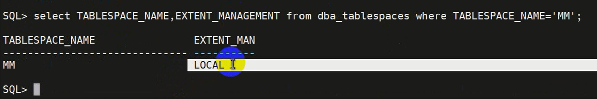
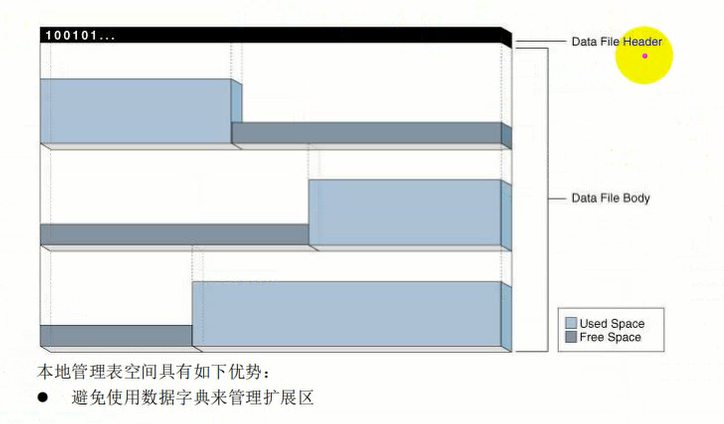

# 逻辑存储结构

Oracle数据库为数据库中的所有数据分配逻辑空间，数据库空间分配的逻辑单元时数据块、扩展区、段和表空间。在物理级，数据被存储在磁盘上的数据文件中，数据文件中的数据存储在操作系统块中。以下是物理和逻辑存储的实体关系图。

Oracle数据库以逻辑的形式使用存储空间。数据库空间分配的逻辑单元是块、区、段和表空间。在物理级别，数据存储在磁盘上的数据文件中。数据文件中的数据存储在操作系统块中。


表空间由多个段构成，一个段由多个区构成，一个区由多个块构成。一个表空间由一个或多个数据文件构成。**数据库一般都以表空间的形式使用存储空间**。一个数据文件由多个区和多个操作系统块构成。OS block是物理的操作系统块，Oracle data block是逻辑的。一个oracle数据块由8个操作系统块构成。

在创建表的时候可以指定表空间，将表放进这个表空间中。在插入数据时，就是将数据存放在表空间中。数据最终要存放在磁盘上，最终就存储在表空间对应的数据文件中。


表空间中有多个段，一个段可以理解为一个段，所以又称为表段。一个段由很多区构成，区由很多数据块构成。表中行数据以行片段的形式保存在数据块中。**数据块是最小的存储单位**。

## 表空间类型

### 本地管理的表空间(默认使用)

数据库使用表空间本身中的位图来管理扩展区。因此，本地管理的表空间将表空间的一部分留给位图使用。在表空间内，数据库可以使用自动段空间管理(ASSM)或手动段空间管理(MSSM)管理段。

```sh
# 这种方式创建的表空间就是本地管理的自动段管理表空间
create tablespace mm datafile '/home/oracle/mm.dbf' size 20M;
desc dba_tablespaces
select TABLESPACE_NAME, EXTENT_MANAGEMENT from dba_tablespace where TALESPACE_NAME="[表名]";
```



位图：在数据文件头部留出一部分10101010，表示某部分空间有没有被使用。



使用本地管理表空间可以：
1. 避免使用数据字典来管理扩展区。消耗或释放一个扩展区会导致在数据字典表或撤消段中消耗或释放空间，则在字典管理的表空间中会发生递归操作。
2. 自动跟踪相邻的可用空间：通过这种方式，数据库消除了合并空闲扩展区的需要。
3. 自动确定本地管理扩展区的大小，或者，在本地管理表空间中所有的扩展区可以具有相同的大小，并覆盖对象存储选项。

Oracle强烈建议使用自动段空间管理的本地管理表空间。

#### 段空间管理

在一个本地管理表空间中，数据库可以自动地或手动地管理段。例如users表空间中的段使用自动管理，而tools表空间中的段使用手动管理。

##### 自动段空间管理

自动段空间管理使用位图管理空间。ASSM更有效，并且是永久性本地管理表空间的默认值。位图提供了以下优点：
1. 简化管理<br />
ASSM可以避免手动确定许多存储参数的正确设置的需要。只有一个很关键的控制空间分配的SQL参数：PCTFREE。此参数指定要为块中保留用于将来的更新的空间百分比。这部分空间不能插入数据，用来更新，例如在数据块中将小的值改为更大的值。
2. 增强并发性<br />
多个事务可以搜索多个相互独立的空闲数据块列表，从而减少争用和等待。

##### 手动段空间管理

MSSM方法使用称为空闲列表的链表来管理段中的可用空间。除了PCTFREE，MSSM需要使用额外的几个SQL参数，如PCTUSED、FREELISTS和FREE LIST GROUPS来控制空间分配。PCTUSED设置在当前使用块中必须存在的可用空间百分比，当使用率低于该百分比使，数据库会将器访日空闲列表中。例如，如果create table语句中设置PCTUSED为40，则只有当块空间使用少于40%的情况下，才能往段中的块插入新行。


手动段空间管理很复杂，必须调整PCTUSDE和PCTFREE，以减少行迁移和避免空间浪费。例如，如果段中的每个使用的块是半满，并且PCTUSED是40，则数据库不允许向这些块插入新行。

由于微调空间分配参数很困难，Oracle强烈建议使用ASSM。在ASSM中，由PCTFREE确定是否可以将新行插入一个块中，但它不适用空闲列表，并忽略PCTUSED。


PCTFREE=20，预留20%空间用于将来更新，PCTUSED=40，数据块使用率低于40%时才能将数据块放入空闲列表中用于插入数据。

空闲空间大于PCTFREE，使用率小于PCTUSED，数据块才能放入空闲列表。

### 字典管理的表空间(不再使用)

数据库使用数据字典来管理扩展区。


::: TIPS
建议使用自动段空间管理
:::
